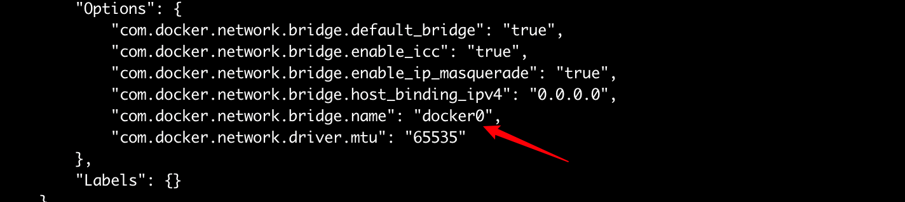

 


Description：Docker 帮助数百万开发人员高效协作地构建、共享和运行应用程序。Docker 协作应用程序开发平台为开发人员提供了无与伦比的集成、可靠和安全工作流程体验，可加速从代码到云的应用程序交付。

Links：[docker.com](https://www.youtube.com/redirect?event=channel_description&redir_token=QUFFLUhqbkM5elE5akJZZUNQOVBIbVZzRnFUM3VaVzNSZ3xBQ3Jtc0treERxdUR1bHVnQVA1YnhmcWR5R1NmcHFuYjFodUptZllVbEtQY19keHRNbXlsNjdiUU5COVJmeDNYV3ZtVVRvakY2bUliQmh3Z0tGZEsxbkNMZ0V3NlVJdndDczNXSHBpYVhFYUFCa1NNRDFGRmZQZw&q=https%3A%2F%2Fwww.docker.com%2F)

---

# 📒doc


## 🕸️ Network

理解 Docker 中的网络以及推进 Kubernetes 和 Docker Swarm 等概念非常重要

**Docker 通过使用网络驱动**程序支持网络容器 （`bridge`和`overlay`驱动程序）

Docker的网路

+ bridge：桥接网路（默认）- 虚拟以太网
+ hosts：主机网络 - 直接使用主机的网路，直接与宿主机的网路进行绑定
+ overlay:   有多个主机并且希望在多个主机上创建集群，覆盖网络非常有用

这三个网络非常流行


### host / bridge 网络

安装docker 默认获得三个网络

```sh
# docker network ls
NETWORK ID     NAME              DRIVER    SCOPE
f47de05a88b4   bridge            bridge    local
109f6edbe737   host              host      local
5aa7cb36bb57   none              null      local
```

在docker的主机上，又一个名为docker0的虚拟交换机或网桥

 

足以做的就是将 容器 插入其中，这个网络是由桥接驱动程序创建的，仅限于当了当前这个docker 主机，因为桥接程序都是关于单主机网络的。   


### Overlay 网络

docker overlay 覆盖驱动程序来了解多主机网络，因此多主机网络时，谈论的是创建单个网络以便跨多 docker 主机 的广播域的单层。

通过3层路由连接到二层网络

+ 创建一个跨多主机的新网络，提供一个网络层

  

```sh
➜  container git:(main) ✗ docker swarm init
➜  container git:(main) ✗ docker network ls
NETWORK ID     NAME              DRIVER    SCOPE
f47de05a88b4   bridge            bridge    local
13e14623a472   docker_gwbridge   bridge    local
109f6edbe737   host              host      local
1c4n3a9gux90   ingress           overlay   swarm
```

查看已经有了新的网络，用于夸主机通信

+ ingress           overlay

创建一个overlay网络

```sh
# docker network create -d overlay  overnet
```

创建容器附加到网络上

```sh
# docker service create --name myservice \
	--network overnet \
	--replicas 2 \
	alpine sleep 1d
	
# docker service ls
ID             NAME        MODE         REPLICAS   IMAGE           PORTS
7uxdx7cmf4zg   myservice   replicated   2/2        alpine:latest
```

查看 overnet

```sh
➜  container git:(main) ✗ docker network inspect overnet
[
...
        "Containers": {
            "341d4da1b60a8dbf13ea478784e83205b67afafb6c38d4eac434434b61be1706": {
                "Name": "myservice.1.5e00gmqg35030bkdbcb2mk78u",
                "EndpointID": "0f1818c518f7feea86c9c2314784a7c56f6bc935cddd3addffd3082ba4671496",
                "MacAddress": "02:42:0a:00:01:20",
                "IPv4Address": "10.0.1.32/24",
                "IPv6Address": ""
            },
...
]
```

在另外一台主机上也能看到：

+ 它们是相同的 overlay网络，能够相互`ping` 通

```sh
            "c8f402313ce1430a7d3e796b3c95617b19cc8503ab8ba51cd4cccef766df4c9e": {
                "Name": "myservice.2.bbj3wwpwjox49pdtq6t4y94uz",
                "EndpointID": "e853db6286f3c14345dea77a21c749bce27f3367459f77be620acfb047aace02",
                "MacAddress": "02:42:0a:00:01:21",
                "IPv4Address": "10.0.1.33/24",
                "IPv6Address": ""
            }
```

使得 docker 使用多主机网络变得超级简单是多么容器


## 📦 Volume

构建镜像时，，第一层作为基础，然后将需要的一层一层添加。

**读写分离的联合文件系统**：将多个只读层（镜像层）以及一个可写层（容器层）组合在一起，形成一个容器的文件系统

对于持久性数据，最好使用数据卷或绑定挂载来确保数据的安全性和持久性。

可以使用共享存储：


