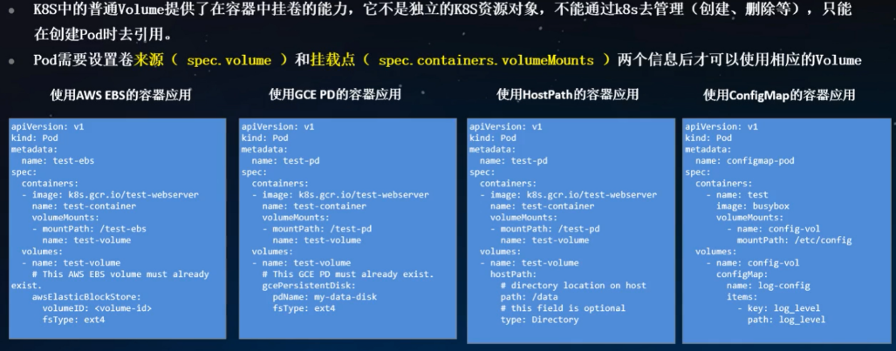
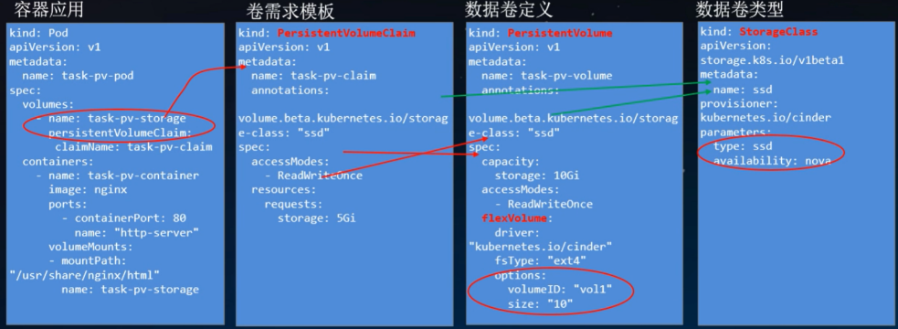

### 大纲

+ K8s存储整体框架及原理解析
+ K8s FlexVolume存储扩展机制
+ K8S CSI存储扩展机制

---

#### 

#### K8s存储能力 - Volume概述

 

https://kubernetes.io/zh-cn/docs/concepts/storage/volumes/#volume-types

K8s的 VolumePlugin提供了插件化扩展存储机制，分为

+ 内置插件（In - Tree Plugins）
+ 外置插件（Out - of Tree）

#### K8S 存储能力-PV

Kubernetes 通过PV子系统API对管理员和用户提供了存储资源和使用的抽象

 

PV：此Volume Driver 允许不同厂商去开发他们自己的驱动来挂载卷到计算节点；

PVC：K8s提供的资源抽象的 Volume Driver，让用户不用关心具体的 Volume的实现细节；

 

