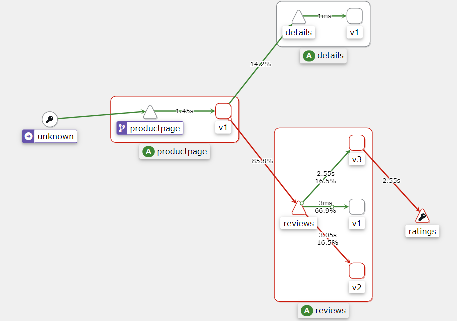

#### 1.1 应用架构演变历程

从微服务到函数级服务

+ 对微服务再次拆分


#### 1.2 单体应用到微服务带来的问题

 

拆成很多微服务遇到的问题，欠佳的地方，例如

+ 微服务挂掉，怎么去处理
+ 微服务没有挂掉，处理缓慢；导致其他微服务也缓慢，拖累整个软件（需要自动处理这些故障）
+ 拆分成微服务，弹性能力增强；在多副本数，需要弹性负载来控制请求，在达到调用最高值，如果没有对调用算法进行处理，会导致请求排队；
+ 解决单体服务的弊端，同时也引来了网络上的一些问题、安全等；都是需要考虑的
+ 在很多的开源公司或者自己的公司都是有考虑的，所有诞生了很多，有名的如：springcloud 解决这些问题；


#### 1.3 云原生为何抛弃springcloud

springcloud 并非万全之策

 

微服务（开发人员）

+ 业务逻辑
+ 网络功能
  + 负载均衡
  + 服务发现
  + 熔断降级
  + 动态路由

存在的问题：

1. Nocos注册，同步时间
2. 如果在K8s中部署springcloud ，Pod的重建后IP会变化，注册表会发变化；其他服务没有及时同步信息，在请求时会导致服务中断、缓慢
3. springcloud  对 Java语言比较友好；对其他语言也可以集成但不是很友好

现在使用K8s作为底层，本身的服务发现能力Service就可以实现服务发现负载均衡；又在k8s上使用springcloud  或者 Nocos 出现了套娃的现象。并不符合云原生的概念；

但是：虽然springcloud  实现了这些功能，代码还是由开发维护的，虽然代码量小，多多少少还是有；

如果开发人员只需关注业务逻辑

+ 1+1 =2 不用再去实现如何网络功能代码，所以诞生了服务网格


#### 1.4 服务网格应用而生

非业务逻辑的代码下沉到基础架构，平台去实现

+ 充分利用云原生的优势

服务网格一句话代替：业务逻辑、网络功能代码拆分开，业务逻辑开发去管理，网络功能都使用服务网格管理


#### 1.5 什么是服务网格

Service Mesh（服务网格）

+ 目标：解决微服务之间复杂的关系
+ 将程序网络功能和程序本身解耦
+ 网络功能下沉到基础架构，由服务网格实现微服务之间的负载均衡等功能
+ 处理网络功能，也能提供其他高级的功能，如全链路加密、监控、链路追踪


#### 1.6 服务网格的功能

1. 负载均衡：多副本请求
2. 服务发现：A调用B，B的IP地址（服务网格使用DNS、key:value）
3. 熔断降级：请求访问缓慢，发送到了有问题节点，对节点降级
4. 动态路由：负载均衡差不多，基于各种请求头的发布
5. 故障注入：新项目测试，某个服务挂掉对其他服务的影响，又不能之间关掉，由一种现象服务缓慢延迟变高但是没有挂掉等情况；
6. 错误重试：幂等性问题，请求失败是丢弃还是重试，调用对端还未处理又再次发了一次请求也是问题；
7. 安全通信：全链路加密
8. 语言无关


#### 2.1 Istio 架构刨析

 

开源后分为了两层

1. 数据平面
2. 控制平面：对配置统一管理，配置分发到不同的数据层面
   + 1.5版本前部署Istio 可以看到很多个Pod
   + 1.5后：架构变革，只能看到一个istiod的守护进程，一个Pod起了三个进程，通过守护进程管理

> K8s通过yaml 作为Istio的配置，控制层面解析后分发到数据层面，生成Mesh 路由


#### 2.2 Istio数据平面和控制平面

一、Istio数据平面-Envoy

> 不需要对Envoy做任何配置，所有配置通过控制平面分发的 Istiod - Pod；

Envoy：Istio的数据平面使用的是Envoy，Envoy C++开发的高性能代理，用于调节服务网格中所有服务的入站出战流量，Envoy代理是唯一一个与数据平面流量交互的Istio组件；

> 注入在Pod中，在Pod加一层代理

起到的作用

+ 动态服务发现
+ 负载均衡
+ HTTP/2 &gRPC代理
+ 熔断器
+ 健康检查、基于百分比流量拆分的灰度发布
+ 故障注入
+ 丰富的度量指标


二、Istio控制平面 - Istiod

提供：

+ 服务发现、配置、证书管理、加密通信、认证；

Pod

+ Pilot：为 Envoy Sidecar 提供服务发现，为智能路由（如AB测试、金丝雀部署等）和弹性（超时、重试、熔断器等）提供流量管理；
+ Citadel：通过内置身份和凭证管理可以提供强大的服务与服务之间的最终用于验证，可用于升级服务网格未加密的流量；

> 认证授权的复杂度非常高，用到最终用于验证还是比较小，常用于全链路加密，认证授权

+ Galley：负责配置管理的组件，用于验证配置信息的格式和正确性，Galley使用网格配置协议和其他组件进行配置交互；

> 验证配置是否正确


---

`以下为核心知识!!!`

---


#### 2.3 Istio 东西流量管理-VirtualService

> 基于 service 做服务发现，和service同一个层面

VirtualService：虚拟服务 基于 Istio个对应平台提供的基本 连通性和服务发现能力；将请求路由到对应的目标。每一个VirtualServeice 包含一组路由规则，Istio 将每个请求根据路由匹配到的指定的目标地址；

+ 不需要理解成太难理解的东西；比如k8s创建 Pod、Deployment、daemonset、statefulset核心资源，最终都是Pod，管理的都是容器；
+ Istio也是一样，有很多资源 vs、dr、gw等

> 在K8s中的servive实现的也是 东西流量（AB访问），生成iptables或者ipvs

K8s Service

+ K8s service 资源不能给 Istio用

+ Service实现不了比较细粒度的配置；如用户、版本、流量百分比、灰度测试、等负责功能的控制


配置示例：

https://istio.io/latest/zh/docs/tasks/traffic-management/request-routing/

基于用户身份的路由

```YAML
$ kubectl get virtualservice reviews -o yaml
apiVersion: networking.istio.io/v1beta1
kind: VirtualService
...
spec:
  hosts:	# vs主机，指定的目标/路由规则的目标，client - server请求时使用的1/n个地址
  - reviews
  http:		# 路由规则，可以是http/1.1 HTTP2 GRPC
  - match:	# 规则的条件
    - headers:
        end-user:
          exact: jason
    route:	# 路由规则
    - destination:	# 符合此条件的流量的实际目标地址
        host: reviews
        subset: v2
  - route:	# 路由规则
    - destination:
        host: reviews
        subset: v1
```


#### 2.4 细粒度流控 DestiantionRule

目标规则：用于后端真实服务再做进一步的划分

更加精细的流量划分

+ 指定流量
+ 用户等

> 创建DR资源划分，可以通过Pod的标签区分十日DR划分成不同的子集，再去修改vs，指向流量；


DestiantionRule 配置解析

```YAML
apiVersion: networking.istio.io/v1alpha3
kind: DestinationRule
metadata:
  name: bookinfo-ratings
spec:
  host: ratings.prod.svc.cluster.local	# 主机，用户目标或路由规则
  trafficPolicy:
    loadBalancer:
      simple: LEAST_REQUEST
  subsets:
  - name: testversion
    labels:
      version: v3	# Pod的标签
    trafficPolicy:
      loadBalancer:
        simple: ROUND_ROBIN
```


#### 2.5 Istio南北流量管理 - Gatway

istio的网关功能，可以使用Gateway再网格最外层接受HTTP/TCP流量，并将流量转发到网格内的某个服务。同时也支持出口流量的管控，可以将出口的流量固定从Egressgateway的服务中代理出去；

> 使用 Istio gw 就不再推荐使用ingress网关功能了，比ingress功能强大得多；

> 安装时，Ingressgw 和 Egressgw 时可选的，时两类的Pod 

结合 vs实现路由策略，vs配置的域名 绑定到 gw（字段-指定到Pod）流量先到ingressgw（会暴露一个端口）前面还会又一个代理LB，代理到每个节点的端口上，域名解析到端口上；

> 生成环境不会开发所有主机到公网，指定某几个主机出去，部署Egress到这几个节点，重定向后来转发流量访问公网；

配置解析;

使用网关配置 Ingress

> 项目非常的要拆分成多个gw，不适合用全局gw

https://istio.io/latest/zh/docs/reference/config/networking/gateway/

```YAML
apiVersion: networking.istio.io/v1alpha3
kind: Gateway
metadata:
  name: my-gateway
  namespace: some-config-namespace
spec:
  selector:
    app: my-gateway-controller	# Ingressgw Pod的标签
  servers:
  - port:
      number: 80
      name: http
      protocol: HTTP
    hosts:
    - uk.bookinfo.com
    - eu.bookinfo.com
    tls:
      httpsRedirect: true # sends 301 redirect for http requests	# 证书
  - port:
      number: 443
      name: https-443
      protocol: HTTPS
    hosts:				 # 此域名可以通过 Gw 进来
    - uk.bookinfo.com
```

VirtualService

```YAML
apiVersion: networking.istio.io/v1alpha3
kind: VirtualService
metadata:
  name: my-gateway
  namespace: some-config-namespace
spec:
  hosts:
  - uk.bookinfo.com
  gateways:	# GW的名称
  - my-gatewa
```

> 一般是一个项目创建一个GW，小项目一个集群用一个gw


#### 3.1 Istio 安装

https://istio.io/latest/zh/docs/setup/install/

主要是Istioctl 、 Helm、Operator

> 包管理复杂管理：一般都是Helm和Operator；需要又定制化配置都是以Operator为主


1> 下载istio 包

https://github.com/istio/istio/releases

2> 解压，将工具移入/usr/local/bin

```SH
tar xf istio-1.17.1-linux-amd64.tar.gz
cd istio-1.17.1/
mv bin/istioctl /usr/local/bin/
istioctl version
istioctl version
```

https://istio.io/latest/zh/docs/setup/install/operator/

参照安装文档即可

> 实验环境，ingress-service改为nodeport


3> 图形化界面安装

提供了可视化的界面，可以在Kiali上进行观测流量的走向、调用链，同时还可以使用Kaili进行配置管理；

```YAML
kubectl create -f samples/addons/kiali.yaml
```

安装链路追踪工具

> 开发关注的更多

```YAML
kubectl create -f samples/addons/jaeger.yaml
```

4> Promethues和Grafana

```YAML
kubectl create -f samples/addons/prometheus.yaml -f samples/addons/grafana.yaml
```


#### 3.2 BookInfo项目介绍

官方提供练习的项目：

https://istio.io/latest/zh/docs/examples/bookinfo/

 

  


> 官方提供的一个在线书店的项目


#### 3.3 IngressGateway发布原理

使用域名发布服务

+ ingress Controller -> service -> Pod
+ Ingress Getway -> VS -> Pod
  + 先创建gw，再创建vs绑定gw，vs指定域名hosts、service和gw

>  一般是 gw可以写成 *，sv 不推荐


#### 3.4 使用域名发布网格内的服务

修改 gw 和 vs 的hosts 为 bookinfo.kubeasy.com

```SH
[root@k8s-master01 istio-1.17.1]# grep "hosts" -A 1 samples/bookinfo/networking/bookinfo-gateway.yaml
    hosts:
    - "*"
--
  hosts:
  - "*"
[root@k8s-master01 istio-1.17.1]# vim  samples/bookinfo/networking/bookinfo-gateway.yaml
[root@k8s-master01 istio-1.17.1]# grep "hosts" -A 1 samples/bookinfo/networking/bookinfo-gateway.yaml
    hosts:
    - "*"
--
  hosts:
  - "bookinfo.kubeasy.com"

# 创建资源：
# kubectl create -f !$

# kubectl get virtualservices.networking.istio.io bookinfo  -oyaml
apiVersion: networking.istio.io/v1beta1
kind: VirtualService
metadata:
  annotations:
    kubectl.kubernetes.io/last-applied-configuration: |
      {"apiVersion":"networking.istio.io/v1alpha3","kind":"VirtualService","metadata":{"annotations":{},"name":"bookinfo","namespace":"default"},"spec":{"gateways":["bookinfo-gateway"],"hosts":["bookinfo.kubeasy.com"],"http":[{"match":[{"uri":{"exact":"/productpage"}},{"uri":{"prefix":"/static"}},{"uri":{"exact":"/login"}},{"uri":{"exact":"/logout"}},{"uri":{"prefix":"/api/v1/products"}}],"route":[{"destination":{"host":"productpage","port":{"number":9080}}}]}]}}
  creationTimestamp: "2023-03-25T02:29:03Z"
  generation: 1
  name: bookinfo
  namespace: default
  resourceVersion: "26314"
  uid: 538c6b37-18f9-4d38-8251-c806b67fc7e3
spec:
  gateways:
  - bookinfo-gateway
  hosts:
  - bookinfo.kubeasy.com
  http:
  - match:
    - uri:
        exact: /productpage		# 完全匹配
    - uri:
        prefix: /static
    - uri:
        exact: /login
    - uri:
        exact: /logout
    - uri:
        prefix: /api/v1/products
    route:
    - destination:
        host: productpage
        port:
          number: 9080
```

> 一般gw host 写为*，vs再做更加细粒度的配置
>
> gw 可以跨命名空间 ， 通过标签istio=egressgateway 匹配


再将域名解析到Pod上，修改主机hosts，访问

http://bookinfo.kubeasy.com:32416/productpage

> 生产环境肯定时不能加端口号的

每个宿主机都监听个端口，为了高可用肯定使用多宿主机代理；

+ 公司代理：NGINX、LVS、SLB、ELB 都是有一个地址
+ 买个域名，解析到代理的IP地址，再去访问的时候就不需要端口

 

#### 3.5 使用Kiali进行服务健康检测及流量检测

 


#### 4.1 什么是灰度发布、金丝雀发布

kubectl scale deployment reviews-v2 --replicas=0
kubectl scale deployment reviews-v3 --replicas=0


滚动发布：

+ 介绍：直接替换生产环境的镜像
+ 问题：新版本虽然经过了测试，但未在生产环境中测试（生产环境的流量、不确定性非常多），产生一些意想不到的情况
+ 解决：为了解决这个问题，用到灰度发布


灰度发布：

+ 原：v1 版本 100%流量
+ 灰度发布：v1：90% ， v2：%10 ；可以先观察10%流量的反馈、报错、分析、探测；真的又影响也只有10%；没问题再切所有流量，没有任何问题了，v1版本就可以下线
+ 一点一点流量来切


#### 4.2 istio 内实现灰度发布

限制条件：部署的时候需要配置标签，区别应用和版本；标签写的全一些（项目、版本号、等）

+ 至少有一个相同和不同的标签

 

> vs控制送service下来的流量，DR划分划分subnet

流程

1. 使用DR划分Subnet
2. 使用VS将流量导向旧版本
3. 部署新版本
4. 使用VS切换流量

 


#### 4.3 istio 灰度发布新旧版本上线实践

首先：

+ 将reviews的所有流量指向v1版本，此时需要通过 DestinationRule将reviews分成三个版本

```YAML
# cat destination-rule-reviews.yaml
apiVersion: networking.istio.io/v1alpha3
kind: DestinationRule
metadata:
  name: reviews
spec:
  host: reviews
  trafficPolicy:
    loadBalancer:
      simple: RANDOM
  subsets:
  - name: v1
    labels:
      version: v1
  - name: v2
    labels:
      version: v2
  - name: v3
    labels:
      version: v3
```

+ 创建：先注释掉v3

```YAML
# kubectl get destinationrules.networking.istio.io
NAME      HOST      AGE
reviews   reviews   9s
```

然后：

+ 启动Pod

```YAML
# kubectl scale deployment reviews-v2 --replicas=1
```

再：

+  创建vs：流量全部指向到v1

```YAML
cat reviews-v1-all.yaml
apiVersion: networking.istio.io/v1alpha3
kind: VirtualService
metadata:
  name: reviews
spec:
  hosts:
    - reviews
  http:
  - route:
    - destination:
        host: reviews
        subset: v1
```


```YAML
# kubectl get svc -l app=reviews
# kubectl get pod -l app=reviews
NAME                          READY   STATUS    RESTARTS   AGE
reviews-v1-777df99c6d-nxpjh   2/2     Running   0          3h52m
reviews-v2-cdd8fb88b-6s72f    2/2     Running   0          15m
```


80% 的流量 调度在v1，其余调度在v2

```YAML
cat virtual-service-reviews-80-20.yaml
apiVersion: networking.istio.io/v1alpha3
kind: VirtualService
metadata:
  name: reviews
spec:
  hosts:
    - reviews
  http:
  - route:
    - destination:
        host: reviews
        subset: v1
      weight: 80
    - destination:
        host: reviews
        subset: v2
      weight: 20
```

所有流量切到v2

 ```YAML
 # cat reviews-v2-all.yaml
 apiVersion: networking.istio.io/v1alpha3
 kind: VirtualService
 metadata:
   name: reviews
 spec:
   hosts:
     - reviews
   http:
   - route:
     - destination:
         host: reviews
         subset: v2
 ```

ISTIO：

 


#### 4.4 图形化管灰度发布

> 拖拉的形式

前提：删除手动创建的 dr、vs

 


 


自动创建了DR和VS

 

刷新界面测试

v1提高到80% update

 


> 拓展：蓝绿发布，流量直接全切v2，有问题再全切v1


#### 4.5 AB测试

> 灰度发布是按照流量，不会匹配用户的来源（外部测试、内部测试）

AB测试

 


外部的用户访问v2，内部测试用户访问v3；

> v3 没有问题再切v3，也可以根据地区限制

 

原理比较简单

+ 生产环境要用，代码是要又这些请求头的

```YAML
apiVersion: networking.istio.io/v1alpha3
kind: VirtualService
metadata:
  name: reviews
spec:
  hosts:
  - reviews
  http:
  - match:
    - headers:
        end-user:
          exact: jason
    route:
    - destination:
        host: reviews
        subset: v2
  - route:
    - destination:
        host: reviews
        subset: v3
```

创建NS和VS

```YAML
[root@k8s-master01 networking]# kubectl create -f destination-rule-reviews.yaml
destinationrule.networking.istio.io/reviews created
[root@k8s-master01 networking]# cat !$
cat destination-rule-reviews.yaml
apiVersion: networking.istio.io/v1alpha3
kind: DestinationRule
metadata:
  name: reviews
spec:
  host: reviews
#  trafficPolicy:
#    loadBalancer:
#      simple: RANDOM
  subsets:
  - name: v1
    labels:
      version: v1
  - name: v2
    labels:
      version: v2
  - name: v3
    labels:
      version: v3
# cat virtual-service-reviews-jason-v2-v3.yaml
apiVersion: networking.istio.io/v1alpha3
kind: VirtualService
metadata:
  name: reviews
spec:
  hosts:
  - reviews
  http:
  - match:
    - headers:
        end-user:
          exact: jason
    route:
    - destination:
        host: reviews
        subset: v3
  - route:
    - destination:
        host: reviews
        subset: v2
```

访问：在没有登录用户的情况下，流量都调度在了v2

登录用户：jason

流量全部切到了v3

 

```YAML
# kubectl logs -f productpage-v1-66756cddfd-r5dcw
send: b'GET /reviews/0 HTTP/1.1\r\nHost: reviews:9080\r\nuser-agent: Mozilla/5.0 (Windows NT 10.0; Win64; x64) AppleWebKit/537.36 (KHTML, like Gecko) Chrome/111.0.0.0 Safari/537.36\r\nAccept-Encoding: gzip, deflate\r\nAccept: */*\r\nConnection: keep-alive\r\nX-B3-TraceId: 32951296339d49c2bd47dc526773e09b\r\nX-B3-SpanId: bd47dc526773e09b\r\nX-B3-Sampled: 1\r\nend-user: jason\r\nx-request-id: 726c8617-b86d-96ce-b1fe-7f26180ada08\r\ncookie: session=eyJ1c2VyIjoiamFzb24ifQ.ZB6Yfg.ddx3Bk-jVDnAMpyNGsfuXDh3Oxs\r\n\r\n'
reply: 'HTTP/1.1 200 OK\r\n'
header: x-powered-by: Servlet/3.1
header: content-type: application/json
```

> 程序是要加一个请求头的


#### 4.6 istio 地址重新写和重定向

新旧地址的替换-Redirect实践

比如访问 A 域名 跳转到 www.baidu.com

用途

+ A域名下线直接用B域名：客户还以为公司倒闭了
+ 做重定向，等到旧域名流量长时间没人访问就可以下了

https://istio.io/latest/zh/docs/reference/config/networking/virtual-service/#HTTPRedirect


#### 4.7 Istio 前后端分离

做前后的分离肯定要用到的，必用

前后端分离，一般会

+ 根路径指向前端
+ API接口指向后端，但是后端可能没api接口路径，旧要将api接口路径转成“/”

如：在访问根路径时转成 http://bookinfo.kubeasy.com:32416/productpage 

https://istio.io/latest/zh/docs/reference/config/networking/virtual-service/#HTTPRewrite


#### 4.8 Istio 负载均衡算法

​		Istio云原生支持多种负载均衡算法，比如 round_robain\least_conn\random等。加入一个应用存在多个副本（Pod）；可以使用上述算法对多个Pod 进行定制化的负载均衡配置。

每种负载均衡策略如下：

+ round_robin：默认，轮询算法，将请求依次分配给每一个实例；
+ least_conn：最小连接数，随机选择两个健康的实例，将请求分配成两个中连接数最小的那个；
+ random：随机算法，将请求随机分配给其中一个实例；
+ passthrough：将连接数转发到调用者请求的原始IP地址，而不进行任何形式的负载均衡，不推荐；

首次访问bookinfo的首页，之后观看reviews的流量分配

> 默认 round_robin，常用要么least_conn，要么默认，其他都很少使用

删除vs，再次访问；就是轮询访问

  

> 可以看到大概是 1：1：1


随机：random

https://istio.io/latest/zh/docs/reference/config/networking/destination-rule/#LoadBalancerSettings-SimpleLB

```YAML
apiVersion: networking.istio.io/v1alpha3
kind: DestinationRule
metadata:
  name: bookinfo-ratings
spec:
  host: ratings.prod.svc.cluster.local
  trafficPolicy:
    loadBalancer:
      simple: RANDOM
  subsets:
  - name: testversion
    labels:
      version: v3
    trafficPolicy:
      loadBalancer:
        simple: ROUND_ROBIN
```

全局配置 和 版本下配置都是可以的

 


#### 4.9 Istio 并发连接数

假设 ratings 进行熔断，希望在并发请求超过3，并且存在1个以上的待处理请求，就出发熔断，此时可以配置ratings的DestinationRule；

> 说白了就是一种保护，在请求错误的时候，就不要再接受请求；扔给其他的副本

+ 恶意访问：连续攻击、服务挂掉、重启... 陷入死循环 （导致数据丢失、请求中断等故障，如果没限制资源甚至影响宿主机）

https://istio.io/latest/zh/docs/reference/config/networking/destination-rule/#ConnectionPoolSettings

连接池配置 和 熔断 探测配置没有必要说要在一起使用；

```YAML
# 连接数限制
  trafficPolicy:
    connectionPool:
      tcp:
        maxConnections: 3	# 最大并发
      http:
        http1MaxPendingRequests: 1	# 最大待处理
        maxRequestsPerConnection: 1	# 请求最大链接数
# 熔断配置
    outlierDetection:
      consecutive5xxErrors: 1	# 如果连续出现错误超过1次，就会被熔断
      interval: 10s	# 没过10s探测一次后端实例
      baseEjectionTime: 3m	# 熔断时间 	
```

> 连接数限制 和  熔断配置 没有直接性的关系

https://github.com/fortio/fortio 压测工具

```SH
# kubectl create -f  samples/httpbin/sample-client/fortio-deploy.yaml
```

等待 fortio容器启动成功后，获取 fortio 容器 id：

```YAML
# FORTIO_POD=$(kubectl get pod | grep fortio | awk '{print $1}')
# echo $FORTIO_POD
fortio-deploy-6cf68cc4c-wftjn
```

 

发送一个请求，可以看到当前状态码为200，即连接成功：

```YAML
# kubectl exec -ti $FORTIO_POD -- fortio load -curl http://ratings:9080/ratings/0
```

并发两个链接（-c 2），发送 20 请求 （-n 20）:

```YAML
# kubectl exec -ti $FORTIO_POD -- fortio load -c 2 -qps 0 -n 20 -loglevel Warning  http://ratings:9080/ratings/0 | grep Code
Code 200 : 20 (100.0 %)
```

> 对于公司程序能够扛得住多少并发、测试和开发人员是知道的；不要乱配置。不能更具经验配置。

+ 接口特别牛可能上万个并发
+ 逻辑特复杂可能只能扛得住 几十个

配置

```YAML
# kubectl edit dr reviews
  trafficPolicy:
    loadBalancer:
      simple: LEAST_REQUEST
    connectionPool:
      tcp:
        maxConnections: 3       # 最大并发
      http:
        http1MaxPendingRequests: 1      # 最大待处理
        maxRequestsPerConnection: 1     # 请求最大链接数
```

测试：并发20，链接50

```SH
# kubectl exec -ti $FORTIO_POD -- fortio load -c 20 -qps 0 -n 50 -loglevel Warning  http://ratings:9080/ratings/0 | grep Code
Code 200 : 14 (28.0 %)
Code 503 : 36 (72.0 %)
```


在生产环境中，如果已经出现了很多503，还继续处理请求，可能会导致程序直接挂掉；

> 限制并发数不是唯一的目的

```YAML
# kubectl edit dr reviews
  trafficPolicy:
    loadBalancer:
      simple: LEAST_REQUEST
    connectionPool:	
      tcp:
        maxConnections: 3       # 最大并发
      http:
        http1MaxPendingRequests: 1      # 最大待处理
        maxRequestsPerConnection: 1     # 请求最大链接数			
# 熔断配置
    outlierDetection:
      consecutive5xxErrors: 1	# 如果连续出现错误超过1次，就会被熔断
      interval: 10s	# 没过10s探测一次后端实例
      baseEjectionTime: 3m	# 熔断时间 	
      maxEjectionPercent: 100 # 被熔断实例最大的百分比
```

> connectionPool:	# 改这么小是为了看熔断器效果

+  consecutive5xxErrors：不能配置太低，不然会特别灵敏（一般是5 -7 次）
+ interval: 10s	# 没过10s探测一次后端实例 （10s \ 60s都是可以的）
+ baseEjectionTime: 3m	# 熔断时间  一般3-5m
+ axEjectionPercent: 100 # 被熔断实例，连续失败熔断的副本是多少；

> 生产环境 被熔断实例 不能是100，按需配置；

上述均为验证 - 实验

```YAML
# for i in `seq 1 100`;do kubectl exec -ti $FORTIO_POD -- fortio load -c 20 -qps 0 -n 50 -loglevel Warning  http://ratings:9080/ratings/0 | grep Code; done
```

 


查看熔断的次数：

```SH
# kubectl exec -ti $FORTIO_POD -c istio-proxy -- sh -c 'curl localhost:15000/stats' | grep ratings | grep pending_overflow
cluster.outbound|9080||ratings.default.svc.cluster.local.upstream_rq_pending_overflow: 575
You have new mail in /var/spool/mail/root
```


#### 4.10 Istio 注入延迟故障

> 如何一个程序挂掉，对其他程序的影响；对这种故障处理一般都是没有的
>

很难测试程序挂掉、缓慢 - 对程序的影响

https://istio.io/latest/zh/docs/reference/config/networking/virtual-service/#HTTPFaultInjection-Delay

故障注入就是提高服务的可用性、增加挂载处理的能力；

针对调用 details 

```YAML
apiVersion: networking.istio.io/v1alpha3
kind: VirtualService
metadata:
  name: details
spec:
  hosts:
  - details
  http:
  - fault:
      delay:
        percentage:
          value: 100
        fixedDelay: 5s
  - route:
    - destination:
        host: details
  #      subset: v2
```

访问：服务降级

 

reviews变慢，拖累了整个页面

> 强依赖的服务变慢了怎么处理，这个是要开发去考虑的

未注入故障前

 


#### 4.11 Istio 注入中断故障

https://istio.io/latest/zh/docs/reference/config/networking/virtual-service/#HTTPFaultInjection-Abort

延迟注入是将请求变慢，也能返回结果；

中断：

+ 可能并不返回结果，处理的逻辑不同

```YAML
apiVersion: networking.istio.io/v1alpha3
kind: VirtualService
metadata:
  name: details
spec:
  hosts:
  - details
  http:
  - fault:
      abort:
        percentage:
          value: 50 # 50%
        httpStatus: 503
  - route:
    - destination:
        host: details
```


4.12 使用 Kalia 配置中断

 

测试：

 


productpage 日志：

```YAML
# kubectl logs -f productpage-v1-66756cddfd-r5dcw | grep 503
DEBUG:urllib3.connectionpool:http://details:9080 "GET /details/0 HTTP/1.1" 503 18
reply: 'HTTP/1.1 503 Service Unavailable\r\n'
DEBUG:urllib3.connectionpool:http://details:9080 "GET /details/0 HTTP/1.1" 503 18
reply: 'HTTP/1.1 503 Service Unavailable\r\n'
DEBUG:urllib3.connectionpool:http://details:9080 "GET /details/0 HTTP/1.1" 503 18
```


#### 4.12 Istio 快速超时配置

场景：不希望评分系统影响其他服务

如果探测到服务比较慢，就快速超时，不做等待；

参数：timeout 

+ 并不是随便加的，需要知道加的位置

首先向Ratings 服务注入一个5s的延迟模拟 Ratings服务响应比较慢

  

```YAML
kind: VirtualService
apiVersion: networking.istio.io/v1beta1
metadata:
  namespace: default
  name: ratings
  labels:
    kiali_wizard: request_timeouts
spec:
  http:
    - route:
        - destination:
            host: ratings.default.svc.cluster.local
            subset: v1
          weight: 100
      timeout: 5s
  hosts:
    - ratings.default.svc.cluster.local
  gateways: ~
```

整个页面变得缓慢，接下来向 reviews服务配置一个 1 s 超时（为了直观看到效果，可在 jason的路由添加1s超时）

```YAML
apiVersion: networking.istio.io/v1alpha3
kind: VirtualService
metadata:
  name: reviews
spec:
  hosts:
  - reviews
  http:
  - match:
    - headers:
        end-user:
          exact: jason
    route:
    - destination:
        host: reviews
        subset: v3
    timeout: 1s
  - route:
    - destination:
        host: reviews
        subset: v2
  - route:
    - destination:
        host: reviews
        subset: v1
```

先延迟30s

 

配置reviews timeout 1s

```YAML
apiVersion: networking.istio.io/v1alpha3
kind: VirtualService
metadata:
  name: ratings
spec:
  hosts:
  - ratings
  http:
  - match:
    - headers:
        end-user:
          exact: jason
    fault:
      delay:
        percentage:
          value: 100.0
        fixedDelay: 30s
    route:
    - destination:
        host: ratings
        subset: v1
  - route:
    - destination:
        host: ratings
        subset: v1
```


