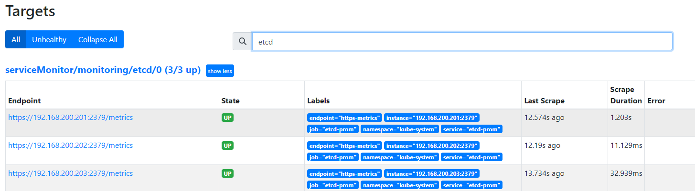
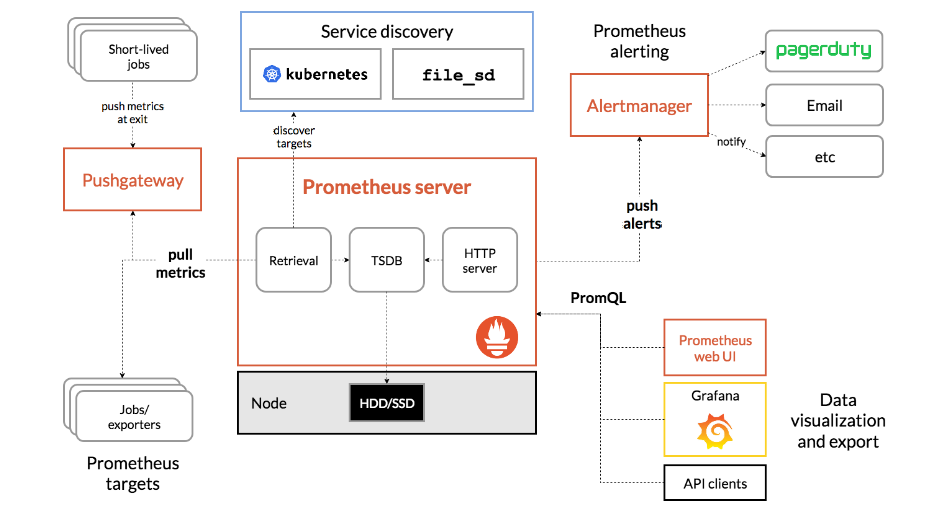

#### 公开课

---


官方网站：https://prometheus.io/docs/introduction/overview/

---

#### :deciduous_tree: 什么是Prometheus

Prometheus也被称为下一代云原生监控，与老牌的zabbix还是有差距的；

+ 在使用K8s的时候很容易感受到老牌的监控系统对K8s不是很友好，监控起来不是非常方便，所以诞生了Prometheus；

具备老牌监控不具备的

+ 老牌的监控能做的Prometheus都可以做，但是Prometheus能做的老牌监控系统不一定能干
+ K8s会跑很多Pod，成千上万个；老牌监控很难达到监控效果
+ Prometheus 也可以监控K8s外部的东西：数据库、中间件、操作系统、交换机路由器等

认识：

1.   是一个开源系统监控和警报工具包
2. Prometheus 将其指标收集并存储为时间序列数据，即指标信息与记录时的时间戳以及称为标签的可选键值对一起存储。

普罗米修斯的主要特点是：

- 具有由指标名称和键/值对标识的时间序列数据的多数据模型，老牌监控查询几分钟内的数据速度不是很快。Prometheus 本身就是一个数据库，通过时间戳查询非常非常快
- PromQL，一种灵活的查询语言来利用这个维度
- 不依赖分布式存储；单个服务器节点是自治的（自治：非常方便实现高可用）
- 时间序列收集通过 HTTP 上的pull模型进行
- 通过中间网关支持推送时间序列
- 通过服务发现或静态配置发现目标
  - k8S外的机器
- 多种图形和仪表板支持模式，与GRafana堪称绝配

> 指标在理解您的应用程序为何以某种方式工作方面起着重要作用
>
> 大多数 Prometheus 组件都是用Go编写的，这使得它们易于构建和部署为静态二进制文件。

 

#### :deciduous_tree: 架构

 


 		Prometheus 直接或通过一个用于短期作业的中间推送网关从检测作业中抓取指标。它在本地存储所有抓取的样本，并对这些数据运行规则，以聚合和记录现有数据的新时间序列或生成警报。Grafana 或其他 API 消费者可用于可视化收集的数据。


#### :deciduous_tree: 安装

官方文档：https://prometheus.io/docs/prometheus/latest/installation/

使用技术栈：Kube-Prometheus Stack

+ https://github.com/prometheus-operator/kube-prometheus

无论使用什么方式安装：原理相同，可能只是配置位置不同；

确定集群版本：安装对应版本的

 

```SHELL
git clone -b release-0.12  https://github.com/prometheus-operator/kube-prometheus.git
# 安装
 cd kube-prometheus/manifests/
 kubectl create -f setup/
 
# 测试环境
vim alertmanager-alertmanager.yaml # 修改副本数1
vim prometheus-prometheus.yaml     # 副本数1
kubectl create -f .
```

 


访问Prometheus界面

  


#### :deciduous_tree: 数据来源

数据是如如何抓取到的？ 

+ 云原生应用：/metrics
+ 非云原生：Exporter （如 redis 、mysql）如果需要监控指标就装一个Exporter

1> 非云原生

如主机监控肯定有一个node exporter

```SHELL
[root@k8s-master01 ~]# ps aux | grep node_exporter
nfsnobo+  14520  0.3  0.6 726844 24560 ?        Ssl  18:41   0:23 /bin/node_exporter ...
```

对应Pod（在每个宿主机起了一个deamonset）

```SH
[root@k8s-master01 ~]# kubectl get pod -n monitoring | grep node
node-exporter-9cqzg                    2/2     Running   0              109m
node-exporter-hpxkk                    2/2     Running   0              109m
node-exporter-jvjr9                    2/2     Running   0              109m
node-exporter-nkbn8                    2/2     Running   0              109m
node-exporter-snpbj                    2/2     Running   0              109m
```

通过监听：9100端口采集宿主机的信息

```SH
[root@k8s-master01 ~]# netstat -lntp | grep 9100
tcp        0      0 192.168.200.201:9100    0.0.0.0:*               LISTEN      15834/kube-rbac-pro
tcp        0      0 127.0.0.1:9100          0.0.0.0:*               LISTEN      14520/node_exporter
```

查看全部监控信息: Prometheus定期通过pull获取export二暴露出来的数据，获取到数据，也就是指标

```SH
# curl 127.0.0.1:9100/metrics
```


 


2> 云原生

```YAML
# netstat -lntp | grep kubelet
tcp        0      0 127.0.0.1:10248         0.0.0.0:*               LISTEN      1069/kubelet
tcp6       0      0 :::10250                :::*                    LISTEN      1069/kubelet
```

进程本身就提供了metrics接口，所以不用再提供exporter；


#### :deciduous_tree: 什么是ServiceMonitor

用来配置监控目标；

 

Prometheus 配置文件是非常长的，监控项越来越多配置文件就越来越难维护，所以在K8s部署Prometheus就想到了这个问题，设计出来了自定义的一个资源“ServiceMonitor”；

```YAML
[root@k8s-master01 ~]# kubectl get servicemonitors -n monitoring
NAME                      AGE
alertmanager-main         3h49m
blackbox-exporter         3h49m
coredns                   3h49m
grafana                   3h49m
kube-apiserver            3h49m
kube-controller-manager   3h49m
kube-scheduler            3h49m
kube-state-metrics        3h49m
kubelet                   3h49m
node-exporter             3h49m
prometheus-adapter        3h49m
prometheus-k8s            3h49m
prometheus-operator       3h49m
```

查看 node-exporter

1. 利用K8s的service实现自动发现，同名的ep 会有主机IP


#### :deciduous_tree: 配置解析

一般也不需要怎么写，很多开源项目已经提供

```YAML
[root@k8s-master01 ~]# kubectl get servicemonitors -n monitoring node-exporter -oyaml
apiVersion: monitoring.coreos.com/v1
kind: ServiceMonitor
metadata:
  labels:
    app.kubernetes.io/component: exporter
    app.kubernetes.io/name: node-exporter
    app.kubernetes.io/part-of: kube-prometheus
    app.kubernetes.io/version: 1.5.0
  name: node-exporter
  namespace: monitoring
spec:
  endpoints:
  - honroLabels: #如果目标标签和服务器标签冲突，是否保留目标标签
    interval: 15s	# 抓取数据时间间隔
    port: https	# Metrics端口
    path: /metrics #端口路径
    scheme: https	# 端口协议
  jobLabel: es-exporter #
  namespaceSelector:
    matchNames:
    - monitoting
  selector:	# 匹配svc标签，实现自动发现
    matchLabels:
      app.kubernetes.io/component: exporter
      app.kubernetes.io/name: node-exporter
      app.kubernetes.io/part-of: kube-prometheus
```


#### :deciduous_tree: 监控流程

 

prometheus 采集数据：

+ 应用本身提供
+ exporter提供：非云原生应用-创建Service-Export采集数据指向Servcie，Export创建一个Service暴露出/metrics接口，再创建一个ServiceMonitor指向Exporter 上；

> 集群外部应用：service指向IP地址


#### :label: 监控实践

ETCD监控

1> 测试访问etcd的 ./metrics接口

````SH
[root@k8s-master01 ~]# netstat -lntp | grep etcd
tcp        0      0 192.168.200.201:2379    0.0.0.0:*               LISTEN      2037/etcd
tcp        0      0 127.0.0.1:2379          0.0.0.0:*               LISTEN      2037/etcd
tcp        0      0 192.168.200.201:2380    0.0.0.0:*               LISTEN      2037/etcd
tcp        0      0 127.0.0.1:2381          0.0.0.0:*               LISTEN      2037/etcd
[root@k8s-master01 ~]# curl 127.0.0.1:2381/metrics
````

2> 证书的位置可以在Etcd配置文件中获得

```
[root@k8s-master01 ~]# curl -Lk --cert /etc/kubernetes/pki/etcd/peer.crt --key /etc/kubernetes/pki/etcd/peer.key  https://192.168.200.201:2379/metrics | tail -2
  % Total    % Received % Xferd  Average Speed   Time    Time     Time  Current
                                 Dload  Upload   Total   Spent    Left  Speed
100  169k    0  169k    0     0   896k      0 --:--:-- --:--:-- --:--:--  900k
promhttp_metric_handler_requests_total{code="500"} 0
promhttp_metric_handler_requests_total{code="503"} 0
```

3> etcd service 

```YAML
apiVersion: v1
kind: Endpoints
metadata:
  labels:
    app: etcd-prom
  name: etcd-prom
  namespace: kube-system
subsets:
- addresses:
  - ip: 192.168.200.201
  - ip: 192.168.200.202
  - ip: 192.168.200.203
  ports:
  - name: https-metrics
    port: 2379
    protocol: TCP
---
apiVersion: v1
kind: Service
metadata:
  labels:
    app: etcd-prom
  name: etcd-prom
  namespace: kube-system
spec:
  ports:
  - name: https-metrics
    port: 2379
    protocol: TCP
    targetPort: 2379
  type: ClusterIP
```

创建：

```SH
[root@k8s-master01 ~]# kubectl get svc -n kube-system | grep etcd
etcd-prom        ClusterIP   10.103.99.164    <none>        2379/TCP                       46s
[root@k8s-master01 ~]# kubectl get ep -n kube-system | grep etcd
etcd-prom        192.168.200.201:2379,192.168.200.202:2379,192.168.200.203:2379                   53s
```

测试：

+ SVC可以正常的代理到Pod上

```SH
[root@k8s-master01 ~]# curl -Lk --cert /etc/kubernetes/pki/etcd/peer.crt --key /etc/kubernetes/pki/etcd/peer.key  https://10.103.99.164:2379/metrics | tail -2
  % Total    % Received % Xferd  Average Speed   Time    Time     Time  Current
                                 Dload  Upload   Total   Spent    Left  Speed
100  169k    0  169k    0     0   353k      0 --:--:-- --:--:-- --:--:--  354k
promhttp_metric_handler_requests_total{code="500"} 0
promhttp_metric_handler_requests_total{code="503"} 0
```

 


4> 创建

> ETCD是需要证书的，必须将证书挂载到etcdPod当中

```SH
kubectl create secret generic etcd-ssl --from-file=/etc/kubernetes/pki/etcd/ca.crt --from-file=/etc/kubernetes/pki/etcd/peer.crt --from-file=/etc/kubernetes/pki/etcd/peer.key -n monitoring
```

因为Secret有namespace隔离性，要和prometheus在同一命名空间下


5> 更改prom资源

```SH
# kubectl edit prometheus -n monitoring k8s
  probeSelector: {}
  secrets:
    - etcd-ssl
  replicas: 1
# kubectl get prometheus -n monitoring
NAME   VERSION   DESIRED   READY   RECONCILED   AVAILABLE   AGE
k8s    2.41.0    1         1       True         True        18h
# kubectl exec -n monitoring prometheus-k8s-0 -c prometheus -- ls /etc/prometheus/secrets/etcd-ssl
ca.crt
peer.crt
peer.key
```

重启完成后查看证书是否挂载，prom通过证书文件就可以访问到etcd的/metric接口


6> 创建Servicemonitor

```YAML
[root@k8s-master01 ~]# cat etcd-servicemonitor.yaml
apiVersion: monitoring.coreos.com/v1
kind: ServiceMonitor
metadata:
  labels:
    app: etcd
  name: etcd
  namespace: monitoring
spec:
  endpoints:
  - interval: 15s
    port: https-metrics # Metrics端口,service.spec.ports.name
    path: /metrics #端口路径
    scheme: https       # 端口协议
    tlsConfig:
      certFile: /etc/prometheus/secrets/etcd-ssl/peer.crt
      keyFile: /etc/prometheus/secrets/etcd-ssl/peer.key
      caFile: /etc/prometheus/secrets/etcd-ssl/ca.crt
      insecureSkipVerify: true # 关闭证书校验
  namespaceSelector:
    matchNames:
    - kube-system
  selector:     # 匹配svc标签，实现自动发现
    matchLabels:
      app: etcd-prom
```

prom config

 

 


查看ETCD版本号：

 


#### :label:非云原生监控

 

云原生和非云原生差别：数据是谁提供的

+ 云原生：应用本身
+ 非云原生：export采集数据，暴露出 /mertics接口

> MySQL - 非云原生监控

演示：并非生产环境可使用

```SH
kubectl create deployment mysql --image=mysql:8.0
kubectl set env deploy/mysql MYSQL_ROOT_PASSWORD=mysq
kubectl expose deployment mysql --port 3306
# 登录Mysql 创建Exporter所需的用户权限（如果有需要监控的MySQL，可以直接执行此步骤）
kubectl exec -ti mysql-7d7f4894c9-c9z4p -- mysql -uroot -pmysql
create user 'exporter'@'%' identified by 'exporter' with max_user_connections 3;
grant process,replication client,select on *.* to 'exporter'@'%';
```

配置Exporter采集MySQL监控数据

```YAML
apiVersion: apps/v1
kind: Deployment
metadata:
  name: mysql-exporter
  namespace: monitoring
spec:
  replicas: 1
  selector:
    matchLabels:
      k8s-app: mysql-exporter
  strategy: {}
  template:
    metadata:
      labels:
        k8s-app: mysql-exporter
    spec:
      containers:
      - image: bitnami/mysqld-exporter
        name: mysqld-exporter
        env:
        - name: DATA_SOURCE_NAME
          value: "exporter:exporter@(mysql.default:3306)/"
          #value: "exporter:exporter@(1.1.1.1:3306)/" #外部集群
        imagePullPolicy: IfNotPresent
        ports:
        - containerPort: 9104
---
apiVersion: v1
kind: Service
metadata:
  labels:
    k8s-app: mysql-exporter
  name: mysql-exporter
  namespace: monitoring
spec:
  ports:
  - name: api
    port: 9104
    protocol: TCP
  selector:
    k8s-app: mysql-exporter
  type: ClusterIP
```

测试是否采集到数据

```SH
# kubectl get svc -n monitoring | grep mysql
mysql-exporter          ClusterIP   10.103.51.5      <none>        9104/TCP                        28m
# curl 10.103.51.5:9104/metrics
```

配置Servicemonitoring

```YAML
apiVersion: monitoring.coreos.com/v1
kind: ServiceMonitor
metadata:
  name: mysql-exporter
  namespace: monitoring
  labels:
    k8s-app: mysql-exporter
    namespace: monitoring
spec:
  jobLabel: k8s-app
  endpoints:
  - interval: 15s
    port: api
    path: /metrics #端口路径
    scheme: http       # 端口协议
  namespaceSelector:
    matchNames:
    - monitoring
  selector:     # 匹配svc标签，实现自动发现
    matchLabels:
      k8s-app: mysql-exporter
```

> scheme: http       # 端口协议 为 http

 


#### :label:监控失败排查步骤

1. 确认Service Monitor是否成功创建
2. 确认Service Monitor标签是否配置正确
3. 确认存在的Service Monitor匹配的Service
4. 确认通过Service能够访问程序的Mertics接口
5. 确认Service的端口和Scheme和Service Monitor一致

1> Watchdog

不是一个告警，是一个状态的监控，在生产环境中可以关掉也可以不关

 

+ active：表示Prometheus集群状态正常


 2> CPU

 

因素很多，比如

+ 服务器内核配置
+ 程序的CPU配置的不合理，limit 给的太低了
+ K8s 使用 cfs进行限制CPU限流产生的告警

> 自己的虚拟机搭建的环境可能有，生产环境服务器配置比较高，可能没有这个告警

生产环境可以尝试将Limit参数调高来解决这个问题


> 以下两个是根据安装的环境觉得的有没有

3> **KubeControllerManagerDown** (1 active)

 


4> **KubeSchedulerDown** (1 active)

 


5> **NodeClockNotSynchronising** (4 active)

+ 没有ntp服务器，或者连接不到

  


排查解决

+ **KubeControllerManagerDown** (1 active)
+ **KubeSchedulerDown** (1 active)

1> 查看servicemonitoring有没有被创建

```SH
# kubectl get servicemonitors.monitoring.coreos.com -n monitoring
NAME                      AGE
kube-controller-manager   38h
kube-scheduler            38h
```

2> SM抓取的svc是否存在

```SH
# kubectl get servicemonitor -n monitoring kube-controller-manager -oyaml | grep -5 selector
      insecureSkipVerify: true
  jobLabel: app.kubernetes.io/name
  namespaceSelector:
    matchNames:
    - kube-system
  selector:
    matchLabels:
      app.kubernetes.io/name: kube-controller-manager	# 标签
# kubectl get svc -n kube-system -l app.kubernetes.io/name=kube-controller-manager
No resources found in kube-system namespace.
```

没有该标签的svc


#### :label:黑盒监控

白盒监控

+ 程序内部的一些指标，这类监控专注的点是原因，也就是一般出现问题的根本，此类监控称为白盒监控，主要关注的是原因；

黑盒监控

+ 监控关注的是现象，也就是正在发生的告警，比如某个网站突然变慢了，或者是打不开了。此类告警是站在用户角度上看到的东西，比较关注现象，表示正在发生的问题，这类监控称为黑盒监控

> 安装新版的prom 黑盒监控都是已经安装过的

```SH
# kubectl get pod -n monitoring blackbox-exporter-58c9c5ff8d-lclpr
NAME                                 READY   STATUS    RESTARTS   AGE
blackbox-exporter-58c9c5ff8d-lclpr   3/3     Running   0          40h
# kubectl get svc -n monitoring blackbox-exporter
# curl -s "http://10.103.25.81:19115/probe?target=www.baidu.com&module=http_2xx" |tail -1
```

probe：接口地址

target：检测的目标

module：使用哪个模块进行探测


#### :label: 静态配置

K8s内部的服务使用Servicemonitoring可能比较简单

外部服务使用静态配置更简单些

+ 之前：比如配置etcd的监控，创建一个Endpoints、service、Servicemonitoring；
+ 静态配置：直接在target下配置Ip地址，不需要再去创建Endpoints、service

> 两种不同的配置方式，Servicemonitoring并不适合所有，比喻域名的监控


```SHELL
# touch promethues-additional.yaml
# kubectl create secret generic additional-configs --from-file=promethues-additional.yaml -n monitoring
```

更改promethues配置：

```YAML
spec:
  additionalScrapeConfigs:
    key: promethues-additional.yaml
    name: additional-configs
    optional: true
```

添加配置后保存退出，无需重启 Prometheus的Pod即可生效，之后再promethues-additional.yaml 内编辑一些静态配置文件，此处用于黑盒监控的配置进行演示：

https://github.com/prometheus/blackbox_exporter

```YAML
  - job_name: 'blackbox'
    metrics_path: /probe
    params:
      module: [http_2xx]  # Look for a HTTP 200 response.
    static_configs:
      - targets:
        - http://prometheus.io    # Target to probe with http.I
        - https://prometheus.io   # Target to probe with https.
        - http://example.com:8080 # Target to probe with http on port 8080.
        - https://www.baidu.com
    relabel_configs:
      - source_labels: [__address__]
        target_label: __param_target
      - source_labels: [__param_target]
        target_label: instance
      - target_label: __address__
        replacement: blackbox-exporter:19115  # The blackbox exporter's real hostname:port.
```

更新Secret：

```SH
# kubectl create secret generic additional-configs --from-file=promethues-additional.yaml --dry-run=client -oyaml| kubectl replace -f - -n monitoring
# kubectl get -n monitoring secrets additional-configs -oyaml
apiVersion: v1
data:
  promethues-additional.yaml: ICAtIGpvYl9uYW1lOiAnYmxhY2tib3gnCiAgICBtZXRyaWNzX3BhdGg6IC9wcm9iZQogICAgcGFyYW1zOgogICAgICBtb2R1bGU6IFtodHRwXzJ4eF0gICMgTG9vayBmb3IgYSBIVFRQIDIwMCByZXNwb25zZS4KICAgIHN0YXRpY19jb25maWdzOgogICAgICAtIHRhcmdldHM6CiAgICAgICAgLSBodHRwOi8vcHJvbWV0aGV1cy5pbyAgICAjIFRhcmdldCB0byBwcm9iZSB3aXRoIGh0dHAuSQogICAgICAgIC0gaHR0cHM6Ly9wcm9tZXRoZXVzLmlvICAgIyBUYXJnZXQgdG8gcHJvYmUgd2l0aCBodHRwcy4KICAgICAgICAtIGh0dHA6Ly9leGFtcGxlLmNvbTo4MDgwICMgVGFyZ2V0IHRvIHByb2JlIHdpdGggaHR0cCBvbiBwb3J0IDgwODAuCiAgICAgICAgLSBodHRwczovL3d3dy5iYWlkdS5jb20KICAgIHJlbGFiZWxfY29uZmlnczoKICAgICAgLSBzb3VyY2VfbGFiZWxzOiBbX19hZGRyZXNzX19dCiAgICAgICAgdGFyZ2V0X2xhYmVsOiBfX3BhcmFtX3RhcmdldAogICAgICAtIHNvdXJjZV9sYWJlbHM6IFtfX3BhcmFtX3RhcmdldF0KICAgICAgICB0YXJnZXRfbGFiZWw6IGluc3RhbmNlCiAgICAgIC0gdGFyZ2V0X2xhYmVsOiBfX2FkZHJlc3NfXwogICAgICAgIHJlcGxhY2VtZW50OiBibGFja2JveC1leHBvcnRlcjoxOTExNSAgIyBUaGUgYmxhY2tib3ggZXhwb3J0ZXIncyByZWFsIGhvc3RuYW1lOnBvcnQuCg==
kind: Secret
metadata:
  creationTimestamp: "2023-03-15T03:24:54Z"
  name: additional-configs
  namespace: monitoring
  resourceVersion: "285897"
  uid: 092ba7cf-243e-4c2b-82b1-61a629218d7a
type: Opaque
---
# echo """ICAtIGpvYl9uYW1lOiAnYmxhY2tib3gnCiAgICBtZXRyaWNzX3BhdGg6IC9wcm9iZQogICAgcGFyYW1zOgogICAgICBtb2R1bGU6IFtodHRwXzJ4eF0gICMgTG9vayBmb3IgYSBIVFRQIDIwMCByZXNwb25zZS4KICAgIHN0YXRpY19jb25maWdzOgogICAgICAtIHRhcmdldHM6CiAgICAgICAgLSBodHRwOi8vcHJvbWV0aGV1cy5pbyAgICAjIFRhcmdldCB0byBwcm9iZSB3aXRoIGh0dHAuSQogICAgICAgIC0gaHR0cHM6Ly9wcm9tZXRoZXVzLmlvICAgIyBUYXJnZXQgdG8gcHJvYmUgd2l0aCBodHRwcy4KICAgICAgICAtIGh0dHA6Ly9leGFtcGxlLmNvbTo4MDgwICMgVGFyZ2V0IHRvIHByb2JlIHdpdGggaHR0cCBvbiBwb3J0IDgwODAuCiAgICAgICAgLSBodHRwczovL3d3dy5iYWlkdS5jb20KICAgIHJlbGFiZWxfY29uZmlnczoKICAgICAgLSBzb3VyY2VfbGFiZWxzOiBbX19hZGRyZXNzX19dCiAgICAgICAgdGFyZ2V0X2xhYmVsOiBfX3BhcmFtX3RhcmdldAogICAgICAtIHNvdXJjZV9sYWJlbHM6IFtfX3BhcmFtX3RhcmdldF0KICAgICAgICB0YXJnZXRfbGFiZWw6IGluc3RhbmNlCiAgICAgIC0gdGFyZ2V0X2xhYmVsOiBfX2FkZHJlc3NfXwogICAgICAgIHJlcGxhY2VtZW50OiBibGFja2JveC1leHBvcnRlcjoxOTExNSAgIyBUaGUgYmxhY2tib3ggZXhwb3J0ZXIncyByZWFsIGhvc3RuYW1lOnBvcnQuCg==""" | base64 -d
  - job_name: 'blackbox'
    metrics_path: /probe
    params:
      module: [http_2xx]  # Look for a HTTP 200 response.
    static_configs:
      - targets:
        - http://prometheus.io    # Target to probe with http.I
        - https://prometheus.io   # Target to probe with https.
        - http://example.com:8080 # Target to probe with http on port 8080.
        - https://www.baidu.com
    relabel_configs:
      - source_labels: [__address__]
        target_label: __param_target
      - source_labels: [__param_target]
        target_label: instance
      - target_label: __address__
        replacement: blackbox-exporter:19115  # The blackbox exporter's real hostname:port.
```


#### 

> 告警：必须掌握PromQL，可以满足生产环境需求

#### :taco: PromQL初体验

PromQL Web UI的Graph选项卡提供了简单的用于查询数据入口

输入up，然后Execute，能够查到监控正常的Target；

只想查看node-exporter

+ up{job="node-exporter"}

 

{}相当于sql 中的 where

+ =
+ !=

正则：注意不能写空格

+ up{job=~"^node-.*"}
+ up{job!~"^node-.*|alertmanager-main"}   #匹配两个

多个条件：管道符


查询集群中每个宿主机的磁盘数量：

+ node_filesystem_size_bytes

查看根分区并且将字节转换成GB：

```properties
node_filesystem_size_bytes{mountpoint="/"}/1024/1024/1024
```

 

查询最近5min

node_filesystem_avail_bytes{instance="k8s-master01",mountpoint="/",device='/dev/mapper/centos-root'}[5m]

 

查询10min之前可用参数

+ offset 1d

```SH
node_filesystem_avail_bytes{instance="k8s-master01",mountpoint="/",device='/dev/mapper/centos-root'}offset 1d
```

用在当前值比较


#### :taco: PromQL操作符

查看磁盘的剩余，将字节转换为GB

```SH
node_filesystem_avail_bytes{instance="k8s-master01",mountpoint='/',device="/dev/mapper/centos-root"}/1024/1024/01024
```

可以将

+ /1024/1024/01024  --  /1024^3 或者 （1024 ^ 3）

```SH
node_filesystem_avail_bytes{instance="k8s-master01",mountpoint='/',device="/dev/mapper/centos-root"}/1024^3
```

+ +
+ -
+ *
+ /
+ ^
+ %

查询 k8s-master01根分区磁盘可用率：

```yaml
node_filesystem_avail_bytes{instance="k8s-master01",mountpoint='/',device="/dev/mapper/centos-root"}/node_filesystem_size_bytes{instance="k8s-master01",mountpoint="/",device="/dev/mapper/centos-root"}
```

  

```sh
[root@k8s-master01 prom]# df -Th
Filesystem              Type      Size  Used Avail Use% Mounted on
/dev/mapper/centos-root xfs        17G  5.6G   12G  33% /
```

100%-33% 

过滤还是很准确的,1减在乘100

```sh
(1-node_filesystem_avail_bytes{mountpoint='/',device="/dev/mapper/centos-root"}/node_filesystem_size_bytes{mountpoint="/",device="/dev/mapper/centos-root"}) * 100
```

PromQL也支持如下判断

+ ==、!=、>、<、>=、<=

查看30%<=磁盘使用率<=60%

+ 可以取设置告警

```SH
30<=(1-node_filesystem_avail_bytes{mountpoint='/',device="/dev/mapper/centos-root"}/node_filesystem_size_bytes{mountpoint="/",device="/dev/mapper/centos-root"} * 100)<=60
```

也可以使用and语法进行联合查询

+ and
+ or
+ unless：排除

大于60并且小于65

```PROMQL
node_filesystem_avail_bytes{mountpoint='/',device="/dev/mapper/centos-root"}/node_filesystem_size_bytes{mountpoint="/",device="/dev/mapper/centos-root"} * 100 >=60 and node_filesystem_avail_bytes{mountpoint='/',device="/dev/mapper/centos-root"}/node_filesystem_size_bytes{mountpoint="/",device="/dev/mapper/centos-root"} * 100 <= 65
```


> 操作符：用来做告警
>
> 常用函数：数据统计


#### :taco: PromQL常用函数

+ sum

统计磁盘的剩余量

```YAML
sum(node_filesystem_free_bytes{mountpoint='/'})/(1024^3)
```

+ by() 分组 ，by中可以存在多个逗号分隔
+ floor：取整数，不会四舍五入
+ sort：排序
+ desc：倒序

函数predict_linear可以预测分析和预测性告警，比如可以根据一天的数据，预测4个小时候的，磁盘分区的空间会不会小于0

```SH
predict_linear(node_filesystem_free_bytes{mountpoint="/"}[1d],4*3600)<0
```

非常非常重要，用的很多

+ rate：计算增长率（长尾效应）

+ irate ： 计算增长率，瞬时

+ increase：计算一段时间范围内的数据增长，只能计算count类型的数据

  rate 和 irate是计算增长率。比如查询某个请求在1小时的时间增长了多少

可以计算出某个指标在给定时间范围内的增长率，比如还是计算1h的增长率，可以用rate函数进行计算：

```SH
increase(node_filesystem_files{}[1h])
rate(node_filesystem_files{}[1h])
```

一般都是使用rate

做告警策略irate 是不能用的，灵敏度太高了


#### :tada:Alertmanager 配置文件夹解析

 


配置模板：

 https://github.com/prometheus/alertmanager/blob/main/doc/examples/simple.yml

官方文档：

https://prometheus.io/docs/alerting/latest/configuration/


Alertmanager 默认 Web UI

 

> status 中是默认配置

模块：global、templates、route、  routes、receivers、

+ global 全局通用配置，在任何一个配置块都可以看到，不需要在每个receivers 配置
  + 邮件告警配置
  + 微信告警配置
  + 钉钉告警配置 等等
+ templates：告警模板
+ route：路由配置（告警信息分组路由，将不同的分组的告警发给不同的人）
  + group_by：分组（切片）
  + group_wait：若一组新的告警产生，则会等group_wait后再发送通知，该功能主要用于当告警在很短时间内接连产生时，在group_wait内合并为单一的告警后再发送
    + 降低告警风暴，合并成一个告警
  + group_interval：再次告警时间间隔
  + repeat_interval：如果一条告警通知已成功发送，且在间隔repeat_interval后，该告警仍然未被设置为resolved，则会再次发送该告警通知
  + receiver：默认告警通知接收者，凡未被匹配进入各子路由节点的告警均被发送到此接收者

> route的配置会被传递给子路由节点，子路由节点进行重新配置才会被覆盖

+ routes: 该配置选项使用正则表达式来匹配告警的labels，以确定能否进入该子路由树
+ inhibit_rules：抑制告警，告警风暴（如：宿主机挂了服务肯定也挂了，就会出现重复的告警，很慢定位到问题）
+ receivers：收件人配置

```YAML
# global块配置下的配置选项在本配置文件内的所有配置项下可见
global:
  # 在Alertmanager内管理的每一条告警均有两种状态: "resolved"或者"firing". 在altermanager首次发送告警通知后, 该告警会一直处于firing状态,设置resolve_timeout可以指定处于firing状态的告警间隔多长时间会被设置为resolved状态, 在设置为resolved状态的告警后,altermanager不会再发送firing的告警通知.
  resolve_timeout: 1h

  # 邮件告警配置
  smtp_smarthost: 'smtp.exmail.qq.com:25'
  smtp_from: 'dukuan@xxx.com'
  smtp_auth_username: 'dukuan@xxx.com'
  smtp_auth_password: 'DKxxx'
  # HipChat告警配置
  # hipchat_auth_token: '123456789'
  # hipchat_auth_url: 'https://hipchat.foobar.org/'
  # wechat
  # 微信告警
  wechat_api_url: 'https://qyapi.weixin.qq.com/cgi-bin/'
  wechat_api_secret: 'JJ'
  wechat_api_corp_id: 'ww'

  # 告警通知模板
templates:
- '/etc/alertmanager/config/*.tmpl'

# route: 根路由,该模块用于该根路由下的节点及子路由routes的定义. 子树节点如果不对相关配置进行配置，则默认会从父路由树继承该配置选项。每一条告警都要进入route，即要求配置选项group_by的值能够匹配到每一条告警的至少一个labelkey(即通过POST请求向altermanager服务接口所发送告警的labels项所携带的<labelname>)，告警进入到route后，将会根据子路由routes节点中的配置项match_re或者match来确定能进入该子路由节点的告警(由在match_re或者match下配置的labelkey: labelvalue是否为告警labels的子集决定，是的话则会进入该子路由节点，否则不能接收进入该子路由节点).
route:
  # 例如所有labelkey:labelvalue含cluster=A及altertname=LatencyHigh labelkey的告警都会被归入单一组中
  group_by: ['job', 'altername', 'cluster', 'service','severity']
  # 若一组新的告警产生，则会等group_wait后再发送通知，该功能主要用于当告警在很短时间内接连产生时，在group_wait内合并为单一的告警后再发送
  group_wait: 30s
  # 再次告警时间间隔
  group_interval: 5m
  # 如果一条告警通知已成功发送，且在间隔repeat_interval后，该告警仍然未被设置为resolved，则会再次发送该告警通知
  repeat_interval: 12h
  # 默认告警通知接收者，凡未被匹配进入各子路由节点的告警均被发送到此接收者
  receiver: 'wechat'
  # 上述route的配置会被传递给子路由节点，子路由节点进行重新配置才会被覆盖

  # 子路由树
  routes:
  # 该配置选项使用正则表达式来匹配告警的labels，以确定能否进入该子路由树
  # match_re和match均用于匹配labelkey为service,labelvalue分别为指定值的告警，被匹配到的告警会将通知发送到对应的receiver
  - match_re:
      service: ^(foo1|foo2|baz)$
    receiver: 'wechat'
    # 在带有service标签的告警同时有severity标签时，他可以有自己的子路由，同时具有severity != critical的告警则被发送给接收者team-ops-mails,对severity == critical的告警则被发送到对应的接收者即team-ops-pager
    routes:
    - match:
        severity: critical
      receiver: 'wechat'
  # 比如关于数据库服务的告警，如果子路由没有匹配到相应的owner标签，则都默认由team-DB-pager接收
  - match:
      service: database
    receiver: 'wechat'
  # 我们也可以先根据标签service:database将数据库服务告警过滤出来，然后进一步将所有同时带labelkey为database
  - match:
      severity: critical
    receiver: 'wechat'
# 抑制规则，当出现critical告警时 忽略warning
inhibit_rules:
- source_match:
    severity: 'critical'
  target_match:
    severity: 'warning'
  # Apply inhibition if the alertname is the same.
  #   equal: ['alertname', 'cluster', 'service']
  #
# 收件人配置
receivers:
- name: 'team-ops-mails'
  email_configs:
  - to: 'dukuan@xxx.com'
- name: 'wechat'
  wechat_configs:
  - send_resolved: true
    corp_id: 'ww'
    api_secret: 'JJ'
    to_tag: '1'
    agent_id: '1000002'
    api_url: 'https://qyapi.weixin.qq.com/cgi-bin/'
    message: '{{ template "wechat.default.message" . }}'
#- name: 'team-X-pager'
#  email_configs:
#  - to: 'team-X+alerts-critical@example.org'
#  pagerduty_configs:
#  - service_key: <team-X-key>
#
#- name: 'team-Y-mails'
#  email_configs:
#  - to: 'team-Y+alerts@example.org'
#
#- name: 'team-Y-pager'
#  pagerduty_configs:
#  - service_key: <team-Y-key>
#
#- name: 'team-DB-pager'
#  pagerduty_configs:
#  - service_key: <team-DB-key>
#  
#- name: 'team-X-hipchat'
#  hipchat_configs:
#  - auth_token: <auth_token>
#    room_id: 85
#    message_format: html
#    notify: true 
```


