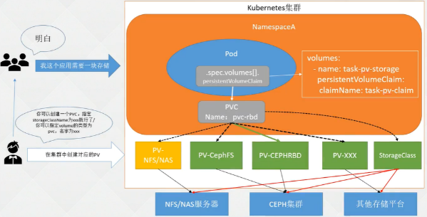

- [K8s进阶篇-持久化存储入门](#k8s进阶篇-持久化存储入门)
  - [1.1 EmptyDir](#11-emptydir)
  - [1.2 HostPath 挂载宿主机路径](#12-hostpath-挂载宿主机路径)
  - [1.3 挂载NFS至容器](#13-挂载nfs至容器)
  - [2.1 K8s持久化存储PV\&PVC](#21-k8s持久化存储pvpvc)
  - [2.2 回收策略](#22-回收策略)
  - [2.3 访问策略](#23-访问策略)
  - [2.4 存储的分类](#24-存储的分类)
  - [2.5 创建NFS或NAS类型的PV](#25-创建nfs或nas类型的pv)
  - [2.6 PV状态](#26-pv状态)
  - [2.7 创建HostPath的PV](#27-创建hostpath的pv)
  - [2.8 PVC绑定PV](#28-pvc绑定pv)
  - [2.9 Pod绑定PVC](#29-pod绑定pvc)
  - [2.10 pvc创建和挂载失败的原因](#210-pvc创建和挂载失败的原因)


###  K8s进阶篇-持久化存储入门 ###

:warning: Kubernetes Volume可以解决这两个问题；

> 容器每次重启都会以最干净的状态启动，未持久化存储，数据就会丢

1. container（容器）中的磁盘文件是短暂的，当容器崩溃时，kubelet会重新启动容器，但最初的文件将丢失，Container会以最干净的状态启动。
2. 当一个Pod运行多个Container时，各个容器可能需要共享一些文件。一些需要持久化数据的程序才会用到Volumes，或者一些需要共享数据的容器需要volumes。

在K8是中可能部署一个Redis-Cluster：nodes.conf文件：保存了Redis各个实例的IP地址和一个ID，做持久化重启Pod即使IP地址变化也会去修改文件，发现其他容器的IP重新载入集群。如果redis数据要落盘也需要做。但在生产环境中redis只做数据的缓存使用，数据丢了没问题，如果真的需要挂数据，后端需要一个很强大的存储。
	

:deciduous_tree: 日志收集的需求

+ 需要在应用程序的容器里面加一个sidecar，这个容器是一个收集日志的容器，比如filebeat，它通过volumes共享应用程序的日志文件目录。


:deciduous_tree: 背景

Volumes：官方文档https://kubernetes.io/docs/concepts/storage/volumes/

Docker也有卷的概念，但是在Docker中卷只是磁盘上或另一个Container中的目录，其生命周期不受管理。虽然目前Docker已经提供了卷驱动程序，但是功能非常有限，例如从Docker 1.7版本开始，每个Container只允许一个卷驱动程序，并且无法将参数传递给卷。

另一方面，Kubernetes卷具有明确的生命周期，与使用它的Pod相同。因此，在Kubernetes中的卷可以比Pod中运行的任何Container都长，并且可以在Container重启或者销毁之后保留数据。Kubernetes支持多种类型的卷，Pod可以同时使用任意数量的卷。

从本质上讲，卷只是一个目录，可能包含一些数据，Pod中的容器可以访问它。要使用卷Pod需要通过.spec.volumes字段指定为Pod提供的卷，以及使用.spec.containers.volumeMounts 字段指定卷挂载的目录。从容器中的进程可以看到由Docker镜像和卷组成的文件系统视图，卷无法挂载其他卷或具有到其他卷的硬链接，Pod中的每个Container必须独立指定每个卷的挂载位置。


#### 1.1 EmptyDir

一般emptyDir卷用于Pod中的不同Container共享数据

+ 如果删除Pod，emptyDir卷中的数据也将被删除
+ 它可以被挂载到相同或不同的路径上。

​	默认情况下，emptyDir卷支持节点上的任何介质，可能是SSD、磁盘或网络存储，具体取决于自身的环境。可以将emptyDir.medium字段设置为Memory:内存造成浪费，让Kubernetes使用tmpfs（内存支持的文件系统），虽然tmpfs非常快，但是tmpfs在节点重启时，数据同样会被清除，并且设置的大小会被计入到Container的内存限制当中。


:deciduous_tree: 使用emptyDir卷的示例，直接指定emptyDir为{}即可：

+ 一个挂载到opt一个mnt

```yaml
apiVersion: apps/v1
kind: Deployment
metadata:
  labels:
    app: dp-emptydir
  name: dp-emptydir
  namespace: default
spec:
  replicas: 1
  selector:
    matchLabels:
      app: dp-emptydir
  template:
    metadata:
      labels:
        app: dp-emptydir
    spec:
      containers:
      - image: nginx:1.23
        imagePullPolicy: IfNotPresent
        name: nginx1
        ports:
        - containerPort: 80
          name: web
          protocol: TCP
        resources:
          requests:
            cpu: 10m
            memory: 256Mi
        volumeMounts:
        - mountPath: /opt
          name: share-volume
          # readOnly: true
      - image: nginx:1.23
        imagePullPolicy: IfNotPresent
        name: nginx2
        #command: [ "sh","-c","sleep 3600" ] # 演示环境
        ports:
        - containerPort: 80
          name: web
          protocol: TCP
        resources:
          requests:
            cpu: 10m
            memory: 256Mi
        volumeMounts:
        - mountPath: /mnt
          name: share-volume
          # readOnly: true 如果为只读，mnt目录将无法使用 touch vi ...
      restartPolicy: Always
      volumes:
      - emptyDir: {} #只是简单的文件共享写{}就可以
          #medium: Memory  #使用Memory比较耗内存
        name: share-volume
```

:warning: 注意事项：

+ Pod中容器端口冲突，状态将会ERROR（因为起了两个Nginx，都监听的80端口）
+ 一般容器状态：RunContainerError 为容器找不到某个命令，Command（找不到终端）

创建容器：

```SH
# kubectl get pod
NAME                           READY   STATUS   RESTARTS      AGE
dp-emptydir-695c9867b6-hljnp   1/2     Error    3 (36s ago)   58s
```


:deciduous_tree: 演示环境

配置

```SH
command: [ "sh","-c","sleep 3600" ]
```

容器1再opt下创建文件，容器2mnt目录下也会有

```sh
# kubectl exec -ti dp-emptydir-78f7dcc7bd-kkhqb -c nginx1 -- sh
# cd /opt;touch 123
# ls
123

# kubectl exec -ti dp-emptydir-78f7dcc7bd-kkhqb -c nginx2 -- sh
# cd /mnt;ls
123
# mv 123 321
# exit

# kubectl exec -ti dp-emptydir-78f7dcc7bd-kkhqb -c nginx1 -- sh
# ls /opt
321
```

总结：emptyDir就是用来共享数据的，在使用filebeat收集日志的时候也会用到去共享容器日志到filebeta，filebeta就可以去采集日志。


#### 1.2 HostPath 挂载宿主机路径

HostPath：一般情况下是不推荐使用的：不能保证Pod每次部署在一个节点，可以使用一些手段来让它每次部署在一个节点

:deciduous_tree: 官方：

​	HostPath 卷存在许多安全风险，最佳做法是尽可能避免使用 HostPath。 当必须使用 HostPath 卷时，它的范围应仅限于所需的文件或目录，并以只读方式挂载。

   hostPath卷能将主机节点文件系统上的文件或目录挂载到你的 Pod 中。 虽然这不是大多数 Pod 需要的，但是它为一些应用程序提供了强大的逃生舱。

:warning: 使用这种类型的卷时要小心，因为：

- HostPath 卷可能会暴露特权系统凭据（例如 Kubelet）或特权 API（例如容器运行时套接字），可用于容器逃逸或攻击集群的其他部分。
- 具有相同配置（例如基于同一 PodTemplate 创建）的多个 Pod 会由于节点上文件的不同而在不同节点上有不同的行为。
- 下层主机上创建的文件或目录只能由 root 用户写入。你需要在 [特权容器] 中以 root 身份运行进程，或者修改主机上的文件权限以便容器能够写入 hostPath卷


总之：就一个将宿主机上东西挂载到Pod中

:deciduous_tree: hostpath的类型：挂载前会检查

+ File：文件，必须存在
+ Directory：目录
+ FileOrCreate：如果给定路径不存在如何内容，会创建一个空文件，权限设为0644
+ DirectoryOrCreate：给定一个0755的空目录
+ Scoket：UNIX套接字，必须存在
+ CharDevice：字符设备，必须存在给定的路径中
+ BlockDevice：块设备，必须存在

:deciduous_tree: 为容器挂载一个文件

```SH
# cat /etc/timezone
Asia/Shanghai
# kubectl exec -ti dp-emptydir-78f7dcc7bd-kkhqb -c nginx1 -- bash
root@dp-emptydir-78f7dcc7bd-kkhqb:/# cat /etc/timezone
Etc/UTC
```


```yaml
apiVersion: apps/v1
kind: Deployment
metadata:
  labels:
    app: dp-hostpath
  name: dp-hostpath
  namespace: default
spec:
  replicas: 1
  selector:
    matchLabels:
      app: dp-hostpath
  template:
    metadata:
      creationTimestamp: null
      labels:
        app: dp-hostpath
    spec:
      containers:
      - image: nginx:1.23
        imagePullPolicy: IfNotPresent
        name: nginx
        ports:
        - containerPort: 80
          name: http
          protocol: TCP
        resources:
          requests:
            cpu: 10m
            memory: 256Mi
        volumeMounts:
        - mountPath: /etc/timezone # 容器目录
          name: timezone
      restartPolicy: Always
      volumes:
      - hostPath:
          path: /etc/timezone  #宿主机目录
          type: File   # 也可以是目录
        name: timezone
```

验证：

```sh
# kubectl exec -ti dp-hostpath-859c7995d7-ppkcm -- cat /etc/timezone
Asia/Shanghai
```

:deciduous_tree: HostPath常用 type：

+ 为空：默认选项，挂载hostpath不会做任何检查
+ DirectoryOrCreate：如果路径不存在，创建一个权限为0755的空目录，和Kubelet具有相同的组和权限
+ Directory：目录必须存在于给定的路径
+ FileOrCreate
+ File
+ Socket：UNIX套接字


#### 1.3 挂载NFS至容器

nfs 卷能将 NFS (网络文件系统) 挂载到你的 Pod 中。 不像 emptyDir 那样会在删除 Pod 的同时也会被删除，nfs 卷的内容在删除 Pod 时会被保存，卷只是被卸载。 

这意味着 nfs 卷可以被预先填充数据，并且这些数据可以在 Pod 之间共享。

以Pv的形式挂载

:deciduous_tree: 安装NFS 配置NFS

> 每个节点都要装一个nfs，要不然挂载时无法识

node01

```SH
# yum install -y nfs-utils
# systemctl start nfs
# mkdir -p  /data/nfs
# vim /etc/exports
/data/nfs *(rw,sync,no_subtree_check,no_root_squash)
# exportfs -a
# systemctl reload nfs-server
```

master01挂载

```SH
# mount -t nfs 192.168.200.204:/data/nfs /mnt/
You have new mail in /var/spool/mail/root
# df -Th | grep nfs
192.168.200.204:/data/nfs nfs4       17G  5.5G   12G  33% /mnt

# mount -t nfs
# cd /mnt/
# touch 123
```

配置nfs挂载的deployment

````YAML
apiVersion: apps/v1
kind: Deployment
metadata:
  labels:
    app: dp-nfs
  name: dp-nfs
  namespace: default
spec:
  replicas: 1
  selector:
    matchLabels:
      app: dp-nfs
  template:
    metadata:
      creationTimestamp: null
      labels:
        app: dp-nfs
    spec:
      containers:
      - image: nginx:1.23
        imagePullPolicy: IfNotPresent
        name: nginx
        ports:
        - containerPort: 80
          name: web
          protocol: TCP
        resources:
          requests:
            cpu: 10m
            memory: 256Mi
        volumeMounts:
        - mountPath: /mnt
          name: nfs-volume
      volumes:
      - name: nfs-volume
        nfs:
          path: /data/nfs
          server: 192.168.200.204
````

nfs支持多级目录，nfs支持多个副本读写

```SH
 kubectl exec -ti dp-nfs-778fd5679c-wpsxw -- sh
/ # df -Th
Filesystem           Type            Size      Used Available Use% Mounted on
192.168.31.204:/data/nfs nfs4           17.0G      6.4G     10.5G  38% /mnt
/ # cd /mnt/
/mnt # ls
123
```

:warning: 注意事项

nfs虽然挂载进去了，但是nfs并没有什么保障，很难实现高可用的架构！

在云平台可以使用阿里云的nas存储，如果有自己的nas存储平台兼容nfs也可以

不建议在生产环境使用nas存储，真的没办法保障！

+ 也基本不会在生产环境的voleme中写nfs。会直接使用pv的方式，连接到nfs，再挂载以个pvc


#### 2.1 K8s持久化存储PV&PVC

既然可以使用Volume连接后端存储NFS、HostPath、emptyDir，它有这个Vulome为什么还需要PV和PVC

:deciduous_tree: 回顾：

```yaml
    volumes:
      - name: share-volume
        emptyDir: {}
          #medium: Memory

      - name: timezone
        hostPath:
          path: /etc/timezone
          type: File
          
      - name: nfs-volume
        nfs:
          server: 192.168.0.204
          path: /data/nfs/test-dp	
```

在生产环境中：可能会遇到一种问题

只有volume无法满足生产需求

+ 开发知道Deployment怎么写，和Pod。但是不清楚存储怎么配置或者集群中怎么样的存储可以配置
+ 如果每个人都需要K8s管理员配置Vulomes的话，显然不现实


:warning: 注意：只有volume无法满足生产需求

volume无法解决的问题：

1. 当某个数据卷不再挂载时，里面的数据如何处理?（程序下线，数据卷怎么处理，导致垃圾数据volume做不到）
2. 如果想要实现只读挂载如何处理？
3. 如果想要只能一个Pod挂载如何处理？
4. 如果只允许某个Pod使用10G的空间？

	PersistentVolume：简称PV，是由Kubernetes管理员设置的存储，可以配置Ceph、NFS、GlusterFS等常用存储配置，相对于Volume配置，提供了更多的功能，比如 生命周期的管理、大小的限制。PV分为静态和动态。

1. 先提前创建PV，告诉开发人员：直接去配置PV为程序提供存储绑定到PV上，保留产生的数据。就不需要去配置Volume；

2. PVC：开发人员绑定PV

	PersistentVolumeClaim：简称PVC，是对存储PV的请求，表示需要什么类型的PV，需要存储的技术人员只需要配置PVC即可使用存储，或者Volume配置PVC的名称即可。

官方文档：https://kubernetes.io/zh-cn/docs/concepts/storage/persistent-volumes/

> 先创建一个PV，开发人员创建一个PVC-绑定到PV；Pod引入PVC就可以使用存储了！！！

注意：

1. PV 卷的制备有两种方式：静态制备或动态制备。

:deciduous_tree: PV与PVC关系

 

:warning: PV 无命名空间限制

提示：多个Pod可以访问同一个存储即“共享存储”。PVC命名空间限制

+ PV分为：
  + 静态：管理员创建绑定到后端存储（涉及到PV特别多，管理起来将特别麻烦）
  + 动态：StorageClass动态去创建PV，（先创建一个StorageClass再绑定到后端存储），PVC只需指定一个name，就会去动态创建PV为Pod使用


#### 2.2 回收策略

:warning: 回收策略 Recycle 已被废弃。取而代之的建议方案是使用动态供应

动态存储卷：StorageClass推荐使用delete（如果手动管理删除PVC后不自动删除PV，将会产生很多PV垃圾）

:deciduous_tree: 目前的回收策略有：

- Retain -- 保留，允许手段删除，删除PVC时，PV仍然存储，PV被视为已释放，管理员可以手动回收卷。
- Recycle -- 回收，已经废弃，基本擦除 (rm -rf )
- Delete -- 删除PVC同时删除PV。诸如 AWS EBS、GCE PD、Azure Disk 或 OpenStack Cinder 卷这类关联存储资产也被删除

  动态存储推荐使用DELET


目前，仅 NFS 和 HostPath 支持回收（Recycle）。 AWS EBS、GCE PD、Azure Disk 和 Cinder 卷都支持删除（Delete）

:warning: DELETE有风险，还时需要根据公司实际情况。直接删除数据（存在风险）：需要多方面的确认！


#### 2.3 访问策略

https://kubernetes.io/zh-cn/docs/concepts/storage/persistent-volumes/#access-modes

例如，可以要求 PV 卷能够以 ReadWriteOnce、ReadOnlyMany 或 ReadWriteMany 模式之一来挂载

:deciduous_tree: 访问模式有：

- `ReadWriteOnce` :RWO

  卷可以被一个节点以读写方式挂载。 ReadWriteOnce 访问模式也允许运行在同一节点上的多个 Pod 访问卷。

- `ReadOnlyMany`：ROX

  卷可以被多个节点以只读方式挂载。

- `ReadWriteMany`：RWX

  卷可以被多个节点以读写方式挂载。

- `ReadWriteOncePod`

  卷可以被单个 Pod 以读写方式挂载。 如果你想确保整个集群中只有一个 Pod 可以读取或写入该 PVC， 请使用ReadWriteOncePod 访问模式。这只支持 CSI 卷以及需要 Kubernetes 1.22 以上版本。


在命令行接口（CLI）中，访问模式也使用以下缩写形式：

- RWO - ReadWriteOnce
- ROX - ReadOnlyMany
- RWX - ReadWriteMany
- RWOP - ReadWriteOncePod

:warning: 注意：必须后端存储支持才可以

+ 重要提醒！ 每个卷同一时刻只能以一种访问模式挂载，即使该卷能够支持 多种访问模式。例如，一个 GCEPersistentDisk 卷可以被某节点以 ReadWriteOnce 模式挂载，或者被多个节点以 ReadOnlyMany 模式挂载，但不可以同时以两种模式 挂载。

```yaml
apiVersion: v1
kind: PersistentVolume
metadata:
  name: pv0003
spec:
  capacity:
    storage: 5Gi
  volumeMode: Filesystem
  accessModes:
    - ReadWriteOnce							# 访问策略
  persistentVolumeReclaimPolicy: Recycle	# 回收策略
  storageClassName: slow
  mountOptions:
    - hard
    - nfsvers=4.1
  nfs:
    path: /tmp
    server: 172.17.0.2
```


#### 2.4 存储的分类

:deciduous_tree: 文件存储：

一些数据可能需要被多个节点使用，比如头像、用户上传的文件等，实现方式NFS、VAS、FTP等

NFS和FTP很难实现高可用，推荐使用NAS（公有云上的服务）

+ 可以被多个后端同时读写操作！

:deciduous_tree: 块存储：

一些数据只能被一个节点使用，或者是需要将一块裸磁盘整个挂载使用，比如服务器磁盘

数据库、RDS、Redis、实现方式：公有云

:deciduous_tree: 对象存储：

S3、OBS 云存储，由程序代码实现的一种存储方式，云原生应用无状态化常用的实现方式

实现方式：一般是符合S3协议的云存储，比如AWS的S3存储、Minio等 各种厂商的对象存储！


#### 2.5 创建NFS或NAS类型的PV ####

在生产环境不推荐使用NFS、所有挂载了NFS都将出问题！使用公有云的NAS

:warning: NFS挂掉，所有挂载NFS的容器都将出问题！

+ NFS挂掉：所有挂载NFS的都会挂掉
+ 使用 NAS chepFS等。可以提供高可用的方式
+ K8s时一个无状态，天生高可用的，已经时一个很好的工具。因为使用K8s失去了高可用性。Pod活着，后端存储已经挂了！！

NFS和NAS配置类似；

实验环境：所有节点安装nfs

>  node1当作NFS服务端
>


:deciduous_tree: 创建PV

参数

1. capacity：容量配置，如5G
2. volumeMode：卷的模式，支持Filesystem文件系统、Block块、其中Block类型需要后端存储支持默认为文件系统
3. accessModes：PV访问模式
4. storageClassName：PV的类，一个特定类型PV只能绑定到特点类别的PVC
5. persistenVolumeReclaimPolicy：回收策略
6. mountOptions：非必须，会被废弃掉
7. nfs：Nfs配置
   + path：NFS上的共享目录
   + server：NFS IP地址

```yaml
apiVersion: v1
kind: PersistentVolume
metadata:
  name: pv-nfs
spec:
  accessModes:
  - ReadWriteOnce				# PV权限支持多个
  capacity:
    storage: 5Gi
  nfs: 							# pv的类型
    path: /data/nfs
    server: 192.168.200.204
  persistentVolumeReclaimPolicy: Retain
  storageClassName: nfs-slow  	# PVC绑定pv的名称
```

```sh
# kubectl get pv
NAME     CAPACITY   ACCESS MODES   RECLAIM POLICY   STATUS      CLAIM   STORAGECLASS   REASON   AGE
pv-nfs   5Gi        RWO            Retain           Available           nfs-slow                5s
```

:warning: pv是否可用:只有在Pod使用挂载时才能知道

+ 存储能不能用、是否能通，权限等，只有在Pod挂载时才能显现出来；

volumeModes参数

+ 针对 PV 持久卷，Kubernetes 支持两种卷模式（volumeModes）：。
  1. Filesystem（文件系统）
  2. Block（块）
+ volumeMode 是一个可选的 API 参数，如果该参数被省略，默认的卷模式是 Filesystem。

:deciduous_tree: 支持的卷类型

PV 持久卷是用插件的形式来实现的。Kubernetes 目前支持以下插件：

https://kubernetes.io/zh-cn/docs/concepts/storage/persistent-volumes/#types-of-persistent-volumes

- [`cephfs`](https://kubernetes.io/zh-cn/docs/concepts/storage/volumes/#cephfs) - CephFS volume
- [`csi`](https://kubernetes.io/zh-cn/docs/concepts/storage/volumes/#csi) - 容器存储接口 (CSI)
- [`fc`](https://kubernetes.io/zh-cn/docs/concepts/storage/volumes/#fc) - Fibre Channel (FC) 存储
- [`hostPath`](https://kubernetes.io/zh-cn/docs/concepts/storage/volumes/#hostpath) - HostPath 卷 （仅供单节点测试使用；不适用于多节点集群；请尝试使用 `local` 卷作为替代）
- [`iscsi`](https://kubernetes.io/zh-cn/docs/concepts/storage/volumes/#iscsi) - iSCSI (SCSI over IP) 存储
- [`local`](https://kubernetes.io/zh-cn/docs/concepts/storage/volumes/#local) - 节点上挂载的本地存储设备
- [`nfs`](https://kubernetes.io/zh-cn/docs/concepts/storage/volumes/#nfs) - 网络文件系统 (NFS) 存储
- [`rbd`](https://kubernetes.io/zh-cn/docs/concepts/storage/volumes/#rbd) - Rados 块设备 (RBD) 卷


#### 2.6 PV状态 ####

```SH
# kubectl get pv
NAME     CAPACITY   ACCESS MODES   RECLAIM POLICY   STATUS      CLAIM   STORAGECLASS   REASON   AGE
pv-nfs   5Gi        RWO            Retain           Available           nfs-slow                5s
```

每个卷会处于以下阶段（Phase）之一：

- Available（可用）-- 卷是一个空闲资源，尚未绑定到任何申领；
- Bound（已绑定）-- 该卷已经绑定到某申领；
- Released（已释放）-- 所绑定的申领已被删除，但是资源尚未被集群回收；
- Failed（失败）-- 卷的自动回收操作失败。

命令行接口能够显示绑定到某 PV 卷的 PVC 对象。


#### 2.7 创建HostPath的PV ####

:warning: 生产环境中很少使用，，不推荐使用

例外：公司没有ceph这样的存储没有可靠的存储在k8s或者公有云（没有存储支持），也想数据不允许丢失，宿主机目录直接挂载到Pod提供存储，使用hostpath Pod重启数据也在。

+ 一般不推荐使用固定主机，宿主机故障Pod就挂掉了
+ ceph比较难，但是也好用

```yaml
apiVersion: v1
kind: PersistentVolume
metadata:
  name: hostpath-pv
spec:
  storageClassName: hostpath
  capacity:
    storage: 5Gi
  accessModes:
    - ReadWriteOnce
  hostPath:
    path: /mnt/data
    type: Directory
```

举一反三，PV的配置只有类型配置不同


#### 2.8 PVC绑定PV ####

:deciduous_tree: 模拟场景：

+ 团队A：我们需要创建一个mysql到k8s需要持久化数据？怎么实现

+ 运维：责任选择 

  1. 管理员： 创建PV、你直接创建PVC申请PV配置到volumes中即可
  2. 团队组员：创建PVC、在Pod的Volumes写上PVC的名称即可

  

将两个pv挂载到pvc

:warning: 选择即责任,特别注意

+ storageClassName: nfs-slow  指定挂载哪一种类型的PV。==决定挂载那中类型的PV、而不是哪个PV==
  + 注意：同一种类型存储可能存在不同的PV

+ 申请大小：小于等于PV
+ 访问策略也必须一致

```yaml
apiVersion: v1
kind: PersistentVolumeClaim
metadata:
  labels:
    app: my-nfs-pvc
  name: my-nfs-pvc
  namespace: default
spec:
  accessModes:
  - ReadWriteOnce
  resources:
    requests:
      storage: 5Gi
  storageClassName: nfs-slow
  volumeMode: Filesystem
```

:deciduous_tree: 状态：Bound

```SH
# kubectl get pvc
NAME         STATUS   VOLUME   CAPACITY   ACCESS MODES   STORAGECLASS   AGE
my-nfs-pvc   Bound    pv-nfs   5Gi        RWO            nfs-slow       5s
  
# kubectl get pv
NAME          CAPACITY   ACCESS MODES   RECLAIM POLICY   STATUS      CLAIM                STORAGECLASS   REASON   AGE
pv-nfs        5Gi        RWO            Retain           Bound       default/my-nfs-pvc   nfs-slow                39m
```

说明

1. Bound：绑定状态
2. default/my-nfs-pvc：因为pvc具有命名空间隔离性


#### 2.9 Pod绑定PVC

:deciduous_tree:PVC

```yaml
apiVersion: v1
kind: PersistentVolumeClaim
metadata:
  labels:
    app: my-hostpath
  name: my-hostpath
  namespace: default
spec:
  accessModes:
  - ReadWriteOnce
  resources:
    requests:
      storage: 5Gi
  storageClassName: hostpath
  volumeMode: Filesystem
```

:deciduous_tree: Pod

```yaml
apiVersion: apps/v1
kind: Deployment
metadata:
  creationTimestamp: null
  labels:
    app: dp-nginx
  name: dp-nginx
  namespace: default
spec:
  replicas: 1
  selector:
    matchLabels:
      app: dp-nginx
  template:
    metadata:
      creationTimestamp: null
      labels:
        app: dp-nginx
    spec:
      containers:
      - image: nginx:1.23
        imagePullPolicy: IfNotPresent
        name: dp-nginx
        ports:
        - containerPort: 80
          name: http
          protocol: TCP
        resources:
          requests:
            cpu: 10m
            memory: 256Mi
        volumeMounts:
        - mountPath: /var/www/html  	# 挂载路径
          name: my-pvc 					# volume的名称
      dnsPolicy: ClusterFirst
      restartPolicy: Always
      volumes:
      - name: my-pvc
        persistentVolumeClaim:   		# pvc
          claimName: my-hostpath 		# pvc的名称
```

扩容副本数：

+ 文件存储：文件共享型的存储

注意：PVC是不关注pv使用的说明存储，只关注大小、访问类型、STORAGECLASS

所以复杂度在PV上，不在PVC上


#### 2.10 pvc创建和挂载失败的原因 ####

:deciduous_tree: PVC一直Pending的原因：

+ PVC的空间申请大小 大于PV的大小
+ PVC的storageClassName 和PV不一致
+ PVC的accessModes 不一致


:deciduous_tree: 挂载PVC的Pod一直处于Pending

+ PVC没有创建成功
+ PVC和Pod不在一个命名空间

