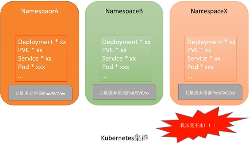
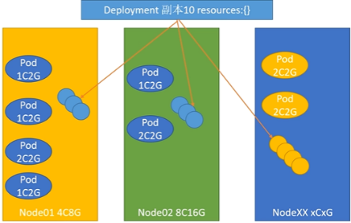
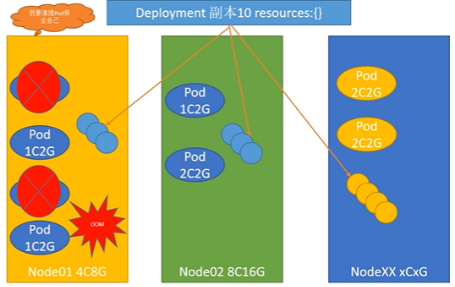

- [Kubernetes进阶-高级调度准入控制](#kubernetes进阶-高级调度准入控制)
  - [1.1 为什么使用ResourceQupta](#11-为什么使用resourcequpta)
  - [1.2 资源配额配置详解](#12-资源配额配置详解)
  - [1.3 生产必备LimitRange](#13-生产必备limitrange)
  - [1.4 限制requests和Limits范围](#14-限制requests和limits范围)
  - [1.5 限制存储空间大小](#15-限制存储空间大小)
  - [2.1 生产可用性保障服务质量QOS](#21-生产可用性保障服务质量qos)


###  Kubernetes进阶-高级调度准入控制 ###


#### 1.1 为什么使用ResourceQupta ####

https://kubernetes.io/zh-cn/docs/concepts/policy/resource-quotas/

:deciduous_tree: 资源配额：

+ 创建了Pod在k8s集群上；一个k8s集群并不是只有管理员在使用，还有很多的运维、开发、测试等人员使用k8s集群

其他人员也有操作集群权限，在创建资源时：

引来一个问题：肆无忌怛的（过度）创建资源

+ 造成资源浪费

:deciduous_tree: 资源配额的重要性

+ 将导致结果：如下

 

产生大量废弃资源，没有及时清理，需要引用一种概念来管理：ResourceQupta

+ 资源配额

给项目组一个命名空间

+ 限制命名空间创建Pod的数量
+ 内存和CPU的上限

 

#### 1.2 资源配额配置详解 ####

https://kubernetes.io/zh-cn/docs/concepts/policy/resource-quotas/

利用对象计数配额来管理的一组资源示例

- `count/persistentvolumeclaims`
- `count/services`
  - services.loadbalancers
  - services.nodeports  （不能无休止的配置端口号）
- `count/secrets`
- `count/configmaps`
- `count/replicationcontrollers`
- `count/deployments.apps`
- `count/replicasets.apps`
- `count/statefulsets.apps`
- `count/jobs.batch`
- `count/cronjobs.batch`


:deciduous_tree: 计算资源限制

配额机制所支持的资源类型：

| 资源名称           | 描述                                                         |
| ------------------ | ------------------------------------------------------------ |
| `limits.cpu`       | 所有非终止状态的 Pod，其 CPU 限额总量不能超过该值。          |
| `limits.memory`    | 所有非终止状态的 Pod，其内存限额总量不能超过该值。           |
| `requests.cpu`     | 所有非终止状态的 Pod，其 CPU 需求总量不能超过该值。          |
| `requests.memory`  | 所有非终止状态的 Pod，其内存需求总量不能超过该值。           |
| `hugepages-<size>` | 对于所有非终止状态的 Pod，针对指定尺寸的巨页请求总数不能超过此值。 |
| `cpu`              | 与 `requests.cpu` 相同。                                     |
| `memory`           | 与 `requests.memory` 相同。                                  |

:deciduous_tree: ResourceQuota配置

```yaml
apiVersion: v1
kind: ResourceQuota
metadata:
  name: resource-test
  labels:
    app: resourcequota
spec:
  hard:
    pods: 2
   # requests.cpu: 0.5		# 最小请求数
   # requests.memory: 512Mi
   # limits.cpu: 5			# 最大请求数
   # limits.memory: 16Gi
    configmaps: 2
   # requests.storage: 40Gi
   # persistentvolumeclaims: 20
   # replicationcontrollers: 20
   # secrets: 20
   # services: 50
   # services.loadbalancers: "2"
   # services.nodeports: "10"
```


:deciduous_tree: 创建一个命名空间：

```sh
kubectl create ns rq-test
kubectl get ns
```

:deciduous_tree: 创建该命名空间的配额管理

```sh
 kubectl create -f resourcequota.yaml -n rq-test
# kubectl get resourcequotas  -n rq-test
NAME            AGE   REQUEST                      LIMIT
resource-test   12s   configmaps: 1/2, pods: 0/2
# kubectl get resourcequotas -n rq-test resource-test -oyaml
apiVersion: v1
kind: ResourceQuota
metadata:
  creationTimestamp: "2022-12-27T11:13:06Z"
  labels:
    app: resourcequota
  name: resource-test
  namespace: rq-test
  resourceVersion: "2253735"
  uid: 926a4f96-f7c3-4066-aa2d-50b02302b991
spec:
  hard:
    configmaps: "2"
    pods: "2"
status:
  hard:
    configmaps: "2"
    pods: "2"
  used:
    configmaps: "1"
    pods: "0"
```

创建3个实例的Pod:只能创建出两个

```SH
# kubectl get -n rq-test pod
NAME                   READY   STATUS    RESTARTS   AGE
test-9cc4787f8-lddts   1/1     Running   0          37s
test-9cc4787f8-pfltj   1/1     Running   0          37s
```

:deciduous_tree: 查看resourcequotas

```yaml
# kubectl get resourcequotas -n rq-test resource-test -oyaml
apiVersion: v1
kind: ResourceQuota
metadata:
  creationTimestamp: "2022-12-27T11:13:06Z"
  labels:
    app: resourcequota
  name: resource-test
  namespace: rq-test
  resourceVersion: "2255083"
  uid: 926a4f96-f7c3-4066-aa2d-50b02302b991
spec:
  hard:
    configmaps: "2"
    pods: "2"
status:
  hard:
    configmaps: "2"
    pods: "2"
  used:
    configmaps: "1"
    pods: "2"
```

查看 RS

```SH
# kubectl get -n rq-test rs
NAME             DESIRED   CURRENT   READY   AGE
test-9cc4787f8   3         2         2       6m13
# kubectl describe -n rq-test rs
Error creating: pods "test-9cc4787f8-n7q67" is forbidden: exceeded quota: resource-test, requested: pods=1, used: pods=2, limited: pods=2
```

:deciduous_tree: 将 resourcequota 的 Pod数改为 3

Pod 需要一段时间反应，周期


#### 1.3 生产必备LimitRange

k8s资源限制LimitRange

:warning: 只有ResourceQuota是不够的

:deciduous_tree: 分析：

+ 做了ResourceQuota 没有限制Pod的数量或者svc，只限制了内存和CPU使用率，这种情况很有可能出现的；
+ 或者说限制Pod数量比较大，内存CPU限制小，存在问题：创建100个Pod所有资源16U64G，问题：不写CPU和内存，创建了很多个Pod，CPU和内存都是0，总计还是0，无限制的创建Pod，更加resource限制的


:deciduous_tree: 引入了LinitRange

+ 创建一个namespace只限制了内存和cpu
+ LimitRange 为resource配置一个默认值（如果没有配置resource）默认添加的加起来不能超过resourceQouta

配置：

+ default：对应limits配置
+ defaultRequest：对应requests配置,Pod没有配置会自动填充

```yaml
apiVersion: v1
kind: LimitRange
metadata:
  name: cpu-mem-limit-range
spec:
  limits:
  - default:
      cpu: 1
      memory: 512Mi
    defaultRequest:
      cpu: 0.5
      memory: 256Mi
    type: Container
```

引入另一个问题：如果直接申请了全部资源，所以需要限制最大值

或者将资源值设很小，就可以无限制的创建

:deciduous_tree: Limit的最大最小值

```yaml
apiVersion: v1
kind: LimitRange
metadata:
  name: cpu-mem-limit-range
spec:
  limits:
  - default:
      cpu: "1"
      memory: 1Gi
    defaultRequest:
      cpu: "0.5"
      memory: 512Mi
    max:
      cpu: "2"
      memory: 2Gi
    min:
      cpu: "200m"
      memory: 500Mi
    type: Container
```

:deciduous_tree: 存储：

```yaml
apiVersion: v1
kind: LimitRange
metadata:
  name: cpu-mem-limit-range 
spec:
  limits:
  - type: PersistentVolumeClaim
    max:
      storage: 2Gi 
    min:
      storage: 1Gi 
```

:deciduous_tree: 配置Requests和Limits

```sh
# kubectl create -f limitrange.yaml -n rq-test
# kubectl get limitranges -n rq-test
NAME                  CREATED AT
cpu-mem-limit-range   2022-12-27T13:03:18Z
```


#### 1.4 限制requests和Limits范围 ####

没有限制而导致无限制的创建也是一个重大的隐患！

之前只是给了一个默认值！自己写的不会被覆盖掉；没有限制之前，修改了CPU

```yaml
apiVersion: v1
kind: LimitRange
metadata:
  name: cpu-mem-limit-range
spec:
  limits:
  - default:
      cpu: 1
      memory: 512Mi
    defaultRequest:
      cpu: 0.5
      memory: 256Mi
    max:
      cpu: "2"
      memory: 1Gi
    min:
      cpu: "10m"
      memory: 128Mi
    type: Container
```

```yaml
# kubectl create deployment test --image=nginx:1.23

# kubectl get pod -n rq-test echo-qjzv4 -oyaml | grep -A 10 resources
    resources:
      limits:
        cpu: "1"
        memory: 512Mi
      requests:
        cpu: 500m
        memory: 256Mi
```

作用在Pod上，并非作用在其他高级资源。

+ 即使配置了LimitRange，也不会更改现有的deployment ， 只会更改创建出来的Pod


#### 1.5 限制存储空间大小

max：最大PVC的空间

min：最小PVC的空间

```yaml
apiVersion: v1
kind: LimitRange
metadata:
  name: cpu-mem-limit-range
spec:
  limits:
  - default:
      cpu: 1
      memory: 512Mi
    defaultRequest:
      cpu: 0.5
      memory: 256Mi
    max:
      cpu: "2"
      memory: 1Gi
    min:
      cpu: "10m"
      memory: 128Mi
    type: Container
  - type: PersistentVolumeClaim
    max:
      storage: 2Gi
    min:
      storage: 1Gi
```


 

#### 2.1 生产可用性保障服务质量QOS ####

resources配置的重要性：

+ 如果没有resource参数，开发上来起了一个10个副本的Pod，还会调度在没有任何资源或者资源很小，感知不到；
+ 内存溢出、CPU居高不下（清理Pod保护自己，驱逐、杀掉）

 

 :deciduous_tree:导致其他Pod被驱逐释放资源

 


Resource并非万能！

+ 内存升高，垃圾回收没有做好
+ 虽然配置了默认值，不能保障每一个requests和Limit都一样


:deciduous_tree: Qos：配置杀掉Pod的顺序

服务质量Qos：

+ 3 Guaranteed：最高服务质量，当宿主机内存不够时，会先kill掉QoS为BestEffort和Burstable的Pod，如果内存还是不够，才会kill掉QoS为Guaranteed，该级别Pod的资源占用量一般比较明确，即`requests的cpu和memory和limits的cpu和memory配置的一致`。
+ 2 Burstable：服务质量低于Guaranteed，当宿主机内存不够时，会先kill掉QoS为BestEffort的Pod，如果内存还是不够之后就会kill掉QoS级别为Burstable的Pod，用来保证QoS质量为Guaranteed的Pod，该级别Pod一般知道最小资源使用量，但是当机器资源充足时，还是想尽可能的使用更多的资源，即`limits字段的cpu和memory大于requests的cpu和memory的配置`。
+ 1 BestEffort：尽力而为，当宿主机内存不够时，首先kill的就是该QoS的Pod，用以保证Burstable和Guaranteed级别的Pod正常运行。`不配置resource`

```sh
# kubectl get pod -n rq-test echo-qjzv4 -oyaml | grep qos
  qosClass: Burstable
```

在生产环境中有些重要的Pod是不能删除的！