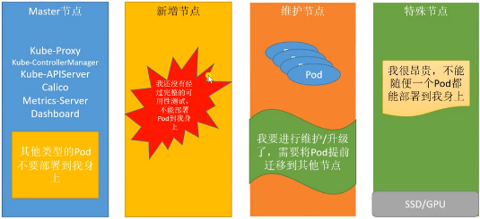
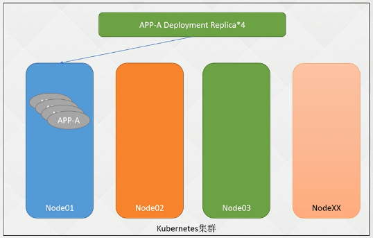
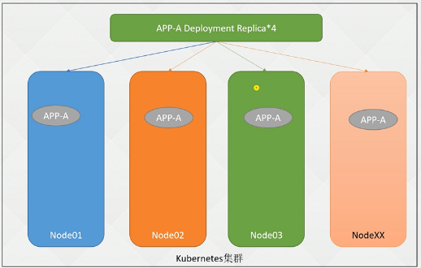
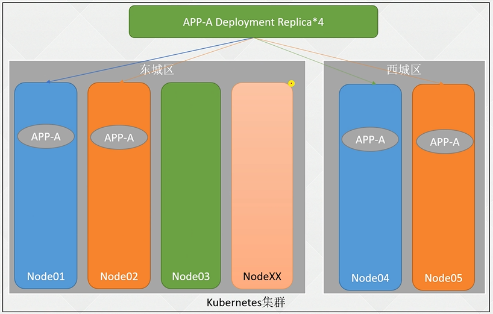
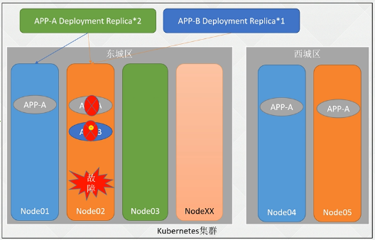
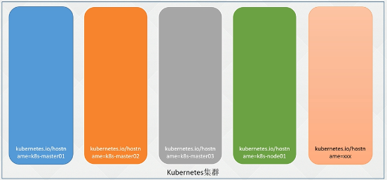
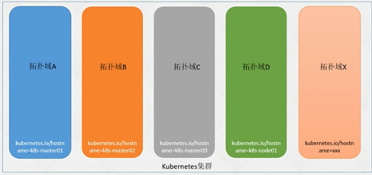

- [K8s进阶篇-高级调度计划任务临时容器](#k8s进阶篇-高级调度计划任务临时容器)
  - [1.1 Job介绍](#11-job介绍)
  - [1.2 CronJob 计划任务](#12-cronjob-计划任务)
  - [2.1 initContainer 用途](#21-initcontainer-用途)
  - [2.2 初始化容器\&普通容器\&PostStart 区别](#22-初始化容器普通容器poststart-区别)
  - [2.3 初始化容器配置解析](#23-初始化容器配置解析)
  - [3.1 临时容器](#31-临时容器)
  - [4.1 污点和容忍 设计理念](#41-污点和容忍-设计理念)
  - [4.2 污点和容忍配置](#42-污点和容忍配置)
  - [4.3 污点和容忍的配置案例](#43-污点和容忍的配置案例)
  - [4.4 内置污点](#44-内置污点)
  - [4.5 节点宕机秒级恢复应用](#45-节点宕机秒级恢复应用)
  - [4.6 Taint 命令](#46-taint-命令)
  - [5.1 亲和力Affinity](#51-亲和力affinity)
  - [5.2 Affinity亲和力](#52-affinity亲和力)
  - [5.3 可用率保障–部署至不同宿主机](#53-可用率保障部署至不同宿主机)
  - [5.4 可用率保障–部署至不同机房或区](#54-可用率保障部署至不同机房或区)
  - [5.5 可用率保障–不把鸡蛋放在一个篮子里](#55-可用率保障不把鸡蛋放在一个篮子里)
  - [5.6 节点亲和力配置](#56-节点亲和力配置)
  - [5.7 Pod亲和力和反亲和力配置](#57-pod亲和力和反亲和力配置)
  - [5.8 实现同一个应用分布在不同的宿主机](#58-实现同一个应用分布在不同的宿主机)
  - [5.9 应用部署到高配置服务器](#59-应用部署到高配置服务器)
  - [5.10 拓扑域TopologyKey详解](#510-拓扑域topologykey详解)


### K8s进阶篇-高级调度计划任务临时容器 ###

:deciduous_tree: 计划任务CronJob & Job

linux运维的时候都使用过crontab -e 来做：

+ 周期性执行脚本
+ 备份
+ 在服务器周期性执行一条命令


比如 linux（crontab -e）写一个备份的任务，周期性执行一条命令（分时日月周）

:deciduous_tree: k8s的计划任务

+ 比linux的更新简单，不会因为某个服务器宕机就不可用了

比如

+ linux：计划任务挂了，可能造成备份不生效
+ K8s：调度的任务，计划任务的工作随机分配到某个节点，节点去完成工作


#### 1.1 Job介绍 ####

:deciduous_tree: 认识：由于某个工具在启动前不能做某些操作

+ 比如：Mysql - Mysql启动后需要导入一些SQL文件，在未启动前需要等待Mysql启动并且可以使用；通过一个指令导入
+ 影响：需要人去等待MySQL启动才能进行加载SQL文件

:deciduous_tree: Job

+ Job：判断Mysql启动，启动后将SQL文件导入
+ 影响：降低等待时间（让Job等待）

特别注意：使用Helm创建很多服务，初始化SQL在外部，需要等待启动后才能进行初始化操作！ - Job会非常有用

除了上述优点还有一点：

+ Job 可以并行执行

优点：大大减少了数据执行的时间

 

:deciduous_tree: Job的配置

+ backoffLimit：如果任务执行失败，失败多少次后不再执行
+ completions：有多少个Pod执行成功，认为任务是成功的
  + 为空默认和parallelism数值一样
+ parallelism：并行执行任务的数量
  + 果parallelism数值大于未完成任务数，只会创建未完成的数量；比如completions是4，并发是3，第一次会创建3个Pod执行任务，第二次只会创建一个Pod执行任务
+ tlSecondsAfterFinished：Job在执行结束之后（状态为completed或Failed）自动清理。设置为0表示执行结束立即删除，不设置则不会清除，需要开启TTLAfterFinished特性、

```yaml
apiVersion: batch/v1
kind: Job
metadata:
  labels:
    job-name: echo
    name: echo
  name: echo
  namespace: default
spec:
  #suspend: true # 1.21+ 暂停任务（Job创建完成后不会立即执行任务）
  #ttlSecondsAfterFinished: 100  # 保留的历史记录，一般不会设置
  backoffLimit: 4 # 失败多少次后不再执行
  completions: 1 # 有多少个Pod执行成功，认为任务是成功的
  parallelism: 1  # 并行执行任务的数量
  template:
    spec:
      containers:
      - name: echo
        image: busybox:1.28
        imagePullPolicy: Always
        command: [ "sh","-c","echo 'hello,job'" ]
        resources: {}
      restartPolicy: Never
```

:deciduous_tree: 验证

```sh
# kubectl get jobs.batch echo
NAME   COMPLETIONS   DURATION   AGE
echo   1/1           14s        21s

# kubectl logs -f echo-5hgsc
hello,job
```

使用helm部署项目的时候

+ 需要等项目启动后，初始化操作（导入sql等等）


#### 1.2 CronJob 计划任务 ####

在生产环境中job并没有cronjob使用的多

+ 经常性的调接口（公司常见的）, 单独性的Job用的并不多；

例如：（场景）PHP脚本-HTML脚本。每周周期执行PHP的脚本

+ 依赖PHP环境，执行PHP命令可能需要先拉取最新的代码，再执行PHP的命令

+ PHP的版本依赖些，假如代码是基于5.6写的，服务器是7.2版本，还需要装一个对应版本

问题：流程耗时繁琐-需要对接版本（如果需要很多个版本），宕机导致计划任务失败


用途：周期性任务 如：

:deciduous_tree: 传统架构：周期清理日志文件、执行PHP命令、请求接口、、crontab -e

+ 宕机：计划任务失效

:deciduous_tree: k8s：cronJob - 资源

+ CronJob执行任务时创建Job，Job创建Pod执行指令。不存在单点故障
+ 数据存储在etcd：高可用，数据不会丢
+ 执行命令节点：调度任务（有健康的节点就会执行）
+ 不存在版本冲突：只需要找对应镜像（省略基础环境依赖问题）
+ 计划任务统一管理

时间：https://crontab.guru/


:deciduous_tree: CronJob的定义

```sh
kubectl create cronjob hello  --image=busybox:1.28  --schedule='1 * * * *' --dry-run='none' -oyaml > cronjob.yaml
```

+ apiVersion: batch/v1  #1.21前为batch/v1beta1
+ schedule: */1 * * * *  #分时日月周
  + 特别注意： */1 * * * * 没一分钟 、 1 * * * * 每小时的 第 1 分钟
+ restartPolicy: OnFailure #失败重启 还有Never
+ concurrencyPolicy: 并发调度策略，传统linux在任务计划没有执行成功，怎么处理是没有这种机制。k8s可以定义任务计划成功失败后怎么操作！
  + Allow: 运行同时多个任务
  + Forbid：不允许并发运行，前一个失败，新的任务不会被创建
  + Replace：上一个任务尚未完成，新的任务会替换之前的任务
+ suspend: false ：如果true则暂停后续的任务，默认false
+ successfulJobsHistoryLimit: 3 保留多少已完成的任务，按需设置，一般5-10
+ failedJobsHistoryLimit: 1 保留多多少个失败的任务

linux问题：linux 1分钟执行一个命令。但是ansible在一分钟之内没有结束，第2分钟，又去执行了一次。到最后这个服务器上有3000多个ansible任务没有结束，导致服务器特别特别卡！

:deciduous_tree: 演示：并没有实际动作

```yaml
apiVersion: batch/v1
kind: CronJob
metadata:
  labels:
    run: hello
  name: hello
  namespace: default
spec:
  concurrencyPolicy: Allow
  failedJobsHistoryLimit: 1
  jobTemplate:
    metadata:
      name: hello
    spec:
      template:
        metadata:
          labels:
            run: hello
        spec:
          containers:
          - image: busybox:1.28
            imagePullPolicy: Always
            name: hello
            resources: {}
            args:
              - sh
              - -c
              - date; echo Hello from the Kubernetes cluster
          restartPolicy: OnFailure
  schedule: '*/1 * * * *
  successfulJobsHistoryLimit: 3
  suspend: false
```

 ```yaml
 apiVersion: batch/v1
 kind: CronJob
 metadata:
   creationTimestamp: null
   labels:
     name: hello
   name: hello
   namespace: default
 spec:
   concurrencyPolicy: Allow
   failedJobsHistoryLimit: 5
   jobTemplate:
     metadata:
       labels:
         name: hello
     spec:
       template:
         metadata:
           labels:
             app: hello
         spec:
           containers:
           - command: [ "sh","-c","date;echo Hello from the Kubernetes cluster" ]
             image: docker.io/library/busybox:latest
             imagePullPolicy: IfNotPresent
             name: hello
             resources: {}
           restartPolicy: OnFailure
   schedule: '*/1 * * * *'
   successfulJobsHistoryLimit: 5
   suspend: false
 ```

:deciduous_tree: 验证

+ 创建三个 pod 后再创建会删除第一个
+ suspend: true 设置为true，计划任务暂停创建新的Pod

```SH
# kubectl get cronjobs.batch
NAME    SCHEDULE      SUSPEND   ACTIVE   LAST SCHEDULE   AGE
hello   */1 * * * *   False     1        4s              109s
# kubectl get pod
NAME                   READY   STATUS      RESTARTS   AGE
hello-27867331-42jrg   0/1     Completed   0          70s
hello-27867332-v2tkt   0/1     Completed   0          10s
# kubectl logs -f hello-27867331-42jrg
Hello from the Kubernetes cluster
```

suspend生效

```SH
# kubectl get pod
NAME                   READY   STATUS      RESTARTS   AGE
hello-27867334-8qxgw   0/1     Completed   0          3m59s
hello-27867335-m49w5   0/1     Completed   0          2m59s
hello-27867336-8v9bz   0/1     Completed   0          119s
```


#### 2.1 initContainer 用途

:deciduous_tree: k8s初始化容器

初始化容器的作用：

1. init容器可以包含一些安装过程中应用容器中不存在的使用工具或个性代码
   + 为了镜像的安全，不推荐预留一些危险命令curl、wget等命令
   + 如果需要使用这些工具下载、请求某些接口
2. init容器可以安全地运行这些工具，避免这些工具导致应用镜像的安全性降低
3. init容器可以以root的身份运行，执行一些高权限命令；
4. init容器相关操作执行完成以后即退出，不会给业务容器带来安全隐患；

如果黑客登到容器中，无法进行init容器进行操作！

简单来说就是：在主程序启动之前、做一些初始化操作，比如

1. 创建文件、创建用户
2. 修改内核参数
3. 等待依赖程序启动
4. 其他需要在主程序启动之前需要做的工作

比如java启动前判断数据库是否启动！，数据库没启动就不起java


#### 2.2 初始化容器&普通容器&PostStart 区别 ####

初始化容器和PostStart类似的一个功能：

+ 但是PostStart不一定先于command运行

:deciduous_tree: PostStart：依赖主应用的环境，而且 并不一定先于Command运行；

+ 使用deployment部署容器的时候，配置的Command配置，arge的配置（启动命令参数）
+ Command可能需要在执行前 某个文件夹需要存在
+ PostStart不是在Command之前执行，就会造成一次重启！！
+ 依赖主应用环境（没有wget、git、curl命令，就无法使用）

:deciduous_tree: initContainer：不依赖主应用的环境、可以有更高的权限和更多的工具，一定会在主应用程序之前完成！

+ 不依赖主应用：初始化可以使用主没有的命令
+ 主没有root权限，init容器有
+ 初始化容器失败，主不会启动


:deciduous_tree: 初始化容器和普通容器区别！

container内可以配置多个容器，init和它同级别；

+ 他们总是运行到完成：配置多个init容器，第一个运行成功后运行第二个，第一个失败就会一直运行第一个直到运行成功。必须成功状态才能下一步！
+ 上一个成功才会下一个！
+ 如果Pod的init失败，kuberneter会不断重启Pod，如果对应的restartPolicy是Never就不会重启Pod
+ init容器不支持健康检查


#### 2.3 初始化容器配置解析 ####

写一个案例：没有什么意义，就是演示

实际用途：一个java启动时，如果程序不是基于云原生开发的，需要一个日志文件，比如/data/logs下。镜像没有这个目录，业务程序不是root用户启动的，java程序启动时没有权限创建，init就起到了作用

```yaml
apiVersion: apps/v1
kind: Deployment
metadata:
  labels:
    name: init-deploy
  name: init-deploy
  namespace: default
spec:
  replicas: 1
  selector:
    matchLabels:
      name: init-deploy
  template:
    metadata:
      labels:
        name: init-deploy
    spec:
      containers:
      - command: [ "sh","-c","echo successful > /mnt/data/test.txt;sleep 60" ]
        image: busybox:1.28
        imagePullPolicy: IfNotPresent
        name: busybox
        resources:
          requests:
            cpu: 10m
            memory: 256Mi
        volumeMounts:
        - mountPath: /mnt
          name: data
      initContainers:  # INIT容器配置
      - command: [ "sh","-c","for i in `seq 10`; do echo $i;done" ]
        image: busybox:1.28
        imagePullPolicy: IfNotPresent
        name: init-for
      - command: [ "sh","-c","mkdir -p /mnt/data" ]
        image: busybox:1.28
        imagePullPolicy: IfNotPresent
        name: init-myservice
        resources: {}
        volumeMounts:
        - mountPath: /mnt
          name: data
      - command: [ "sh","-c","touch /mnt/data/test.txt" ]
        image: busybox:1.28
        imagePullPolicy: IfNotPresent
        name: init-mydb
        resources: {}
        volumeMounts:
        - mountPath: /mnt
          name: data
      restartPolicy: Always
      volumes:
      - emptyDir: {}
        name: data
```


#### 3.1 临时容器 ####

1.16版本后引入

临时容器：EphemeralContainer

在做docker镜像时：镜像大小尽量最小，不用的命令不要装。


:deciduous_tree: 从镜像角度：

+ 传统：bash提权 防止黑客攻击（渗透、注入、肉鸡）
+ k8s：Pod重建注入挖矿程序、通过网站渗透到Pod（bash、sh命令）- 越权访问，安装一系列的工具包，渗透到k8是集群，修改api-service，登录其他Pod，安装一些列黑客扫描工具、通过某种机制连接到k8s节点，k8s节点沦陷，再扫描公司的网络
+ 一般不推荐再容器流：bash和sh工具
+ 不要以root身份运行Pod，即使Pod控制权被拿走，也安装不了一些攻击软件
+ 如果将这些命令都移除，镜像做的特别小！引来另一个问题。程序无法启动，无法进去看问题，排查问题受阻！
+ 如果还想排查：引入了一个临时容器的概念


:deciduous_tree: 如果容器都没有bash、sh

+ 还需要排查网络等等

解决方法：在Pod里注入一个临时容器（有很多Debug工具curl、ping、wget等），排查问题，排查完成后Pod重启就没了！

随便找一个容器：metrics-server-6c48d8f6d6-9q8kv

镜像：

```sh
# kubectl debug metrics-server-6c48d8f6d6-8m5qg -ti --image=busybox:1.28 -n kube-system
Defaulting debug container name to debugger-7q59q.
If you don't see a command prompt, try pressing enter.
/ # wget www.baidu.com
Connecting to www.baidu.com (14.215.177.38:80)
index.html           100% |*****************************************************************************************|  2381   0:00:00 ETA
/ #
```

 直接在Pod上注入一个容器，并打开一个控制台


#### 4.1 污点和容忍 设计理念 ####

:deciduous_tree: 污点容忍；概念有些抽象

+ 除了系统外的容器不要部署在master节点，防止升级时对业务容器造成影响

 

master：

+ 部署系统组件

新增节点：

+ k8s集群需要加节点时，新加节点没有经过一个完整的可用性测试，不能随随便便将Pod部署在节点上
+ 新节点（公司网络限制开通防火墙、配置服务不完善、Pod直接通信存在问题）
+ 需要经过完整的测试！！ 可用性验证

维护节点：

+ 很多个节点，运行了很久需要升级
+ 维护前需要将Pod先挪走
+ 直接关掉Pod，Pod就不能使用了，如果Pod只有一个服务就挂掉了
+ 需要将Pod提前迁移到其他节点

特殊节点：

+ 服务器的新能、硬盘、GPU
+ 不能让随随便便的Pod部署在昂贵的Pod，只有有了请求才能部署到对应服务器上！


:deciduous_tree: 设计理念

+ Taint污点（作用在节点上）
+ Toleration容忍（作用在Pod上）

Taint在一类服务器上打污点，让不能容忍这个污点的Pod不能部署在打了污点的服务器上。Toleration是让Pod容忍节点上配置的污点，可以让一些需要特殊配置的Pod能够调用到具有污点和特殊配置的节点上。


#### 4.2 污点和容忍配置 ####

:deciduous_tree: 创建一个污点

```SH
$ kubecti taint nodes nadeName taunt_KEY=taint_VALUE:EFFECT
#  -- 例如 -- #
kubectl taint k8s-node01 ssd=true:PreferNoSchedule
```

EFFECT：影响，污点的级别

+ NoSchedule:禁止调度到该节点，已存在Pod不受影响
+ NoExecute：禁止调度到该节点，不符合污点的Pod驱逐 (或在一段时间后)
+ preferNoSchedule:尽量避免pod调度到该节点，如果没有合适的，可以部署在该节点


:deciduous_tree: 容忍的配置

分为了三种不同级别的要是，可以模糊的匹配，要容忍很多污点不可能全写上！

Toleration配置在Pod中：

方式：

+ 完全匹配
+ 不完全匹配
+ 大范围匹配（不推荐key为内置key）生产总总结的经验
+ 匹配所有（不推荐）

:deciduous_tree: 完全匹配：

```yaml
tolerations:
- key: "key1"
  operator: "Equal"
  value: "value1"
  effect: "NoSchedule"
```

:warning: 注意：operator的默认值是 Equal

一个容忍度和一个污点相“匹配”是指它们有一样的键名和效果，并且：

+ 如果 `operator` 是 `Exists` （此时容忍度不能指定 `value`）
+ 如果 `operator` 是 `Equal` ，则它们的 `value` 应该相等

:deciduous_tree: 不完全匹配

只需要有 key 就可以了

+ 如有普通SSD、高效SSD 兼容这么多的SSD，不可能每个value都写上去
+ GPU：不同类型的GPU、程序只需要任意一种，三种不可能都写上去

```yaml
tolerations:
- key: "key1"
  operator: "Exists"
  effect: "NoSchedule"
```

:deciduous_tree: 大范围匹配

+ 只需要key匹配就可以部署

```yaml
tolerations:
- key: "key1"
  operator: "Exists"
```

:deciduous_tree: 匹配所有 不推荐

```yaml
tolerations:
-  operator: "Exists"
```


:deciduous_tree: 停留时间配置:

+ 快速故障迁移：Pod挂了后默认300s迁移，加上tolerationSeconds 30; 
+ 30s后迁移

```yaml
tolerations:
- key: "key1"
  operator: "Equal"
  value: "value1"
  effect: "NoExecute"
  tolerationSeconds: 3600
```


:warning: 注意：污点 和 nodeSelecter区别

```yaml
nodeSelecter:
  ssd: "true"
```

**nodeSelecter：强制性将Pod部署在指定的节点上，必须符合这个标签**

tolerations 和 nodeSelecte不一样

+ 并不是说节点有污点，Pod有容忍，也不一定实现和nodeSelecte 同样功能
+ 如果tolerations是ssd，节点也有一个 ssd=true，并不代表Pod一定部署在该节点，不是强制性，只是附加的

遇到了污点再看是否能容忍，:warning: nodeSelecter都无法让你遇到该节点

nodeSelecter：类似没有锁的门，遇到就进去了

想要部署在指定节点，还是需要nodeSelecte


#### 4.3 污点和容忍的配置案例 ####

:deciduous_tree: 示例

有一个节点是纯SSD硬盘，现需要只有一些需要高性能存储的Pod才能调度到该节点上！

:deciduous_tree: 给节点打上标签：ssd=true:NoSchedule

```SH
kubectl taint node k8s-node01 ssd=true:NoExecute
kubectl taint node k8s-node01 ssd=true:NoSchedule
kubectl label nodes k8s-node01 ssd=true
```

:deciduous_tree: 查看节点污点

```SH
[root@k8s-master01 ~]# kubectl taint node k8s-node01 ssd=true:NoSchedule
node/k8s-node01 tainted
You have new mail in /var/spool/mail/root
[root@k8s-master01 ~]# kubectl describe nodes k8s-node01 | grep -A 5 Taint
Taints:             ssd=true:NoSchedule
[root@k8s-master01 ~]# kubectl get pod -owide | grep node01
nginx-59968df44b-9cvcv   1/1     Running   0          2m4s   172.17.125.59    k8s-node01     <none>           <none>
nginx-59968df44b-p2574   1/1     Running   0          2m4s   172.17.125.60    k8s-node01     <none>           <none>
```

删除污点，打上；ssd=true:NoExecute

```SH
# kubectl taint node k8s-node01 ssd=true:NoSchedule-
```

结果：

1. nginx deployment的Pod被驱逐
2.  系统组件没有被驱逐，原因：容忍了污点，默认

系统组件未被驱逐的原因：

```yaml
# kubectl get pod calico-node-bwpjp -n kube-system -oyaml | grep -A 30 toler
  tolerations:
  - effect: NoSchedule
    operator: Exists
  - key: CriticalAddonsOnly
    operator: Exists
  - effect: NoExecute  # 只要存在都可以容忍
    operator: Exists  # 表示存在，只要节点上有NoExecute 级别的污点，也可以容忍
  - effect: NoExecute
    key: node.kubernetes.io/not-ready
    operator: Exists
  - effect: NoExecute
    key: node.kubernetes.io/unreachable
    operator: Exists
  - effect: NoSchedule
    key: node.kubernetes.io/disk-pressure
    operator: Exists
  - effect: NoSchedule
    key: node.kubernetes.io/memory-pressure
    operator: Exists
  - effect: NoSchedule
    key: node.kubernetes.io/pid-pressure
    operator: Exists
  - effect: NoSchedule
    key: node.kubernetes.io/unschedulable
    operator: Exists
  - effect: NoSchedule
    key: node.kubernetes.io/network-unavailable
    operator: Exists
  volumes:
  - hostPath:
      path: /lib/modules
```

打了污点后并不一定能部署到该Pod，所以需要打上nodeSelector

为节点打上ssd的标签


:deciduous_tree: 特别注意

+ nodeSelector 匹配但是 容器状态会Pending 因为 节点上存在未容忍的污点

```yaml
apiVersion: apps/v1
kind: Deployment
metadata:
  labels:
    app: nginx
  name: nginx
spec:
  replicas: 3
  selector:
    matchLabels:
      app: nginx
  template:
    metadata:
      labels:
        app: nginx
    spec:
      containers:
      - image: nginx:1.23
        name: nginx
        imagePullPolicy: IfNotPresent
      nodeSelector:
        ssd: "true"
      tolerations:
      - key: "ssd"
        operator: "Exists"
```

 node01的tab和污点

查看：结果调度在node01上


:warning: 如果忘记配置容忍：

报错：

```SH
Warning  FailedScheduling  40s   default-scheduler  0/5 nodes are available: 1 node(s) had untolerated taint {ssd: true}, 4 node(s) didn't match Pod's node affinity/selector. preemption: 0/5 nodes are available: 5 Preemption is not helpful for scheduling.
```

将处于：Pending状态

设置完全匹配：

+ 特别注意：因为effect有两个，所以要被指两个
+ 先删除一个kubectl taint node k8s-node01 ssd=true:NoExecute

```yaml
      tolerations:
      - key: "ssd"
        operator: "Equal"
        value: "true"
        effect: "NoSchedule"
```


#### 4.4 内置污点 ####

https://kubernetes.io/zh-cn/docs/concepts/scheduling-eviction/taint-and-toleration/

当前内置的污点包括：

- `node.kubernetes.io/not-ready`：节点未准备好。这相当于节点状况 `Ready` 的值为 "`False`"。
- `node.kubernetes.io/unreachable`：节点控制器访问不到节点. 这相当于节点状况 `Ready` 的值为 "`Unknown`"。
- `node.kubernetes.io/memory-pressure`：节点存在内存压力。
- `node.kubernetes.io/disk-pressure`：节点存在磁盘压力。
- `node.kubernetes.io/pid-pressure`: 节点的 PID 压力。
- `node.kubernetes.io/network-unavailable`：节点网络不可用。
- `node.kubernetes.io/unschedulable`: 节点不可调度。
- `node.cloudprovider.kubernetes.io/uninitialized`：如果 kubelet 启动时指定了一个“外部”云平台驱动， 它将给当前节点添加一个污点将其标志为不可用。在 cloud-controller-manager 的一个控制器初始化这个节点后，kubelet 将删除这个污点

自动恢复业务！

节点出现问题，Pod之所以会飘走，是因为配置了污点

NGINX pod的yaml

 ```yaml
   tolerations:
   - key: ssd
     operator: Exists
   - effect: NoExecute
     key: node.kubernetes.io/not-ready  # 节点未准备好
     operator: Exists
     tolerationSeconds: 300
   - effect: NoExecute
     key: node.kubernetes.io/unreachable # 无法访问控制节点
     operator: Exists
     tolerationSeconds: 300 #过了300s后就会跳走！
 ```

+ 节点不健康：不可以太短：如果网络 抖动Pod就逃走，不合适！

```yaml
tolerations:
- key: "node.kubernetes.io/unreachable"
  operator: "Exists"
  effect: "NoExecute"
  tolerationSeconds: 6000
```

默认300s其实在生产环境中时间可以调小一些，默认300s有点大

+ 这个值不是随便设置的，如果网络抖动特别大的话，可能造成误判


#### 4.5 节点宕机秒级恢复应用 ####

节点故障，标记未不可用还是有一个间隔的

kube-controller-manager会去周期性探测5秒探测一次，40s标记不可用

```yaml
tolerations:
- key: "node.kubernetes.io/unreachable"
  operator: "Exists"
  effect: "NoExecute"
  tolerationSeconds: 6000
```

+  tolerationSeconds 这个值不是随便设置的
+  不配置：表示容忍，Pod会一直在该节点上
+  p欸之了：表示只会容忍你在节点上多少秒

演示一下：节点宕机Pod秒级迁移

```yaml
      tolerations:
      - key: "ssd"
        operator: "Equal"
        value: "true"
        effect: "NoSchedule"
      - key: "node.kubernetes.io/unreachable"
        operator: "Exists"
        effect: "NoExecute"
        tolerationSeconds: 10
      - key: "node.kubernetes.io/not-ready"
        operator: "Exists"
        effect: "NoExecute"
        tolerationSeconds: 10
```

 两个deployment

1. nginx配置了：tolerationSeconds: 10
2. nginx2 默认300s

```SH
# date;shutdown
# kubectl get nodes
NAME           STATUS     ROLES           AGE   VERSION
k8s-master01   Ready      control-plane   53d   v1.24.3
k8s-master02   Ready      control-plane   53d   v1.24.3
k8s-master03   Ready      control-plane   53d   v1.24.3
k8s-node01     NotReady   <none>          53d   v1.24.3
# kubectl get pod -owide
NAME                     READY   STATUS        RESTARTS   AGE     IP              NODE         NOMINATED NODE   READINESS GATES
nginx-95d4bf485-v56cl    1/1     Terminating   0          5m47s   172.17.125.8    k8s-node01   <none>           <none>
nginx-95d4bf485-wrh2j    0/1     Pending       0          24s     <none>          <none>       <none>           <none>
nginx2-d5668879b-prjlh   1/1     Running       0          2m58s   172.17.125.63   k8s-node01   <none>           <none>
```

现象：

+ 10s的：Pending 原因，配置的nodeSelector只有一个节点；==所以nodeSelector不要只选择一个节点，可用性无法保障==
+ 300s的：running

node漂移时发现没有匹配的nodeSelecter（生产环境中不要只配置一个节点）

```SH
# kubectl label nodes k8s-node02 ssd="true"
```


#### 4.6 Taint 命令 ####

:deciduous_tree: 常用命令

+ 增加污点：kubectl taint node k8s-node01 ssd=true:NoExecute
+ 查看：
  +  kubectl describe nodes k8s-node01 | grep Taint -A 10
  + kubectl get nodes k8s-node01 -o go-template --template='{{.spec.taints}}'
+ 删除：kubectl taint node k8s-node01 ssd=true:NoExecute-
+ 修改：kubectl taint node k8s-node01 ssd=true:NoExecute --overwrite


#### 5.1 亲和力Affinity ####

在高级调度已经有很多的调度策略了

:deciduous_tree: 在生产环境

+ 按照之前的逻辑，将到deployment、deamoSet、StartfulSet调度策略还是比较简单的！

但是在生产环境中场景可能更加复杂，繁琐，需要很多需要注意的细节：


:deciduous_tree: 存在很多的需求未被解决（列举常见的4点）

Pod和节点之间

1. 某些Pod优先选择ssd=true标签的节点，如果没有在考虑到其他节点；
   + nodeSelector 和nodename将Pod固定到节点上，如果nodeSelector没有符合的标签，将无法调度，一直处于Pending 
   + 也会存在需求：如果没有ssd的节点，其他节点也可以将就用
   + 需求也可能是最好部署到某个网段下等等
2. 某些Pod需要部署在ssd=true和type=physiccal的节点上，但是优先部署在ssd=true的节点上
   + 选择优先级

Pod和Pod之间

1. 同一个应用的Pod不同的副本或者同一个项目的的应`用尽量或必须`部署在同一个节点或者符合某个标签的一类节点上或者不同的区域；(反亲和力)
   + 比如我们部署了一个java应用，副本数不是一个，3个更多个，如果同一个应用的副本，同时调度部署在一个节点上，节点挂了，java就不可用了，即使可以自动恢复，也需要耗时。取决于程序启动时间，这个周期内不可用
   + 出现宕机，可用率就降低了，99.99999%降低到99.99%就是非常不好的体验
   + 同一个项目的不同应用（java1和java2）假设java1 1个副本；java2两个副本。jiava1和java2同时部署在一个节点，节点宕机，影响范围比较广
   + 如果微服务拆封的比较细，一个下单系统，一个付费系统。都收到影响
   + 尽量部署在不同节点
2. 相互依赖的两个Pod`尽量或必须`部署（亲和力）在同一个节点上。
   + 用的并不是很多，但是也有
   + 如：后端对中间件要求特变高，延迟要求高；需求：后端和中间件部署在一个区域或者一个节点

:warning: 在生产环境中可能还存在其他的问题


#### 5.2 Affinity亲和力 ####

Affinity亲和力：

+ NodeAffinity：节点亲和力/反亲和力
  + 参数决定

+ PodAffinity：Pod亲和力
  + 尽量或必须部署在
  
+ PodAntiAffinity：Pod反亲和力
  + 尽量或必须不部署在
  
  


:deciduous_tree: 即然有了nodeSelector为什么还要使用必须这个参数？

nodeSelector功能优先，Affinity未来可能将会替代nodeSelector！！！


分为三类：

:deciduous_tree: 每一种分为两小类：

+ 必须：硬亲和力 required
+ 尽量：软亲和力 preferred

总结：亲和力分为三类，亲和力、反亲和力、节点亲和力。每一种又分为软硬两种，即尽量和必须；


#### 5.3 可用率保障–部署至不同宿主机

如果所有Pod都在node01故障 - 迁移（周期）启动 时间（很极端的方法）

在生产环境很少出现

+ 4个副本全部在一个节点上，虽然很少但是也有可能出现

 

如果在一段时间服务无法使用：影响非常大

+ 即使会迁移，但是迁移也是需要时间的！！！周期：调度-创建Pod-容器程序启动时间。
+ 耽误不起，对公司影响非常大
+ 副本都在一个节点是很极端，但也可能存在

:deciduous_tree: 配置反亲和力：不同的节点 Pod均匀分开。

 

+ 每个节点压力变小，节点故障几乎感知不到，endpoint会将节点下线掉，其他节点还是可用的
+ 客户感知不到故障
+ 4个挂掉一个，还又75%的可用率

不同Pod、区域、机房


#### 5.4 可用率保障–部署至不同机房或区 ####

上述node01挂到不会影响业务

也有一种情况：k8s集群部署在多个区域，多个区域组成了一个k8s集群，如果副本都在一个区域。

+ 很大几率部署在一个区域（k8s是不知道部署在几个区域的），根据自己的算法随机分配，假设刚好分配到一个区域
+ 假设区域光纤被挖断，一个区域Pod挂掉。需要飘逸到其他区域。过程漫长！！
+ Affinity可以实现将pod的副本分配到不同区域（节点亲和力）
+ 既然是一个地区几个中心，那么对服务的可用性要求是非常高的，既然做了两地三中心必须要满足，要不然两地三中心也没什么意义

两地三中心

 

为了防止这种情况发生（默认从策略不支持）

+ Pod分配到不同的区域


#### 5.5 可用率保障–不把鸡蛋放在一个篮子里 ####

:deciduous_tree: 一个区域的Pod

+ 将Pod分配到不同的机柜、方式交换机挂了。导致服务不可用
+ 大部分情况下，也不会划分这么细。除非可用性极高

 

在正常情况下

+ APP-A和APP-B可能出现在同一个节点；

node02出问题：

+ APP-A可用
+ APP-B故障，假设还有其他的APP，节点挂了，整个项目都会被影响掉

在同一个项目内：尽量将不同的应用部署在不同的节点；


#### 5.6 节点亲和力配置  ####

Pod、Node配置类似

https://kubernetes.io/zh-cn/docs/concepts/scheduling-eviction/assign-pod-node/

:deciduous_tree: 硬亲和力配置

+ 意味着 pod 只会被调度到具有 disktype=ssd 标签的节点上。

operator

+ IN：相当于key=value
+ NotIn：key!=value
+ Exists: 节点存在label的key指定的值即可，不能配置value字段
+ DoesNotExist：节点不存在Label的Key为指定的值即可，不能配置values字段；如特殊的节点GPU，争取不要部署在GPU节点上
+ Gt：大于value指定的值
+ Lt：小于value指定的值

```sh
#  kubectl get nodes -l disktype=ssd
NAME         STATUS   ROLES    AGE   VERSION
k8s-node01   Ready    <none>   21d   v1.24.8
```


```yaml
apiVersion: apps/v1
kind: Deployment
metadata:
  labels:
    app: nginx
  name: nginx
  namespace: default
spec:
  replicas: 1
  selector:
    matchLabels:
      app: nginx
  template:
    metadata:
      labels:
        app: nginx
    spec:
      affinity:
        nodeAffinity:
          preferredDuringSchedulingIgnoredDuringExecution: # 软亲和力配置
          - preference: #节点选择器配置，可配置多个matchExpressions（满足其一）
              matchExpressions:  #配置多个key、value类型的选择器（都需要满足）
              - key: disktype
                operator: In
                values: # 可以配置多个满足其一
                - ssd
            weight: 100 # 权重大，优先部署到disktype=ssd； #软亲和力权重值1-255，越大越优
          requiredDuringSchedulingIgnoredDuringExecution: # 硬亲和力
            nodeSelectorTerms:
            - matchExpressions:
              - key: ssd
                operator: In
                values:
                - "true"
      containers:
      - image: nginx:1.23
        imagePullPolicy: IfNotPresent
        name: nginx
        ports:
        - containerPort: 80
          name: web
          protocol: TCP
        resources: {}
      dnsPolicy: ClusterFirst
      restartPolicy: Always
```

软亲和力

+ 意味着 pod 将首选具有  disktype=ssd 标签的节点。

:deciduous_tree: 类似于：

```yaml
apiVersion: v1
kind: Pod
metadata:
  name: with-affinity-anti-affinity
spec:
  affinity:
    nodeAffinity:
      requiredDuringSchedulingIgnoredDuringExecution:
        nodeSelectorTerms:
        - matchExpressions:
          - key: kubernetes.io/os
            operator: In
            values:
            - linux
      preferredDuringSchedulingIgnoredDuringExecution:
      - weight: 1
        preference:
          matchExpressions:
          - key: label-1
            operator: In
            values:
            - key-1
      - weight: 50
        preference:
          matchExpressions:
          - key: label-2
            operator: In
            values:
            - key-2
  containers:
  - name: with-node-affinity
    image: k8s.gcr.io/pause:2.0
```

实验：

测试：ssd=true标签的节点为node01（不存在污点）

+ 配置条件选择：节点必须满足有labels key和value

```yaml
[root@k8s-master01 ~]# cat nodeAffinity.yaml
apiVersion: v1
kind: Pod
metadata:
  name: with-affinity-anti-affinity
spec:
  affinity:
    nodeAffinity:
      requiredDuringSchedulingIgnoredDuringExecution:
        nodeSelectorTerms:
        - matchExpressions:
          - key: role
            operator: In
            values:
            - node
      preferredDuringSchedulingIgnoredDuringExecution:
      - weight: 1
        preference:
          matchExpressions:
          - key: ssd
            operator: In
            values:
            - "true"
      - weight: 50
        preference:
          matchExpressions:
          - key: label-2
            operator: In
            values:
            - key-2
  containers:
  - name: with-node-affinity
    image: nginx:1.23
```

 

#### 5.7 Pod亲和力和反亲和力配置 ####

:deciduous_tree: 参数：

+ labelSelector：Pod选择器配置
+ matchExpressions：和节点亲和力配置一样
+ operator ：无Gt、Lt
+ topologyKey：匹配的拓扑域的key，也就是节点上label和key，Key和Value相同的为同一个域，可以用于标注不同的机房和地区
+ nameSpaces:和哪个命名空间匹配，为空为当前命名空间

匹配Pod的标签，与哪些Pod进行关系的匹配

```yaml
apiVersion: v1
kind: Pod
metadata:
  name: with-pod-affinity
spec:
  affinity:
    podAffinity:
      requiredDuringSchedulingIgnoredDuringExecution: # 硬
      - labelSelector: # 匹配的是Pod的标签
          matchExpressions: # 只能配置一个
          - key: security # 可配置多个
            operator: In
            values:
            - S1
        topologyKey: topology.kubernetes.io/zone
    podAntiAffinity:
      preferredDuringSchedulingIgnoredDuringExecution: # 软
      - weight: 100
        podAffinityTerm:
          labelSelector:
            matchExpressions:
            - key: security
              operator: In
              values:
              - S2
          topologyKey: topology.kubernetes.io/zone
  containers:
  - name: with-pod-affinity
    image: docker.io/library/nginx:latest
```


#### 5.8 实现同一个应用分布在不同的宿主机

部署在不同节点

```SH
kubectl get nodes --show-labels | grep hostname
```

YAML

+ 只需要配置一个标签
+ topologyKey：唯一的一个

```yaml
apiVersion: apps/v1
kind: Deployment
metadata:
  name: web-server
spec:
  selector:
    matchLabels:
      app: web-store
  replicas: 3
  template:
    metadata:
      labels:
        app: web-store
    spec:
      affinity:
        podAntiAffinity: # Pod 反亲和力
          requiredDuringSchedulingIgnoredDuringExecution: # 硬
          - labelSelector:
              matchExpressions:
              - key: app
                operator: In
                values:
                - web-store
            topologyKey: "kubernetes.io/hostname" # 每个主机名一定是不同的
      containers:
      - name: web-app
        image: nginx:1.23
```

因为我们只有两个节点：所以有一个Pod将部署失败

同一个项目不同的标签

+ 每个Pod加一个标签，同一个项目具有相同的标签，就可以达到Pod不会部署到一个节点上！


#### 5.9 应用部署到高配置服务器 ####

1. 必须部署在node节点上
2. 尽量部署在ssd上，其次尽量部署在physical上

```yaml
[root@k8s-master01 ~]# cat nodeAffinity.yaml
apiVersion: v1
kind: Pod
metadata:
  name: with-affinity-anti-affinity
spec:
  affinity:
    nodeAffinity:
      requiredDuringSchedulingIgnoredDuringExecution:
        nodeSelectorTerms:
        - matchExpressions:
          - key: role
            operator: In
            values:
            - node
          - key: role
            operator: NotIn
            values:
            - master
      preferredDuringSchedulingIgnoredDuringExecution:
      - weight: 100
        preference:
          matchExpressions:
          - key: ssd
            operator: In
            values:
            - "true"
          - key: gpu
            operator: NotIn
            values:
            - "true"
      - weight: 50
        preference:
          matchExpressions:
          - key: type
            operator: In
            values:
            - physical
  containers:
  - name: with-node-affinity
    image: nginx:1.23
```


#### 5.10 拓扑域TopologyKey详解 ####

:deciduous_tree: 在生产环境中用法

+ TopologyKey：拓扑域，主要针对宿主机，相当于对宿主机进行区域的划分。用label进行判断
+ 不同的key和不同的value是属于不同的拓扑域

 

:warning: topologyKey非常重要

属于哪个域：又key和value决定

> 如：kubernetes.io/hostname

TopologyKey: 在一个域内不能分配到一个节点，不能部署两个相同标签的Pod

 

:deciduous_tree: 也可以在不同的机房，区域打上标签

+ region=A、region=B等 