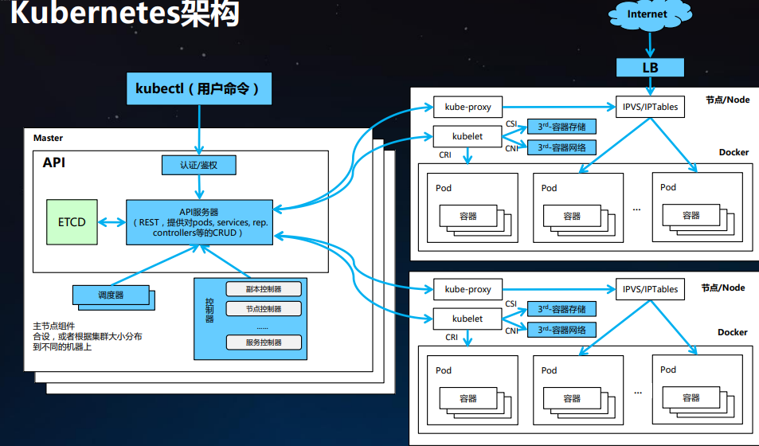

### 云原生技术的前世今生

----

istio：每个容器之间的访问、交互该如何治理；

第一代云：

​		更多的是以虚拟机资源以中心，IAAS传统云计算的服务；现在逐步的发展之后的话，在云上更加提倡的是以应用为中心的服务，更多的关注的是容器化，微服务话，伴随着其中主要的技术，比如说 Docker、Kubenetes、现在的Istio技术，以service m技术，在以应用为中心的云计算中心中，得到一个很大的普及；伴随着Kubernetes出现，已经踏入了一个新的时代；

​	容器：无疑是云计算发展技术的第一波浪潮，首先看近几年 Kubernetes 已经在云原生领域成为了一个事实标准；基本所有的厂家都会选用容kubernetes作为容器编排引擎；

​	Istio：在容器编排这个领域完成之后，现在大家更多会逐步去关注像（因为容器应用后很多服务都被拆散了，微服务架构又出现，微服务架构会把一个应用逐步拆分成多个实例，运维的容器将会非常多，容器之间的访问、交互、治理该如何去搞，）服务网格这类的服务就解决的微服务之间的访问怎么去搞

对接网络：CNI接口

服务网格&服务发现：CoreDNS、Linkerd、Envoy

容器监控：Prometheus

消息通信：GRPC

容器的三大好处：

1. 资源隔离与利用率提升（更好的限制一个应用的CPU和内存就更容易在一个物理机上）
2. 秒级弹性
3. 环境一致性，简化交付

Docker一直提倡的理念：Build、Run、any app；

容器底层关键技术 - Linux Cgroup，子系统

> Docker 使用 Linux Cgroup技术来实现容器实例的资源管理

+ memory：限制内存上线
+ cpu：使用调度程序提供对CPU的cGroup任务访问
+ cpuset：分配独立的cpu和内存节点
+ Clkio：为块设备输入/输出限制

容器底层关键技术 - Linux Namespace

+ 进程隔离
+ 每个容器独立的hostname和domain name
+ 进程交互、进行信号量、消息队列和共享内存的隔离

容器底层关键技术 - 联合文件系统

+ 分层

#### Kubernetes

---

K8s用于自动部署，扩展和管理容器化应用程序的开源项目

+ 生产级别的容器编排系统
+ 数据中心的OS
+ 新时代的云平台

组件很清晰，K8s分为两个 master 和 node

master

+ apiserver 
+ etcd：做存储
+ controllers：控制器（控制pod、dp、statefaults、deamonset都是由contallers控制）
+ scheduler：调度

node

+ kubelet：生命周期
+ kube-proxy：用来实现k8s的service、cluserIP和包括内部一些负载均衡

 

+ APIserver：最核心的就是做认证和鉴权，用户使用命令行直接调用k8s 的 API，操作K8s还是主要通过命令行操作的
  + 所有的K8s组件都是经过APi-server进行中心协调，控制器架构
+ 调度器
+ 控制器：很多控制器，副本控制器，deamonset控制器、节点、service 很多的控制器
+ kube-porxy：节点之间服务的负载均衡
  + 最早用的 user namespace：用户态负载均衡，最后发现性能不是很好
  + 又改成IPtables，iptables在service变得非常多的时候，内存和CPU消耗很大，尤其是内存，多大内存都扛不住
  + ipvs：远远比iptables匹配速度快，添加表的速度性能高很多
+ kubelet 管理生命周期，也会去不停的whch api-server上的变化，schedule 将Pod设置到自己的node上，她就会去起这个Pod 主要关注三个点
  + CRI：现在都必须按照 container runtime interfalse 来做，但是现在社区还在高一些其他的runtime 和 容器引擎
  + CNI：像网络这块都是需要CNI接口去对接，提供一个CNI插件对接到网络，为容器配置网络IP
  + CSI：对接存储

声明式API和命令式API

+ 绝大部分的Kubernetes采用 声明式API设计
+ 命令行：最后后台也是自动生成一个 yaml 提交到APiserver

##### K8s Controllers

k8s又非常多的资源

+ network
+ pod
+ replics
+ namsepace
+ service
+ job
+ deployment
+ colume ...

一堆对象，这个情况下 k8s 怎么工作呢？提交 yaml，schedule 会不停的 whch Pod对象、contaller会whch大部分对象；根据对象当前的状态，期望的状态和真实的状态，到底是什么样的，两边不一致的话，会做一些动作，比如发现实例少一个就增加一个，contaller就是做这些事情

#### K8s初体验

---

