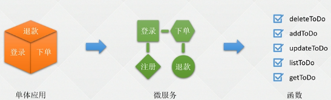
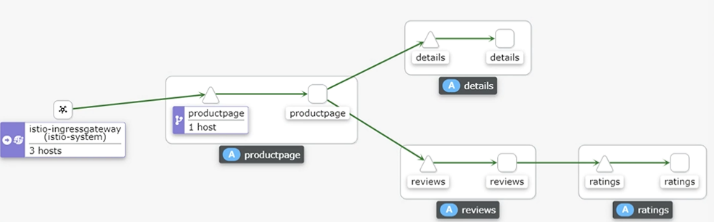
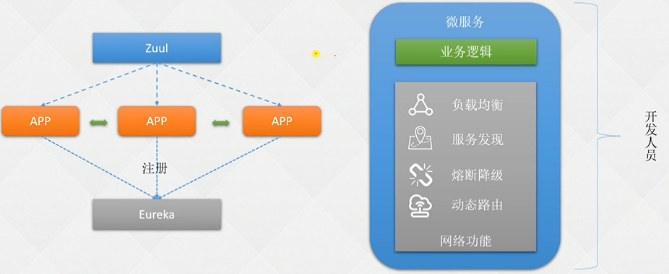
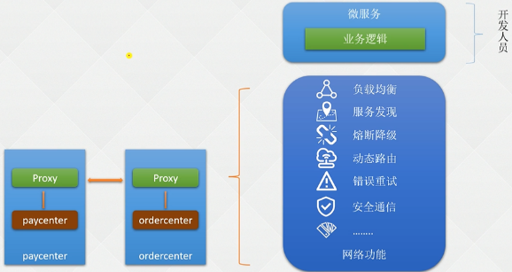
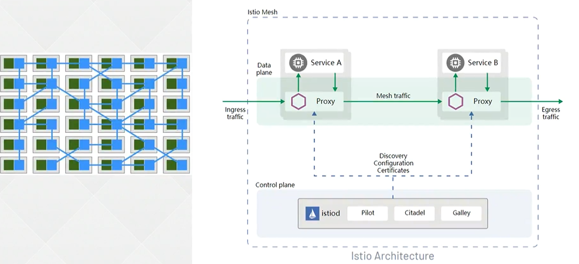
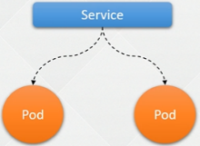
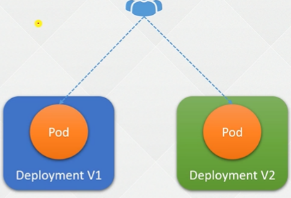
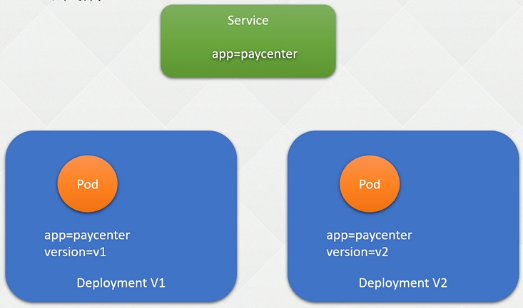
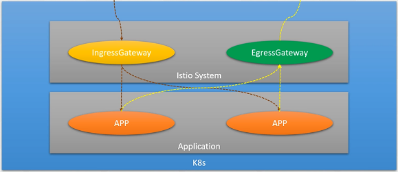

### 服务网格 Istio 入门

---

#### 1.1 应用架构演变历程

 


#### 1.2 微服务带来的问题

+ 解决了单体应用带来的兼容性问题
+ 也引来了其他的问题

 

项目拆成了很多个微服务，服务故障问题：

+ 假设 微服务挂掉，没有探测的一个东西，数据请求过来（如果有超时时间）都要等待后 才返回结果
+ 如果没挂，处理的特别慢：可能导致其他微服务的缓慢，拖累整个项目

单个微服务肯定是不行的，还有很多的副本，就需要负载均衡策略

并发问题：调用算法、排队问题 都是需要去处理的！！！


#### 1.3 云原生时代为何抛弃SpringCloud

SpringCloud/Nacos并非是完全之策

 

Eureka ： 服务注册中心

+ 告诉Eureka 微服务的名称、每个副本的Ip地址端口号；服务注册列表
+ 每个服务都有一张注册表

:deciduous_tree:问题

1. 注册表：同步时间
2. SpringCloud 实现的功能，代码还是由开发维护的（虽然代码量少）
   1. 业务逻辑
   2. 网络功能 

K8s本身就有服务发现、负载均衡的能力，再在K8s上使用SpringCloud 就是一种套娃的形式

+ 并不符合云原生的概念


#### 1.4 云原生服务网格应运而生

非业务逻辑下沉到基础架构当中，让平台去实现

+ 充分利用云带来的红利

 服务网格：业务逻辑和网络功能拆分

 

:deciduous_tree: 服务网格：

在微服务的基础上加了一层代理，K8s 以 Pod为基础，一个Pod可以启动多个容器

+ 可以启动一个 Proxy 容器，就是服务网格，程序的出入流量都要经过 Proxy ， 就可以做一些网络功能的策略或配置
+ 链路上会消耗时间 毫秒，在做测试和监控时都是通过 127.0.0.1 访问 不到1毫秒，所以大可不必关系。带给我们的功能是十分方便的，帮开发省去很多写网络功能的时间；


#### 1.5 Service Mesh

Service Mesh （服务网格）是由Buoyant 公司的CEO William Morgan 发起，目标是为了解决微服务之间复杂的链路关系。

Service Mesh 将程序开发的网络功能和程序本身解耦，网络功能下沉到基础架构，由服务网格实现服务之间的负载等功能，并且除网络功能外，也提供了其他更高级的功能，比如

+ 全链路加密
+ 监控
+ 链路追踪


:deciduous_tree: 服务网格的功能

1. 负载均衡：一个微服务很多个副本，链接到最佳的节点；可以实现更高级的功能如灰度发布
2. 服务发现：微服务框架使用注册中心，服务网格可以使用DNS、文件形式等
3. 熔断降级：如 A调用B，B很多副本，在调用到缓慢副本，服务网格发现一直缓慢就可以降级
4. 动态路由：基于各种策略发布
5. 故障注入：用途很多，如开发了一个镜像测试，很容易忽略其他服务挂掉缓慢等对自身的影响是需要考虑进去的，但是不能关掉其他服务等，无法测试。服务网格故障注入可以实现
6. 错误重试：幂等性问题，请求不同是重试还是丢弃，都是通过错误重试配置。但是不知道是链路还是服务出现问题。在调用处理缓慢导致在处理中多次请求。在生产环境中很少有。存在危险
7. 安全通信：全链路加密
8. 语言无关：需要写的代码较少


#### 1.6 服务网格产品

:deciduous_tree:鼻祖 Linkerd

2016年开源，在服务前加了一层代理，处理服务之间的网络，Service Mesh时代开启

:deciduous_tree: Envoy

和Linkerd 一样，高性能的网络代理，为云原生而设计

:deciduous_tree: Istio

重新定义了Service Mesh 分为了

+ 数据平面
+ 控制平面


---


#### 2.1 Istio 架构刨析

 

1.5 版本后，在装完 istiod 只能看到一个守护进程

+ istiod 是由Pilot、Citadel、Galler组成，一个Pod起了三个；由守护进程管理

 

#### 2.2 Istio 控平台和数据平台

:deciduous_tree: Envoy （数据平面）

Envoy ： Istio的数据平面，是C++开发的高性能代理，用于调节所有服务网格中所有服务的所有入站和出战流量。Envoy代理是唯一一个与数据平面流量交互的Istio组件。

+ 动态服务发现
+ 负载均衡
+ HTTP/2 & gRPC代理
+ 熔断器
+ 健康检查、基于百分比流量拆分的灰度发布
+ 故障注入
+ 丰富的度量指标

:deciduous_tree:Istiod （控制平面）

为Istio 的 控制平面，提供服务发现、配置、证书管理、加密通信和认证。早期的 Istio 控制平台并没有 Istiod 这个容器，而是由Mixer （新版已经废弃）、Pilot、Citadel组成。后来简化 Istio 的架构，将其合并为 I身体哦对，所以 1.5版本后部署仅能看到 Istiod一类的 Pod；

+ Pilot：为Envoy Sidecar 提供服务发现的功能，为智能路由 和 弹性（超时、重试、熔断器等）提供流量管理功能
+ Citadel：通过内置身份和凭证管理可以提供强大的服务与服务之间的最终用户验证，可用于升级服务网格中未加密的流量。
+ Galley：负载配置管理组件，用于验证配置信息的格式和正确性，Galley 使用网络配置协议 和其他组件进行配置的交互


#### 2.3 Istio 东西流量管理-VirtualService

VirtualService：虚拟服务；iyuIstio 和对应平台提供的基本连通性和服务发现能力，将请求路由到对应的目标。

+ 每一个 VirtualService 包含一组路由规则
+ Istio 将每个请求根据路由匹配到指定的目标地址。

  :deciduous_tree: 东西流量 SVC

 

:deciduous_tree: 南北流量 VirtualService

+ 实现更加复杂的配置，如 老用户访问 V1版本，部分用户访问V2版本
+ 对SVC补充，提供了更加完善功能

 


#### 2.4 VirtualService 配置示例

官方文档

```YAML
apiVersion: networking.istio.io/v1beta1	# API版本
kind: VirtualService					# 资源类型
metadata:								# 元数据
  name: reviews							#  VirtualService 名称
spac:									# 关于 VirtualService 定义
  hosts:								# VirtualService 的主机，即用户指定的目标或路由规则的目标，客户端向服务端发送请求时使用的一个或多个地址
  - reviews
  http:									# 路由规则，指定流量的路由行为，通过配置将HTTP/1.1 HTTP2 和 gRPC等流量发送到 hosts字段指定的目标
  - match:								# 路由规则的条件，可以根据一些条件制定更加细粒度的路由
    - headers:
      end-user:
        exact: jason
    route:								# 路由规则，	destination指定符合此条件的流量的实际目标地址	
    - destination:
      host: reviews
      subset: v2
  - route:
    - destination:
      host: reviews
      subset: v3
```


#### 2.5 细粒度流控 DestinationRule

DestinationRule ： 目标规则，用于后端真实的服务再做进一步的划分。

 


例如：

+ 有一个支付中心，再K8s部署，创建 SVC 让其他服务调用。但是在发版迭代过程中做了次很大的升级，之前时V1版本，、现在是V2；
+ 只想将公司 内部流量，或者内部用户 百分之10的流量 迁到V2，默认SVC 时不支持的；

通过创建的Pod的标签，DR可将其划分不同的子集；


#### 2.6 DestinationRule 配置详解

```YAML
apiVersion: networking.istio.io/v1beta1
kind: DestinationRule
metadata:
  name: bookinfo-ratings
spec:
  host: ratings.prod.svc.cluster.local	# DR的主机，即用户指定的目标或路由规则的目标，客户端向服务端发送请求时使用的地址
  trafficPolicy:
    loadBalancer:
      simple: LEAST_REQUEST
  subsets:	# 版本划分，将Pod划分成不同版本，进行细粒度的路由管控
  - name: V3
    labels:	# Pod 的标签
      version: v3
    trafficPolicy:
      loadBalancer:
        simple: ROUND_ROBIN
```


#### 2.7 南北管理流量 Gateway

Gateway：Istio网关功能 （如果使用 Istio 就不建议使用 ingress）

+ 可以使用 Gateway 再网格最外层接受 HTTP/TCP流量，并将流量转发到网格内的某个服务。同时支持出口流量的管控，可以将出口的流量固定从EgressGateway'的服务中代理出去

 


#### 2.8 Gateway 配置详解

```YAML
apiVersion: networking.istio.io/v1beta1
kind: Gateway
metadata:
  name: my-gateway
  namespace: some-config-namespace
spec:
  selector:
    app: my-gateway-controller
  servers:
  - port:
      number: 80
      name: http
      protocol: HTTP
    hosts:
    - uk.bookinfo.com
    - eu.bookinfo.com
    tls:
      httpsRedirect: true # sends 301 redirect for http requests
  - port:
      number: 443
      name: https-443
      protocol: HTTPS
    hosts:
    - uk.bookinfo.com
    - eu.bookinfo.com
    tls:
      mode: SIMPLE # enables HTTPS on this port
      serverCertificate: /etc/certs/servercert.pem
      privateKey: /etc/certs/privatekey.pem
  - port:
      number: 9443
      name: https-9443
      protocol: HTTPS
    hosts:
    - "bookinfo-namespace/*.bookinfo.com"
    tls:
      mode: SIMPLE # enables HTTPS on this port
      credentialName: bookinfo-secret # fetches certs from Kubernetes secret
  - port:
      number: 9080
      name: http-wildcard
      protocol: HTTP
    hosts:
    - "*"
  - port:
      number: 2379 # to expose internal service via external port 2379
      name: mongo
      protocol: MONGO
    hosts:
    - "*"
```


