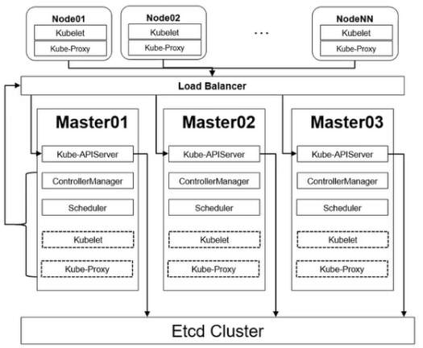

 
 2023

这是有关我创建的Kubernetes的学习详细信息。我创建这些文件是为了尝试使用和记录Kubernetes，或者为自己解决问题。

在学习K8s 不仅仅是学习它本身，还有很多K8s之外的需要学习！

---

K8s 为我们带来了什么？

1. 摆脱繁琐的工作：一键式创建一整套环境；
2. 降低故障频率：传统架构、很多基础问题如基础环境、依赖版本等问题，处理告警等繁琐工作；
3. 简化服务配置：简单的配置实现非常复杂的功能；
4. 更加强大的服务管理：自动扩缩容、更灵活的服务调度等；

> K8s的学习始终是一个难题，只知其表不知其里

Kubernetes 架构

 

