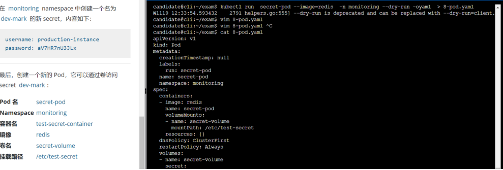

#### 1.1 容器运行时类（RuntimeClass）

##### 1.1.1 概念

是一个让Pod选择容器运行时的一个特征，用于多运行时环境

+ 2014年6月：k8s开源，Docker是唯一的运行时
+ k8s1.3：RKT合入K8s，成为第二个运行时
+ K8s 1.5：退出CRI，符合该标准就能成为运行时，比如Kata、gVisor、Container

 

一个节点上可能存在多个runtime，创建Pod时可以指定

##### 1.1.2 考题

 该Cluster 使用 continerd作为CRI的运行时，continerd默认运行时处理程序是runc。continerd已准备好支持额外的运行时处理程序runsc（gVison）

任务：

使用名为 runsc 的现有运行时处理程序，创建一个名为 untrusted的runtimeClass。

更新 namespac client 中所有的Pod在fViscon上运行

1. 切集群
2. vim 1.yaml 并且创建

```yaml
apiVersion: node.k8s.io/v1
kind: RuntimeClass
metadata:
  name: untrusted
handler: runsc
```

kubectl edit dp -n client **

```YAML
spec:
  runtimeClassName: untrusted
```


#### 1.3 ServiceAccount 

1. 切集群
2. 创建sa - create创建

```yaml
apiVersion: v1
kind: ServiceAccount
metadata:
  name: backend-sa
  namespace: prod
automountServiceAccountToken: false
```

3. vim /home、...

```YAML
spec:
  serviceAccountName: backend-sa
```

4. 删除未使用的sa        get pod -oyaml | grep ServiceAccountName 、 get sa -n


#### 1.4 kube-bench CIS 基准测试

kubeadm运行CSI发现问题：

```SH
1. 切集群
2. ssh master节点
3.#  vim /etc/kubernetes/manifests/kube-apiserver.yaml
    - --authorization-mode=Node,RBAC
    - --enable-bootstrap-token-auth=true
4. #  vim /etc/kubernetes/manifests/etcd.yaml
	- --client-cert-auth=true
5. # vim /var/lib/kubelet/config.yaml
    enabled: false
  webhook:
authorization:
  mode: Webhook
6.重启服务
# systemctl daemon-reload
# systemctl restart kubelet
7. 退出 Master 然后 SSH 到 Node 节点检查是否需要修改 
```


#### 1.5 NetworkPolicy-拒绝所有入口/出口流量 

https://kubernetes.io/zh-cn/docs/concepts/services-networking/network-policies/

1. 切集群
2. vim 5.yaml

```YAML
apiVersion: networking.k8s.io/v1
kind: NetworkPolicy
metadata:
  name: defaultdeny
  namespace: production
spec:
  podSelector: {}
  policyTypes:
  - Ingress
```

5. kubectl create -f 5.yaml


#### 1.6 2022 年 11 月新题 TLS 通信配置 

官方文档：参考 - 组件工具 - kube-apiserver

1.切集群

2.ssh master节点

```SH
1. # vim /etc/kubernetes/manifests/kube-apiserver.yaml
    - --tls-min-version=VersionTLS13
    - --tls-cipher-suites=TLS_ECDHE_RSA_WITH_AES_128_GCM_SHA256
2. # vim /etc/kubernetes/manifests/etcd.yaml
    - --cipher-suites=TLS_ECDHE_RSA_WITH_AES_128_GCM_SHA256
```


#### 1.8 RBAC 授权 

> 本题注意 修改的资源类型

更新为了

> 编辑绑定到 Pod 的 ServiceAccount test-sa-3 的现有 Role，仅允许只对 endpoints 类型的 resources 执行 get 操作。 在 namespace monitoring 中创建一个名为 role-2，并仅允许只对 namespaces 类型的 resources 执行 delete 操作的新 Role。 创建一个名为 role-2-binding 的新的 RoleBinding，将 role-2 绑定到 Pod 绑定的 ServiceAccount 上。


1. 切集群
2. 查看sa kubectl get role -n monitoring 也可以先查看pod的saName，再查看rolebinding | grep saname -B 5
3. 修改role ： 只留一个get 切注意修改的是pods 还是servers
4. 创建role2 ，create 创建

```yaml
apiVersion: rbac.authorization.k8s.io/v1
kind: Role
metadata:
  namespace: monitoring
  name: role-2
rules:
- apiGroups: ["apps"] 
  resources: ["statefulsets"]
  verbs: ["update]
```

5. 创建RoleBinding

```YAML
 kubectl create rolebinding role2-binding --role=role-2 --serviceaccount=monitoring:service-account-web --namespace=monitoring
```


##### 1.10 审计日志

存疑！1点

题：12分

 

解题：

https://kubernetes.io/zh-cn/docs/tasks/debug/debug-cluster/audit/

创建审计日志规则（切换 Context 后，ssh 到对应的 master 节点）：

日志：

+ 30天、10个文件
+ 存储在：/var/log/kuberbetes/kubernetes-logs.txt

在：sample-policy 添加下面的规则

基本策略位于cluster的master节点：所以要 ssh master节点更改apiservice的配置

要求：

+ RequestResponse 的 cronjobs
+ 对 front-apps中pv的记录更改请求体 即 Request
+ matadata 所有命名空间下的cm和secret的更改
+ 添加一个全方位的规则

最后要配置api-service

打开题目提供的文件：

```SH
apiVersion: audit.k8s.io/v1 # This is required.
kind: Policy
# Don't generate audit events for all requests in RequestReceived stage.
 omitStages:
 - "RequestReceived"
rules: []
```


```SH
1.切换集群
2.ssh master节点
3.vim /etc/kubernetes/logpolicy/sample-policy.yaml
# 使用官方文档改吧改吧就ok
apiVersion: audit.k8s.io/v1 # This is required.
kind: Policy
# Don't generate audit events for all requests in RequestReceived stage.
 omitStages:
 - "RequestReceived"
rules:
  - level: RequestResponse
    resources:
    - group: ""
      resources: ["cronjobs"]
  - level: Request
    resources:
    - group: ""
      resources: ["persistentvolumes"]
    namespaces: ["front-apps"]
  - level: Metadata
    resources:
    - group: ""
      resources: ["secrets", "configmaps"]
  - level: Metadata
    omitStages:
      - "RequestReceived"

 4.修改kube-apiservice文件
 # vim /etc/kubernetes/manifests/kube-apiserver.yaml
 增加四条：
    - --audit-policy-file=/etc/kubernetes/logpolicy/sample-policy.yaml
    - --audit-log-path=/var/log/kubernetes/kubernetes-logs.txt
    - --audit-log-maxage=30
    - --audit-log-maxbackup=10
 
 5.接下来挂载数据卷（考试环境有可能已经挂载）；需要确认以下
    volumeMounts:
    - mountPath: /etc/kubernetes/logpolicy
      name: audit
    - mountPath: /var/log/kubernetes
      name: audit-log
  volumes:
  - name: audit
    hostPath:
      path: /etc/kubernetes/logpolicy
  - name: audit-log
    hostPath:
      path: /var/log/kubernetes
 6.重启kubelet
 systemctl daemon-reload
 systemctl restart kubelet
```

更新：

第一个策略：

+ 原：RequestResponse 的 cronjobs
+ 新：RequestResponse 的 nodes

第二个策略

+ 原：对 front-apps中pv的记录更改请求体 即 Request
+ 新：对 web-apps 中pv的记录更改请求体 即 Request

其余没变


#### 1.11 Secret

6分

##### 1.11.1考题 

 

 

解题：

https://kubernetes.io/zh-cn/docs/concepts/configuration/secret/

任务：

+ 在namespace monitoring 中获取名为 db1-test 的现有secret 的内容。
  + 将username 字段存储在 /home/candidate/user.txt
  + 将 password 字段存储在 /home/candidate/old-password.txt
+ 在namespace monitoring 创建一个新的secret dev-mark；内容如下：
  + username：production-instance
  + password：aV7HR7nU3JLx
+ 最后创建一个Pod，挂载 secret dev-mark
  + pod name: secret-pod
  + namespace: monitoring
  + 容器名：test-secret-container
  + 镜像：redis
  + 卷名：secret-volume
  + 挂载路径：/etc/test-secret

```SH
1.不要忘记切换 context
2.查看 secret 内容：
# kubectl get secrets -n monitoring db1-test  -oyaml | grep data -A 2 -m 1
data:
  password: cGFzcw==
  username: YWRtaW4=
3.解密后保存：
mkdir /home/candidate/
echo -n "cGFzcw==" | base64 -d > /home/candidate/old-password.txt
echo -n "YWRtaW4=" | base64 -d >   /home/candidate/user.txt
4.创建 dev-mark Secret:
kubectl create secret generic dev-mark --from-literal=username=production-instance --from-literal=password=aV7HR7nU3JLx -n monitoring

5.拿官方文档改吧改吧
+ 添加namespace
+ 更改secretName为：dev-mark
apiVersion: v1
kind: Pod
metadata:
  name: secret-pod
  labels:
    name: secret-pod
  namespace: monitoring
spec:
  volumes:
  - name: secret-volume
    secret:
      secretName: dev-mark
  containers:
  - name: test-secret-container
    image: redis
    volumeMounts:
    - name: secret-volume
      readOnly: true
      mountPath: "/etc/test-secret"

kubectl create -f 创建

```


#### 1.12 Dockerfile 和 Deployment 优化

理解一下不安全的因素是什么

6分

##### 1.12.1 题

 


##### 1.12.2 解题

```
1.不要忘记切换 context
修改文件不要注释
```

DOCKERFILE

```dockerfile
# 原
FROM ubuntu:16.04
USER root
RUN apt get install -y nginx=4.2
ENV ENV=testing
USER root
CMD ["nginx -d"]

# 新 一般不推荐使用root用户启动容器
# 注意版本，如果是latest 该为 指定的版本
FROM ubuntu:16.04
USER nobody
RUN apt get install -y nginx=4.2
ENV ENV=testing
USER nobody
CMD ["nginx -d"]
```

deployment

```YAML
# 旧
securityContext:
 {'capabilities':{'add':['NET_ADMIN'],'drop':['all']},'privileged':True,'readOnlyRootFilesystem': False, 'runAsUser': 65535}

# 新
securityContext:
 {'capabilities':{'add':['NET_ADMIN'],'drop':['all']},'privileged':False,'readOnlyRootFilesystem': True, 'runAsUser': 65535}
```


更新SecurityContext 安全容器配置-：

修改namespac app，名为iamp-deployment。使其containers：

+ 使用用户ID3000运行
+ 使用一个只读的根文件系统
+ 禁止privilege escalation

> 别忘了切换 Context

```
kubectl edit deploy lamp-deployment -n app
# 注意：是配置在containers下面的
      containers:
        securityContext:
          allowPrivilegeEscalation: false
          readOnlyRootFilesystem: true
          runAsUser: 3000
```

https://kubernetes.io/zh-cn/docs/tasks/configure-pod-container/security-context/


#### 1.14 无状态和不可变应用

 

解题

```SH
不要忘记切换 context
查看具有特权容器的 Pod
kubectl get po -n development -oyaml | grep -E "privileged|RootFileSystem"
kubectl get po -n development
kubectl get po dev-pod -n development -oyaml | grep -E "privileged|RootFileSystem"
kubectl delete po dev-pod -n development
```

查看挂在了volume的

+ nfs
+ hostpath 等的Pod删除掉


#### 1.15 NetworkPolicy 访问控制

 

##### 1.15.1 题

 

解题

```yaml
1.不要忘记切换 context

kubectl get ns development  --show-labels
kubectl get pod  -n development products-service --show-labels

# 注意限制的是Pod,两个from

apiVersion: networking.k8s.io/v1
kind: NetworkPolicy
metadata:
  name: pod-restriction
  namespace: development
spec:
  podSelector:
    matchLabels:
      run: products-service
  policyTypes:
    - Ingress
  ingress:
    - from:
        - namespaceSelector:
            matchLabels:
              kubernetes.io/metadata.name: qa
    - from:
        - podSelector:
            matchLabels:
              enviroment: testing
              
 #  kubectl create -f 

```


#### 1.16 Trivy 镜像扫描

3分 

1.16.1 考题

 


1.16.2 解题

```YAML
1. 不要忘记切换 context
2. ssh 到对应的 master 节点
3。查看镜像
 kubectl get po -n kamino -oyaml | grep " image:"
4.对每个镜像扫描：
第一次扫描的时候，不能跳过漏洞库--skip-update
 trivy image -s "HIGH,CRITICAL" ubuntu:18.04
 trivy image --skip-update -s "HIGH,CRITICAL" ubuntu:18.04

```


#### 1.17 禁止匿名访问 

6分

##### 1.17.1 题

 

解题：

```SH
1. 切换 Context
2. ssh 到对应的 master 节点
3. 更改授权模式和添加 NodeRestriction 准入控制器：

    - --authorization-mode=Node,RBAC
    - --enable-admission-plugins=NodeRestriction

4. 删除 clusterrolebinding
 kubectl delete clusterrolebinding system:anonymous
```


##### 1.18 AppArmor 

12分

解题不难，概念难

 

##### 1.18.1 概念

linux 内核安全模块，可以通过一个安全配置文件限制程序的功能，比如可以在指定某个程序可读，写或运行某些文件，也可以限制能够打开一些网络端口等；


##### 1.18.2 解题

```YAML
1. 记切换 context
2. ssh 工作节点
 cat /etc/apparmor.d/nginx_apparmor
 记录：profile nginx-profile-1 flags=(attach_disconnected) {
3. 加载 apparmor 配置文件
 apparmor_parser /etc/apparmor.d/nginx_apparmor
4. 查看 apparmor 的策略名称：
 apparmor_status | grep nginx-profile-1 # 表示加载完成
5. 配置 Pod 使用该策略：（退回操作节点）
exit
  name: deploy-nginx
  annotations:
    container.apparmor.security.beta.kubernetes.io/deploy-nginx: localhost/nginx-profile-1
spec:
  containers:
  - image: nginx
    name: deploy-nginx
    
# kubectl create -f 创建POD
```


#### 1.19 Sysdig

7分

大部分都会考试最后一题，概念用法比较麻烦，解题一条命令就能完成


#### 1.19.1 概念

开源工具，用于系统分析、探测和故障排查

+ 不仅可以分析Linux系统，还可以将排查的信息保存为文件

Sysdig

> Sysdig 是一个超级系统工具，比 strace、tcpdump、lsof 加起来还强大。

+ 网络抓包功能：tcpdump
+ 文件追踪：lsof
+ 进程执行系统调用和信息接受跟踪：strace
+ Netstat
+ PS
+ ETCD


##### 1.19.2 题目

+ 检测pod：tomcat
+ 至少30s
+ /opt/KsRS00101/envnts/details

##### 1.19.3 解题

```YAML
1. 切换 Context 后
2. ssh 到对应的工作节点 (解题完成后不要忘记退出)
3.查看容器的名字或 ID：
docker ps |grep redis
crictl ps | grep redis
kubectl get po redis -oyaml | grep containerID
4.使用 sysdig 进行检测
：
先看有没有日志，再导入

sudo sysdig -M 30 -p "%evt.time,%user.uid,%proc.name" container.id=46183d7281e15 > /opt/KSRS00101/events/details
注意：如果文件为空，使用 container.name 重新执行
sudo sysdig -M 30 -p "%evt.time,%user.uid,%proc.name" container.name=redis > /opt/KSRS00101/events/details
```


#### 1.20 ImagePolicyWebhook 

##### 1.20.1 概念

ImagePolicyWebhook ： 评估镜像的准入控制器，通过该webhook可以决定镜像是否合规，不合规的会拒绝常见Pod，规则配置通过 --admission-control-config-file 参数指定。

 


##### 1.20.2 考题

+ 在master节点完成整个考题
+ 给定目录：/etc/kubernetes/epconfig 中不完整的配置 以及具有HTTPS端点https://***:8082/image_policy 的功能性容器镜像扫描器
  + 启用必要插件创建镜像策略
  + 校验控制配置并将其改为隐式拒绝
  + 编辑配置正确指向HTTPS
+ 最后：通过部署 /root/KSSC00202/config-test.yaml 来测试配置是否有效

 

```YAML
1.切集群
2.ssh master
3.关闭默认允许： json文件
vim /etc/kubernetes/epconfig/admission_configuration.json
'defaultAllow': false # 改成 false

4.配置 Webhook 地址：
# vim /etc/kubernetes/epconfig/kubeconfig.yaml

# 修改 server

apiVersion: v1
kind: Config
clusters:
- cluster:
     certificate-authority: /etc/kubernetes/pki/server.crt
     server: https://***:8082/image_policy
  name: bouncer_webhook

5. 开启 ImagePolicyWebhook：
vim /etc/kubernetes/manifests/kube-apiserver.yaml
    - --enable-admission-plugins=NodeRestriction,ImagePolicyWebhook
    - --admission-control-configfile=/etc/kubernetes/epconfig/admission_configuration.json
    # 该文件在 epconfig目录下

- mountPath: /etc/kubernetes/epconfig
 name: epconfig
 readOnly: true
 
- hostPath:
 path: /etc/kubernetes/epconfig
 name: epconfig


6.重启服务
# systemctl daemon-reload
# systemctl restart kubelet

7.测试：
# kubectl create -f /root/KSSC00202/configuration-test.yml
```

