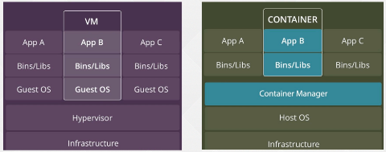

容器基础

---

在生产环境中遇到最多的命令就是这些，这些掌握好了，足以应对在生产环境中常用的指令或者是工作场景。

- [:ship: 互联网的基础架构 “工业革命”](#ship-互联网的基础架构-工业革命)
- [:ship: 什么是容器](#ship-什么是容器)
- [:ship: Docker 基础](#ship-docker-基础)
- [:ship: Docker 安装注意事项](#ship-docker-安装注意事项)
- [:ship: Docker 基础命令](#ship-docker-基础命令)
  - [1.1 Docker version](#11-docker-version)
  - [1.2 docker info](#12-docker-info)
  - [1.3  搜索镜像](#13--搜索镜像)
  - [1.4 拉取下载镜像](#14-拉取下载镜像)
  - [1.5 更改镜像 Tag](#15-更改镜像-tag)
  - [1.6 启动容器 run](#16-启动容器-run)
  - [1.7 容器运行详细信息](#17-容器运行详细信息)
  - [1.8 端口映射](#18-端口映射)
  - [1.9 日志](#19-日志)
  - [1.10 查询运行的容器](#110-查询运行的容器)
  - [1.11 删除](#111-删除)
  - [1.12 数据持久化](#112-数据持久化)
- [:ship: DockerFile 的编写](#ship-dockerfile-的编写)
  - [1.1 Dockerfile常用命令](#11-dockerfile常用命令)
  - [1.2 创建用户](#12-创建用户)
  - [1.2 CMD](#12-cmd)
  - [1.3 RUN](#13-run)
  - [1.4 USER](#14-user)
  - [1.5 WORKDIR](#15-workdir)
  - [1.6 ENV](#16-env)
  - [1.7 CMD](#17-cmd)
  - [1.8 ENTRYPOINT](#18-entrypoint)
  - [1.9 COPY](#19-copy)
  - [1.10 ADD](#110-add)
  - [1.11 ARG](#111-arg)
  - [1.12 LABEL](#112-label)
- [:ship: 镜像优化](#ship-镜像优化)
  - [1.1 存在的问题](#11-存在的问题)
  - [1.2 Alpine 做为基础镜像](#12-alpine-做为基础镜像)
- [:ship: 多阶段构建](#ship-多阶段构建)
  - [1.1 单阶段构建](#11-单阶段构建)
  - [1.2 多阶段构建](#12-多阶段构建)


#### :ship: 互联网的基础架构 “工业革命”

物理机	-	虚拟化	-	云计算	-	容器	-	容器编排/容器云	-	others...

+ 物理机：服务器上架，可能配置很多服务，都部署在一台物理机，部署的少了可能造成资源浪费；但也会因为承载太多导致故障
+ 虚拟化：物理机拆分成很多小的虚拟机，有自己的系统和内核；
  + 虽然，提供了很多的虚拟机；管理起来特别麻烦；
  + 于是乎产生了云计算；
+ 云计算：可以管理成千上万的虚拟机 openstack
  + 虚拟化虽然提供了独立的环境，但是服务还是按照之前的模式部署；需要安装基础环境；还是非常麻烦，只是说将大的拆分成了小块，对工作而言没有太大的变化；
  + 虚拟机挂了，不能快速恢复（虚拟机启动时间以分钟计时）
+ 容器：对于虚拟化更小，启动毫秒级，一个容器可以部署一个服务；
  + 资源利用率更高
  + 之前一台物理机拆分成十几个虚拟机，容器可以启动成百上千；管理起来更为困难；
+ 容器编排/容器云：
  + 对容器实现自动化的编排；
  + k8s并不是一个技术的天花板，有很多技术比k8s做的很多；

有人也说：能跌颠覆 k8s 的可能是它本身，在目前主要以 k8s 为主。


#### :ship: 什么是容器

技术来源于生活，容器也是一样；设计理念来自于集装箱。

 

容器：

1. 基础架构
2. 系统
3. 容器管理平台：Container Manager  【之前是docker，目前可能是其他的】
4. 启动一个镜像 即 容器：包含了基础环境

> Docker 已经失宠了，为什么还需要学习

+ docker 依旧是一产品交付的最佳实践
+ 对于 k8s 有余悸的企业，依旧以docker为主
+ 我们更习惯使用 Docker 制作镜像，如 CICD 制作镜像
+ 虽然 K8s 不再兼任 Docker，镜像依旧可用：镜像的标准一样
+ 其他的历史元素


#### :ship: Docker 基础

简单的介绍：

+ 开源项目、轻量级虚拟化
+ 打包应用以及依赖包，可移植

docker 的架构：

+ Docker Client ： Docker 的客户端，用于执行 Docker的相关命令，比如镜像下载；
+ Docker Daemon：Docker 守护进程，运行在服务器或者其他工作站上；
+ Docker image：Docker 镜像，相当于一个模板，可以用来启动容器；
+ Docker Container：Docker‘ 容器，由镜像去启动，容器内运行相关的应用程序。

这是一个基本信息，了解这些足矣；


以上是一大堆非常枯燥无味的概念......


#### :ship: Docker 安装注意事项

Docker 安装：https://docs.docker.com/engine/install/centos/

```SH
# 安装所有所需依赖包
yum install  yum-utils device-mapper-persistent-data lvm2 -y

# 添加 docker yum 源
yum-config-manager --add-repo https://mirrors.aliyun.com/docker-ce/linux/centos/docker-ce.repo
sed -i -e '/mirrors.cloud.aliyuncs.com/d' -e '/mirrors.aliyuncs.com/d' /etc/yum.repos.d/CentOS-Base.repo

# 安装 docker 
yum install docker-ce-20.10.* docker-ce-cli-20.10.* -y

# 启动 Docker
systemctl daemon-reload && systemctl enable --now docker
```


容器基础

主要分为三部分

1. Docker 基础命令
2. DockerFile 的编写
3. 镜像大小优化


#### :ship: Docker 基础命令

##### 1.1 Docker version

​	查看 Docker 版本包括 Docker 版本号、API版本号、对应的 Git Commit、Containcrd 和 runC 的版本信息等

```SH
[root@k8s-node02 ~]# docker version
Client: Docker Engine - Community
 Version:           20.10.21
 API version:       1.41
 Go version:        go1.18.7
 Git commit:        baeda1f
 Built:             Tue Oct 25 18:04:24 2022
 OS/Arch:           linux/amd64
 Context:           default
 Experimental:      true

Server: Docker Engine - Community
 Engine:
  Version:          20.10.21
  API version:      1.41 (minimum version 1.12)
  Go version:       go1.18.7
  Git commit:       3056208
  Built:            Tue Oct 25 18:02:38 2022
  OS/Arch:          linux/amd64
  Experimental:     false
 containerd:
  Version:          1.6.10	# containerd 版本	
  GitCommit:        770bd0108c32f3fb5c73ae1264f7e503fe7b2661
 runc:
  Version:          1.1.4
  GitCommit:        v1.1.4-0-g5fd4c4d
 docker-init:
  Version:          0.19.0
  GitCommit:        de40ad0
```

+ OCI：Open Container Initiative的简称，由Linux基金会开发的OCI标准和规范，目的是围绕容器格式和 Runtime 制定一个开放的工业标准；
+ Containerd：Docker 为了兼容OCI标准，讲容器Runtime 机器管理能力从 Docker 守护进程中剥离出来，勇于不启动 Docker 也能直接通过 Containerd 来管理容器。
+ RunC：Docker 按照 OCF（Open Container Format）开放容器格式标准制订的一个轻量级工具，可以使用 RunC 不通过Docker 引擎可实现容器的启动、停止和资源隔离等功能。


##### 1.2 docker info

查看 docker 的详细信息

```SH
[root@k8s-node02 ~]# docker info
Client:
 Context:    default
 Debug Mode: false
 Plugins:
  app: Docker App (Docker Inc., v0.9.1-beta3)
  buildx: Docker Buildx (Docker Inc., v0.9.1-docker)
  scan: Docker Scan (Docker Inc., v0.21.0)

Server:
 Containers: 0	# 容器个数
  Running: 0	# 运行状态
  Paused: 0
  Stopped: 0
 Images: 0		# 镜像个数
 Server Version: 20.10.21
 Storage Driver: overlay2	# 存储驱动默认overlay2 aufs|overlay|btts
  Backing Filesystem: xfs	# 服务器文件系统
  Supports d_type: true
  Native Overlay Diff: true
  userxattr: false
 Logging Driver: json-file	# 日志驱动	
 Cgroup Driver: cgroupfs	# 限制和隔离的驱动，生产环境建议使用 systemd
 Cgroup Version: 1
 Plugins:
  Volume: local
  Network: bridge host ipvlan macvlan null overlay	# 网络插件
  Log: awslogs fluentd gcplogs gelf journald json-file local logentries splunk syslog	# 支持的日志驱动
 Swarm: inactive	# docker 官方的编排工具 inactive不开启
 Runtimes: io.containerd.runtime.v1.linux runc io.containerd.runc.v2
 Default Runtime: runc
 Init Binary: docker-init
 containerd version: 770bd0108c32f3fb5c73ae1264f7e503fe7b2661
 runc version: v1.1.4-0-g5fd4c4d
 init version: de40ad0
 Security Options:
  seccomp
   Profile: default
 Kernel Version: 4.19.12-1.el7.elrepo.x86_64
 Operating System: CentOS Linux 7 (Core)
 OSType: linux
 Architecture: x86_64
 CPUs: 2
 Total Memory: 3.829GiB
 Name: k8s-node02
 ID: NVZK:IC4O:RNKY:QDN4:EQRJ:JZRA:PVTN:SHH5:2TDB:UMDA:MUKC:IMW2
 Docker Root Dir: /var/lib/docker	# docker 的根目录，生产环境建议使用 SSD 不要和系统在一个磁盘
 Debug Mode: false
 Registry: https://index.docker.io/v1/	# 默认镜像仓库地址 官方
 Labels:
 Experimental: false
 Insecure Registries:	# 仓镜像库
  127.0.0.0/8
 Live Restore Enabled: false	# Docker 的 热更新，默认关闭（重启 docker 是否需要重启容器）
```


docker version 和 docker info 命令虽然不常用，但是信息 非常重要！


##### 1.3  搜索镜像

search 命令

```SH
[root@k8s-node02 ~]# docker search alpine
NAME                               DESCRIPTION                                     STARS     OFFICIAL   AUTOMATED
alpine                             A minimal Docker image based on Alpine Linux…   9489      [OK]
```


##### 1.4 拉取下载镜像

+ docker pull

不指定版本：默认下载最新：latest

```SH
[root@k8s-node02 ~]# docker pull alpine
Using default tag: latest
latest: Pulling from library/alpine
c158987b0551: Pull complete
Digest: sha256:8914eb54f968791faf6a8638949e480fef81e697984fba772b3976835194c6d4
Status: Downloaded newer image for alpine:latest
docker.io/library/alpine:latest
You have new mail in /var/spool/mail/root
[root@k8s-node02 ~]#
[root@k8s-node02 ~]# docker images
REPOSITORY   TAG       IMAGE ID       CREATED       SIZE
alpine       latest    49176f190c7e   13 days ago   7.05MB
```

注意事项：

下载时没有指定 url 默认从配置的 Registry 拉取

```SH
# docker info
 Registry: https://index.docker.io/v1/	# 默认镜像仓库地址 官方
```

也就是说：从官方下载

标准的镜像地址：

1. 镜像仓库地址：https://index.docker.io
2. 项目地址：v1
3. 镜像名称：alpine
4. 版本号：latest


注意事项：如果要拉取私有仓库：先登录

```SH
docker login
```

docker push 一个镜像到仓库是必须要登录的！


##### 1.5 更改镜像 Tag

因为层都是一样的，所以不会再次占用资源

```sh
REPOSITORY   TAG       IMAGE ID       CREATED       SIZE
alpine       latest    49176f190c7e   13 days ago   7.05MB
You have new mail in /var/spool/mail/root
[root@k8s-node02 ~]#
[root@k8s-node02 ~]# docker tag alpine:latest alpine:new-tag
[root@k8s-node02 ~]# docker images
REPOSITORY   TAG       IMAGE ID       CREATED       SIZE
alpine       latest    49176f190c7e   13 days ago   7.05MB
alpine       new-tag   49176f190c7e   13 days ago   7.05MB
```


##### 1.6 启动容器 run

+  -ti 前台启动一个容器
+ -ti --rm 参数，表示前台启动的容器退出即删除
+ -tid：后台启动
+ --restart=always 容器异常重启

```sh
[root@k8s-node02 ~]# docker run -ti alpine
/ # pwd
/
```

进入一个容器

```SH
[root@k8s-node02 ~]# docker exec -ti cae66b68244d sh
/ #
```


##### 1.7 容器运行详细信息

```SH
docker inspect cae66b68244d
```

如查找 IP 地址

```SH
[root@k8s-node02 ~]# docker inspect cae66b68244d | grep \"IPAddress
            "IPAddress": "172.17.0.2",
                    "IPAddress": "172.17.0.2",
```


##### 1.8 端口映射

先 pull 一个 nginx 镜像

在后台启动一个nginx容器，不覆盖默认启动命令

```sh
[root@k8s-node02 ~]# docker run -tid -p 1111:80 nginx
4b54d7f29aa4c1e0a90a24562a18306da50afc72f0e3ebd31ceb0d84e1f37b30
[root@k8s-node02 ~]# netstat -lntp | grep 1111
tcp        0      0 0.0.0.0:1111            0.0.0.0:*               LISTEN      125459/docker-proxy
tcp6       0      0 :::1111                 :::*                    LISTEN      125466/docker-proxy
```

请求 - 访问

```SH
[root@k8s-node02 ~]# docker inspect 4b54d7f29aa4 | grep \"IPAdd
            "IPAddress": "172.17.0.3",
                    "IPAddress": "172.17.0.3",
[root@k8s-node02 ~]# curl 172.17.0.3
<!DOCTYPE html>
<html>
<head>
<title>Welcome to nginx!</title>
<style>
```

```SH
[root@k8s-node02 ~]# curl 192.168.200.205:1111
<!DOCTYPE html>
<html>
<head>
<title>Welcome to nginx!</title>
<style>
```


##### 1.9 日志

访问日志：

```SH
[root@k8s-node02 ~]# docker logs -f 4b54d7f29aa4 --tail 3
192.168.200.205 - - [06/Dec/2022:14:06:23 +0000] "GET / HTTP/1.1" 200 615 "-" "curl/7.29.0" "-"
172.17.0.1 - - [06/Dec/2022:14:07:31 +0000] "GET / HTTP/1.1" 200 615 "-" "curl/7.29.0" "-"
172.17.0.1 - - [06/Dec/2022:14:08:11 +0000] "GET / HTTP/1.1" 200 615 "-" "curl/7.29.0" "-"
```

注意事项：

有些容器 查看时没有日志，原因：

1. 日志没有输出在控制台

云原生理念：开发时不推荐将日志写在某个文件中，最好输出在控制台


##### 1.10 查询运行的容器

+ docker ps

其他命令：

+ docker ps -a ： 查看所有状态的容器

查看所有容器的ID

```SH
[root@k8s-node02 ~]# docker ps -aq
4b54d7f29aa4
```


##### 1.11 删除

删除容器：docker rm 容器ID

删除镜像：docker rmi 镜像名/镜像ID

注意事项：删除镜像前，镜像必须未被使用

批量方式：

```SH
docker rm $(docker ps -aq)
```


##### 1.12 数据持久化

-v：本机器目录映射到容器目录

相对比较重要

```SH
#进入 nginx 容器
[root@k8s-node02 ~]# docker exec -ti 4b54d7f29aa4 bash
root@4b54d7f29aa4:/# cd /usr/share/nginx/html/;ls
50x.html  index.html
```

修改index.html 再次访问

```SH
root@4b54d7f29aa4:/usr/share/nginx/html# echo 1111 > index.html
root@4b54d7f29aa4:/usr/share/nginx/html# curl 192.168.200.205:1111
1111
```

重新启动一个 nginx 容器，发现更改的数据不存在，最初的样式

+ 所以说：在一个容器被重建后数据会丢失
+ 容器每次启动都是以最干净的状态启动
+ 最佳解决方法：dockerfile

```SH
[root@k8s-node02 ~]# docker run -tid -p 1111:80 nginx
[root@k8s-node02 ~]# curl 192.168.200.205:1111
<!DOCTYPE html>
<html>
<head>
<title>Welcome to nginx!</title>
<style>
```

另一种方法：

> 本机器目录同步到容器目录

```SH
[root@k8s-node02 ~]# mkdir /mnt/nginxhtml
[root@k8s-node02 ~]# docker run -tid -v /mnt/nginxhtml:/usr/share/nginx/html -p 1111:80 nginx
[root@k8s-node02 ~]# curl 192.168.200.205:1111
<html>
<head><title>403 Forbidden</title></head>
<body>
<center><h1>403 Forbidden</h1></center>
<hr><center>nginx/1.23.2</center>
</body>
</html>
```

访问报：403

+ 原因：宿主机创建的文件夹下本身没有文件

```SH
[root@k8s-node02 ~]# docker exec -ti dc6e74c95a96 bash
root@dc6e74c95a96:/# cd /usr/share/nginx/html/;ls
root@dc6e74c95a96:/usr/share/nginx/html#
# 创建文件
root@dc6e74c95a96:/usr/share/nginx/html# echo "1111" > index.html
root@dc6e74c95a96:/usr/share/nginx/html# exit
exit
# 访问
[root@k8s-node02 ~]# curl 192.168.200.205:1111
1111

# 挂载目录
[root@k8s-node02 nginxhtml]# echo "test.html" > test.html
[root@k8s-node02 nginxhtml]# docker exec -ti dc6e74c95a96 ls /usr/share/nginx/html/
index.html  test.html

# 访问 test.html
[root@k8s-node02 nginxhtml]# curl 192.168.200.205:1111/test.html
test.html
```

其他命令

+ 本地文件拷贝到容器：docker cp


#### :ship: DockerFile 的编写

默认：Dockerfile，指定文件：-f 

##### 1.1 Dockerfile常用命令

+ FROM：继承基础镜像
+ MAINTAINER：镜像制作的作者信息，【已弃用，使用LABEL代替】
+ LABEL：k=v 形式，将一些元数据添加至镜像
+ RUN：用来执行shell命令，在镜像之上操作
+ EXPOSE：暴露的端口号
+ CMD：启动容器默认执行的命令，会被覆盖
+ ENTRYPOINT：启动容器真正执行的命令，不会被覆盖
+ ENV：配置环境变量
+ ADD：复制文件到容器，一般拷贝文件，压缩包自动减压
+ COPY：复制文件到容器，一般拷贝目录
+ WORKDIR：设置容器的工作目录
+ USER：容器使用的用户
+ ARG：设置编译镜像时传入的参数

##### 1.2 创建用户 #####

镜像如何制作：

比如在linux创建用户：useradd dk、在容器内也可以有同样的操作；

+ 如果想让用户一直存在某个镜像（先有基础镜像，基础镜像之上操作，再生成一个新的镜像）

```SH
 vim Dockerfile
```

Dockerfile 文件：

```dockerfile
FROM docker pull centos:centos7.9.2009
MAINTAINER dot
RUN useadd dot
```

> 构建 Dockerfile

注意事项：build命令中 -t 指定镜像版本

+ 点：将 当前目录所有文件全部加载到内存，再执行docker build
+ 本地文件、包拷贝到容器都可找到，想拷贝其他目录的文件时拷贝不了的，需要注意

```SH
[root@k8s-node02 dockerfiles]# docker build -t centos:user .
Sending build context to Docker daemon  2.048kB
Step 1/3 : FROM centos:centos7.9.2009
 ---> eeb6ee3f44bd
Step 2/3 : MAINTAINER dot
 ---> Running in 5e46dde52ce7
Removing intermediate container 5e46dde52ce7
 ---> 055aab3b5ba7
Step 3/3 : RUN useradd dot
 ---> Running in 7412d5dc3974
Removing intermediate container 7412d5dc3974
 ---> 90a20cc2882c
Successfully built 90a20cc2882c
Successfully tagged centos:user
You have new mail in /var/spool/mail/root

# run镜像 查看用户
[root@k8s-node02 dockerfiles]# docker run -ti --rm centos:user id dot
uid=1000(dot) gid=1000(dot) groups=1000(dot)
```


##### 1.2 CMD

```dockerfile
FROM centos:centos7.9.2009
MAINTAINER dot
RUN useradd dot
CMD echo "test"

EXPOSE 80
```

```SH
[root@k8s-node02 dockerfiles]# docker run -ti --rm centos:cmd
test
```

注意事项：

+ 在启动时：如果后面添加了一个bash，会将cmd覆盖掉，但是不会覆盖ENTRYPOINT 


##### 1.3 RUN

+ 不仅仅可以创建用户，还可以创建文件夹、目录、做一些编译的命令
+ 可以写多行，用 &&拼接符。生产环境建议写一行，减少层数，镜像大小会变小
+ 有的命令可能没有，会失败

```dockerfile
FROM centos:centos7.9.2009
MAINTAINER dk
RUN useradd dk
RUN mkdir -p /opt/1
RUN useradd dk2 && mkdir -p /opt/2
```

构建：

+ 如果镜像名和tag一样，第二次构建将覆盖第一次


##### 1.4 USER

容器使用的用户

+ 在启动容器指定环境的用户，指定dk

```dockerfile
FROM centos:centos7.9.2009
MAINTAINER dot
RUN useradd dk
RUN mkdir -p /opt/1
RUN useradd dk2 && mkdir -p /opt/2
USER dk
```

```sh
# docker run -ti --rm centos:run bash
[dk@7e0ce89703fd /]$
```


##### 1.5 WORKDIR

工作目录

```dockerfile
FROM centos:centos7.9.2009
MAINTAINER dot
RUN useradd dk
RUN mkdir -p /opt/1
RUN useradd dk2 && mkdir -p /opt/2
USER dk
WORKDIR /opt/2
```

运行的目录

```SH
[root@k8s-node02 dockerfiles]# docker run -ti --rm centos:workdir bash
[dk@177a6c6f2a44 2]$ pwd
/opt/2
```


##### 1.6 ENV #####

两种写法：

+ k=v:	 一行写法(推荐)
+ k v

```dockerfile
FROM centos:centos7.9.2009
MAINTAINER dot
RUN useradd dk
RUN mkdir -p /opt/1
RUN useradd dk2 && mkdir -p /opt/2
USER dk
WORKDIR /opt/2
ENV ENV1=123 ENV2=234
ENV ENV3 345
```

```sh
# docker run -ti --rm centos:env bash
[dk@1e04dba5b9c2 2]$ env | grep ENV
ENV3=345
ENV2=234
ENV1=123
```


CMD	ENTRYPOINT 【都可以作为容器的启动命令】

##### 1.7 CMD

```dockerfile
FROM centos:centos7.9.2009
MAINTAINER dot
RUN useradd dk
RUN mkdir -p /opt/1
RUN useradd dk2 && mkdir -p /opt/2
USER dk
WORKDIR /opt/2
ENV ENV1=123 ENV2=234
ENV ENV3 345
CMD echo $ENV1 $ENV2 $ENV3
```

直接执行：

+ 不加bash：正常输出
+ 加bash：回被覆盖掉

```SH
# docker run -ti --rm centos:run
123 234 345
# docker run centos:run bash
```

##### 1.8 ENTRYPOINT

```dockerfile
FROM centos:centos7.9.2009
MAINTAINER dot
RUN useradd dk
RUN mkdir -p /opt/1
RUN useradd dk2 && mkdir -p /opt/2
USER dk
WORKDIR /opt/2
ENV ENV1=123 ENV2=234
ENV ENV3 345
#CMD echo $ENV1 $ENV2 $ENV3
ENTRYPOINT echo $ENV1 $ENV2 $ENV3
```

运行

+ 注意：entrypoint 会将bash当成它的参数

```sh
# docker run centos:entrypoint bash
123 234 345
```

注意事项：

1. entrypoint 会将bash当成它的参数

推荐写法：

```dockerfile
ENTRYPOINT [ "echo" ] 
# docker run -ti --rm centos:entrypoint bash
bash
```


##### 1.9 COPY

压缩一个包： 

```SH
# tar -zcf 123.tar.gz 123
# ls
123  123.tar.gz  Dockerfile
```

```dockerfile
FROM centos:centos7.9.2009
COPY 123.tar.gz /tmp/
```

构建后：123.tar.gz 已经传过

```SH
# docker run -ti --rm centos:copy ls /tmp
123.tar.gz  ks-script-DrRL8A  yum.log
```

注意事项：拷贝到目录

+ 正确方式：COPY temp /root/temp/

+ 错误写法 COPY temp /root/temp


##### 1.10 ADD

不需要将包 copy 到目录，再使用 run 去减压，这样做会使镜像很大

目前只支持 解压 tar.gz

```dockerfile
FROM centos:centos7.9.2009

COPY 123.tar.gz /tmp
ADD 123.tar.gz /opt
```

tar.gz包自动减压

```shell
# docker run -ti --rm centos:add ls /opt
123
```


##### 1.11 ARG

设置编译镜像时传入的参数，声明一个可变化的参数，在build 时可以指定参数

```dockerfile
FROM centos:centos7.9.2009
LABEL mainainer="dot" version="demo"
LABEL multiple="true"
ARG USERNAME
ARG DIR="defaultValue"
RUN useradd -m $USERNAME -u 1001 && mkdir $DIR
```

+ ARG USERNAME #没有默认值

构建：

+ --build-arg ： 指定 arg 的值

```sh
# docker build --build-arg USERNAME="test_arg" -t centos:arg .
# docker run -ti --rm centos:arg bash
# id test_arg
uid=1001(test_arg) gid=1001(test_arg) groups=1001(test_arg)
# ls
anaconda-post.log  defaultValue 
```


##### 1.12 LABEL

```dockerfile
FROM centos:centos7.9.2009
LABEL mainainer="dot" version="demo"
LABEL multiple="true"
ARG USERNAME
ARG DIR="defaultValue"
RUN useradd -m $USERNAME -u 1001 && mkdir $DIR
```

查看 镜像 的Lable

```SH
# docker inspect centos:arg | grep Label -A 5                                
"Labels": {
                "mainainer": "dot",
                "multiple": "true",
                "org.label-schema.build-date": "20201113",
                "org.label-schema.license": "GPLv2",
                "org.label-schema.name": "CentOS Base Image",
```


#### :ship: 镜像优化 ####

选择合适的基础

##### 1.1 存在的问题 #####

根据docker实现了自定义的功能，指令。但是镜像存在一个问题：

+ 只想创建一个用户，但是大小却有204MB

```sh
# docker images | grep user
centos       user             90a20cc2882c   12 hours ago     204MB
```

在生产环境中没法用，在生产环境不推荐使用Centos 或其他系统级别的类型，特别不安全

+ 对于我们而言：可能用不到里面的很多命令、参数
+ 也是非常不安全的一种用法

在做一个生产环境的镜像（不能使用centos）：

1. 选择一个小的镜像
2. 多阶段构建


问题一：204MB 镜像为什么这么大，首先看一下创建用户的Dockerfile

```dockerfile
FROM centos:centos7.9.2009
MAINTAINER dot
RUN useradd dk
```

再执行docker build 会生成一些层，最后生成镜像


使用docker history 查看每一层的大小

```sh
# docker history 90a20cc2882c
IMAGE          CREATED         CREATED BY                                      SIZE      COMMENT
90a20cc2882c   12 hours ago    /bin/sh -c useradd dot                          360kB
055aab3b5ba7   12 hours ago    /bin/sh -c #(nop)  MAINTAINER dot               0B
eeb6ee3f44bd   14 months ago   /bin/sh -c #(nop)  CMD ["/bin/bash"]            0B
<missing>      14 months ago   /bin/sh -c #(nop)  LABEL org.label-schema.sc…   0B
<missing>      14 months ago   /bin/sh -c #(nop) ADD file:b3ebbe8bd304723d4…   204MB
```

执行一个添加用户的操作，只占用了360KB，由于使用了Centos，导致多付出了204MB空间。


##### 1.2 Alpine 做为基础镜像 #####

将之前的创建用户的Dockerfile改为Alpine镜像，

先 pull 一个 alpine:3.16 镜像大小只有 5.54MB

```dockerfile
FROM alpine:3.16
MAINTAINER dot
RUN adduser -D dk
```

+ Apline镜像创建用户的命令为adduser，-D表示不设置密码；

构建后：大小只有5.55 MB

```SH
# docker images | grep user
alpine       user             b734f46dd1ce   10 seconds ago   5.55MB
```

特别注意：

+ 在生还环境不推荐使用centos作为基础镜像，使用alpine
+ java镜像：openjdk 作为基础镜像，将包拷过来就可以作为一个基础镜像


#### :ship: 多阶段构建 ####

如：需要做一个java程序的容器化，编译做一个包，放到jre环境中

```dockerfile
FROM openjdk:alpine
MAINTAINER dot
RUN mvn clean install
CMD java -jar xxx.jar
```

构建出来的镜像，特别大

> GO 演示同样的效果
>

创建Go语言的hello world程序

```GO
package main
import "fmt"
func main() {
        fmt.Println("hello world!")
}
```


##### 1.1 单阶段构建 #####

具有 GO环境的 镜像，执行 go 的命令 build产生一个二进制文件，让它可以运行

```dockerfile
FROM golang:alpine3.17
WORKDIR /opt
COPY hello.go /opt
RUN go build /opt/hello.go
CMD "./hello"
```

构建后查看：可以使用

```SH
# docker build -t go:hello .
# docker run -ti --rm go:hello
hello world!

# docker run -ti --rm go:hello sh
/opt # ls
hello     hello.go
```

查看构建后镜像大小：

+ golang:alpine3.17	354MB
+ go:hello                      356MB

```SH
# docker images | grep hello
go           hello            51b7073bde70   About a minute ago   356MB
# docker run -ti --rm go:hello ls -hl
total 2M
-rwxr-xr-x    1 root     root        1.7M Dec  7 04:21 hello
-rw-r--r--    1 root     root          78 Dec  7 04:20 hello.go
```

程序只有1.7M

+ 由于使用单阶段构建导致镜像大小：354MB，全都浪费的空间
+ 如果做java构建的，生成的镜像将会更大

注意：

1. go语言只有二进制文件，就可以在任何环境运行
2. java则只要有jre环境就可以


所以：将编译的过程和运行的过程拆分开来

##### 1.2 多阶段构建

编译和运行的过程拆分开

+ 多步骤构建

scratch：没有任何的基础命令

编译过程无论多么复杂，产生了多少编译层，每个镜像层多大，和生成镜像大小无关

使用：alpine

```dockerfile
FROM golang:alpine3.17 AS builder
WORKDIR /opt
COPY hello.go /opt
RUN go build /opt/hello.go

FROM alpine:3.16
COPY --from=builder /opt/hello .
CMD ["./hello"]
```

+ alpine:3.16	        5.54MB

+ hello:multiple        7.36MB

```sh
# docker images | grep multiple
hello        multiple         69456b04a0b8   12 seconds ago      7.36MB
# docker run -ti --rm hello:multiple
hello world!
# docker run -ti --rm hello:multiple ls -hl
-rwxr-xr-x    1 root     root        1.7M Dec  7 04:21 hello

```

总结：在做有构建过程的操作，构建的过程和生成镜像的过程拆开，

注意事项：

+ 如果不指定–from，可以使用 `--from=0` 将从第一个 FROM中找

```dockerfile
FROM golang:alpine3.17 AS builder
WORKDIR /opt
COPY hello.go /opt
RUN go build /opt/hello.go

FROM XXX 1
FROM XXX 2
FROM XXX 3

FROM alpine:3.16
COPY --from=builder /opt/hello .
CMD ["./hello"]
```

