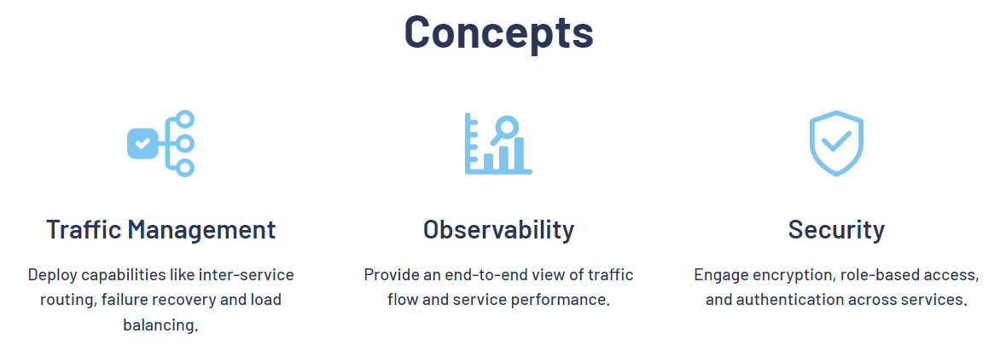
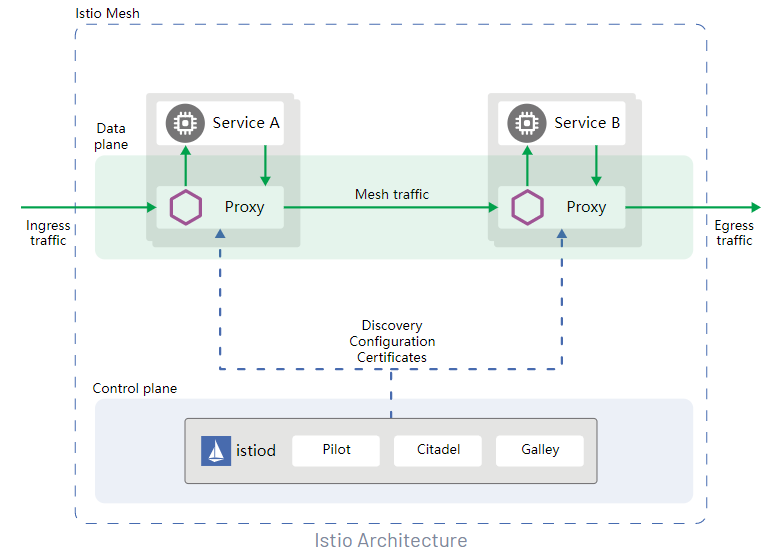
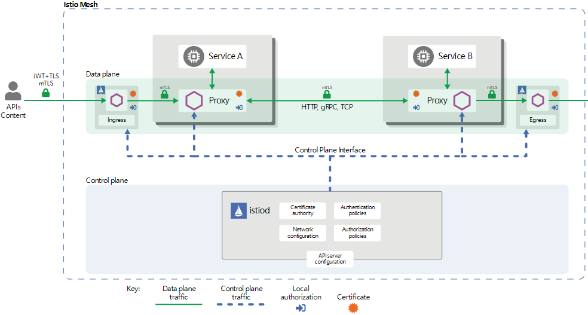
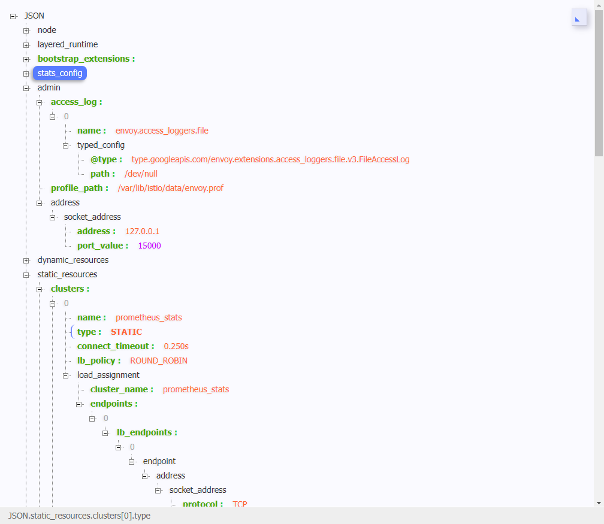
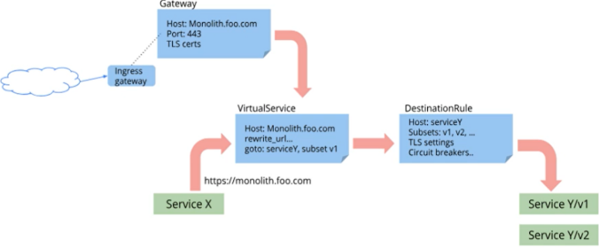
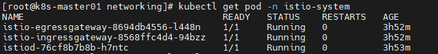
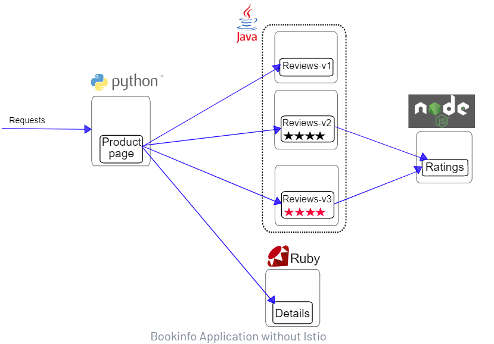
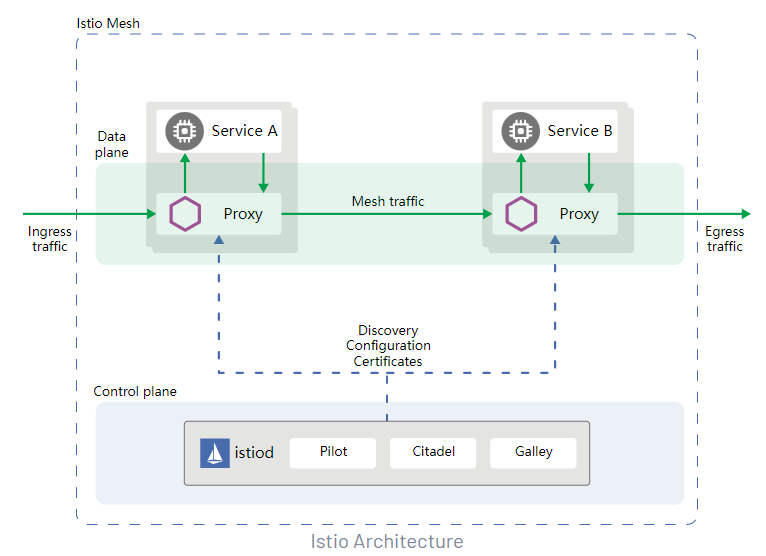

istio刨析

---

### istio 架构与设计（1.5版前）

+ Service Mesh
+ Istio 架构基础
+ Istio 基本概念
+ Istio & Kuberneets：架构结合
+ 运行Istio集群（新版）


Kubernetes

+ k8s时提供平台基础设施层强大的容器编排与调度能力
  + 服务部署与弹性伸缩：deployment
  + 服务拆分与服务发现：Service

> k8s提供负载上了整个声明周期的管理，从创建到弹性伸缩、故障重启都可以做，这是编排调度的能力

+ Kubernetes 提供简单的负载均衡
  + 负载均衡：基于ipvs或iptables的简单均衡策略机制
  + kube-proxy
  + ipvs 比iptables性能提示很少，但是对服务的治理还时比较简单的
  + 早期：微服务治理的方法：写在代码中，和服务耦合在一起给开发带来了一些麻烦，后来就想治理拆出
  + Spring Cloud：这是一个非常流行的Java微服务框架，提供了多个组件，例如服务发现、负载均衡、熔断器等。相对还时比较麻烦
  + 为了进一步的独立出来：提出了Service Mesh

Service Mesh

+ 治理能力独立（Sidecar）
+ 应用程序无感知
+ 服务通信的基础设施层

#### Istio问世

 

+ 流量管理：部署服务间路由、故障恢复和负载平衡等功能。
+ 可观察性：提供流量和服务性能的端到端视图。
+ 安全：跨服务进行加密、基于角色的访问和身份验证。

官方功能介绍：服务之间的连接、相互通信间的安全、访问控制、监控认证调用链分析等；

总结：

> 关键能力

+ 流量管理：负载均衡、动态路由、灰度发布、故障注入等
+ 可观察性：调用链、监控、访问日志
+ 策略执行：限流、ACL
+ 服务身份认证：认证、鉴权

> 扩展

+ 平台支持：k8s、cloud* 等等
+ 集成定制：ACL、日志、配额


==为什么需要istio==

istio 有很强的服务治理功能

在k8s上完美的补齐缺乏服务治理的小缺陷

+ 部署运维 - k8s提供了很强的：负载均衡、服务发现、扩缩容、运维、部署等
+ 服务治理 - istio 补齐了k8s的服务治理能力


#### Istio架构

https://istio.io/latest/zh/docs/ops/deployment/architecture/

Istio 服务网格从逻辑上分为**数据平面**和**控制平面**。

- **数据平面** 由一组智能代理（[Envoy](https://www.envoyproxy.io/)）组成，被部署为 Sidecar。这些代理负责协调和控制微服务之间的所有网络通信。它们还收集和报告所有网格流量的遥测数据。
- **控制平面** 管理并配置代理来进行流量路由。

下图展示了组成每个平面的不同组件：

 

以下各节概述了 Istio 的每个核心组件

Envoy

> Envoy 是用 C++ 开发的高性能代理，用于协调服务网格中所有服务的入站和出站流量。Envoy 代理是唯一与数据平面流量交互的 Istio 组件。

Envoy 代理被部署为服务的 Sidecar，在逻辑上为服务增加了 Envoy 的许多内置特性，例如：

- 动态服务发现
- 负载均衡
- TLS 终端
- HTTP/2 与 gRPC 代理
- 熔断器
- 健康检查
- 基于百分比流量分割的分阶段发布
- 故障注入
- 丰富的指标

istiod

> Istiod 提供服务发现、配置和证书管理。

Istiod 将控制流量行为的高级路由规则转换为 Envoy 特定的配置，并在运行时将其传播给 Sidecar。

可以使用 Istio [流量管理 API](https://istio.io/latest/zh/docs/concepts/traffic-management/#introducing-istio-traffic-management) 让 Istiod 重新构造 Envoy 的配置，以便对服务网格中的流量进行更精细的控制

Istiod 充当证书授权（CA），并生成证书以允许在数据平面中进行安全的 mTLS 通信。

+ Pilot 与k8s对接会whtch pod、svc等源信息，根据一些路由信息都配置到proxy，以及用户自定义的规则，实现服务之间的治理；
+ Citadel：证书生成下发；
+ Galley：用户配置的规则，对规则进行验证；


Pilot  细节

+ 主要功能：就是为proxy sidecar配置一些规则；
+ 两个部分：
  + 用户配置的规则：服务治理的规则，envoy规则进行分析最后配置到proxy（envoy中）
  + whach来的k8s源数据

Citadel：安全管理中心

https://istio.io/latest/zh/docs/concepts/security/

 


#### Istio 与 Kuberbetes：架构结合

用户通过自定义资源：CRD kube-APIserver作为统一接口配进来，istiod就可以watch这些资源（Service、Endpoints、Pod）分析后，下发到 Envoy中；

+ 每个envoy中都有全量的规则


#### Envoy 详解

性能、生产使用都是经受住了考验

+ Listeners - LDS
+ Routes - RDS
+ Clusters - CDS
+ Endpoints - EDS

Envoy配置

整个envoy的概况，listener进来，选择一个routes，再匹配到cluster，更具endpoints转发

 


#### Istio基础概念

 

1. 外部访问到 ingressgateway 需要配置一个Gateway，将服务暴露到网关
2. VirtualService：如：请求（v1，v2，v3版本）判断需要将请求发到哪个版本，规则配置
3. DestinationRule：如：流量到达版本，再向下分发是基于什么策略（v1版本多副本）轮询、最小连接、等等


VirtualService 配置示例

> 最核心的配置接口，定义指定服务的索引路由规则

```YAML
apiVersion: networking.istio.io/v1alpha3
kind: VirtualService
metadata:
  name: reviews
spec:
  hosts:
    - reviews
  http:
  - route:
    - destination:
        host: reviews
        subset: v1
      weight: 80
    - destination:
        host: reviews
        subset: v2
      weight: 20
```

destination 就是下面 destinationrule配置

> 定义的策略决定了路由处理后的流量访问策略。负载均衡设置，熔断器。TLS设置等等

+ host

```YAML
apiVersion: networking.istio.io/v1alpha3
kind: DestinationRule
metadata:
  name: reviews
spec:
  host: reviews
  trafficPolicy:
    loadBalancer:
      simple: RANDOM # 负载均衡策略
  subsets:
  - name: v1
    labels:
      version: v1
  - name: v2
    labels:
      version: v2
  - name: v3
    labels:
      version: v3
```


Gateway

> 提供外部服务访问接入，可以发布任意内部端口服务，供外部访问，配合 Virtualservice使用，使用标准的Istio规则治理

+ server
+ Selector

```YAML
apiVersion: networking.istio.io/v1alpha3
kind: Gateway
metadata:
  name: bookinfo-gateway
spec:
  selector:
    istio: ingressgateway # use istio default controller
  servers:
  - port:
      number: 80
      name: http
      protocol: HTTP
    hosts:
    - "*"
---
apiVersion: networking.istio.io/v1alpha3
kind: VirtualService
metadata:
  name: bookinfo
spec:
  hosts:
  - "*"
  gateways:
  - bookinfo-gateway
  http:
  - match:
    - uri:
        exact: /productpage
    - uri:
        prefix: /static
    - uri:
        exact: /login
    - uri:
        exact: /logout
    - uri:
        prefix: /api/v1/products
    route:
    - destination:
        host: productpage
        port:
          number: 9080
---
apiVersion: networking.istio.io/v1alpha3
kind: DestinationRule
metadata:
  name: productpage
spec:
  host: productpage
  subsets:
  - name: v1
    labels:
      version: v1
```

> 扩展：在Istio 1.11中，ServiceEntry已被标记为过时，这意味着在未来的版本中可能会弃用


#### 基于K8s运行Istio集群

```yaml
1.下载istio包
2.减压，mv istioctl
https://istio.io/latest/zh/docs/setup/install/operator/
```

  


图形化安装：

```YAML
kubectl create -f samples/addons/prometheus.yaml -f samples/addons/grafana.yaml
kubectl create -f samples/addons/kiali.yaml
# 调用链
kubectl create -f samples/addons/jaeger.yaml
```

> 开启自动注入,

经典案例

 


---


### Istio Pilot服务发现

> 非常重要的组件

+ Istio架构回顾&Pilot介绍
+ Istio 服务发现
+ IStio服务配置
+ Istio服务发现&规则管理与K8s结合
+ ShowCase

 

数据面和控制面，数据面所有的治理都是通过proxy

proxy主要受控制面的管理

> 接下来主要是 Pilot

Polit 和数据面怎么交互？怎么完成服务发现和配置管理？

Pilot功能

+ 服务发现
+ 服务配置

服务发现基本原理：


1430462586@qq.com


