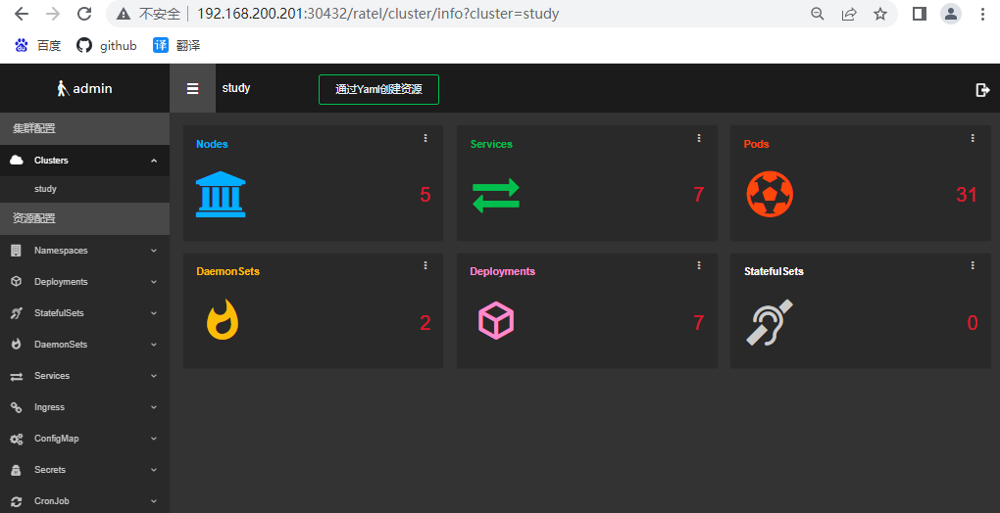

- [1.1 安装](#11-安装)
- [1.2 创建RBAC](#12-创建rbac)
- [1.3  部署ratel](#13--部署ratel)
- [1.4 Service和Ingress配置](#14-service和ingress配置)

https://github.com/dotbalo/ratel-doc

图形化的管理资源

用于更方便创建、管理、更新Kubernetes集群中的资源，所有的资源配置都可以通过Web界面进行配置、创建， 无需管理复杂的yaml或json文件，即可轻松实现Kubernetes的资源管理，

:deciduous_tree: 用于

+ 简化配置难度
+ 管理Kubernetes的Deployment、DaemonSet、StatefulSet、Service、Ingress、Pods、Nodes、CronJob等。
+ 管理Kubernetes的Role、ClusterRole、Rolebinding、ClusterRoleBinding、Secret、ConfigMap、PV、PVC等。
+  同时具备了一些常用的功能，比如跨集群资源复制、一键项目迁移、图形化资源编辑、资源一键回滚及更新、一键式用户权限管理等
+ 并且具备K8s不具备的功能，比如ConfigMap和Secret备份功能。


#### 1.1 安装

 ratel配置文件servers.yaml内容如下

复制：set paste

```SH
- serverName: 'study'
  serverAddress: 'https://192.168.200.236:16443'
  #serverAdminUser: 'xxx'
  #serverAdminPassword: 'xxx#'
  serverAdminToken: 'null'
  serverDashboardUrl: "https://192.168.200.204:32702/#"
  production: 'false'
  kubeConfigPath: "/mnt/study.config"
  harborConfig: "HarborUrl, HarborUsername, HarborPassword, HarborEmail"
```

:deciduous_tree: serverAddress

```SH
# kubectl cluster-info
Kubernetes control plane is running at https://192.168.200.236:16443
CoreDNS is running at https://192.168.200.236:16443/api/v1/namespaces/kube-system/services/kube-dns:dns/proxy
```

 :deciduous_tree:kubeConfigPath

```SH
# ls -a ~/.kube/config
/root/.kube/config

# ls /etc/kubernetes/admin.conf
/etc/kubernetes/admin.conf
# cp ~/.kube/config /root/project/ratel/study.config
```

 :deciduous_tree:创建Secret:

```sh
# kubectl create secret generic ratel-config --from-file=study.config --from-file=servers.yaml -n kube-system
```


#### 1.2 创建RBAC

:deciduous_tree:创建权限管理namespace

```
kubectl create ns kube-users
```

:deciduous_tree:然后添加如下的ClusterroleBinding

vim ratel-rbac.yaml

```yaml
apiVersion: v1
items:
- apiVersion: rbac.authorization.k8s.io/v1
  kind: ClusterRole
  metadata:
    annotations:
      rbac.authorization.kubernetes.io/autoupdate: "true"
    labels:
      kubernetes.io/bootstrapping: rbac-defaults
      rbac.authorization.k8s.io/aggregate-to-edit: "true"
    name: ratel-namespace-readonly
  rules:
  - apiGroups:
    - ""
    resources:
    - namespaces
    verbs:
    - get
    - list
    - watch
  - apiGroups:
    - metrics.k8s.io
    resources:
    - pods
    verbs:
    - get
    - list
    - watch
- apiVersion: rbac.authorization.k8s.io/v1
  kind: ClusterRole
  metadata:
    name: ratel-pod-delete
  rules:
  - apiGroups:
    - ""
    resources:
    - pods
    verbs:
    - get
    - list
    - delete
- apiVersion: rbac.authorization.k8s.io/v1
  kind: ClusterRole
  metadata:
    name: ratel-pod-exec
  rules:
  - apiGroups:
    - ""
    resources:
    - pods
    - pods/log
    verbs:
    - get
    - list
  - apiGroups:
    - ""
    resources:
    - pods/exec
    verbs:
    - create
- apiVersion: rbac.authorization.k8s.io/v1
  kind: ClusterRole
  metadata:
    annotations:
      rbac.authorization.kubernetes.io/autoupdate: "true"
    name: ratel-resource-edit
  rules:
  - apiGroups:
    - ""
    resources:
    - configmaps
    - persistentvolumeclaims
    - services
    - services/proxy
    verbs:
    - patch
    - update
  - apiGroups:
    - apps
    resources:
    - daemonsets
    - deployments
    - deployments/rollback
    - deployments/scale
    - statefulsets
    - statefulsets/scale
    verbs:
    - patch
    - update
  - apiGroups:
    - autoscaling
    resources:
    - horizontalpodautoscalers
    verbs:
    - patch
    - update
  - apiGroups:
    - batch
    resources:
    - cronjobs
    - jobs
    verbs:
    - patch
    - update
  - apiGroups:
    - extensions
    resources:
    - daemonsets
    - deployments
    - deployments/rollback
    - deployments/scale
    - ingresses
    - networkpolicies
    verbs:
    - patch
    - update
  - apiGroups:
    - networking.k8s.io
    resources:
    - ingresses
    - networkpolicies
    verbs:
    - patch
    - update
- apiVersion: rbac.authorization.k8s.io/v1
  kind: ClusterRole
  metadata:
    name: ratel-resource-readonly
  rules:
  - apiGroups:
    - ""
    resources:
    - configmaps
    - endpoints
    - persistentvolumeclaims
    - pods
    - replicationcontrollers
    - replicationcontrollers/scale
    - serviceaccounts
    - services
    verbs:
    - get
    - list
    - watch
  - apiGroups:
    - ""
    resources:
    - bindings
    - events
    - limitranges
    - namespaces/status
    - pods/log
    - pods/status
    - replicationcontrollers/status
    - resourcequotas
    - resourcequotas/status
    verbs:
    - get
    - list
    - watch
  - apiGroups:
    - ""
    resources:
    - namespaces
    verbs:
    - get
    - list
    - watch
  - apiGroups:
    - apps
    resources:
    - controllerrevisions
    - daemonsets
    - deployments
    - deployments/scale
    - replicasets
    - replicasets/scale
    - statefulsets
    - statefulsets/scale
    verbs:
    - get
    - list
    - watch
  - apiGroups:
    - autoscaling
    resources:
    - horizontalpodautoscalers
    verbs:
    - get
    - list
    - watch
  - apiGroups:
    - batch
    resources:
    - cronjobs
    - jobs
    verbs:
    - get
    - list
    - watch
  - apiGroups:
    - extensions
    resources:
    - daemonsets
    - deployments
    - deployments/scale
    - ingresses
    - networkpolicies
    - replicasets
    - replicasets/scale
    - replicationcontrollers/scale
    verbs:
    - get
    - list
    - watch
  - apiGroups:
    - policy
    resources:
    - poddisruptionbudgets
    verbs:
    - get
    - list
    - watch
  - apiGroups:
    - networking.k8s.io
    resources:
    - networkpolicies
    - ingresses
    verbs:
    - get
    - list
    - watch
  - apiGroups:
    - metrics.k8s.io
    resources:
    - pods
    verbs:
    - get
    - list
    - watch
kind: List
metadata:
  resourceVersion: ""
  selfLink: ""
```

kubectl create -f ratel-rbac.yaml

vim ratel-rbac-binding.yaml

```yaml
apiVersion: rbac.authorization.k8s.io/v1
kind: ClusterRoleBinding
metadata:
  name: ratel-namespace-readonly-sa
roleRef:
  apiGroup: rbac.authorization.k8s.io
  kind: ClusterRole
  name: ratel-namespace-readonly
subjects:
- apiGroup: rbac.authorization.k8s.io
  kind: Group
  name: system:serviceaccounts:kube-users
```

kubectl create -f ratel-rbac-binding.yaml


#### 1.3  部署ratel

ratel的部署文件内容如下:

:deciduous_tree: 需要更改的内容如下:

+ ProRunMode: 区别在于dev模式打印的是debug日志, 其他模式是info级别的日志, 实际使用时应该配置为非dev
+ ADMIN_USERNAME: ratel自己的管理员账号
+ ADMIN_PASSWORD: ratel自己的管理员密码
+ 实际使用时账号密码应满足复杂性要求,因为ratel可以直接操作所有配置的资源。
+ 其他无需配置, 端口配置暂不支持。

```yaml
        apiVersion: apps/v1
        kind: Deployment
        metadata:
          labels:
            app: ratel
          name: ratel
          namespace: kube-system
        spec:
          replicas: 1
          selector:
            matchLabels:
              app: ratel
          strategy:
            rollingUpdate:
              maxSurge: 1
              maxUnavailable: 0
            type: RollingUpdate
          template:
            metadata:
              creationTimestamp: null
              labels:
                app: ratel
            spec:
              containers:
                - command:
                    - sh
                    - -c
                    - ./ratel -c /mnt/servers.yaml
                  env:
                    - name: TZ
                      value: Asia/Shanghai
                    - name: LANG
                      value: C.UTF-8
                    - name: ProRunMode
                      value: prod
                    - name: ADMIN_USERNAME
                      value: admin
                    - name: ADMIN_PASSWORD
                      value: admin
                  image: registry.cn-beijing.aliyuncs.com/dotbalo/ratel:latest
                  imagePullPolicy: Always
                  livenessProbe:
                    failureThreshold: 2
                    initialDelaySeconds: 10
                    periodSeconds: 60
                    successThreshold: 1
                    tcpSocket:
                      port: 8888
                    timeoutSeconds: 2
                  name: ratel
                  ports:
                    - containerPort: 8888
                      name: web
                      protocol: TCP
                  readinessProbe:
                    failureThreshold: 2
                    initialDelaySeconds: 10
                    periodSeconds: 60
                    successThreshold: 1
                    tcpSocket:
                      port: 8888
                    timeoutSeconds: 2
                  resources:
                    limits:
                      cpu: 500m
                      memory: 512Mi
                    requests:
                      cpu: 500m
                      memory: 512Mi
                  volumeMounts:
                    - mountPath: /mnt
                      name: ratel-config
              dnsPolicy: ClusterFirst
              imagePullSecrets:
                - name: myregistrykey
              restartPolicy: Always
              schedulerName: default-scheduler
              securityContext: {}
              terminationGracePeriodSeconds: 30
              volumes:
                - name: ratel-config
                  secret:
                    defaultMode: 420
                    secretName: ratel-config
```

#### 1.4 Service和Ingress配置

注意：如果没有安装ingress controller，需要把type: ClusterIP改成type: NodePort，然后通过主机IP+Port进行访问

```yaml
#创建ratel Service的文件如下:
        apiVersion: v1
        kind: Service
        metadata:
          labels:
            app: ratel
          name: ratel
          namespace: kube-system
        spec:
          ports:
            - name: container-1-web-1
              port: 8888
              protocol: TCP
              targetPort: 8888
          selector:
            app: ratel
          type: NodePort

#创建ratel Ingress:
        apiVersion: extensions/v1beta1
        kind: Ingress
        metadata:
          name: ratel
          namespace: kube-system
        spec:
          rules:
          - host: krm.test.com
            http:
              paths:
              - backend:
                  serviceName: ratel
                  servicePort: 8888
                path: /
```

创建完成：

