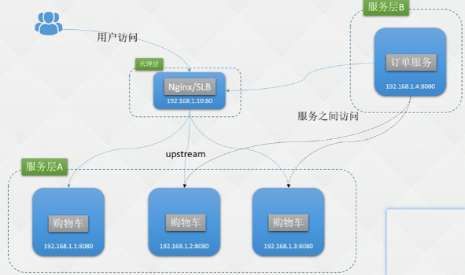
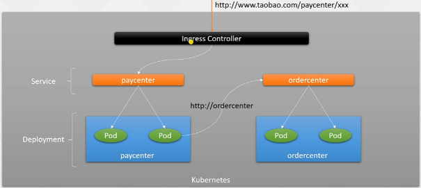
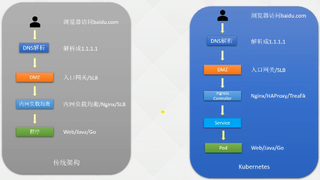
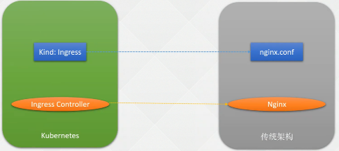

- [Service](#service)
  - [1.1 在K8s上如何发布服务](#11-在k8s上如何发布服务)
  - [1.2 Lable](#12-lable)
    - [1.2.1 基本概念](#121-基本概念)
    - [1.2.2 定义一个Lable](#122-定义一个lable)
  - [1.3 Selector](#13-selector)
    - [1.3.1 Selector选择器](#131-selector选择器)
  - [1.4 定义 Service](#14-定义-service)
  - [1.5 Service 类型](#15-service-类型)
  - [1.6 NodePort](#16-nodeport)
  - [1.7 使用Service代理K8s外部的服务](#17-使用service代理k8s外部的服务)
  - [1.8 ExternalName Service](#18-externalname-service)
  - [1.9 多端口Service](#19-多端口service)
- [Ingress](#ingress)
  - [2.1 Ingress 概念](#21-ingress-概念)
  - [2.2 ingress Controller](#22-ingress-controller)
  - [2.3 使用域名发布k8s服务](#23-使用域名发布k8s服务)
  - [2.4 ingress特例](#24-ingress特例)
  - [2.5 Ingress V1和v1bata1e区别](#25-ingress-v1和v1bata1e区别)

### Service

---

#### 1.1 在K8s上如何发布服务 ####

​		在实际使用过程中服务的发布是一项非常重要的一项，服务无论部署在虚拟机、容器、k8s也好，最终的目标就是让用户去使用它！

:deciduous_tree: 在K8s如何发布服务

这一章探讨的问题：

+ 假设部署了10个副本的deployment分布在不同的节点上，其他人如何访问部署的服务？

1> 传统架构：裸机或者虚拟机

  


:deciduous_tree: 对外：（南北流量）

​	肯定不会将服务器直接公布到公网上，一般会在前面加一个Nginx（upsteram）或者LB。在公有云的话会使用LB代理到后端服务器上！

+ LB 通过路由指到后端服务

​	负载均衡器：有一个IP地址，通过域名的方式访问到后端的服务器上，将域名解析到LB上，通过路由策略就能找到后端服务


:deciduous_tree: 对内：（东西流量）

服务之间的访问：

1. 直接配置IP端口
2. 通过LB访问（内部域名）
3. 服务注册发现

> 此章重点：研究k8s的南北流量和东西流量


:deciduous_tree: 东西流量

 

+ service：代理的一种方式，通过service访问到Pod上，将自己的服务代理到相同的Pod上，通过Service名称访问Pod，对外的名称不变;
+ Pod：的IP地址是变化的（重现等），不能使用Pod ip对外发布服务;

:deciduous_tree: 南北流量

+ 外部 网关 service Pod
+ ingress Controller （配置域名代理到service上。 像nginx一样。内部也是使用nginx实现的,可以配置域名）

对内service、对外ingress


#### 1.2 Lable ####

决定了Service能否使用！

##### 1.2.1 基本概念 #####

:deciduous_tree: Label：标签

+ 对k8s的一些对象分组（Pod、节点等）；
+ key：value 格式 为不同资源添加标签
+ 区分同样的资源不同的分组

:deciduous_tree: Selector：标签选择器

+ 根据资源的标签查询出精确的对象信息

```yaml
apiVersion: apps/v1
kind: Deployment
metadata:
  labels:    # deployment 的标签
    app: nginx-server-hpa
  name: nginx-server-hpa
spec:
  replicas: 1
  selector:   # 标签选择器（区分deployment管理的Pod是谁）
    matchLabels:
      app: nginx-server-hpa
  template:   # 定义Pod的标签
    metadata:
      labels:
        app: nginx-server-hpa
    spec:
      containers:
      - image: docker.io/library/nginx
        name: nginx
        ports:
        - containerPort: 80
          name: nginx
          protocol: TCP
        resources:
          requests:
            cpu: 10m
      restartPolicy: Always
```

Selector：过滤出标签

```SH
# kubectl get node -l disktype=ssd
NAME         STATUS   ROLES    AGE     VERSION
k8s-node01   Ready    <none>   7d21h   v1.24.8
```

资源都是通过标签去区分的！！！！

```SH
# kubectl get node --show-labels
```

使用标签对资源进行一个逻辑上的划分


##### 1.2.2 定义一个Lable #####

注意：在添加删除标签的时候，一般情况不要对Pod随便更改（可能出问题），最多的改node标签！

:deciduous_tree: 案例：

假设k8s-node02 对接外部服务

:taco: 节点打标签：用于固定Pod

+ nodeSelector

为k8s-node02都打一个标签：gpu=true //最好不要用数字，达不到想要的效果

```yaml
      nodeSelector:  # 关键参数
        gpu: "true"
```

```sh
# kubectl label nodes k8s-node02 k8s-node01 gpu=true
node/k8s-node02 labeled
# kubectl get node -l gpu=true
NAME         STATUS   ROLES    AGE     VERSION
k8s-node02   Ready    <none>   7d21h   v1.24.8
```

:taco: 将 Pod手动指定到节点上

+ 为GPU节点打上标签，GPU的资源部署到 标签gpu的节点

```yaml
apiVersion: apps/v1
kind: Deployment
metadata:
  labels:
    app: nginx
  name: nginx
spec:
  replicas: 3
  selector:
    matchLabels:
      app: nginx
  template:
    metadata:
      labels:
        app: nginx
    spec:
      containers:
      - image: nginx
        imagePullPolicy: IfNotPresent
        name: nginx
        resources:
          requests:
            cpu: 10m
        ports:
        - containerPort: 80
          name: nginx
      nodeSelector:  # 关键参数
        gpu: "true"
```

创建Pod：达到效果：将Pod固定在某些节点上：

```SH
# kubectl get pod -owide
NAME                     READY   STATUS    RESTARTS   AGE   IP              NODE         NOMINATED NODE   READINESS GATES
nginx-7dbf88bdb7-bk8pr   1/1     Running   0          27s   172.17.125.25   k8s-node01   <none>           <none>
nginx-7dbf88bdb7-nbkbr   1/1     Running   0          27s   172.27.14.213   k8s-node02   <none>           <none>
nginx-7dbf88bdb7-w8shp   1/1     Running   0          27s   172.27.14.212   k8s-node02   <none>           <none>
```

:deciduous_tree: 删除标签

不直接影响Pod，Pod重建后无法创建

```SH
# kubectl label nodes k8s-node02 k8s-node01  gpu-
# kubectl get nodes -l gpt=true
No resources found

# kubectl delete pod nginx-7dbf88bdb7-bk8pr
# kubectl get pod
NAME                     READY   STATUS    RESTARTS   AGE
nginx-7dbf88bdb7-gz9vf   0/1     Pending   0          3s
nginx-7dbf88bdb7-nbkbr   1/1     Running   0          6m56s
nginx-7dbf88bdb7-w8shp   1/1     Running   0          6m56s


# Warning  FailedScheduling  47s   default-scheduler  0/5 nodes are available: 5 node(s) didn't match Pod's node affinity/selector. preemption: 0/5 nodes are available: 5 Preemption is not helpful for scheduling.
报错：没有可用节点
```


#### 1.3 Selector

##### 1.3.1 Selector选择器 #####

:deciduous_tree: 为节点打标签

+ role=master和node
+ master02：gpu

```sh
# kubectl label nodes k8s-node01 k8s-node02 role=node

# kubectl label nodes k8s-master01 k8s-master02 role=master

# kubectl label node k8s-master02 gpu=true
```


:deciduous_tree:Selector

--show-labels 选择匹配

+ gpu!=true  过滤gpu不等于true
+ 根据需求过滤！

```sh
# kubectl get node -l 'role in (node,master)' --show-labels | awk -F" " '{print $1}'
NAME
k8s-master01
k8s-master02
k8s-node01
k8s-node02

# kubectl get node -l 'gpu!=true,role in (node,master)'  | awk -F" " '{print $1}'
NAME
k8s-master01
k8s-node01
k8s-node02
```


:deciduous_tree: 修改标签

```sh
# kubectl label nodes k8s-master02 gpu=false --overwrite

批量修改
# kubectl label nodes -l gpu gpu=true --overwrite
```

:deciduous_tree: 查看符合标签的ndoe

```SH
# kubectl get nodes -l gpu=true
NAME           STATUS   ROLES           AGE     VERSION
k8s-master02   Ready    control-plane   7d23h   v1.24.8
```

:deciduous_tree: 删除标签：减号

```sh
# kubectl label nodes k8s-master02 gpu-
node/k8s-node02 unlabeled

# 全部删掉：
kubectl label node -l gpu gpu-
```


#### 1.4 定义 Service ####

明确一点：每个Pod在创建都有一个Ip地址，但是这些IP地址不总是稳定和可依赖的

+ Pod的IP确实可以直接被我们访问！但是，Pod重建后IP地址回变化

:deciduous_tree: 导致一个问题：

+ 在k8s集群，一组Pod（如后端）为其他Pod（如前端）提供服务，如果使用Pod IP通信，在pod重建后，将无法再进行通信。

> 不能使用Pod IP通信
>

于是：

+ k8s引出了Service抽象概念：逻辑上的一组Pod，即一种可以访问Pod的策略，这一组Pod可以被Service通过标签选择器访问，之后使用Service访问！
+ 命名空间隔离
+ 生产环境中不推荐使用svc ip，虽然不经常变化，但是在重建后IP就会改变，所以通过svc的名称！

:deciduous_tree: Service名称

+ 利用kube-dns解析的，所以宿主机无法直接访问svc的名称，因为宿主机dns不是kube-dns

在没有使用任何的注册中心情况下：需要配置一个Servcie

> 注意一点：service 标签为Pod的标签，不是deployment的标签
>

```yaml
apiVersion: v1
kind: Service
metadata:
  labels:
    app: nginx
  name: nginx  #名称随意
  namespace: default
spec:
  ports:
  - name: nginx	
    port: 80	  # service自己端口号，随便改65535直接，推荐统一
    protocol: TCP 
    targetPort: 80 # 容器的端口号，如果在容器之间端口的name字段，这里也可以是Name，无论Pod端口怎么变都不影响
  selector:
    app: nginx  # pod的标签
  sessionAffinity: None
  type: ClusterIP
```

Service 的 80端口代理到了 容器的 80 端口

:deciduous_tree: 创建查看

```SH
# kubectl get svc
NAME         TYPE        CLUSTER-IP       EXTERNAL-IP   PORT(S)   AGE
kubernetes   ClusterIP   10.103.0.1       <none>        443/TCP   8d
nginx        ClusterIP   10.103.195.166   <none>        80/TCP    9s
```

假如Pod更新了：

```yaml
#  kubectl delete po -l app=nginx
pod "nginx-7dbf88bdb7-gz9vf" deleted
pod "nginx-7dbf88bdb7-nbkbr" deleted
pod "nginx-7dbf88bdb7-w8shp" deleted
```

Pod重建，但是使用Service IP 访问ok

访问到哪一个Pod：轮询的方式

```sh
# curl 10.103.195.166
# kubectl logs -f nginx-7dbf88bdb7-l272h
......
172.25.244.192 - - [14/Dec/2022:04:06:36 +0000] "GET / HTTP/1.1" 200 615 "-" "curl/7.29.0" "-"
```

:deciduous_tree: Service 名称

+ 宿主机没有配置kube-dns所以无法访问；
+ Pod容器内可以访问

 ```SH
 # kubectl exec -ti nginx-7dbf88bdb7-l272h -- bash
 root@nginx-7dbf88bdb7-l272h:/# curl -I nginx
 HTTP/1.1 200 OK
 Server: nginx/1.23.3
 ```

服务直接使用Service 名称就好了！！

注意：无法解析其他命名空间下的Service Name

+ 需要访问：wget https://metrics-server.kube-system


#### 1.5 Service 类型 ####

:deciduous_tree: Type 服务类型

Kubernetes Service Type（服务类型）主要包括以下几种： 

1. ClusterIP：在集群内部使用，默认值，使用最多，只能从集群中访问。 
2. NodePort：在所有安装了 Kube-Proxy 的节点上打开一个端口，此端口可以代理至后端 Pod，可以通过 NodePort 从集群外部访问集群内的服务，格式为 NodeIP:NodePort。 
   + 比如再服务器装了个Nginx 80端口（netstat -lntp），通过宿主机的80端口访问nginx
3. LoadBalancer：使用云提供商的负载均衡器公开服务，成本较高。 
4. ExternalName：通过返回定义的 CNAME 别名，没有设置任何类型的代理，需要 1.7 或 更高版本 kube-dns 支持。
   + 场景：后端服务器迁移到k8s,后端服务器连接了不同的组件后端、

```YAML
apiVersion: v1
kind: Service
metadata:
  labels:
    app: nginx
  name: nginx  #名称随意
  namespace: default
spec:
  ports:
  - name: nginx
    port: 80
    protocol: TCP # service自己端口号，随便改65535直接，推荐统一
    targetPort: 80 # 容器的端口号，如果在容器之间端口的name字段，这里也可以是Name
  selector:
    app: nginx  # pod的标签
  sessionAffinity: None
  type: ClusterIP  # SVC类型，只能在集群内部使用
```


#### 1.6 NodePort ####

类型改为：NodePort

```yaml
# kubectl edit svc nginx
type: NodePort
```

```SH
# kubectl get svc
NAME         TYPE        CLUSTER-IP       EXTERNAL-IP   PORT(S)        AGE
nginx        NodePort    10.103.195.166   <none>        80:30715/TCP   3h12m
```

+ 30715代理到了service的80，service的80代理到Pod的80

:deciduous_tree: 宿主机访问：ip+端口

+ 任意一个宿主机

+ http://192.168.200.201:30715/

通过service的 30715 就可以访问Pod


**端口号来源**

   	如果将 Service 的 type 字段设置为 NodePort，则 Kubernetes 将从--service-node-port-range 参 数指定的范围（默认为 30000-32767）中自动分配端口，也可以手动指定 NodePort，创建该 Service 后，集群每个节点都将暴露一个端口，通过某个宿主机的 IP+端口即可访问到后端的应用。

指定一个端口：一般不推荐，避免与宿主机端口冲突！

 

####  1.7 使用Service代理K8s外部的服务

例如：我们有一个java程序，有很多的配置文件。只是连接的中间件的地址不一样，其他的都一样。

简化配置：service指向外部中间件，无论什么环境Pod都可以只写一个配置文件，维护的application就只有一个

:deciduous_tree: 使用场景 

1. 希望在生产环境中使用某个固定的名称而非 IP 地址访问外部的中间件服务； 
2. 希望 Service 指向另一个 Namespace 中或其他集群中的服务； 
3. 正在将工作负载转移到 Kubernetes 集群，但是一部分服务仍运行在 Kubernetes 集群 之外的 backend。


LoadBalancer：IP地址

ExternalName：域名

:warning: 注意：代理到外部就不需要配置selector

使用 ClusterIP 和 NodePor t回自动创建svc会创建一个 同名的 endpoint 

+ 缩写 ep
+ 存储了所管理的所以Pod的Ip地址端口

```sh
# kubectl get endpoints
# kubectl get ep
```


:deciduous_tree: 可以被访问的公网IP（测试）

```SH
# curl 140.205.94.189
```

如果代理外部的服务，所以selector就不要写了，创建一个同名的endpoints

```yaml
apiVersion: v1
kind: Service
metadata:
  labels:
    app: nginx-svc-external
  name: nginx-svc-external # 一定要与service名称相同
  namespace: default
spec:
  ports:
  - name: http
    port: 80
    protocol: TCP
    targetPort: 80
  type: ClusterIP
---
apiVersion: v1
kind: Endpoints
metadata:
  labels:
    app: nginx-svc-external
  name: nginx-svc-external
subsets:
- addresses:
  - ip: 140.205.94.189
  ports:
  - name: http
    port: 80
    protocol: TCP
```

```sh
# kubectl get svc
NAME                 TYPE        CLUSTER-IP       EXTERNAL-IP   PORT(S)        AGE
nginx-svc-external   ClusterIP   10.103.26.130    <none>        80/TCP         5s
# kubectl get ep
NAME                 ENDPOINTS                                                        AGE
nginx-svc-external   140.205.94.189:80 
```


:deciduous_tree: 访问测试：

```SH
# curl 10.103.26.130
# curl 140.205.94.189:80
```

使用service代理外部服务：用的很多！！

注意：Endpoint IP 地址不能是 loopback（127.0.0.0/8）、link-local（169.254.0.0/16）或者 linklocal 多播地址（224.0.0.0/24）。

访问没有 Selector 的 Service 与有 Selector 的 Service 的原理相同，通过 Service 名称即可访问，请求将被路由到用户定义的 Endpoint。

```SH
# kubectl exec -ti nginx-7dbf88bdb7-l272h -- bash
root@nginx-7dbf88bdb7-l272h:/# curl nginx-svc-externa
```


#### 1.8 ExternalName Service

ExternalName Service 是 Service 的特例，它没有 Selector，也没有定义任何端口和 Endpoint，

+ 通过返回该外部服务的别名来提供服务。

​	比如可以定义一个 Service，后端设置为一个外部域名，这样通过 Service 的名称即可访问到 该域名。使用 nslookup 解析以下文件定义的 Service，集群的 DNS 服务将返回一个值为 my.database.example.com 的 CNAME 记录：

```yaml
apiVersion: v1
kind: Service
metadata:
  name: external-service
  namespace: default
spec:
  externalName: www.baidu.com
  type: ExternalName
```

```SH
# kubectl create -f svc-externalname.yaml

# kubectl get svc
NAME                 TYPE           CLUSTER-IP      EXTERNAL-IP     PORT(S)   AGE
exyernal-service     ExternalName   <none>          www.baidu.com   <none>    4s

# curl exyernal-service
curl: (6) Could not resolve host: exyernal-service; Unknown error
# kubectl exec -ti nginx-657b987f44-45hv9 -- sh
/ # curl exyernal-servicekube
/ # curl -kv  exyernal-service
*   Trying 14.215.177.39:80...
* Connected to exyernal-service (14.215.177.39) port 80 (#0)
```

:deciduous_tree: nslookup解析

````SH
/ # nslookup exyernal-service
Server:         10.103.0.10
Address:        10.103.0.10:53
````

注意：exyernal-service.default.svc.cluster.local

可以将  externalName: www.baidu.com 改为其他命名空间的svcname.namespace


:deciduous_tree: 真实用途

举个例子：

在public-server命名空间下创建了很多个服务，比如rabbit、mysql等

+ 如果没配置 ExternalName ：通过mysql.public-server:3306方式访问（如果mysql将来换个地址和命名空间还需要改）
+ 自己命名空间下创建一个mysql的svc指向mysql.public-server:3306，无论mysql怎么去改，mysql是不用动的


#### 1.9 多端口Service ####

例如将 Service 的 80 端口代理到后端的 9376,443 端口代理到后端的 9377：

```yaml
apiVersion: v1
kind: Service
metadata:
  labels:
    app: nginx
  name: nginx
  namespace: default
spec:
  ports:
  - name: nginx:1.23  # name不能重复
    port: 80
    protocol: TCP
    targetPort: 80
  - name: http
    port: 8080
    protocol: TCP
    targetPort: 8080
  selector:
    app: nginx
  type: ClusterIP
```

:deciduous_tree: 注意：name不能一样

原生的服务也有很多端口的：

```yaml
# kubectl get svc -n kube-system kube-dns
NAME       TYPE        CLUSTER-IP    EXTERNAL-IP   PORT(S)                  AGE
kube-dns   ClusterIP   10.103.0.10   <none>        53/UDP,53/TCP,9153/TCP   49d
# kubectl get svc -n kube-system kube-dns -oyaml | grep -A 10 ports:
  ports:
  - name: dns
    port: 53
    protocol: UDP
    targetPort: 53
  - name: dns-tcp
    port: 53
    protocol: TCP
    targetPort: 53
  - name: metrics
    port: 9153
```


### Ingress

---

#### 2.1 Ingress 概念 ####

在Kubernetesv 1.1版中添加的Ingress用于从集群外部到集群内部Service的HTTP和HTTPS路由，流量从Internet到Ingress再到Services最后到Pod上，

+ 不推荐使用nodeport发布服务：原因是宿主机挂了就无法访问

通常情况下，Ingress部署在所有的Node节点上。

:deciduous_tree: ingress 为 k8s集群中的服务提供了入口

​	Ingress可以配置提供服务外部访问的URL、负载均衡、终止SSL，并提供基于域名的虚拟主机。但Ingress不会暴露任意端口或协议。

+ 前提：在通过Service也可以发布:nodeport去暴露一些端口号，可以代理到k8s的内部服务，实现了服务发布的一种方式；
+ 为何还要使用ingress
  1. nodeport性能一直存在争议，在Service多的时候性能急剧下降，或者成百上千的服务管理它的端口特别麻烦，既然有了K8s这个平台了就不要使用上个世纪的架构了。我们不可能再去外部维护一个Nginx去代理到K8s的nodeport上面。
  2. 所以引入了一个Ingerss的概念：可以再K8s内部实现一个7层或四层的代理，实现端口代理、域名的发布方式；主要是域名的发布方式，再后期时非常常用的，来通过一个域名来发布我们的服务。
  3. 通俗来讲，ingress和之前提到的Service、Deployment，也是一个k8s的资源类型，ingress用于实现用域名的方式访问k8s内部应用
  4. 通过 K8s官方维护的一个ingress，内部为Nginx+openrester实现的一个ingress的功能，
     + nginx维护的叫：nginx ingress
     + k8s维护的：ingress nginx（k8s的概念版本更新很快，ingress跟着更新，第三方可能没有k8s更新的快）

:deciduous_tree: 传统：我们部署一个应用到宿主机，启动这个应用，应用暴露一个端口号，可以通过宿主机和端口号去访问。

  	不可能让客户通过IP+端口去访问,体验差、IP可能变更，一般情况在宿主机的前面会加一个Nginx或者其他的代理工具。然后去配置一个域名反代到宿主机上。（域名厂商买一个，解析到入口的反代上）。

:deciduous_tree: 生产环境中

​		首先使用容器部署一个应用之后呢，这个容器里面是定义了程序的启动方式，容器一旦启动程序就会启动。容器中就会暴露一个端口号会启动一个进程监听这个端口号。再通过配置一个Service来代理到Pod上，Service可以用作服务之间的访问

+ 在Service上加一层Ingress,在ingress上配置域名，通过ingress所在的宿主机和端口号把这个域名解析到我们的宿主机上，我们就可以通过这个域名去访问到我们的服务了，在有ingress之后，ingress也是在k8s内部
+ 公司入口F5、或者LVS、阿里云SLB、腾讯云华为云的ELB，入口的反代再到Ingress。ELB代理到ingress的80/443端口，之后将购买的域名解析到ELB上。再通过运行代理到ingress - SVC - 后端 《这就实现了服务发布的方式》。

虽然经过的层很多，但是是基于IPVS内核级的转发，所以比较快。在今后可能使用一个叫EBPF的东西，速度可能更快，不要关系速度

Ingress带来的好处：

1. 不需要维护很多的端口，可以把所有的Service（有自己的IP，都使用一个端口不会冲突）都使用一个端口如80
2. 只需要将域名代理到指定Service的80端口就可以实现

Ingress为Kubernetes集群中的服务提供了入口

+ 可以提供负载均衡、SSL终止和基于名称的虚拟主机，
+ 在生产环境中常用的Ingress有Treafik、Nginx、HAProxy、Istio等。
+ 最佳方式：通过域名的方式 nginx


:deciduous_tree: 使用ingress发布服务的流程，如下：

传统架构 vs k8s

ingress Controlet充当了在传统架构中的负载均衡器的角色！

   


:warning: 不推荐使用NotPort部署服务

问题：如果很多的service都配置notport，端口号改起来非常麻烦。


东西流量：使用servie

南北流量：NotPort（不推荐）、推荐Ingress


ingress和ingress Controller

 

区别：

传统架构中，一个服务器搭建了nginx程序，配置文件nginx.conf（配置了域名到后端的哪一个服务器）

到了K8s中，有ingress资源，相当于nginx.conf（域名指定到哪个service上）

+ nginx.conf：nginx.conf配置了很多域名指定了后端服务器
+ ingress：指定了到了哪个service
+ ingress Controller：充当了nginx的角色


#### 2.2 ingress Controller ####

官方文档：：https://kubernetes.github.io/ingress-nginx/deploy/#bare-metal-clusters

很多的安装方式：云、宿主机

:deciduous_tree: 宿主机

```sh
# kubectl create -f deploy-ingress.yaml
# kubectl get pod -n ingress-nginx
NAME                                        READY   STATUS      RESTARTS   AGE
ingress-nginx-admission-create-2c4fs        0/1     Completed   0          2m12s
ingress-nginx-admission-patch-4czqk         0/1     Completed   1          2m12s
ingress-nginx-controller-695d64d6f6-gvmmw   1/1     Running     0          2m12s
```


#### 2.3 使用域名发布k8s服务

之前都是通过

+ SVC 名称
+ SVC IP地址   访问Pod
+ 改成NodePort：通过宿主机ip + 端口访问


:deciduous_tree: 创建web服务：deployment 

```SH
# kubectl get pod
NAME                     READY   STATUS    RESTARTS   AGE
nginx-6cbc76d586-5fk8x   1/1     Running   0          25s
nginx-6cbc76d586-8th46   1/1     Running   0          25s
nginx-6cbc76d586-m5s7z   1/1     Running   0          25s
```

:deciduous_tree: 创建svc

可以通过yaml，也可以使用命令（kubectl expose deployment nginx --port 80）

```yaml
apiVersion: v1
kind: Service
metadata:
  labels:
    app: nginx
  name: nginx
  namespace: default
spec:
  ports:
  - name: nginx
    port: 80
    protocol: TCP
    targetPort: 80
  selector:
    app: nginx
  type: ClusterIP
```

```SH
# kubectl get svc
NAME         TYPE        CLUSTER-IP       EXTERNAL-IP   PORT(S)   AGE
nginx        ClusterIP   10.103.251.243   <none>        80/TCP    20s
```

:deciduous_tree: 创建ingress

+ 直接通过yaml、或者命令

```yaml
# kubectl create ingress nginx-ingress --default-backend=nginx:80 --dry-run=client -oyaml
apiVersion: networking.k8s.io/v1
kind: Ingress
metadata:
  creationTimestamp: null
  name: nginx-ingress
spec:
  defaultBackend:
    service:
      name: nginx
      port:
        number: 80
status:
  loadBalancer: {}
```

:deciduous_tree: 一个非常简单的ingress配置

```yaml
apiVersion: networking.k8s.io/v1  # 1.22+ 必须v1
kind: Ingress
metadata:
  name: nginx-ingress
spec:
  ingressClassName: nginx
  rules: # 配置域名的规则：nginx.test.com根路径代理到nginx的服务上，端口80
  - host: nginx.test.com
    http:
      paths:
      - backend:
          service:
            name: nginx	# svc名称
            port:
              number: 80
        path: /
        pathType: ImplementationSpecific
```

:deciduous_tree: 配置详解

pathType：路径的匹配方式，目前有 ImplementationSpecific、Exact 和 Prefix 方式

+ Exact：精确匹配，比如配置的 path 为/bar，那么/bar/将不能被路由；
+ Prefix：前缀匹配，基于以 / 分隔的 URL 路径。比如 path 为/abc，可以匹配 到/abc/bbb 等，比较常用的配置；
+ mplementationSpecific：这种类型的路由匹配根据 Ingress Controller 来实现，可以当做一个单独的类型，也可以当做 Prefix 和 Exact。ImplementationSpecific 是 1.18 版本引入 Prefix 和 Exact 的默认配置；

rules：配置域名的规则：nginx.test.com根路径代理到nginx的服务上，端口80

**查看**

```SH
# kubectl get ingress
NAME            CLASS   HOSTS            ADDRESS           PORTS   AGE
nginx-ingress   nginx   nginx.test.com   192.168.200.204   80      2m17s

# kubectl get ingressclasses.networking.k8s.io
NAME    CONTROLLER             PARAMETERS   AGE
nginx   k8s.io/ingress-nginx   <none>       21m
```

如果使用 k8s.io/ingress-nginx 解析，那么ClASS 必须是nginx 

:deciduous_tree: 注意

+ 因为是NotPort，在每一个节点上都开了一个映射，所以说192.168.31.201 并不是get ingress看到的地址!

到达ingress-nginx-controller svc上就可以到达ingress-nginx-controller Pod上；

```SH
# kubectl get svc -n ingress-nginx
NAME                                 TYPE        CLUSTER-IP       EXTERNAL-IP   PORT(S)                      AGE
ingress-nginx-controller             NodePort    10.103.221.152   <none>        80:31963/TCP,443:32115/TCP   33m
ingress-nginx-controller-admission   ClusterIP   10.103.222.144   <none>        443/TCP                      33m
```

将ingress-nginx-controller 指到宿主机上ip地址

+ 宿主机可以到达 ingress-nginx-controller SVC上
+ 因为类型：NodePort
+ 所以通过这个Pod就可以访问到服务


:deciduous_tree: 修改hosts文件

注意：配置的IP 任意一个node节点IP都可以

文件目录：‪C:\Windows\System32\drivers\etc\hosts

```yaml
192.168.200.204 nginx.test.com
```

访问：

宿主机访问 http://nginx.test.com:31963/


**整个流程**

1. ingress-nginx-controller 是 NodePort的形式
2. hosts文件：域名指向任意一个服务器
3. 访问:31963/就到了ingress-nginx上，通过nginx配置文件找到service，到Pod上

```SH
# kubectl exec -ti -n ingress-nginx ingress-nginx-controller-695d64d6f6-gvmmw -- sh
/etc/nginx $ grep -A 20 "nginx.test.com" nginx.conf
        ## start server nginx.test.com
        server {
                server_name nginx.test.com ;

                listen 80  ;
                listen [::]:80  ;
                listen 443  ssl http2 ;
                listen [::]:443  ssl http2 ;

                set $proxy_upstream_name "-";

                ssl_certificate_by_lua_block {
                        certificate.call()
                }

                location / {

                        set $namespace      "default";
                        set $ingress_name   "nginx-ingress";
                        set $service_name   "nginx";
                        set $service_port   "80";
                        set $location_path  "/";
                        set $global_rate_limit_exceeding n;
--
        ## end server nginx.test.com
```


#### 2.4 ingress特例 ####

使用nginx，可以使用域名或者不同路径发布域名

不配置域名发布服务

> 不推荐

+ 很简单，hosts去掉就行

```yaml
apiVersion: networking.k8s.io/v1  # 1.22+ 必须v1
kind: Ingress
metadata:
  name: no-host
spec:
  ingressClassName: nginx
  rules: # 配置域名的规则：nginx.test.com根路径代理到nginx的服务上，端口80
  - http:
      paths:
      - backend:
          service:
            name: nginx # svc名称
            port:
              number: 80
        path: /no-host
        pathType: ImplementationSpecific
```

:deciduous_tree: 创建测试

```sh
# kubectl get ingress
NAME            CLASS   HOSTS            ADDRESS           PORTS   AGE
no-host         nginx   *                192.168.200.204   80      41s
```

可以直接使用 ingress-nginx-controller  的 IP 地址就可以访问 这个服务

```sh
# kubectl get po -n ingress-nginx -owide
NAME                                        READY   STATUS      RESTARTS   AGE    IP              NODE         NOMINATED NODE   READINESS GATES
ingress-nginx-controller-695d64d6f6-gvmmw   1/1     Running     0          121m   172.17.125.27   k8s-node01   <none>           <none>
# curl 172.17.125.27/no-host
<html>
<head><title>404 Not Found</title></head>
<body>
<center><h1>404 Not Found</h1></center>
<hr><center>nginx/1.23.3</center>
</body>
</html>
```

:deciduous_tree: 404 原因

没有这个目录：no-host，但是路由已经过来了

查看日志:

+ 使用 -l 查看所有符合标签的日志

```SH
# kubectl logs -f -l app=nginx
172.17.125.27 - - [15/Dec/2022:03:15:33 +0000] "GET /no-hots HTTP/1.1" 404 153 "-" "curl/7.29.0" "172.25.244.192"
```

本地访问：


#### 2.5 Ingress V1和v1bata1e区别 ####

1.22版本前都将而已使用v1beta1，之后彻底废弃掉了

1.19 之后就可以使用 v1

v1beta1配置：

```yaml
---
apiVersion: networking.k8s.io/v1beta1
kind: Ingress
metadata:
  creationTimestamp: null
  name: nginx-ingress
spec:
  rules:
  - host: nginx.test.com
    http:
      paths:
      - backend:
          serviceName: nginx
          servicePort: 80
        path: /
        pathType: ImplementationSpecific
status:
  loadBalancer: {}
```
