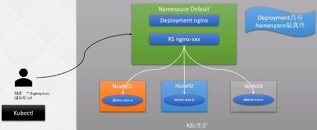
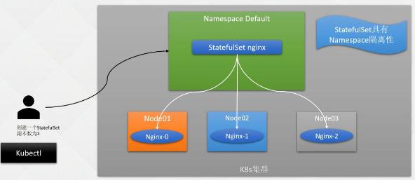
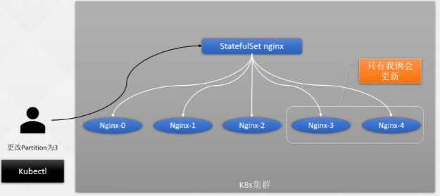
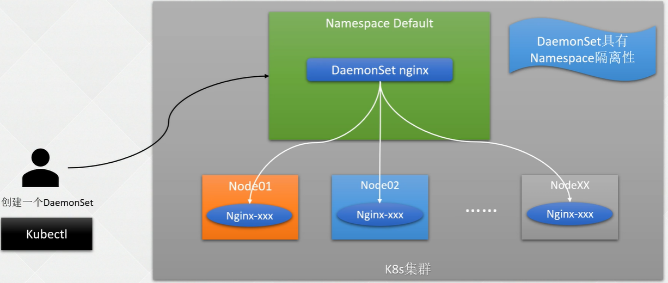
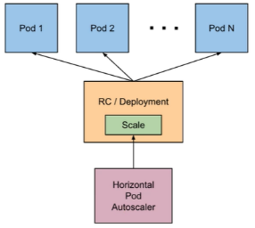

- [K8s基础篇-资源调度](#k8s基础篇-资源调度)
  - [1.1 Replication Controller](#11-replication-controller)
  - [1.2 RS](#12-rs)
  - [1.2 Deployment](#12-deployment)
    - [1.2.1 概念](#121-概念)
    - [1.2.1 部署](#121-部署)
    - [1.2.3 更新](#123-更新)
    - [1.2.4 回滚](#124-回滚)
    - [1.2.4 扩容](#124-扩容)
    - [1.2.5 暂停和恢复](#125-暂停和恢复)
    - [1.2.6 更新 Deployment 的注意事项](#126-更新-deployment-的注意事项)
  - [1.3  StatefulSet](#13--statefulset)
    - [1.3.1 基础概念](#131-基础概念)
    - [1.3.2 HeadLess Service](#132-headless-service)
    - [1.3.3 创建一个StatefulSet](#133-创建一个statefulset)
    - [1.3.4 创建和删除Pod的过程](#134-创建和删除pod的过程)
    - [1.3.5 Headless Service 通信原理](#135-headless-service-通信原理)
    - [1.3.6 扩容缩容](#136-扩容缩容)
    - [1.3.7 更新策略](#137-更新策略)
    - [1.3.8 灰度发布](#138-灰度发布)
    - [1.3.9 级联 非级联删除](#139-级联-非级联删除)
  - [1.4 DaemonSet](#14-daemonset)
    - [1.4.1 基本概念](#141-基本概念)
    - [1.4.2 创建](#142-创建)
    - [1.4.3 节点选择器](#143-节点选择器)
    - [1.4.4 更新回滚](#144-更新回滚)
- [1.5 自动扩缩容HPA](#15-自动扩缩容hpa)


### K8s基础篇-资源调度

---

在使用k8s时，就能非常简单的实现在传统架构中很难实现的功能，如健康检查、平滑退出；

注意：

+ 所有在Pod中的配置都可以在接下来的高级资源使用

:deciduous_tree: Pod 的问题：

+  在生产环境中并不会拿出来单独的创建使用，因为有些操作还是非常不方便的，所以在生产环境中，都是使用更高级资源部署服务
+ 版本升级、配置更改都要先修改yaml、再删除Pod才能创建，是一种非常不好的体验。


:deciduous_tree: 接下来所涉及到内容

1. Replication Controller和ReplicaSet 可能用的不多，但是也要了解一下的两个控制器
   + Replication Controller 第一代控制器：几乎没人在用了
   + ReplicaSet ： 可能不会单独的使用，Deployment会使用它实现一些功能
2. Deployment 无状态应用管理
3. StatefulSet 有状态应用管理
4. DaemonSet 守护经常集


#### 1.1 Replication Controller 

简称：RC

:deciduous_tree: Replication Controller 几乎被废弃，简单了解即可

+ 可确保Pod副本数达到期望值，也就是RC定义的数量。
+ 换句话说，Replication Controller可确保一个Pod或一组同类Pod总是可用。
+ 如果存在的Pod大于设定的值，则Replication Controller将终止额外的Pod。如果太小，Replication Controller将启动更多的Pod用于保证达到期望值。
+ 与手动创建Pod不同的是，用Replication Controller维护的Pod在失败、删除或终止时会自动替换。因此即使应用程序只需要一个Pod，也应该使用Replication Controller或其他方式管理。Replication Controller类似于进程管理程序，但是Replication Controller不是监视单个节点上的各个进程，而是监视多个节点上的多个Pod。

总之就是：设定一个Pod的数量 值确保达到期望值


#### 1.2 RS

ReplicaSet是支持基于集合的标签选择器的下一代Replication Controller

+ 在RC基础上加了一个标签选择器的功能（支持正则表达式）

:deciduous_tree: ReplicaSet 更高级

+ 它主要用作Deployment协调创建、删除和更新Pod
+ 和Replication Controller唯一的区别是，ReplicaSet支持标签选择器。
+ 在实际应用中，虽然ReplicaSet可以单独使用，但是一般建议使用Deployment来自动管理ReplicaSet，除非自定义的Pod不需要更新或有其他编排等。

定义一个ReplicaSet的示例如下：

```yaml
apiVersion: apps/v1
kind: ReplicaSet
metadata:
  name: frontend
  labels:
    app: guestbook
    tier: frontend
spec:
  replicas: 3 #pod 副本数
  selector:
    matchLabels: # pod的标签，符合标签都会被RS管理
      tier: frontend
    matchExpressions:
      - {key: tier, operator: In, values: [frontend]}
  template: #定义pod的内容
    metadata:
      labels:
        app: guestbook
        tier: frontend
    spec:
      containers:
      - name: php-redis
        image: gcr.io/google_samples/gb-frontend:v3
        resources:
          requests:
            cpu: 100m
            memory: 100Mi
        env:
        - name: GET_HOSTS_FROM
        ports:
        - containerPort: 80

```

注意：

+ Replication Controller和ReplicaSet的创建删除和Pod并无太大区别；
+ Replication Controller目前几乎已经不在生产环境中使用，ReplicaSet也很少单独被使用；
+ 都是使用更高级的资源Deployment、DaemonSet、StatefulSet进行管理Pod。


#### 1.2 Deployment

##### 1.2.1 概念

:deciduous_tree: deployment：无状态资源管理

+ 企业中像java、Go、Vue、PHP等业务容器、其他需要任何状态的服务；都是一个无状态的应用
+ 利用deployment 高级功能做：
  + 无缝迁移
  + 自动扩缩容
  + 自动灾难恢复
  + 一键回滚等

在生产环境中可能会创建Pod，但是很少几乎不会去创建RC和RS、都是使用更高级的方法！

:deciduous_tree: 最常用的三种Pod部署方式

1. Deployment：

     + 无状态应用部署（不需要保证如何产生的访问数据等、可以随时重启、回滚、下线等）

     + 生产环境建议最好每个应用都是无状态的。符合云原生的趋势

     + 如果真的开发一个有状态的，需要保留一些数据，就需要存储单独的挂一个盘，做有状态
     
     + 用户部署无状态的服务，最常用的控制器。企业内部无状态的微服务。一般用户管理维护企业内部无状态的微服务，比如configserver、zuul、springboot。
2. Statefulset：部署一个有状态应用，Redis等
3. DaemonSet：会在每一个节点都起一个容器。如calico在每个节点都会起一个网络插件，管理每个节点的网络，为Pod分配IP、也可以部署一个收集日志的插件

 

##### 1.2.1 部署 #####

:deciduous_tree: 部署方式：

 

Kind：deployment

流程：

1. create：将它提交给apiserver，apiserver就会持久化实例
2. 假设在default namespace：假设deployment就叫nginx实例
   + get deployment 具有命名空间隔离性
3. 启动Pod：首先创建一个RS 名称未nginx-xxxx随机字符串；由它创建Pod 可能部署在不同节点

注意事项：

+ 在master01节点执行命令，并不代表在master上创建资源

```yaml
apiVersion: apps/v1
kind: Deployment
metadata:
  labels:
    app: nginx  #deployment 标签
  name: nginx # deployment名称
  namespace: default # 命名空间
spec:
  replicas: 3 # 副本数
  selector: # deployment 所管理的pod的标签
    matchLabels:
      app: nginx
  template:
    metadata:
      labels:
        app: nginx # pod的标签
    spec:
      containers: # pod配置
      - name: nginx
        image: nginx:1.23
        imagePullPolicy: IfNotPresent # 拉取策略，存在不拉取
        ports: # 暴露端口
        - containerPort: 80
          name: nginx
          protocol: TCP
      restartPolicy: Always # 重启策略
```

**也可以使用一条命令创建：**

:deciduous_tree: 最简单的 deploy 模板

+ 输出一个yaml格式文件
+ --dry-run=client：意思就是不落地、不持久化 发给apiserver 不会去创建

+ deployment缩写deploy

```yaml
# kubectl create deployment nginx --image=nginx:1.23 --dry-run=client -oyaml
apiVersion: apps/v1
kind: Deployment
metadata:
  labels:
    app: nginx
  name: nginx
spec:
  replicas: 1
  selector:
    matchLabels:
      app: nginx
  template:
    metadata:
      labels:
        app: nginx
    spec:
      containers:
      - image: nginx:1.23
        name: nginx
```

修改： replicas: 3

```sh
# kubectl get pod
NAME                     READY   STATUS    RESTARTS   AGE
nginx-6c7985744b-94cnh   1/1     Running   0          6m52s
nginx-6c7985744b-hqqvn   1/1     Running   0          3m38s
nginx-6c7985744b-sqvvs   1/1     Running   0          3m38s

# kubectl get deployments.apps
NAME    READY   UP-TO-DATE   AVAILABLE   AGE
nginx   3/3     3            3           3m21s
```

1. NAME：deployment名称
2. READY：Pod就绪/Pod总数
3. UP-TO-DATE：已经达到期望的副本数
4. AVAILABE：可以使用的副本数
5. AGE：应用程序运行时长

:christmas_tree: 删除

注意事项：

+ 直接 在删除一个pod后，会自动补救以个pod，达到期望值

k8s带来的好处：自动恢复

```SH
# kubectl delete deploy nginx
# kubectl delete -f nginx-dp.yaml
```

:deciduous_tree: 查看Pod标签

```sh
# kubectl get pod --show-labels
NAME                     READY   STATUS    RESTARTS   AGE     LABELS
nginx-6c7985744b-2f6v4   1/1     Running   0          4m53s   app=nginx,pod-template-hash=6c7985744b
```

:deciduous_tree: 查看rs

```SH
# kubectl get rs
NAME               DESIRED   CURRENT   READY   AGE
nginx-64cdf5878b   6         6         6       8m59s
```


##### 1.2.3 更新 #####

:deciduous_tree: 注意事项

+ 当且仅当 Deployment 的 Pod 模板（即.spec.template）更改时，才会触发 Deployment 更新，例如更改内存、CPU 配置或者容器的 image
+ 新版本不允许改标签 

:deciduous_tree: 更新过程

更新策略 RS副本数设为1，Pod数缩减成2，新的Rs设成1会起来一个新的Pod状态1/1后设置rs为2…新pod达到期望值，旧的RS设置成0.

假设：（可以去改 镜像、资源、注释、但是不允许改matclabels）

更新的方式：

1. set 命令
2. edit 命令
3. vim

使用vim需要注意：文件是否是pod所使用的

+ 如果使用edit改过，再使用vim改，那么就有问题了（覆盖掉别人改的）
+ 如果不使用这个文件更改资源，不推荐使用vim去修改；
+ 或者:导出yaml文件，但是有些文件内容是要删掉的

如果不是一直使用文件更新资源、不推荐使用文件更新。推荐使用edit。或者导出文件再更新，但是要删除一些东西


:deciduous_tree: 更新image版本 （set）

latest （set image命令）

+ -–record：会将这条命令记录起来，但是，再1.24版本被弃用了！！

```sh
[root@k8s-master01 ~]# kubectl set -h
Configure application resources.

 These commands help you make changes to existing application resources.

Available Commands:
  env              Update environment variables on a pod template
  image            Update the image of a pod template
  resources        Update resource requests/limits on objects with pod templates
  selector         Set the selector on a resource
  serviceaccount   Update the service account of a resource
  subject          Update the user, group, or service account in a role binding


# kubectl set image deploy nginx nginx=nginx:1.15.12
```


:deciduous_tree: 使用edit 添加cpu内存配置

```sh
# kubectl edit deployments.apps/nginx
```

更新过程：

+ 可以看出更新过程为新旧交替更新
+ 首先新建一个 Pod，当 Pod 状态为 Running 时，删除一 个旧的 Pod，同时再创建一个新的 Pod。
+ 当触发一个更新后，会有新的 ReplicaSet 产生，旧的 ReplicaSet 会被保存，查看此时 ReplicaSet，可以从 AGE 或 READY 看出来新旧 ReplicaSet：

```sh
# kubectl rollout status deployment nginx
Waiting for deployment "nginx" rollout to finish: 1 out of 3 new replicas have been updated... 
Waiting for deployment "nginx" rollout to finish: 1 out of 3 new replicas have been updated...
Waiting for deployment "nginx" rollout to finish: 1 out of 3 new replicas have been updated...                     
Waiting for deployment "nginx" rollout to finish: 2 out of 3 new replicas have been upda ted...                     
Waiting for deployment "nginx" rollout to finish: 2 out of 3 new replicas have been updated...
Waiting for deployment "nginx" rollout to finish: 2 old replicas are pending termination...
Waiting for deployment "nginx" rollout to finish: 1 old replicas are pending termination...
Waiting for deployment "nginx" rollout to finish: 1 old replicas are pending termination...
deployment "nginx" successfully rolled out
```

通过 describe 查看 Deployment 的详细信息：

```SH
# kubectl describe deployment nginx
Events:
  Type    Reason             Age    From                   Message
  ----    ------             ----   ----                   -------
  Normal  ScalingReplicaSet  33m    deployment-controller  Scaled up replica set nginx-6c7985744b to 3
  Normal  ScalingReplicaSet  30m    deployment-controller  Scaled up replica set nginx-6c7985744b to 6
  Normal  ScalingReplicaSet  10m    deployment-controller  Scaled up replica set nginx-64cdf5878b to 2
  Normal  ScalingReplicaSet  10m    deployment-controller  Scaled down replica set nginx-6c7985744b to 5
  Normal  ScalingReplicaSet  10m    deployment-controller  Scaled up replica set nginx-64cdf5878b to 3
  Normal  ScalingReplicaSet  9m33s  deployment-controller  Scaled down replica set nginx-6c7985744b to 4
  Normal  ScalingReplicaSet  9m33s  deployment-controller  Scaled up replica set nginx-64cdf5878b to 4
  Normal  ScalingReplicaSet  9m23s  deployment-controller  Scaled down replica set nginx-6c7985744b to 3
  Normal  ScalingReplicaSet  9m23s  deployment-controller  Scaled up replica set nginx-64cdf5878b to 5
  Normal  ScalingReplicaSet  4m59s  deployment-controller  Scaled down replica set nginx-6c7985744b to 1
  Normal  ScalingReplicaSet  4m59s  deployment-controller  Scaled up replica set nginx-64cdf5878b to 6
  Normal  ScalingReplicaSet  4m53s  deployment-controller  Scaled down replica set nginx-6c7985744b to 0
```

:deciduous_tree: 滚动更新

滚动更新策略向上和向下 扩展新旧 ReplicaSet，最终新的 ReplicaSet 可以拥有 6 个副本，并将旧的 ReplicaSet 缩小为 0。

```yaml
# kubectl edit deployments.apps nginx
spec:
  progressDeadlineSeconds: 600
  replicas: 3
  revisionHistoryLimit: 10
  selector:
    matchLabels:
      app: nginx
  strategy: #升级策略
    rollingUpdate:
      maxSurge: 25% # 滚动更新时最多可以多启动多少个pod
      maxUnavailable: 25% #滚动更新时最大可以删除多少个pod
    type: RollingUpdate
  template:
    metadata:
      creationTimestamp: null
      labels:
        app: nginx
```

是先启动一个pod再删除一个pod还是先删除一个pod再启动一个pod
例如
		replicas是5
		maxSurge: 1
		maxUnavailable: 0

答案：

+ 更新时 最大的pod数是 replicas+ maxSurge = 5+1 =6，最大的个数是6

+ 最小pod数是 replicas - maxUnavailable = 5-0 = 5,最小pod数是5，所以只能先启动一个pod，再删除一个pod


##### 1.2.4 回滚

在生产环境中用的还是比较多的 

+ 快速回滚到正常的版本（一条命令或点下鼠标）非常实用的！

传统架构回滚方法：停掉新服务，老的包挪过去再启动

k8s：执行一条命令。点个鼠标（开发的管理平台），比传统的简单非常多

+ 在生产环境使用的还是比较多的，比如开发了一个新功能，这个新功能在测试环境已经测试没问题。但是在生产环境中，生产环境流量是比测试环境大。突然间爆发性能问题、bug、或者写的SQL不行。导致数据库有压力。只能快速回滚到上一个稳定的版本。

当更新了版本不稳定或配置不合理时，可以对其进行回滚操作，假设我们又进行了几次更新 

 此处以更新配置触发更新，更改镜像版本效果类似

使用 kubectl rollout history 查看更新历史

```sh
# kubectl rollout history deployment nginx
deployment.apps/nginx
REVISION  CHANGE-CAUSE
1         <none>
2         <none>
```

更新镜像（不用管成功失败）

```sh
# kubectl set image deploy nginx nginx=nginx:1.23 --record
Flag --record has been deprecated, --record will be removed in the future
deployment.apps/nginx image updated
# --record已经废弃
deployment.apps/nginx image updated
```

更新历史：可以根据记录回滚到指定或者上一个版本

+ 生产中一般会回滚到上一个版本
+ --recursive=3 查看3的详细信息
+ 回滚到上一个版本undo --to-revision 去掉
+ 指定版本：--to-revision

```sh
# kubectl rollout history deployment nginx
deployment.apps/nginx
REVISION  CHANGE-CAUSE
2         <none>
3         kubectl set image deploy nginx nginx=nginx:1.23 --record=true

# kubectl rollout undo deployment nginx --to-revision=1
```


##### 1.2.4 扩容 #####

当公司访问量变大，或者有预期内的活动时，三个 Pod 可能已无法支撑业务时，可以提前 对其进行扩展。 

+ 传统：新装服务器-操作系统-web服务器-前端加上来
+ k8s：扩缩容：加入购物网站，会涉及到扩容缩容记忆自动扩容缩容

使用 kubectl scale 动态调整 Pod 的副本数，比如增加 Pod 为 5 个：

方法：

+ edit：搜索replicas 
+ scale：扩容


无状态缩容：edit 将replicas改成2：

:warning: 特别注意：

+ 如果部署的redis、kafka等最好不要缩容，非常危险(StartfulSet)
+ 即有状态服务不要随意扩缩

```sh
# kubectl edit deployments.apps nginx
```

使用 scale 缩容到3

```SH
# kubectl scale deployment nginx --replicas=3
deployment.apps/nginx scaled
# kubectl get pod
NAME                     READY   STATUS    RESTARTS      AGE
nginx-6c7985744b-nbkwd   1/1     Running   1 (27m ago)   10h
nginx-6c7985744b-nvn9g   1/1     Running   1 (27m ago)   10h
nginx-6c7985744b-rs47t   1/1     Running   1 (27m ago)   10h
```


##### 1.2.5 暂停和恢复 #####

用的并不多，但是在做自动化处理可能会用到，使用kubectl set 更改很多参数：

+ 不暂停：更新一次触发一次（Pod的删除重建）

+ 触发一次，多次更新（损耗最少）

+ 应对不能使用edit（在线编辑的情况）

使用 kubectl rollout pause 命令即可暂停 Deployment 更新：

```sh
# kubectl rollout pause deployment nginx      # 暂停

$ kubectl set 更改参数（一条或多条命令）

# kubectl rollout resume deployment nginx     # 恢复
```


##### 1.2.6 更新 Deployment 的注意事项

​	历史版本清理策略：

​	在默认情况下，revision 保留 10 个旧的 ReplicaSet，其余的将在后台进行垃圾回收，可以 在.spec.revisionHistoryLimit 设置保留 ReplicaSet 的个数。当设置为 0 时，不保留历史记录。

```yaml
spec:
  progressDeadlineSeconds: 600
  replicas: 5
  revisionHistoryLimit: 10 # 保留的历史记录
```


一般10个就够了，不会设置为0

更新策略：

+ .spec.strategy.type==**Recreate**，表示重建，先删掉旧的Pod再创建新的Pod； 
+  .spec.strategy.type==**RollingUpdate**，表示滚动更新，可以指定maxUnavailable和maxSurge 来控制滚动更新过程；（**一般都是这个**）
  + .spec.strategy.rollingUpdate.maxUnavailable，指定在回滚更新时最大不可用的Pod数量， 可选字段，默认为25%，可以设置为数字或百分比，如果maxSurge为0，则该值不能 为0；
  + spec.strategy.rollingUpdate.maxSurge可以超过期望值的最大Pod数，可选字段，默认为 25%，可以设置成数字或百分比，如果maxUnavailable为0，则该值不能为0。

```yaml
# kubectl edit deployments.apps nginx
spec:
  strategy: #升级策略
    rollingUpdate:
      maxSurge: 25% # 滚动更新时最多可以多启动多少个pod
      maxUnavailable: 25% #滚动更新时最大可以删除多少个pod
    type: RollingUpdate
  template:
```

.spec.minReadySeconds 是可选参数，指定新创建的 Pod 应该在没有任何容器崩溃的情况下 视为 Ready（就绪）状态的最小秒数，默认为 0，即一旦被创建就视为可用，通常和容器探针连 用。

一般不会去改这个参数！


#### 1.3  StatefulSet ####

:deciduous_tree: 有状态的资源管理

程序需要持久化数据、或者有固定的标识符，存在命名空间限制，缩写 sts


##### 1.3.1 基础概念 #####

有状态：Eureka集群、MongoDB、ElasticSearch、Redis、Kafka等

+ 稳定的独一无二的网络标识符
+ 需要程序持久化数据（每个实例需要单独的存储）
+ 需要有固定的标识符（雪花算法，多副本启动一个服务时，生成一个不会冲突的ID信息）
+ 需要有序、优雅的部署和扩展（按顺序场景、删除也是）
+ 需要有序的自动滚动更新

常用于部署有状态且需要有序启动的应用程序；

:deciduous_tree: 部署过程

+ 与deployment区别，deployment是先创建了一个rs再创建副本
+ statefunSet没有rs

图示：StatefunSet再node1先启动一个nginx，完全启动可用后才会启动第二个

+ 0 可以当作主节点，其他当作备节点，只需要维护一份配置文件
+ 命名空间隔离性

 


##### 1.3.2 HeadLess Service #####

statefulset必须依赖了它

:deciduous_tree: 无头服务：

+ 和Deployment类似，一个statefulset也同样管理着基于相同容器规范的Pod，不同的是，StatefunSet为每一个Pod维护一个粘性标识！
+ 而Statefulset创建的Pod一般使用Headless service(无头服务)进行Pod直接的通信！
+ 和普通的Service创建的区别在于Headless Service没有ClusterIP、它使用的是Endpoint进行 相互通信，headless一般的格式为：

```SH
# statefunSetName-{0..N-1}.serviceName.namespace.svc.cluster.local
```

+ servicename：Headless Service的名字，创建StatefulSet时必须指定Headless Service的名称
+ 0..N-1 为Pod所在的序号，从0开始到N-1
+ statefunSetName为StatefulSet的名字
+ namespace为服务所在的命名空间
+ .cluster.local为Cluster Domain （集域名）

Headless Service 需要提前创建


##### 1.3.3 创建一个StatefulSet

未指定namespace就在default

一般用到 StatefulSet 都是一个有状态的服务，每个副本都需要一个单独的存储

+ 需要单独的配置一个 pvc，为Pod绑定使用 volumeClaimTemplates

```yaml
apiVersion: v1
kind: Service
metadata: # Headless Service
  labels:
    app: nginx
  name: nginx
spec:
  ports:
  - port: 80
    name: web
  clusterIP: None
  selector:
    app: nginx
---
apiVersion: apps/v1
kind: StatefulSet
metadata:
  labels:
    app: nginx
  name: web
  namespace: default
spec:
  replicas: 3
  selector:
    matchLabels:
      app: nginx
  serviceName: nginx
  template:
    metadata:
      labels:
        app: nginx
    spec:
      containers:
      - image: nginx:1.23
        imagePullPolicy: IfNotPresent
        name: nginx
        ports:
        - containerPort: 80
          name: web
          protocol: TCP
        resources:
          limits:
            cpu: 1000m
            memory: 500Mi
          requests:
            cpu: 500m
            memory: 200Mi
      restartPolicy: Always
```

注释：kubectl create -f nginx.yaml

+  kind: Service定义了一个名字为Nginx的Headless Service，创建的Service格式为nginx-0.nginx.default.svc.cluster.local，其他的类似，因为没有指定Namespace（命名空间），所以默认部署在default；
+ kind: StatefulSet定义了一个名字为web的StatefulSet，replicas表示部署Pod的副本数
+ 在 StatefulSet 中 必 须 设 置 Pod 选择器（ .spec.selector ） 用 来 匹 配 其 标 签 （.spec.template.metadata.labels）
+ 如果未指定匹配 Pod Selector，则会导致 StatefulSet 创建错误。

当 StatefulSet 控制器创建 Pod 时，它会添加一个标签 statefulset.kubernetes.io/pod-name，该 标签的值为 Pod 的名称，用于匹配 Service。

```SH
# kubectl get svc | grep nginx
nginx        ClusterIP   None         <none>        80/TCP    8m12s
```

Pod: 按顺序创建 0 1 2

```sh
# kubectl get pod
NAME    READY   STATUS    RESTARTS   AGE
web-0   1/1     Running   0          3m14s
web-1   1/1     Running   0          3m12s
web-2   1/1     Running   0          3m11s
```

执行过程：

```sh
# kubectl rollout status statefulset web
Waiting for 3 pods to be ready...
Waiting for 2 pods to be ready...
Waiting for 2 pods to be ready...
Waiting for 1 pods to be ready...
Waiting for 1 pods to be ready...
partitioned roll out complete: 3 new pods have been updated...
```


##### 1.3.4 创建和删除Pod的过程 #####

StatefulSet 管理的 Pod 部署和扩展规则如下

1. 对于具有N个副本的StatefulSet，将按顺序从0到N-1开始创建Pod； 
2. 当删除Pod时，将按照N-1到0的反顺序终止； 
3. 在缩放Pod之前，必须保证当前的Pod是Running（运行中）或者Ready（就绪）；
4. 在终止Pod之前，它所有的继任者必须是完全关闭状态。


​	当创建上面的 Nginx 实例时，Pod 将按 web-0、web-1、web-2 的顺序部署 3 个 Pod。在 web0 处于 Running 或者 Ready 之前，web- 不会被部署，相同的，web-2 在 web-1 未处于 Running 和 Ready 之前也不会被部署。

​	如果在 web-1 处于 Running 和 Ready 状态时，web-0 变成 Failed （失败）状态，那么 web-2 将不会被启动，直到 web-0 恢复为 Running 和 Ready 状态。


:deciduous_tree: 只有前面的Pod可用，才会创建下一个Pod

删除时：副本数改为1，效果

```sh
[root@k8s-master01 ~]# vim nginx.yaml
[root@k8s-master01 ~]# kubectl replace -f nginx.yaml
service/nginx replaced
statefulset.apps/web replaced
```

查看：-w 一直查状态 删除的过程

+ 当删除Pod时，将按照N-1到0的反顺序终止； 
+ 如果用户将 StatefulSet 的 replicas 设置为 1，那么 web-2 将首先被终止，在完全关闭并删除 web-2 之前，不会删除 web-1。如果 web-2 终止并且完全关闭后，web-0 突然失败，那么在 web0 未恢复成 Running 或者 Ready 时，web-1 不会被删除。

```sh
# kubectl scale --replicas=1 statefulset web
# kubectl get pod -w
NAME    READY   STATUS        RESTARTS   AGE
web-0   1/1     Running       0          61s
web-1   0/1     Terminating   0          59s
web-1   0/1     Terminating   0          59s
web-1   0/1     Terminating   0          59s
```

​	StatefulSet 的 pod.Spec.TerminationGracePeriodSeconds（终止 Pod 的等待时间）不应该指定 为 0，设置为 0 对 StatefulSet 的 Pod 是极其不安全的做法，优雅地删除 StatefulSet 的 Pod 是非常 有必要的，而且是安全的，因为它可以确保在 Kubelet 从 APIServer 删除之前，让 Pod 正常关闭。

```yaml
terminationGracePeriodSeconds: 30
```


##### 1.3.5 Headless Service 通信原理 #####

statefulset创建前必须指定：headless service，为每个Pod提供了一个FQDN的域名，可以解析成IP地址


受管理的Pod就可以通过Svc互相访问，被其他Pod调用；例如使用固定名词组建集群，主节点-0  其他从节点

有些Pod只需要一个固定的标识符，有序的启动

+ 比如：redis 必须要启动主节点，然后才能启动从节点
+ 或者其他的集群，需要按顺序启动

```SH
# kubectl scale --replicas=4 statefulset web
```

pod内：curl -kv web-0.nginx.default.svc.cluster.local

其他命令：wget|nslookup

+ nginx：service名称
+ defalut：命名空间
+ svc.cluster.local:默认

```sh
# kubectl exec -ti web-3 -- bash
```

使用 nginx:1.23.2-alpine apline

:deciduous_tree: 比如访问百度地址：可以将域名解析成IP

```SH
# kubectl exec -ti web-3 -- sh
/ # wget www.baidu.com
Connecting to www.baidu.com (14.215.177.39:80)
saving to 'index.html'
index.html           100% |*************************************************************|  2381  0:00:00 ETA
'index.html' saved
/ #
/ # nslookup www.baidu.com
Server:         10.103.0.10
Address:        10.103.0.10:53

Non-authoritative answer:
www.baidu.com   canonical name = www.a.shifen.com
Name:   www.a.shifen.com
Address: 14.215.177.38
Name:   www.a.shifen.com
Address: 14.215.177.39

Non-authoritative answer:
www.baidu.com   canonical name = www.a.shifen.com
```

:deciduous_tree: 解析 Pod地址

web-0.nginx.default.svc.cluster.local 解析出的地址就是Pod的地址

+ 同一个命名: 空间下访问：可以省略为web-0.nginx
+ 不要跨命名空间访问

  + 一般不推荐跨命名空间访问：会发生网络交叉的现象，是非常不好的设计

```sh
/ # nslookup web-0.nginx
Server:         10.103.0.10
Address:        10.103.0.10:53

** server can't find web-0.nginx.default: NXDOMAIN

** server can't find web-0.nginx.default: NXDOMAIN

/ #
/ # nslookup web-0.nginx.default.svc.cluster.local
Server:         10.103.0.10
Address:        10.103.0.10:53


Name:   web-0.nginx.default.svc.cluster.local
Address: 172.27.14.208
```


##### 1.3.6 扩容缩容 #####

和 Deployment 类似，可以通过更新 replicas 字段扩容/缩容 StatefulSet 也可以使用 

+ kubectl scale、kubectl edit 和 kubectl patch 来扩容/缩容一个 StatefulSet

扩容：

```SH
# kubectl scale statefulset web --replicas=5
```

缩容：

```sh
# kubectl patch statefulsets.apps web -p '{"spec":{"replicas":3}}' :根据json串去更新

# kubectl scale statefulset web --replicas=3
```

注意：

+ 一般不推荐缩容（如：可能导致redis集群不可以用）
+ 偶数扩容


##### 1.3.7 更新策略 #####

:deciduous_tree: 两种策略

（1）On Delete 策略 OnDelete 更新策略实现了传统（1.7 版本之前）的行为

+ 它也是默认的更新策略。当我们选 择这个更新策略并修改 StatefulSet 的.spec.template 字段时，StatefulSet 控制器不会自动更新 Pod， 必须手动删除 Pod 才能使控制器创建新的 Pod。 
+ 不会自动更新，删除一个更新一个

> 1.7版本之后

（2）RollingUpdate 策略 RollingUpdate（滚动更新）更新策略会自动更新一个 StatefulSet 中所有的 Pod

+ 采用与序号 索引相反的顺序进行滚动更新。 比如更改一个名称为 web 的 StatefulSet 使用 RollingUpdate 方式更新：

:deciduous_tree: 自动触发更新

```yaml
  updateStrategy:
    rollingUpdate:
      partition: 0
    type: RollingUpdate
```


##### 1.3.8 灰度发布 #####

statefulSet独有的功能：分段更新

比如我们定义一个分区"partition":3，可以使用 patch 或 edit 直接对 StatefulSet 进行设置：

 

```yaml
  updateStrategy:
    rollingUpdate:
      partition: 3  #分段更新	 默认：partition: 0 只要大于等于0的都会被更新
    type: RollingUpdate
```

```sh
# kubectl patch sts web -p '{"spec":{"updateStrategy":{"rollingUpdate":{"partition":3}}}}'
# kubectl scale --replicas=5 statefulset web
```

修改镜像：

+ 指挥更新后两个镜像，实现了一个简单的灰度发布

```SH
# kubectl get pod -oyaml | grep image:
    - image: nginx:1.23.2-alpine
      image: docker.io/library/nginx:1.23.2-alpine
    - image: nginx:1.23.2-alpine
      image: docker.io/library/nginx:1.23.2-alpine
    - image: nginx:1.23.2-alpine
      image: docker.io/library/nginx:1.23.2-alpine
    - image: nginx:1.23
      image: docker.io/library/nginx:1.23
    - image: nginx:1.23
      image: docker.io/library/nginx:1.23
```

:deciduous_tree: 扩展

使用patch改变容器的镜像

```sh
# kubectl patch sts web --type='json' -p='[{"op":"replace","path":"/spec/template/spec/containers/0/image","value":"nginx-slim:0.7"}]'
```

此时，因为 Pod web-2 的序号小于分区 3，所以 Pod 不会被更新，还是会使用以前的容器恢 复 Pod。

将分区改为 2，此时会自动更新 web-2（更新策略），但是不会更新 web-0 和 web-1：

```sh
kubectl patch sts web -p='{"spec":{"updateStrategy":{"rollingUpdate":{"partition":2}}}}'
```


##### 1.3.9 级联 非级联删除 #####

**删除stateful注意事项**

使用非级联方式删除 StatefulSet时， StatefulSet 的 Pod 不会被删除；

使用级联删除时，StatefulSet 和它的 Pod 都会被删除。

:deciduous_tree: 非级联删除 

+ 用的非常少

使用 kubectl delete sts xxx 删除 StatefulSet 时，只需提供--cascade=false 参数，就会采用 非级联删除，此时删除 StatefulSet 不会删除它的 Pod：

```sh
# kubectl delete sts web --cascade=false
# kubectl delete po web-0
# kubectl get po
NAME    READY   STATUS    RESTARTS   AGE
web-1   1/1     Running   0          5h3m
web-2   1/1     Running   0          3h55m
web-3   1/1     Running   0          4h9m
```

不会恢复，其他资源没有这种机制

+ 基本不会使用，要么全删、要么不删


:deciduous_tree: 级联删除默认

```SH
# kubectl delete statefulsets.apps web
```

```yaml
  updateStrategy:
    rollingUpdate:
      partition: 0  #分段更新
    type: RollingUpdate
```


#### 1.4 DaemonSet  ####

:deciduous_tree: 守护进程

在集群所有节点都会部署一个相同的Pod、亲和力、污点（部署在符合条件的节点）

##### 1.4.1 基本概念 #####

Daemon（守护进程级，缩写ds）和守护进程类似，它在符合匹配条件的节点上部署一个Pod。

+ 当有新节点加入集群时，也会为它们新增一个Pod
+ 当节点从集群中移除时，这些Pod也会被回收，删除DaemonSet将会删除它创建的所有Pod！

:deciduous_tree: 用于

​	在使用zabbix监控时，会在每个机器上部署一个zabbiz agent客户端工具，采集数据push到server就可以监控了。存在的问题s是新增节点就需要安装，更新配置和版本时很麻烦的事

通过DaemonSet就可以写出想要的版本和配置，在所有的节点都会部署agent，做一个统一的管理；

+ 运行集群存储daemon，例如在每个节点上运行Glusterd、Ceph
+ 在每个节点上运行日志收集daemon、如Fluentd、LogStash
+ 在每个节点运行监控、如Prometheus Node Exporter、Colletcd、Datadog代理、New Pelic代理、Gangliia gmond

> 这就是DaemonSet带来非常便利的东西

k8s推荐使用云原生的监控：Prometheus Node Exporter普罗米修斯

部署过程: 

 


##### 1.4.2 创建 #####

+ 没有了副本的概念
+ 不支持部署两个

https://kubernetes.io/zh-cn/docs/concepts/workloads/controllers/daemonset/

:deciduous_tree: 集群默认DaementSet

```SH
# kubectl get ds -n kube-system
NAME          DESIRED   CURRENT   READY   UP-TO-DATE   AVAILABLE   NODE SELECTOR            AGE
calico-node   5         5         5       5            5           kubernetes.io/os=linux   7d5h
kube-proxy    5         5         5       5            5           kubernetes.io/os=linux   7d5h
```


:deciduous_tree: 创建

```yaml
apiVersion: apps/v1
kind: DaemonSet
metadata:
  labels:
    app: nginx
  name: nginx
spec:
  selector:
    matchLabels:
      app: nginx
  template:
    metadata:
      labels:
        app: nginx
    spec:
      containers:
      - image: nginx:1.23
        imagePullPolicy: IfNotPresent
        name: nginx
        resources:
          requests:
            cpu: 500m
            memory: 200Mi
        ports:
        - containerPort: 80
          name: nginx
```

查看：

```sh
# kubectl get pod -owide
NAME          READY   STATUS    RESTARTS   AGE   IP               NODE           NOMINATED NODE   READINESS GATES
nginx-5sfvw   1/1     Running   0          14m   172.25.92.75     k8s-master02   <none>           <none>
nginx-82nvb   1/1     Running   0          14m   172.27.14.209    k8s-node02     <none>           <none>
nginx-nrsht   1/1     Running   0          14m   172.17.125.21    k8s-node01     <none>           <none>
nginx-xdl4x   1/1     Running   0          14m   172.25.244.213   k8s-master01   <none>           <none>
nginx-xqvnl   1/1     Running   0          14m   172.18.195.10    k8s-master03   <none>           <none>

```


##### 1.4.3 节点选择器 #####

:deciduous_tree: 指定节点部署 Pod

​	如果指定了.spec.template.spec.nodeSelector，DaemonSet Controller 将在与 Node Selector（节 点选择器）匹配的节点上创建 Pod，比如部署在磁盘类型为 ssd 的节点上（需要提前给节点定义 标签 Label）：

```yaml
nodeSelector:
 disktype: ssd
```

如果只想在node01上部署：

+ 打上标签

```sh
# kubectl label nodes k8s-node01 disktype=ssd
```

```yaml
# kubectl edit daemonsets.apps nginx
    spec:
      nodeSelector:
        disktype: ssd
```

只会部署在 ssd

```SH
# kubectl get pod -owide
NAME          READY   STATUS    RESTARTS   AGE   IP              NODE         NOMINATED NODE   READINESS GATES
nginx-nlt9x   1/1     Running   0          41s   172.17.125.22   k8s-node01   <none>           <none>
# kubectl get nodes --show-labels | grep ssd | awk {'print $1'}
k8s-node01
```


##### 1.4.4 更新回滚 #####

如果添加了新节点或修改了节点标签（Label），DaemonSet 将立刻向新匹配上的节点添加 Pod，同时删除不能匹配的节点上的 Pod。

DaemonSet 更新策略和 StatefulSet 类似，也有 OnDelete 和 RollingUpdate 两种方式。

:deciduous_tree: 默认：rollingUpdate

```yaml
  updateStrategy:
    rollingUpdate:
      maxSurge: 0
      maxUnavailable: 1
    type: RollingUpdate
```

:warning: 注意事项：比较危险的重要的建议使用：OnDelete

+ 更新完后手动删除一个node节点的Pod，起不来就不要去更新其他的节点，直到配置文件ok
+ 否则可能刹不住车

更新：

1. edit
2. patch
3. set image

查看：

```SH
# kubectl rollout history daemonset nginx
daemonset.apps/nginx
REVISION  CHANGE-CAUSE
1         <none>
2         <none>
# kubectl rollout status daemonset nginx
```

回滚到指定版本：kubectl rollout undo daemonset  --to-revision=

业务中用的很少，基本没需求！


### 1.5 自动扩缩容HPA

> 全称：Horizontal Pod Autoscaler 

 水平伸缩

之前安装了一个叫metrics-server组件：可以通过这个组件看到节点的内存使用率和Pod的内存使用率！

+ 不仅仅能看到这些，可以拿指标做些事情

+ 监控cpu/内存超过某个值，认为容器时有压力的，就进行扩容  HPA实现

  

```sh
# kubectl top pod
NAME          CPU(cores)   MEMORY(bytes)
nginx-nlt9x   0m           3Mi
```

:deciduous_tree: HAP：水平的Pod自动伸缩器

**注意**：在k8s中不建议不推荐使用纵向扩容VPA

 ```SH
 # kubectl api-resources | grep hpa
 horizontalpodautoscalers   hpa       autoscaling/v2  true         HorizontalPodAutoscaler
 ```

:deciduous_tree: HPA的版本

```SH
# kubectl get apiservices | grep autosca
v1.autoscaling                         Local                        True        7d6h
v2.autoscaling                         Local                        True        7d6h
v2beta1.autoscaling                    Local                        True        7d6h
v2beta2.autoscaling                    Local                        True        7d6h
```

v1版本只支持cpu: cpu为指标好处（内存指标很少）

+ 动态指标，压力影响

v2为beta版本，分为

+ v1beta1（支持cpu、内存、自定义）
+ v1beta2（支持cpu、内存、自定义指标、ExternalMetrics公有云指标）

使用的最多：cpu、自定义

:deciduous_tree: 注意：如果使用内存为指标，在内存升高后 垃圾回收处理的不好，内存是很难降下来的！

+ 导致：扩容的副本不会自动降低

```SH
# kubectl api-resources | grep metric
nodes                                          metrics.k8s.io/v1beta1                 false        NodeMetrics
pods                                           metrics.k8s.io/v1beta1                 true         PodMetrics
```

:deciduous_tree: 自定义指标：基于普罗米修斯提供的接口，自定义指标：服务的访问量、请求数、服务的报500? 404？

+ 需要程序端暴露：代码区实现

+ 服务网格：自动化扩缩容，更复杂

:deciduous_tree: 总结：

+ HAP：水平的Pod自动扩缩容，监控CPU、内存、自定义指标等超多某个值，认为容器是由压力的，就进行扩容。
+ 当健康的指标下降，回自动缩容


:taco: HPA实践

> 其实比较简单，一条命令
>

:deciduous_tree: 配置要求

1. 必须安装metrics-server或者其他的自定义metrics-sevrer
2. 必须配置requests
3. 不能扩容无法缩容的对象，比如DaemonSet

```yaml
 # kubectl create deployment hpa-nginx --image=nginx:1.23 --dry-run=client -oyaml >nginx.yaml
 # 添加 cpu 配置
apiVersion: apps/v1
kind: Deployment
metadata:
  labels:
    app: hpa-nginx
  name: hpa-nginx
spec:
  replicas: 1
  selector:
    matchLabels:
      app: hpa-nginx
  template:
    metadata:
      labels:
        app: hpa-nginx
    spec:
      containers:
      - image: nginx:1.23
        name: nginx
        resources:
          requests:
            cpu: 10m
```

:deciduous_tree: 查看Pod

+ Pod位于 k8s-node01节点

```SH
]# kubectl get pod -owide
NAME                         READY   STATUS    RESTARTS   AGE   IP              NODE         NOMINATED NODE   READINESS GATES
hpa-nginx-7c457f7bcc-bwczq   1/1     Running   0          31s   172.27.14.210   k8s-node02   <none>           <none>
```

访问Pod

 ```sh
 # curl -I 172.27.14.210
 HTTP/1.1 200 OK
 Server: nginx/1.23.2
 ```

暴露一个deploy端口的另外一种方法

```sh
# kubectl expose deployment hpa-nginx --port=80
```


:deciduous_tree:  SVC

```SH
# kubectl get svc | grep hpa
hpa-nginx    ClusterIP   10.103.53.145   <none>        80/TCP    3m3s
# curl -I 10.103.53.145
HTTP/1.1 200 OK
```


:deciduous_tree: 配置查看hpa

+ 注意：deploy的selector的matchlabels不能和其他冲突
+ MINPODS：最小pod数
+ MAXPODS：最多pod数

```sh
# kubectl autoscale deployment hpa-nginx --cpu-percent=10 --min=1 --max=10

# kubectl get hpa
NAME        REFERENCE              TARGETS   MINPODS   MAXPODS   REPLICAS   AGE
hpa-nginx   Deployment/hpa-nginx   0%/10%    1         10        1          16s
```

执行一个死循环，一直访问接口

```sh
# while true; do wget -q http://10.103.53.145 >/dev/null; done
# kubectl get pod
NAME                         READY   STATUS    RESTARTS   AGE
hpa-nginx-7c457f7bcc-4dmpw   1/1     Running   0          45s
hpa-nginx-7c457f7bcc-bwczq   1/1     Running   0          10m
hpa-nginx-7c457f7bcc-f9n6h   1/1     Running   0          15s
hpa-nginx-7c457f7bcc-gs74h   1/1     Running   0          30s
hpa-nginx-7c457f7bcc-ll5mc   1/1     Running   0          30s
hpa-nginx-7c457f7bcc-lpx67   1/1     Running   0          30s
hpa-nginx-7c457f7bcc-m9smn   1/1     Running   0          30s
hpa-nginx-7c457f7bcc-qvh2x   1/1     Running   0          15s
hpa-nginx-7c457f7bcc-sztqp   1/1     Running   0          45s
hpa-nginx-7c457f7bcc-zccjh   1/1     Running   0          45s
# kubectl get hpa
NAME        REFERENCE              TARGETS   MINPODS   MAXPODS   REPLICAS   AGE
hpa-nginx   Deployment/hpa-nginx   58%/10%   1         10        10         3m34s
```

结束循环后cpu降下来后：缩容

```SH
# kubectl get pod
NAME                         READY   STATUS    RESTARTS   AGE
hpa-nginx-7c457f7bcc-f9n6h   1/1     Running   0          12m
```


:warning: 特别注意：HPA看着挺好用，也并不是说随便用；

在生产环境中，架构肯定不是这么简单。

如果：

+ 对前端阔缩容：那肯定没什么问题，如果是后端数据库引起的，扩容前端没什么用！
+ 对后端扩缩容：目前是基于程序接口做的，通过内部反应返回出程序内部机制，对程序进行扩容。

按需使用，并不是一定要去使用HPA