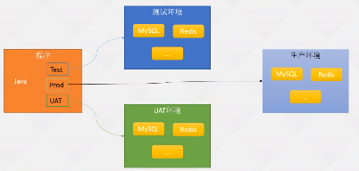
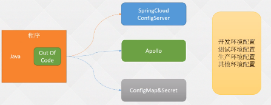
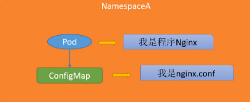

- [K8s基础篇-配置管理](#k8s基础篇-配置管理)
  - [1.1 云原生要素配置分离](#11-云原生要素配置分离)
  - [1.2 官方Configmap示例](#12-官方configmap示例)
  - [1.3 创建Configmap文件的几种形式](#13-创建configmap文件的几种形式)
    - [1.3.1 基于目录](#131-基于目录)
    - [1.3.2 基于文件](#132-基于文件)
    - [1.3.3 基于env文件](#133-基于env文件)
  - [1.4 使用valuefrom定义环境变量](#14-使用valuefrom定义环境变量)
  - [1.5 envFrom批量生成环境变量](#15-envfrom批量生成环境变量)
  - [1.6 以文件形式挂载ConfigMap](#16-以文件形式挂载configmap)
  - [1.7 自定义挂载权限及名称](#17-自定义挂载权限及名称)
  - [1.8 Secret常用类型](#18-secret常用类型)
  - [1.9 Secret拉取私有仓库镜像](#19-secret拉取私有仓库镜像)
  - [1.10 Secret管理HTTPS证书](#110-secret管理https证书)
  - [2.1 使用SubPath解决挂载覆盖](#21-使用subpath解决挂载覆盖)
  - [2.2 Configmap和Secret热更新](#22-configmap和secret热更新)
  - [2.3 Configmap和Secret使用限制](#23-configmap和secret使用限制)
  - [2.4 k8s1.19的不可变Sercet和CM](#24-k8s119的不可变sercet和cm)


###  K8s基础篇-配置管理

---

#### 1.1 云原生要素配置分离

:deciduous_tree: 配置分为两个概念

1. ConfigMap
2. Secret

通常情况下启动一个服务的时候需要依赖些配置，比如一个JAVA应用,如何知道自己连接哪个数据库、或者连接的Redis、其他的中间件，或者另一个后端地址？

 

:deciduous_tree: 传统的开发架构：代码里写了很多application的Yaml文件：比如

1. application-test就是连接测试环境的配置

2. application-Prod就是连接生产环境的配置

3. application-UAT就是连接开发环境的配置 

还有很多公司在用，架构问题：

+ 配置文件时写在代码里面的，Java编译的时候会生成一个J包，生成完之后都打在包里面启动的时候可以使用.profiles.active指定启动的配置文件，假如数据库做了一次变更IP地址改变，那就需要该配置文件重新打包编译上线
+ 流程特别麻烦，可能引起一系列的连锁反应。

 

:deciduous_tree: 云原生：配置分离

+ 配置文件拆分出来，不要放在代码里面。

可以放到：

  

K8s应用了一个比较简单的概念：ConfigMap&Secret ， 可以挂载到Pod

:deciduous_tree: 基本概念

宿主机：

+ 传统的配置文件保存在代码或者宿主机中，在配置Nginx的时候，Nginx的配置文件都是放在宿主机上的，当要更新配置文件

+ 5台宿主机改5台宿主机，还需reload重新加载Nginx

Pod：

+ 使用Pod部署Nginx：更新故障恢复就会部署到其他节点，容器所在的节点并不是固定的，不能使用这种方式，将配置文件放在容器中

+ 如果更改了Nginx的配置需要重新生成镜像，非常麻烦

> 所以：K8s抽象了一个概念：ConfigMap&Secret
>

1. ConfigMap：明文的配置（Nginx配置文件、PHP配置文件、Redis配置文件）
2. Secret：密文的配置（稍微涉及到密码 - 敏感信息）

:deciduous_tree: ConfigMap

 


每个ConfigMap和Secret都是有命名空间的隔离性的，使用Nginx配置文件创建一个ConfigMap（名称Nginx.config）

+ 在Pod配置通过Value的配置将ConfigMap挂载到容器的某个目录下。
+ Nginx启动的时候可以使用挂载的文件，在使用Readis的时候也一样。将配置文件独立出来。

好处：

1. 配置的分离：更改修改方便，配置文件自动刷新配置（有限制），Pod不需要重新新建镜像等
2. 自动读取新配置
3. 做环境变量使用

变更配置后不需要动原有的镜像，便利性。独立配置文件，更改配置和更改镜像不会相互影响;

#### 1.2 官方Configmap示例

基于目录、配置文件、命令

https://kubernetes.io/zh-cn/docs/concepts/configuration/configmap/

**configmap案例：**

:deciduous_tree: 两个数据格式：

1. 简单的key：value
2. 文件类型

```yaml
apiVersion: v1
kind: ConfigMap
metadata:
  name: game-demo
data:
  # 类属性键；每一个键都映射到一个简单的值
  player_initial_lives: "3"
  ui_properties_file_name: "user-interface.properties"

  # 类文件键
  game.properties: |
    enemy.types=aliens,monsters
    player.maximum-lives=5    
  user-interface.properties: |
    color.good=purple
    color.bad=yellow
    allow.textmode=true   
```

:deciduous_tree: 对应的Pod

1. env中的两个环境变量对应configmap文件 简单的key:value
2. volumeMounts: 容器挂的valume是 volumes中名字为config的挂载到"/config"、只读
3. volumes:卷，名字为：config，类型configmap，items下为configmap文件中的”文件类型“

这是因为 Pod 定义中在 volumes 节指定了一个  items 数组

```yaml
apiVersion: v1
kind: Pod
metadata:
  name: configmap-demo-pod
spec:
  containers:
    - name: demo
      image: alpine
      command: ["sleep", "3600"]
      env:
        # 定义环境变量
        - name: PLAYER_INITIAL_LIVES # 请注意这里和 ConfigMap 中的键名是不一样的
          valueFrom:
            configMapKeyRef:
              name: game-demo           # 这个值来自 ConfigMap
              key: player_initial_lives # 需要取值的键
        - name: UI_PROPERTIES_FILE_NAME
          valueFrom:
            configMapKeyRef:
              name: game-demo
              key: ui_properties_file_name
      volumeMounts:
      - name: config
        mountPath: "/config"
        readOnly: true
  volumes:
    # 你可以在 Pod 级别设置卷，然后将其挂载到 Pod 内的容器中
    - name: config
      configMap:
        # 提供你想要挂载的 ConfigMap 的名字
        name: game-demo
        # 来自 ConfigMap 的一组键，将被创建为文件
        items: 
        - key: "game.properties"
          path: "game.properties"
        - key: "user-interface.properties"
          path: "user-interface.properties"
```

非常重要的一句话：

+ ConfigMap 不会区分单行属性值和多行类似文件的值，重要的是 Pods 和其他对象如何使用这些值。


#### 1.3 创建Configmap文件的几种形式

1. 基于目录
1. 基于文件
1. 基于env

##### 1.3.1 基于目录 #####

比如，创建两个文件：game2.conf  game.conf

生产：一个目录下很多文件，可以基于目录去指定！

:deciduous_tree: 配置文件

```SH
# vim conf/game1.conf
lives=3
secret.code=true

# vim conf/game2.conf
color.good=purple
user=tomcat
```

基于目录创建configmap

```yaml
# kubectl create configmap cmfromdir --from-file=conf/ --dry-run=client -oyaml > cmfromdir.yaml
apiVersion: v1
data:
  game1.conf: |
    lives=3
    secret.code=true
  game2.conf: |
    color.good=purple
    user=tomcat
kind: ConfigMap
metadata:
  creationTimestamp: null
  name: cmfromdir
```

:deciduous_tree: 特别注意：

+ configmap具有命名空间隔离性

```sh
# kubectl create -f cmfromdir.yaml
# kubectl get cm
NAME               DATA   AGE
cmfromdir          2      4s
kube-root-ca.crt   1      10d
```


##### 1.3.2 基于文件 #####

再创建一个文件，验证基于文件创建

```SH
# vim conf/redis.conf
password redis123
```

:deciduous_tree: yaml文件

```yaml
# kubectl create cm cmfromfile --from-file=conf/redis.conf -oyaml
apiVersion: v1
data:
  redis.conf: |
    password redis123
kind: ConfigMap
metadata:
  creationTimestamp: "2022-12-16T09:23:32Z"
  name: cmfromfile
  namespace: default
  resourceVersion: "472532"
  uid: 6266b932-a9cf-4f8c-bc3c-c53d49004398
```

:deciduous_tree:扩展

+ 自定义名称方法： --from-file=redis.conf=xxxx.conf 一般不用


##### 1.3.3 基于env文件 #####

很多key value的数据，直接以环境变量的新式创建configmap应用到Pod中。生成环境变量！

基于env文件！ 

```yaml
# kubectl create cm gameenv --from-env-file=conf/game1.conf -oyaml
apiVersion: v1
data:
  lives: "3"
  secret.code: "true"
kind: ConfigMap
metadata:
  creationTimestamp: "2022-12-16T09:34:16Z"
  name: gameenv
  namespace: default
  resourceVersion: "473728"
  uid: 637d6e5a-4da6-4c5e-a29f-77ff84d807da
```

env的值很多的时候，可以写在configmap文件管理！

在配置容器的env时，如果环境变量很多配置麻烦、使用envFrom一次性生产很多！

:deciduous_tree: 当env配置很少时

```yaml
# kubectl create cm envfromliteral --from-literal=level=INFO --from-literal=PASSWD=redis@123 -oyaml
apiVersion: v1
data:
  PASSWD: redis@123
  level: INFO
kind: ConfigMap
metadata:
  creationTimestamp: "2022-12-16T09:36:45Z"
  name: envfromliteral
  namespace: default
  resourceVersion: "474004"
  uid: 99b3c110-aec1-487f-b10f-61c472d07b1f
```

:warning: 特别注意

+ 无论以什么方式创建：最后保存的都是map[string]string形式的
+ 一般情况不需要生成configmap文件，直接使用配置文件。习惯用配置文件直接修改！！


#### 1.4 使用valuefrom定义环境变量

configmap可以用于配置文件，也可以用于环境变量，valueFrom：配置文件


注意：以下用于配置环境变量较少的（valueFrom）

生成一个ConfigMap文件，对它修改

下面是一个 Pod 的示例，它通过使用 cmformdir 中的值来配置一个 Pod

:deciduous_tree: env 的 configmap文件

```YAML
apiVersion: v1
data:
  lives: "3"
  secret.code: "true"
kind: ConfigMap
metadata:
  creationTimestamp: "2022-12-16T09:34:16Z"
  name: gameenv
  namespace: default
  resourceVersion: "473728"
  uid: 637d6e5a-4da6-4c5e-a29f-77ff84d807da
```

:deciduous_tree: Deployment

+ 注意：需要在同一个命名空间

```yaml
apiVersion: apps/v1
kind: Deployment
metadata:
  creationTimestamp: null
  labels:
    app: dp-cm
  name: dp-cm
  namespace: default
spec:
  replicas: 1
  selector:
    matchLabels:
      app: dp-cm
  strategy:
    rollingUpdate:
      maxSurge: 1
      maxUnavailable: 0
    type: RollingUpdate
  template:
    metadata:
      labels:
        app: dp-cm
    spec:
      containers:
      - env:
        - name: LIVER # env的key，将gameenv configmap的lives的值“3”，赋值给它
          valueFrom:  # valuefrom用途，一对一，一个value对应一个key
            configMapKeyRef:
              key: lives # key
              name: gameenv # configmap的name
        image: nginx:1.23
        imagePullPolicy: IfNotPresent
        name: dp-cm
        ports:
        - containerPort: 8080
          name: web
          protocol: TCP
        resources:
          requests:
            cpu: 10m
            memory: 256Mi
      dnsPolicy: ClusterFirst
      restartPolicy: Always
```

+ 将 Configmap 中的 “lives” 做为env

 ```SH
 # kubectl exec -ti dp-cm-6ccfd6bb55-8flsc -- bash
 root@dp-cm-6ccfd6bb55-8flsc:/# env | grep LIVER
 LIVER=3
 ```

如果创建po找不到gameenv的configmap会报错，找不到configmap


#### 1.5 envFrom批量生成环境变量

:deciduous_tree: 定义多个或一批环境变量：

+ 假如配置文件有几十行，还是使用valuefrom就特别麻烦，K8s的解决方法”envfrom“

配置分离一种形式使用配置文件。

+ 通过环境变量注入的方式去生成我们的一些配置，连接数据库的地址密码，是云原生配置分离的一种方式。

:deciduous_tree: envfrom 

+ 切片类型：envFrom 将所有 ConfigMap 的数据定义为容器环境变量
+ 位置spec.envFrom

:warning: 注意： envfrom 是一个单独的字段，不是在env下

```yaml
apiVersion: apps/v1
kind: Deployment
metadata:
  creationTimestamp: null
  labels:
    app: dp-cm
  name: dp-cm
  namespace: default
spec:
  replicas: 1
  selector:
    matchLabels:
      app: dp-cm
  strategy:
    rollingUpdate:
      maxSurge: 1
      maxUnavailable: 0
    type: RollingUpdate
  template:
    metadata:
      labels:
        app: dp-cm
    spec:
      containers:
      - env:  # 指定env的方式一 key：value
        - name: TZ
          value: Asia/Shanghai
        - name: LANG
          value: C.UTF-8
        envFrom: # 指定envfrom
        - configMapRef:
            name: gameenv
        image: nginx:1.23
        imagePullPolicy: IfNotPresent
        name: dp-cm
        ports:
        - containerPort: 8080
          name: web
          protocol: TCP
        resources:
          requests:
            cpu: 10m
            memory: 256Mi
      dnsPolicy: ClusterFirst
      restartPolicy: Always
```

验证：

```SH
# kubectl exec dp-cm-6f6f9fb8f9-khhb2 env
secret.code=true
LIVER=3
TZ=Asia/Shanghai
LANG=C.UTF-8
lives=3
```

:warning: 注意一点：linux中变量名称不能配置成”secret.code“带点的形式

+ 大写字母
+ 下划线

https://kubernetes.io/zh/docs/tasks/configure-pod-container/configure-pod-configmap/

另外：envFrom还有一个功能 用的很少 

:warning: env 前缀

假如想区分环境变量是ConfigMap定义的还是环境本身的，可以在变量名称加一个前缀

```yaml
     spec:
       containers:
       - image: nginx
         name: dp-cm
         envFrom:
         - configMapRef:
             name: gameenv
           prefix: fromCm_
```


#### 1.6 以文件形式挂载ConfigMap

以文件形式挂载ConfigMap

:deciduous_tree: 创建一个cm

```SH
# cat conf/redis.conf
password redis123
# kubectl create cm redis-conf --from-file=conf/redis.conf
# kubectl get cm | grep redis
redis-conf         1      25s
```

configmap文件

```yaml
# kubectl get cm redis-conf -oyaml
apiVersion: v1
data:
  redis.conf: |
    password redis123
kind: ConfigMap
metadata:
  creationTimestamp: "2022-12-17T08:30:35Z"
  name: redis-conf
  namespace: default
  resourceVersion: "627423"
  uid: 2abe5d88-08e1-43cb-86b3-e63f099b659c
```

:deciduous_tree: 挂载到dp-cm.yaml创建的Pod中

https://kubernetes.io/zh/docs/tasks/configure-pod-container/configure-pod-configmap

Pod可能会存在多个容器。

创建：kubectl replace -f configmap/conf/dp-cm.yaml

```yaml
apiVersion: apps/v1
kind: Deployment
metadata:
  labels:
    app: dp-cm
  name: dp-cm
  namespace: default
spec:
  replicas: 1
  selector:
    matchLabels:
      app: dp-cm
  template:
    metadata:
      labels:
        app: dp-cm
    spec:
      containers:
      - image: redis:alpine3.17
        imagePullPolicy: IfNotPresent
        name: dp-cm
        volumeMounts: # 挂在卷
        - mountPath: /config
          name: config
          readOnly: true # 只读
      restartPolicy: Always
      volumes: # 卷
      - configMap: # 类型为configmap
          items:
          - key: redis.conf # key指定挂载谁
            path: redis.conf # path挂载的名称
          name: redis-conf
        name: config # 卷名
```

如果目录不存在，会字段创建

验证：

```SH
# kubectl exec dp-cm-c8d8f87c-f52lj -- cat /config/redis.conf
password redis123
```

假如我们在线编辑了redis-conf cm

+ 结果：容器内配置文化也发生变化

:deciduous_tree: 注意两点

+ 如果程序有加载功能，会自动监控文件，文件一旦变化，直接更新到程序中

+ 挂载的目录可以不存在，不存在可以自动创建


#### 1.7 自定义挂载权限及名称

修改挂载的权限

defaultMode：默认为420 8进制644

:deciduous_tree: items 自定义文件名

+  key 指定挂载谁
+  path 挂载的名称

需要注意：挂载的命令是软链过来的

defaultMode：0666 八进制写法，还可以使用十进制写法（最好八进制）

```yaml
# kubectl get pod dp-cm-c8d8f87c-f52lj -oyaml | grep -A 10 volumes
  volumes:
  - configMap:
      defaultMode: 420
      items:
      - key: redis.conf
        path: redis.conf
      name: redis-conf
    name: config
  - name: kube-api-access-rhd6s
    projected:
      defaultMode: 420
```

:warning: 特别注意

+ 挂载的文件时软链

```shell
# kubectl exec -ti dp-cm-c8d8f87c-f52lj -- sh
/data # cd /config/ && ls -l
total 0
lrwxrwxrwx    1 root     root            17 Dec 17 08:47 redis.conf -> ..data/redis.conf
/config # cd ..data/ && ls -l
total 4
-rw-r--r--    1 root     root            18 Dec 17 08:47 redis.conf
```

 权限 420，还可以使用十进制写法，最好配置八进制。


#### 1.8 Secret常用类型

涉及到加密数据，和configmap使用方法差不多

:warning: secret有类型！

https://kubernetes.io/docs/concepts/configuration/secret/

```SH
# kubectl get secrets
NAME                  TYPE                                  DATA   AGE
default-token-bl84w   kubernetes.io/service-account-token   3      17d
```

Secret与ConfigMap区别：Secret涉及到类型

+ Opaque：通用型Secret，默认类型；存各种形式
+ kubernetes.io/service-account-token：作用于ServiceAccount，包含一个令牌，用于标识API服务账户；
+ kubernetes.io/dockerconfigjson：下载私有仓库镜像使用的Secret，和宿主机的/root/.docker/config.json一致，宿主机登录后即可产生该文件；
+ kubernetes.io/basic-auth：用于使用基本认证（账号密码）的Secret，可以使用Opaque取代；
+ kubernetes.io/ssh-auth：用于存储ssh密钥的Secret；  生产环境基本不涉及
+ kubernetes.io/tls：用于存储HTTPS域名证书文件的Secret，可以被Ingress使用；
+ bootstrap.kubernetes.io/token：一种简单的 bearer token， 用于创建新集群或将新节点添加到现有集群，在集群安装时可用于自动颁发集群的证书。


:warning: 主要使用两种形式

1. kubectl
2. 配置文件

:deciduous_tree: 使用kubectl配置

https://kubernetes.io/docs/tasks/configmap-secret/managing-secret-using-kubectl/

测试：

首先生成两个文件，一个账号，一个密码

```shell
# echo -n 'admin' > ./username.txt
# echo -n '1f2d1e2e67df' > ./password.txt
# ls
password.txt  username.txt
```

创建secret

+ 类型：generic
+ 名称：db-user-pass

```shell
# kubectl create secret generic db-user-pass \
> --from-file=./username.txt \
> --from-file=./password.txt
secret/db-user-pass created
# kubectl get secrets
NAME                  TYPE                                  DATA   AGE
db-user-pass          Opaque                                2      11s
```

查看sercetyaml文件：

```yaml
# kubectl get secrets db-user-pass -oyaml
apiVersion: v1
data:
  password.txt: MWYyZDFlMmU2N2Rm
  username.txt: YWRtaW4=
kind: Secret
metadata:
  creationTimestamp: "2022-12-23T12:34:01Z"
  name: db-user-pass
  namespace: default
  resourceVersion: "1618267"
  uid: 4544dfb0-d411-40ed-97f6-a19920197ee3
type: Opaque
```

区别很明显：之前显示ConfigMap的时候直接显示名称，在sercet中是加密的

软加密：是可以被加密的，使用的是base64加密

```SH
# echo 'MWYyZDFlMmU2N2Rm' | base64 -d
1f2d1e2e67df[
```

可以被解出来，不是那么严格，K8s可以对Sercet再次加密，这样可能被解密不出来，但是配置会麻烦。而且解密速度会比较慢。

同样的，也可以使用literal

+ 内容使用单引号

```shell
# kubectl create secret generic db-user-pass \
  --from-literal=username=devuser \
  --from-literal=password='S!B\*d$zDsb='
```


:deciduous_tree: 通过Secret的yaml文件创建

```shell
echo -n 'admin' | base64
echo -n '1f2d1e2e67df' | base64
```

创建yaml'文件：

```yaml
apiVersion: v1
kind: Secret
metadata:
  name: mysecret
type: Opaque
data:
  username: YWRtaW4=
  password: MWYyZDFlMmU2N2Rm
```

:warning: 如果不想通过echo的方式

+ 使用明文创建，创建完成后自动加密

```yaml
apiVersion: v1
kind: Secret
metadata:
  name: mysecret
type: Opaque
stringData:
  config.yaml: |
    apiUrl: "https://my.api.com/api/v1"
    username: admin
    password: passwd123
    
------

apiVersion: v1
data:
  config.yaml: YXBpVXJsOiAiaHR0cHM6Ly9teS5hcGkuY29tL2FwaS92MSIKdXNlcm5hbWU6IGFkbWluCnBhc3N3b3JkOiBwYXNzd2QxMjMK
kind: Secret
metadata:
  creationTimestamp: "2022-12-23T12:38:33Z"
  name: mysecret
  namespace: default
  resourceVersion: "1618770"
  uid: 6aa1b082-e7fe-42d0-bb27-9ff6449076d5
type: Opaque
```

挂载和生成环境变量和ConfigMap都一样


#### 1.9 Secret拉取私有仓库镜像 ####

怎么使用kubectl下载有密码的，以下载华为云为例

:deciduous_tree: 私有镜像

+ 直接docker pull配置用户密码的镜像仓库镜像，报错：需要登录的 “docker login”
+ 报错没有授权

```sh
# docker pull swr.cn-north-4.myhuaweicloud.com/vas_k8s_47e5b2d0/nginx:1.15.1
Error response from daemon: Head "https://swr.cn-north-4.myhuaweicloud.com/v2/vas_k8s_47e5b2d0/nginx/manifests/1.15.1": denied: You may not login yet
```

登录下载镜像，或镜像公开：成功下载

:warning: 在登录后可以直接pull镜像，但是pod拉取回失败

+ kubectl get pod ：状态ERRImagePull

+ kubectl describr po 查看报错：需要去登录，不能直接下载

```sh
# kubectl create deployment dp --image=swr.cn-north-4.myhuaweicloud.com/vas_k8s_47e5b2d0/nginx:1.15.2 --dry-run=client -oyaml > nginx.yaml
# kubectl create -f nginx.yaml
```

:deciduous_tree: Secret

+ kubernetes.io/dockerconfigjson 

```SH
# kubectl create secret docker-registry my-swr --docker-username=cn-north-4@L3N60T5NEPF6RC0O98CV --docker-password=d3e5fcdc8a6782071c6f527ecca8cfc17cec576b6d7328dbc03402c85b42803a --docker-server=swr.cn-north-4.myhuaweicloud.com

# kubectl get secrets my-swr -oyaml
apiVersion: v1
data:
  .dockerconfigjson: eyJhdXRocyI6eyJzd3IuY24tbm9ydGgtNC5teWh1YXdlaWNsb3VkLmNvbSI6eyJ1c2VybmFtZSI6ImNuLW5vcnRoLTRATDNONjBUNU5FUEY2UkMwTzk4Q1YiLCJwYXNzd29yZCI6ImQzZTVmY2RjOGE2NzgyMDcxYzZmNTI3ZWNjYThjZmMxN2NlYzU3NmI2ZDczMjhkYmMwMzQwMmM4NWI0MjgwM2EiLCJhdXRoIjoiWTI0dGJtOXlkR2d0TkVCTU0wNDJNRlExVGtWUVJqWlNRekJQT1RoRFZqcGtNMlUxWm1Oa1l6aGhOamM0TWpBM01XTTJaalV5TjJWalkyRTRZMlpqTVRkalpXTTFOelppTm1RM016STRaR0pqTURNME1ESmpPRFZpTkRJNE1ETmgifX19
kind: Secret
metadata:
  creationTimestamp: "2022-12-23T13:06:29Z"
  name: my-swr
  namespace: default
  resourceVersion: "1621940"
  uid: 0a4dbcf8-19ba-499b-a4bd-e4d74b2b7998
type: kubernetes.io/dockerconfigjson
```

挂载到容器：

```YAML
# cat nginx.yaml
apiVersion: apps/v1
kind: Deployment
metadata:
  creationTimestamp: null
  labels:
    app: dp
  name: dp
spec:
  replicas: 1
  selector:
    matchLabels:
      app: dp
  strategy: {}
  template:
    metadata:
      creationTimestamp: null
      labels:
        app: dp
    spec:
      containers:
      - image: swr.cn-north-4.myhuaweicloud.com/vas_k8s_47e5b2d0/nginx:1.15.2
        name: nginx
      imagePullSecrets:		# 配置
      - name: my-swr
      restartPolicy: Always
```

describe 

+ secret也是具有命名空间隔离性的！

````SH
Events:
  Type    Reason     Age   From               Message
  ----    ------     ----  ----               -------
  Normal  Scheduled  67s   default-scheduler  Successfully assigned default/dp-5666f5b46d-nh5dw to k8s-node01
  Normal  Pulling    66s   kubelet            Pulling image "swr.cn-north-4.myhuaweicloud.com/vas_k8s_47e5b2d0/nginx:1.15.2"
  Normal  Pulled     55s   kubelet            Successfully pulled image "swr.cn-north-4.myhuaweicloud.com/vas_k8s_47e5b2d0/nginx:1.15.2" in 11.376777187s
  Normal  Created    55s   kubelet            Created container nginx
  Normal  Started    54s   kubelet            Started container nginx
````


#### 1.10 Secret管理HTTPS证书

实验环境：不涉及权威证书 - openssl 作为演示

:warning: 生产环境一定不要自己生成、要使用公司买的权威证书

首先生成证书：

+ tls.key 私钥
+ tls.crt

```shell
# openssl req -x509 -nodes -days 365 -newkey rsa:2048 -keyout tls.key -out tls.crt -subj "/CN=test.com"
# ls
nginx.yaml  password.txt  test.yaml  tls.crt  tls.key  username.txt
```

自己买的证书也是有这两个文件的

+ tls.crt
+ tls.key

```sh
# kubectl create secret tls nginx-test-tls --key=tls.key --cert=tls.crt
# kubectl get secrets
NAME                  TYPE                                  DATA   AGE
nginx-test-tls        kubernetes.io/tls                     2      11s
```

此时就可以在Ingress上创建

+ 假如是https就可以加一个tls的证书，生产环境中中不推荐直接配置到这里，应该去配置到最外围。可以是LB负载均衡器，配置在入口，在第一道门槛做安全策略

```yaml
---
apiVersion: networking.k8s.io/v1
kind: Ingress
metadata:
  creationTimestamp: null
  name: nginx-https-test
spec:
  ingressClassName: nginx
  rules:
  - host: https-test.com
    http:
      paths:
      - backend:
          service:
            name: nginx
            port:
              number: 80
        path: /
        pathType: ImplementationSpecific
  tls:
  - hosts:
    - https-test.com
    secretName: nginx-test-tls
```

:warning: 生产环境不这样使用，安全在第一道门栏做


---

ConfigMap和Sercet其实就到此了，但是还有很多小细节：


#### 2.1 使用SubPath解决挂载覆盖

如果直接挂载/etc/config 如果文件夹下原本有文件，可能会覆盖

解决挂载覆盖的问题

:warning: 特别重要！！ 

+ subPath：告诉容器以文件形式挂载，不要覆盖掉整个目录

+ 如果挂载的是一个文件夹，会将文件夹覆盖掉。故障排查困难

```yaml
apiVersion: apps/v1
kind: Deployment
metadata:
  labels:
    app: dp
  name: dp
spec:
  replicas: 1
  selector:
    matchLabels:
      app: dp
  template:
    metadata:
      labels:
        app: dp
    spec:
      containers:
      - image: swr.cn-north-4.myhuaweicloud.com/vas_k8s_47e5b2d0/nginx:1.15.2
        name: nginx
        volumeMounts: # 挂在卷
        - mountPath: /config/redis.conf      # 挂载路径,告诉容器，以文件的方式去挂载，不要去覆盖其他的
          subPath: redis.conf          # 子目录，指定挂载文件名redis.conf，挂载路径也需要修改
          name: config
          readOnly: true # 只读
      volumes: # 卷
      - configMap: # 类型为configmap
          items:
          - key: redis.conf # key指定挂载谁
            path: redis.conf # path挂载的名称
          name: redis-conf
        name: config # 卷名
      imagePullSecrets:
      - name: my-swr
      restartPolicy: Always
```

```sh
# kubectl exec -ti dp-59bfd4bd49-jtt5n -- sh
# ls config
redis.conf
```


#### 2.2 Configmap和Secret热更新 ####

使用edit修改：简单的内容

如果需要数据比较多比较乱的：

+ 修改cm文件，replice -f cm文件名

如果通过kubcetl create cm cm*\*\*\* –from-file=xxxx 两种方式

+ yaml 导出来修改，但是存在换行符 问题
+ 建议：直接修改配置文件xxx.conf (使用–dry-run生成一个yaml 再replice)


```SH
# kubectl create cm nginx-conf --from-file=nginx.conf --dry-run=client -oyam | kubectl replace -f -
```


#### 2.3 Configmap和Secret使用限制 ####

:deciduous_tree: 使用限制分为

1. 提前创建cm或者secret（如果不存在，Pod创建提醒不存在）
2. 引用cm或secret时：key必须存在
3. 使用envfrom或valuefrom无法热更新环境变量（环境变量：服务级别），只能重启Pod
4. 使用envfrom配置环境变量：如果key无效，它会忽略掉无效的key（比如变量名不规范）
5. Configmap和secret必须要和Pod或引用它的资源再同一个命名空间
6. 使用subePath：无法热更新（鱼和熊掌不可兼得）
7. configmap和secret最好不要太大


#### 2.4 k8s1.19的不可变Sercet和CM

:deciduous_tree: 安全配置

1.18 引入了一个概念 immutable 参数将Sercet和CM设置成不可变的

官方概念：如果 immutable 设为 true，则确保不会更新 Secret 中存储的数据（只能修改对象元数据）。 如果未设为 true，则可以随时修改此字段。 默认为 nil。

原因：容器再挂载了configmap或者sercet到本地，可能是一个配置文件，如果更改了configmap或者sercet就会将配置更改到容器，容器监听到文件变化，将重载文件，文件更改错了影响使用（非常严重）

1.19版本公测 

https://kubernetes.io/zh-cn/docs/concepts/configuration/configmap/

```
apiVersion: v1
kind: ConfigMap
metadata:
  ...
data:
  ...
immutable: true
```

只能删除并重建 ConfigMap。 因为现有的 Pod 会维护一个已被删除的 ConfigMap 的挂载点，建议重新创建这些 Pods。

