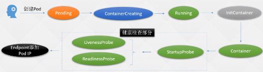
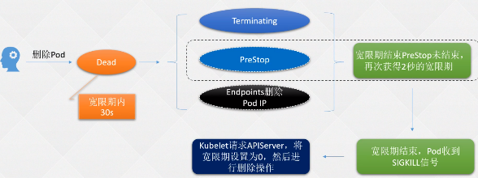

K8s基础篇-基本概念
- [1.1 K8s 和 Docker](#11-k8s-和-docker)
- [1.2 k8s架构解析](#12-k8s架构解析)
- [1.3 k8s控制节点组件介绍](#13-k8s控制节点组件介绍)
- [1.4 Scheduler Controller 状态组件](#14-scheduler-controller-状态组件)
- [1.5 工作节点组件](#15-工作节点组件)
- [1.6 pod](#16-pod)
- [1.7 引入Pod的意义](#17-引入pod的意义)
- [1.8 定义一个Pod](#18-定义一个pod)
- [1.9 Pod 字段解释](#19-pod-字段解释)
- [1.10 更改 Pod 的启动命令和参数](#110-更改-pod-的启动命令和参数)
- [1.11 Pod 状态及 Pod 故障排查命令](#111-pod-状态及-pod-故障排查命令)
- [1.12 Pod镜像拉取策略](#112-pod镜像拉取策略)
- [1.13 Pod重启策略](#113-pod重启策略)
- [1.14 Pod 三种探针](#114-pod-三种探针)
- [1.15  探针的实现四种种方式](#115--探针的实现四种种方式)
- [1.16 livenessProbe 和 readinessProbe](#116-livenessprobe-和-readinessprobe)
- [1.17 配置 StartupProbe](#117-配置-startupprobe)
- [1.10  postStart](#110--poststart)
- [1.11 preStop](#111-prestop)
- [1.12 gRPC 探测](#112-grpc-探测)

---

#### 1.1 K8s 和 Docker ####

:deciduous_tree: 有了Docker为什么还要使用k8s？

Docker：

1. Docker宿主机宕机容器无法自动恢复
2. 程序级健康检查依旧不到位
3. 程序的扩容、缩容、回滚和更新依旧不够灵活
4. 端口问题并未得到解决

容器编排：不止k8s一种编排

1. 轻松管理成千上万个的业务容器、
2. 全自动容灾机制
3. 全自动扩缩容、回滚
4. 原生支持服务发现和负载均衡
5. 更加灵活方便的健康检查(接口、端口、命令) 
6. 等等

:deciduous_tree:  健康检查

+ 在裸机和容器都是没有的（部署发布：设置 基础环境等很麻烦）
+ k8s中，健康检查就特别特别好做。k8s提供很多健康检查的工具，可以通过请求端口或者执行命令等，提供了两种方式live、reading检查我们的应用程序。

:deciduous_tree: 端口问题

 Dpcker

​		需要将容器中的端口好暴露到宿主机上，然后通过宿主机IP地址加端口访问到容器中的进程。假如容器中部署了5个应用，就需要启用5个端口（端口1：1管理几十个端口非常复杂）。

K8s

+ 在k8s中就不需要担心这个，在k8s中有一个内部service，在容器内启动相同的端口，端口不直接暴露对外，通过service反代到容器中，通过service可以访问到容器中的进程;
+ service有一个 ip 唯一的，不会出现ip地址冲突的问题。

 

#### 1.2 k8s架构解析 ####

Kubernetes简称：K8S	云原生：CNCF

简称由来：官方：K~S之间有8个字母

​		Kubernetes是谷歌以Borg为前身开发的第三个容器管理系统，基于谷歌15年生产环境经验的基础上开源的一个项目，Kubernetes致力于提供跨主机集群的自动部署、扩展、高可用以及运行应用程序容器的平台。（平台经过15年生产环境的考验，使用k8s并不会出现什么问题）

提供了：

1. 资源调度
2. 扩容缩容
3. 服务发现
4. 存储编排
5. 自动部署和回滚
6. 天生的高可用性
7. 负载均衡
8. 故障自动恢复等功能的 ”生态系统“，目前已成为云原生领域的标准


:deciduous_tree: 主节点

推荐3个起步，都不建议在主节点安装任何的Pod、只负责一些调度工作和控制工作

:deciduous_tree: Etcd Cluster

3个起步，和主节点不用在同一个服务器，

+ 在生产环境中一定要有独立的SSD硬盘
+ 只有主节点的api-service与它通信
+ 高可用主要是争对数据的：etcd必须是3个
+ 必须是奇数个

:deciduous_tree: 从节点

部署pod，无限扩容 

:deciduous_tree: 客户端工具（kubectl）

并不一定非要在master安装，只要和LB或者master网络时通的就可以操作集群

+ 任意一个和集群通信的节点
+ 通过文件config
+ 在集群的每个节点安装kubectl是非常危险的操作，不推荐

:deciduous_tree: load Balancer

负载均衡（vip:虚拟IP，对Master实现一个高可用，绑定到mastre节点的一个网卡上，通过LB就可以访问到APIServer）

 

#### 1.3 k8s控制节点组件介绍 ####

控制节点（master）

Master节点的组件包括：

:deciduous_tree: APIServer：APIServer是整个集群的控制中枢

+ 提供集群中各个模块之间的数据交换；
+ 将集群状态和信息存储到分布式键-值(key-value)存储系统Etcd集群中。
+ 集群管理、资源配额、提供完备的集群安全机制的入口 RBAC，为集群各类资源对象提供增删改查以及watch的REST API接口
+ 作为Kubernetes的关键组件，使用Kubernetes API和 JSON over HTTP提供Kubernetes的内部和外部接口。
+ 总结：(Kube-APIServer：集群的控制中枢，各个模块之间信息交互都需要经过Kube-APIServer，同时它也是集群管理、资源配置、整个集群安全机制的入口)
  例如：Kubectl工具所有请求都是发在APIserver

:deciduous_tree: Scheduler：Scheduler是集群Pod的调度中心

  + 主要是通过调度算法将Pod分配到最佳的节点（Node），
  + 通过APIServer监听所有Pod的状态，一旦发现新的未被调度到任何Node节点的Pod（PodSpec.NodeName为空），就会根据一系列策略选择最佳节点进行调度，对每一个Pod创建一个绑定（binding），然后被调度的节点上的Kubelet负责启动该Pod。
  + Scheduler是集群可插拔式组件，它跟踪每个节点上的资源利用率以确保工作负载不会超过可用资源。因此Scheduler必须知道资源需求、资源可用性以及其他约束和策略，例如服务质量、亲和力/反关联性要求、数据位置等。
  + Scheduler将资源供应与工作负载需求相匹配以维持系统的稳定和可靠，因此Scheduler在调度的过程中需要考虑公平、资源高效利用、效率等方面的问题。
  + 总结：Scheduler：集群的调度中心，它会根据指定的一系列条件，选择一个或一批最佳的节点，然后部署我们的Pod。

:deciduous_tree: Controller Manager

Controller Manager是集群状态管理器（它的英文直译名为控制器管理器），以保证Pod或其他资源达到期望值。

  + 当集群中某个Pod的副本数或其他资源因故障和错误导致无法正常运行，没有达到设定的值时，Controller Manager会尝试自动修复并使其达到期望状态。
  + Controller Manager包含NodeController、ReplicationController、EndpointController、NamespaceController、ServiceAccountController、ResourceQuotaController、ServiceController和TokenController，该控制器管理器可与API服务器进行通信以在需要时创建、更新或删除它所管理的资源，如Pod、服务断点等。
  + 总结：（Controller-Manager：集群的状态管理器，保证Pod或其他资源达到期望值，也是需要和APIServer进行通信，在需要的时候创建、更新或删除它所管理的资源。）
    例如：使用kubectl向APIserver发起一个create一个资源，APIserver会连接Controller Manager去创建。比如改了一个字段，APIserver告诉Controller你要去更新它。

:deciduous_tree: Etcd

  + Etcd由CoreOS开发，用于可靠地存储集群的配置数据，是一种持久性、轻量型、分布式的键-值（key-value）数据存储组件。
  + Etcd作为Kubernetes集群的持久化存储系统，集群的灾难恢复、状态信息存储都与其密不可分，所以在Kubernetes高可用集群中，Etcd的高可用是至关重要的一部分，在生产环境中建议部署为大于3的奇数个数的Etcd，以保证数据的安全性和可恢复性。
  + Etcd可与Master组件部署在同一个节点上，大规模集群环境下建议部署在集群外，并且使用高性能服务器来提高Etcd的性能和降低Etcd同步数据的延迟。
  + 总结： Etcd：键值数据库，保存一些集群的信息，一般生产环境中建议部署三个以上节点（奇数个），一定要使用SSD硬盘

总结：Master节点资源一定要给够，后期动Master节点时非常麻烦的事情，在Master节点绑定它的证书，每个证书绑定Master节点的主机名或者IP地址，如果在生成证书的时候没有预留，那我们可能要重新生成一份证书去替换之前的证书包括node节点的。


#### 1.4 Scheduler Controller 状态组件

:deciduous_tree: 有状态和无状态

在master节点都安装了api-server、scheduler、Controller，每个组件时如何工作，之间的相互影响

APIserver：无状态

+ 状态存储在etcd中，比如LB发了一个请求，只会发给一个APIserver，但是scheduler、Controller是没有人取调用它的，scheduler它是通过APIserver的信息监听Pod的状态

假设pod的状态不正常了，3个scheduler都监听到恢复pod的状态，这样肯定不行的

所以：

+ scheduler、Controller 是有状态服务（选主），信息保存在（1.24版本以上：）保存在

```SH
# kubectl get leases -n kube-system
NAME                      HOLDER                                              AGE
kube-controller-manager   k8s-master02_19bdfcd2-9dcb-4bd3-9f6e-7dafc7b9da7d   32h
kube-scheduler            k8s-master01_ed4a5ac2-1abf-4816-a938-09d63f69ddbc   32h
```

无论搭建多少个scheduler、Controller，工作的只有一个

+ scheduler、Controller 监听APIserver
+ 调用APIserver是一对一，调用到master01就是master01工作


#### 1.5 工作节点组件 ####

:deciduous_tree: 工作节点也叫：node节点

​		Node节点也被称为Worker或Minion，是主要负责部署容器（工作负载）的单机（或虚拟机），集群中的每个节点都必须具备容器的运行环境（runtime），比如Docker及其他组件等。

:deciduous_tree: Kubelet

+ 作为守护进程运行在Node节点上，负责监听该节点上所有的Pod，同时负责上报该节点上所有Pod的运行状态，确保节点上的所有容器都能正常运行。
+ 当Node节点宕机（NotReady状态）时，该节点上运行的Pod会被自动地转移到其他节点上。


:deciduous_tree: Node节点包括：
   1> Kubelet：

+  负责与Master通信协作，管理该节点上的Pod。
+ 负责监听节点上Pod的状态，同时负责上报 APIserver 节点和节点上面Pod的状态，负责与Master节点通信，并管理节点上面的Pod 
+ APIserver 将状态写入ETCD 当中

   2> Kube-Proxy：

+ 负责Pod之间的通信和负载均衡
+ 将指定的流量分发到后端正确的机器上
+ 如：通过SVC访问服务，流量打在哪个Pod上就是它来控制

工作模式：

+ 

   3> Docker Engine

+ Docker引擎，负载对容器的管理

   4> Runtime

+ 负责集群的管理

:deciduous_tree:其他组件

​	1> CoreDNS

+ 用于 K8s 集群内部Service的解析，让 Pod 将Service名称解析成 Service的IP
+ 通过Service的IP地址进行连接到对应的应用上

​	2> Calico

+ 负责为每个Pod分配一个唯一的IP地址
+ 并且把每个节点当做一个路由器，这样一个节点的Pod就可以通过IP地址访问到其他节点的Pod

​	3> Docker：容器引擎，负责对容器的管理。

:taco:CoreDNS

```SH
[root@k8s-master01 ~]# kubectl get svc -n kube-system
NAME             TYPE        CLUSTER-IP       EXTERNAL-IP   PORT(S)                  AGE
calico-typha     ClusterIP   10.103.6.32      <none>        5473/TCP                 32h
kube-dns         ClusterIP   10.103.0.10      <none>        53/UDP,53/TCP,9153/TCP   33h
metrics-server   ClusterIP   10.103.119.223   <none>        443/TCP                  32h
```

在Pod中 ping NAME 时 可以解析成IP地址

每个Pod中都会有 nameserver (就是CoreDNS kube-dns地址)

+ 所以 Pod 可以通过 kube-dns 解析 Service

```SH
# kubectl exec -ti metrics-server-6c48d8f6d6-8m5qg -n kube-system -- bash
I have no name!@metrics-server-6c48d8f6d6-8m5qg:/opt/bitnami/metrics-server$
I have no name!@metrics-server-6c48d8f6d6-8m5qg:/opt/bitnami/metrics-server$ cat /etc/resolv.conf
search kube-system.svc.cluster.local svc.cluster.local cluster.local
nameserver 10.103.0.10
options ndots:5
```

:taco: Calico

```SH
# kubectl get po -A -owide 
kubernetes-dashboard   dashboard-metrics-scraper-5b997cd56f-zfb6l   1/1     Running   2 (9h ago)    32h   172.17.125.7      k8s-node01     <none>           <none>
# 172.17.125.7 Calico分配的一个地址 在  k8s-node01 节点
```

Ping node01 地址：通

```SH
# ping 172.17.125.7
64 bytes from 172.17.125.7: icmp_seq=1 ttl=63 time=17.5 ms
# master 01 路由表
[root@k8s-master01 ~]# route -e
Kernel IP routing table
Destination     Gateway         Genmask         Flags   MSS Window  irtt Iface
default         gateway         0.0.0.0         UG        0 0          0 ens32
link-local      0.0.0.0         255.255.0.0     U         0 0          0 ens32
172.17.0.0      k8s-node02      255.255.0.0     UG        0 0          0 tunl0
172.17.125.0    k8s-node01      255.255.255.192 UG        0 0          0 tunl0
172.18.195.0    k8s-master03    255.255.255.192 UG        0 0          0 tunl0
172.25.92.64    k8s-master02    255.255.255.192 UG        0 0          0 tunl0
172.25.244.192  0.0.0.0         255.255.255.192 U         0 0          0 *
172.25.244.199  0.0.0.0         255.255.255.255 UH        0 0          0 calieea57380bfb
172.25.244.200  0.0.0.0         255.255.255.255 UH        0 0          0 calidd7c888a1da
172.25.244.201  0.0.0.0         255.255.255.255 UH        0 0          0 cali0c3ac931242
172.27.14.192   k8s-node02      255.255.255.192 UG        0 0          0 tunl0
192.168.200.0   0.0.0.0         255.255.255.0   U         0 0          0 ens32
```


:deciduous_tree: Kube-proxy工作模式：

```SH
[root@k8s-master01 ~]# curl 127.0.0.1:10249/proxyMode
ipvs
```

Ipvs

+ 监听Master节点增加和删除service以及endpoint的消息，调用Netlink接口创建相应的IPVS规则。
+ 通过IPVS规则，将流量转发至相应的Pod上。

Iptables

+ 监听Master节点增加和删除service以及endpoint的消息
+ 对于每一个Service，他都会场景一个iptables规则，将service的clusterIP代理到后端对应的Pod。（IPtables在规则特别多的时候性能极具下降）

 


#### 1.6 pod

资源是非常巧妙的设计！！

​		为什么K8s要设计出这么多让人费解的资源呢？Pod、deployment等；只是想用K8s部署自己的服务而已，但是就必须了解一些抽象的概念deployment、service等，之前我觉得这么设计太奇葩了，学了很久还是没有将k8s部署在一个集群上的。后来才知道，这么设计是多么巧妙的设计：

抽象的资源可以让不用理解一些技术上的细节就能实现最想要效果；


Pod：是k8s最小的一个业务单元，简单的理解为是一组、一个或多个容器组成，每个Pod还包含了一个Pause容器；

:deciduous_tree: Pod可以只部署一个容器，也可以部署多个

+ pause容器：
  + Pod的父容器，负责僵尸进程的回收管理
  + 使同一个pod中的不同容器共享存储、网络、PID、IPC等

容器间可以使用localhost:port 互相访问，可以使用volume 等实现数据共享。根据docker的构造，Pod可被建模为一组具有共享命令空间、卷、IP地址和Port端口的容器！

```SH
# ctr -n k8s.io c ls
```

总结：Pod是一个或多个容器的集合


#### 1.7 引入Pod的意义

1. 强依赖的服务需要部署在一起
2. 多个服务需要协同工作
3. 兼容其他CRI标准的运行时

:deciduous_tree: 强依赖的服务需要部署在一起

> 比如：Nginx和PHP、将PHP的代码代码转到PHP去解析的话，需要有一个前端的代理转到PHP去解析
>

+ 这两个服务是有一定的依赖些，直接管理容器的话，不能100%的确定会部署在同一个机器
+ Nginx和PHP跨机器的话，会导致访问速度变慢
+ 有些服务需要协调工作，比如需要初始化数据拉一些东西，如果直接管理容器会很难实现，可以在Pod上加一个初始化容器（在程序启动前：比如拉文件、修改内核等）

:deciduous_tree: 多个服务需要协同工作

从K8s的角度看，不一定需要使用Docker来作为runtime

k8s的目标并不是兼容别人的容器，而是需要兼容k8s的标准（无论你是什么容器，只要符合就兼容）非常好的理念！

一个应用不可能是单个容器就能支撑的，一定是很多个微服务支持这个应用。

+ 例如：A-B服务之间有强依赖性，必须无延迟或特别小，而且AB服务可能有数据的依赖性，A用B的文件。所有AB需要保证在一个Pod中、共享一个目录、实现特别小的延迟访问。

> 从使用方角度

:deciduous_tree: Pod

​		Pod：依赖性、对网络延迟要求高容器可以部署在一个容器部署在同一个容器中，非常便于管理。Kubernetes为每个Pod都分配一个唯一的IP地址，这样就可以保证应用程序使用同一端口，避免了发生冲突的问题。。

:deciduous_tree: K8s角度：
		Pod：K8s编排不止Docker容器，Docker不是唯一的容器技术，k8s很少去操作容器，都是操作pod


#### 1.8 定义一个Pod

定义一个 Pod https://kubernetes.io/zh-cn/docs/concepts/workloads/pods/

```SH
# kubectl run nginx --image=nginx:1.23
pod/nginx created
# kubectl get pod
NAME    READY   STATUS    RESTARTS   AGE
nginx   1/1     Running   0          41s
# kubectl get pod -owide
NAME    READY   STATUS    RESTARTS   AGE     IP             NODE         NOMINATED NODE   READINESS GATES
nginx   1/1     Running   0          2m29s   172.17.125.8   k8s-node01   <none>           <none>
```

curl pod：可以访问容器内

```SH
# curl 172.17.125.8
<!DOCTYPE html>
<html>
<head>
<title>Welcome to nginx!</title>
<style>
```

删除Pod：delete

:deciduous_tree: 推荐使用文件方式

使用kubectl创建一个文件，发给api-server将数据持久化到etcd中，scheduler、Controller监听到变化，就会将它部署到k8s集群

快速创建一个文件

```yaml
apiVersion: v1  		# 版本号 使用kubectl api-resources
kind: Pod  				# 资源类型
metadata: 				# 元数据
  labels: 				# 标签
    run: nginx 			# run=nginx的标签；通过选择器选择出想要的Pod
  name: nginx 			# Pod的名称
spec:					# Pod的配置
  containers: 			# 容器配置
  - image: nginx:1.23 	# 镜像
    name: nginx 		# 镜像名字
    ports: 					# 可选，容器需要暴露的端口号列表
      - containerPort: 80 	# 端口号
```

创建：

```SH
# kubectl create -f pod.yaml
```

:deciduous_tree: 快速创建一个yaml 文件

+ --dry-run=client：只是将命令发给apiserver但是不会持久化数据

```SH
# kubectl run nginx --image=nginx1.23 -oyaml --dry-run=client > pod.yaml
```


#### 1.9 Pod 字段解释

:deciduous_tree: API 的版本号 ：apiVersion: v1

 不同资源定义的方法

```sh
# kubectl api-resources | grep pod
pods      po           v1                     true         Pod
```

同理：查看 deployment的 apiVersion  

创建deployment的yaml文件

```SH
# kubectl create deployment nginx --image=nginx --dry-run=client -oyaml >deploy.yaml
```

:deciduous_tree:Kind: 资源类型

+ kind: Deployment
+ kind：Pod
+ kind：StatefulSet
+ kind：service

:deciduous_tree:metadata 元数据信息

+ labels 标签
  + run：nginx key=value
+ name：nginx Pod的名称

:deciduous_tree:spec 定义Pod配置

​	kubectl explain pod.spec

:deciduous_tree: 配置容器的地方

`- image `是切片，可以有多个  注意：image可以相同，name不可以相同


#### 1.10 更改 Pod 的启动命令和参数

nginx启动命令就是nginx，起来后暴露一个端口号，在yaml配置参数

+ command参数：覆盖entrypoint；

+ ages：覆盖cmd

注意：pod是最小单元，改spec后需要delete重构

:deciduous_tree: 删除：

+ kubectl delete po nginx
+ kubectl delete -f nginx.yaml

```yaml
apiVersion: v1
kind: Pod
metadata:
  labels:
    run: nginx
  name: nginx
spec:
  containers:
  - image: nginx:1.23
    name: nginx
    command: [ "sleep","10" ]   # 覆盖 entrypoint
```

```SH
# kubectl get pod -owide
NAME    READY   STATUS             RESTARTS      AGE   IP              NODE         NOMINATED NODE   READINESS GATES
nginx   0/1     CrashLoopBackOff   3 (40s ago)   56m   172.27.14.198   k8s-node02   <none>           <none>
# curl 172.27.14.198
curl: (7) Failed connect to 172.27.14.198:80; Connection refused
```

原因：

+ nginx启动覆盖掉了,sleep执行完成后前台没有一个执行的进程，pod就退出了！
+ 容器内部主进程退出，一般计划任务执行结束会显示该状态，此时可以通过 logs 查看容器日志


pod端口：

+ 不指定也可以，但是最好指定一下，访问的时候用Pod的名称访问最好，端口号可能很多，也可能会改！

配置一个唯一的名称，无论端口号怎么改，名字是唯一的！


#### 1.11 Pod 状态及 Pod 故障排查命令 ####

:deciduous_tree: 非常重要！


| 状态                          | 说明                                                         |
| ----------------------------- | ------------------------------------------------------------ |
| Pending（挂起）               | Pod 已被 Kubernetes 系统接收，但仍有一个或多个容器未被创建，可以通过 kubectl describe 查看处于 Pending 状态的原因 |
| Running（运行中）             | Pod 已经被绑定到一个节点上，并且所有的容器都已经被创建，而且至少有一个 是运行状态，或者是正在启动或者重启，可以通过 kubectl logs 查看 Pod 的日志 |
| Succeeded（成功）             | 所有容器执行成功并终止，并且不会再次重启，可以通过 kubectl logs 查看 Pod 日志 |
| Failed（失败）                | 所有容器都已终止，并且至少有一个容器以失败的方式终止，也就是说这个容器 要么以非零状态退出，要么被系统终止，可以通过 logs 和 describe 查看 Pod 日 志和状态 |
| Unknown（未知）               | 通常是由于通信问题造成的无法获得 Pod 的状态                  |
| ImagePullBackOff ErrImagePull | 镜像拉取失败，一般是由于镜像不存在、网络不通或者需要登录认证引起的，可 以使用 describe 命令查看具体原因 |
| CrashLoopBackOff              | 容器启动失败，可以通过 logs 命令查看具体原因，一般为启动命令不正确，健 康检查不通过等 |
| OOMKilled                     | 容器内存溢出，一般是容器的内存 Limit 设置的过小，或者程序本身有内存溢出， 可以通过 logs 查看程序启动日志 |
| Terminating                   | Pod 正在被删除，可以通过 describe 查看状态                   |
| SysctlForbidden               | Pod 自定义了内核配置，但 kubelet 没有添加内核配置或配置的内核参数不支持， 可以通过 describe 查看具体原因 |
| Completed                     | 容器内部主进程退出，一般计划任务执行结束会显示该状态，此时可以通过 logs 查看容器日志 |
| ContainerCreating             | Pod 正在创建，一般为正在下载镜像，或者有配置不当的地方，可以通过 describe 查看具体原因 |

注意：Pod 的 Phase 字段只有 Pending、Running、Succeeded、Failed、Unknown，其余的为处 于上述状态的原因，可以通过 kubectl get po xxx –o yaml 查看。


#### 1.12 Pod镜像拉取策略 ####

通过 spec.containers[].imagePullPolicy 参数可以指定镜像的拉取策略，目前支持的策略如下：

| 操作方式     | 说明                                                         |
| ------------ | ------------------------------------------------------------ |
| Always       | 总是拉取，当镜像 tag 为 latest 时，且 imagePullPolicy 未配置，默认为 Always |
| Never        | 不管是否存在都不会拉取                                       |
| IfNotPresent | 镜像不存在时拉取镜像，如果 tag 为非 latest，且 imagePullPolicy 未配置，默认为 IfNotPresent |

:deciduous_tree:注意事项：

+ 如果 镜像 tag 为 latest，且 imagePullPolicy 未配置，默认为 Always
+ 如果 tag      为非 latest，且 imagePullPolicy 未配置，默认为 IfNotPresent

更改镜像拉取策略为 IfNotPresent：

```yaml
apiVersion: v1
kind: Pod
metadata:
  labels:
    run: nginx
  name: nginx
spec:
  containers:
  - image: nginx:1.23
    name: nginx
    imagePullPolicy: IfNotPresent
    ports:
    - containerPort: 80
```

```SH
# kubectl describe pod nginx
Events:
  Type    Reason     Age   From               Message
  ----    ------     ----  ----               -------
  Normal  Scheduled  7s    default-scheduler  Successfully assigned default/nginx to k8s-node02
  Normal  Pulled     7s    kubelet            Container image "nginx:1.23" already present on machine
  Normal  Created    7s    kubelet            Created container nginx
  Normal  Started    6s    kubelet            Started container nginx
```


#### 1.13 Pod重启策略 ####

可以使用 spec.restartPolicy 指定容器的重启策略

| 操作方式  | 说明                                      |
| --------- | ----------------------------------------- |
| Always    | 默认策略。容器失效时，自动重启该容器      |
| OnFailure | 容器以不为 0 的状态码终止，自动重启该容器 |
| Never     | 无论何种状态，都不会重启                  |

```yaml
apiVersion: v1
kind: Pod
metadata:
  labels:
    run: nginx
  name: nginx
spec:
  containers:
  - image: nginx:1.23
    name: nginx
    command: [ "sleep","10" ]
    imagePullPolicy: IfNotPresent
    ports:
    - containerPort: 80
  restartPolicy: Always
```

```SH
# kubectl get pod
NAME    READY   STATUS      RESTARTS      AGE
nginx   0/1     Completed   3 (44s ago)   89s
```

注意：如果值为：Always（一直重启）

+ Aways 是生产环境用的最多的


#### 1.14 Pod 三种探针 ####

:deciduous_tree: 特别特别重要

+ 决定在发版的过程中会不会对业务产生影响！ 流量终止和502的情况
+ 只有配置好了探针，才能实现零宕机的发版

| 种类           | 说明                                                         |
| -------------- | ------------------------------------------------------------ |
| startupProbe   | Kubernetes1.16 新加的探测方式用于判断容器内的应用程序是否已经启动。<br />如果 配置了 startupProbe，就会先禁用其他探测，直到它成功为止。如果探测失败，Kubelet 会杀死容器，之后根据重启策略进行处理，如果探测成功，或没有配置 startupProbe， 则状态为成功，之后就不再探测。 |
| livenessProbe  | 用于探测容器是否在运行，如果探测失败，kubelet 会“杀死”容器并根据重启策略 进行相应的处理。<br />如果未指定该探针，将默认为 Success |
| readinessProbe | 一般用于探测容器内的程序是否健康，即判断容器是否为就绪（Ready）状态。<br />如果是，则可以处理请求，反之 Endpoints Controller 将从所有的 Service 的 Endpoints 中删除此容器所在 Pod 的 IP 地址。如果未指定，将默认为 Success |

:deciduous_tree: startupProbe

+ 只探测一次（启动时）
+ 用于启动较慢的服务，缩短启动时间（比如java；使用liveness探测启动慢的程序，会发生想象不到的结果，出现故障、恢复时间长）

:deciduous_tree:livenessProbe

+ 循环探测（只要Pod运行中）

:deciduous_tree:readinessProbe

+ service 对应 同名的 endpoint （缩写ep）标志了一个正常的 Pod 地址
+ 所以只有readinessProbe 成功了 ep 才有 pod地址，流量才可以进来；

```SH
# kubectl get po -n kube-system -owide | grep metrics-server-
metrics-server-6c48d8f6d6-8m5qg            1/1     Running   5 (23h ago)    46h   172.17.125.6      k8s-node01     <none>           <none>

# kubectl get svc -n kube-system
NAME             TYPE        CLUSTER-IP       EXTERNAL-IP   PORT(S)                  AGE
metrics-server   ClusterIP   10.103.119.223   <none>        443/TCP                  46h

# kubectl get ep metrics-server -n kube-system
NAME             ENDPOINTS           AGE
metrics-server   172.17.125.6:4443   46h
```


#### 1.15  探针的实现四种种方式

探针是用来检查容器是否正常的；

:deciduous_tree: 检测方式：

| 实现方式        | 说明                                                         |
| :-------------- | ------------------------------------------------------------ |
| ExecAction      | 在容器内执行一个指定的命令，如果命令返回值为 0，则认为容器健康 |
| TCPSocketAction | 通过 TCP 连接检查容器指定的端口，如果端口开放，则认为容器健康 |
| HTTPGetAction   | 对指定的 URL 进行 Get 请求，如果状态码在 200~400 之间，则认为容器健康<br />使用Curl -I 可以查看状态码 |
| GRPC            |                                                              |

生产环境推荐使用：HTTPGetAction 最可靠的一种方式

+ 需要研发暴露一个，可以反应容器的进程是否可用的一个接口

:deciduous_tree: TCPSocketAction问题：

+ 当JAVA假死：pod正常，程序tunning、端口正常监听；但是请求接口就是不返回数据。可能是资源问题导致的！

#### 1.16 livenessProbe 和 readinessProbe ####

:deciduous_tree: 模拟一下服务启动的特别慢，没有配置健康检查！

创建一个没有探针的Pod

```yaml
apiVersion: v1
kind: Pod
metadata:
  labels:
    run: nginx
  name: nginx
spec:
  containers:
  - image: nginx:1.23
    name: nginx
    command:
    - sh
    - -c
    - sleep 10; nginx -g "daemon off;"
    imagePullPolicy: IfNotPresent
    ports:
    - containerPort: 80
  restartPolicy: Never
```

容器一旦创建成功立刻变成running状态:

+ service就将IP分配过去了，但是没有启动成功流量就拒绝掉了！

+ 这是一个非常危险的操作

```SH
# kubectl create -f pod.yaml
pod/nginx created
# kubectl get pod -owide
NAME    READY   STATUS    RESTARTS   AGE   IP              NODE         NOMINATED NODE   READINESS GATES
nginx   1/1     Running   0          3s    172.17.125.11   k8s-node01   <none>           <none>
# curl 172.17.125.11
curl: (7) Failed connect to 172.17.125.11:80; Connection refused
```


:deciduous_tree: 配置健康检查

```yaml
apiVersion: v1
kind: Pod
metadata:
  labels:
    run: nginx
  name: nginx
spec:
  containers:
  - image: nginx:1.23
    name: nginx
    imagePullPolicy: Always
    command:
    - sh
    - -c
    - sleep 10; nginx -g "daemon off;"
    ports:
    - containerPort: 80
    readinessProbe:
      httpGet:
        path: /index.html
        port: 80
        scheme: HTTP
        #httpHeaders: # 可选, 检查的请求头
        #- name: end-user
        # value: Jason
      initialDelaySeconds: 10 # 初始化时间, 健康检查延迟执行时间
      timeoutSeconds: 2 # 超时时间
      periodSeconds: 5 # 检测间隔 
      successThreshold: 1 # 检查成功为 2 次表示就绪
      failureThreshold: 2 # 检测失败 1 次表示未就绪
    livenessProbe:
      tcpSocket:
        port: 80
      initialDelaySeconds: 10 # 初始化时间, 健康检查延迟执行时间
      timeoutSeconds: 2 # 超时时间
      periodSeconds: 5 # 检测间隔
      successThreshold: 1 # 检查成功为 1 次表示就绪
      failureThreshold: 2 # 检测失败 2 次表示未就绪
  restartPolicy: Always
```

+ initialDelaySeconds: 10 # 初始化时间, 健康检查延迟执行时间 （不想再pod启动成功就立刻探测，预留时间的目的是：程序启动的慢、按需-预估）
+ timeoutSeconds: 2 # 超时时间（2s没有返回值程序有问题）
+ periodSeconds: 5 一直会检查，此处为了演示配5s这么短;正常25或30
+ successThreshold: 1 # 检查成功为 1 次表示就绪（接入流量）
+  failureThreshold: 2 # 检测失败 2 次表示未就绪（切断流量）

```sh
# kubectl get pod -owide
NAME    READY   STATUS    RESTARTS   AGE   IP              NODE         NOMINATED NODE   READINESS GATES
nginx   1/1     Running   0          17s   172.17.125.12   k8s-node01   <none>           <none>
# curl 172.17.125.12/index.html
<!DOCTYPE html>
<html>
<head>
<title>Welcome to nginx!</title>
<style>
```

:deciduous_tree: readinessProbe httpGet.path错误

+ 会导致程序无法接受流量

```yaml
    readinessProbe:
      httpGet:
        path: /index.html
        port: 80
        scheme: HTTP
```

创建查看pod状态：

```SH
# kubectl describe pod nginx
  Warning  Unhealthy  0s (x2 over 5s)  kubelet            Readiness probe failed: HTTP probe failed with statuscode: 404
```

readinessProbe:true 代表程序完全启动、可以接受流量、处理程序的逻辑


#### 1.17 配置 StartupProbe

readinessProbe和livenessProbe的确可以对Pod做健康检查，程序出现问题可以切断流量和重启Pod。

:deciduous_tree: 引入StartupProbe的原因

场景：

+ 一个JAVA程序启动特别的慢，假设180s才启动。在生产环境中可能遇到超过60s、90s启动。

:deciduous_tree: 健康检查保证Pod不能被重启掉
+ initialDelaySeconds: 180 # 初始化时间就需要改成180
+ 但是，180s是不能容忍的
+ 解决方法：失败的次数10和间隔改大20（引来另一个问题：Pod 内部挂了，200s后才会重启，放大了故障率）

最终解决方法：引入StartupProbe（将等待的时间放在StartupProbe）

+ 失败次数设成20
+ 探测时间20 — 400s的缓存，但是不是写死的，如在100s的时候就起来了，这样的话就 不用干等400s，容器内挂掉或重启就是readinessProbe和livenessProbe决定（设置的更短）。

```yaml
    startupProbe:
      tcpSocket:
        port: 80
      initialDelaySeconds: 2 # 初始化时间, 健康检查延迟执行时间
      timeoutSeconds: 2 # 超时时间
      periodSeconds: 5 # 检测间隔
      successThreshold: 1 # 检查成功为 2 次表示就绪
      failureThreshold: 20 # 检测失败 1 次表示未就绪
```

failure次数足够大，算下来大概有100s时间，程序只需要30s

注意事项：

+ 镜像选择一个 nginx:1.23.2-alpine ( 带 pq 命令)

:deciduous_tree: 启动时间模拟成 30s

+ startupProbe 探测处理 启动慢

+ readinessProbe 和  readinessProbe 就可以设置很短；根据业务（设置太频繁对业务也是一种压力）

```yaml
apiVersion: v1
kind: Pod
metadata:
  labels:
    run: nginx
  name: nginx
spec:
  containers:
  - name: nginx
    image: nginx:1.23.2-alpine #带pq命令
    imagePullPolicy: Always
    command:
    - sh
    - -c
    - sleep 30; nginx -g "daemon off;"
    ports:
    - containerPort: 80
    startupProbe:
      tcpSocket:
        port: 80
      initialDelaySeconds: 2 # 初始化时间, 健康检查延迟执行时间
      timeoutSeconds: 2 # 超时时间
      periodSeconds: 5 # 检测间隔
      successThreshold: 1 # 检查成功为 2 次表示就绪
      failureThreshold: 20 # 检测失败 1 次表示未就绪
    readinessProbe: 
      httpGet:
        path: /index.html
        port: 80
      initialDelaySeconds: 2 # 初始化时间, 健康检查延迟执行时间
      timeoutSeconds: 2 # 超时时间
      periodSeconds: 5 # 检测间隔
      successThreshold: 1 # 检查成功为 2 次表示就绪
      failureThreshold: 2 # 检测失败 1 次表示未就绪
    livenessProbe:
      httpGet:
        path: /index.html
        port: 80
        scheme: HTTP
      initialDelaySeconds: 2 # 初始化时间, 健康检查延迟执行时间
      timeoutSeconds: 2 # 超时时间
      periodSeconds: 5 # 检测间隔
      successThreshold: 1 # 检查成功为 2 次表示就绪
      failureThreshold: 2 # 检测失败 1 次表示未就绪
  restartPolicy: Always
```

```SH
# kubectl describe pod nginx
  Warning  Unhealthy  2m28s (x6 over 2m53s)  kubelet            Startup probe failed: dial tcp 172.17.125.14:80: connect: connection refused
```

:deciduous_tree: 比如将/index.html文件挪走

+ 服务出现问题后不会立刻重启，在失败5次之后才会重启

```sh
# kubectl exec -ti nginx -- sh
/ # rm -rf /usr/share/nginx/html/index.html

# kubectl describe pod nginx
  Warning  Unhealthy  76s (x3 over 81s)     kubelet            Readiness probe failed: HTTP probe failed with statuscode: 404
  Warning  Unhealthy  76s (x2 over 81s)     kubelet            Liveness probe failed: HTTP probe failed with statuscode: 404
  Normal   Killing    6m53s                  kubelet            Container nginx failed liveness probe, will be restarted

```

所以：不能将Readiness、Liveness 设置过长，负责会影响业务

总结：

+  K8S版本大于1.16，程序启动比较久大于30s，就需要配置startupProbe去等延迟时间
+ 让readinessProbe和livenessProbe去等待将造成恢复的时间特别长，在业务上是无法忍受的！


:deciduous_tree: 探针也并不会保障万无一失，传统的架构发版新式，停止一个副本，新代码部署上去再启动副本

#### 1.10  postStart ####

Pod也是具有启动和退出的过程：做了一个平滑的启动，没有平滑的退出；要想做到零宕机发版还是不够的！

+ perStop：非常重要的一个指令；

+ postStart：不常用

:deciduous_tree: 停止和启动操作

默认更新方式：在k8s中，更新先创建一个新的Pod，Pod启动完成后再删除一个旧的（更新方式）

 


:deciduous_tree: pod的创建流程

Kuberctl 提交一个 创建 Pod 的指令时，APIservice就会收到这个指令，Pod将会处于 Pending状态

+ Pending：需要选择某一个节点去部署，确定节点后Pod 变成 ContainerCreating
+ ContainerCreating：拉取镜像，成功后变成 running
  + initContainer：如果有初始化容器的话，先执行初始化容器中的操作，再启动主容器

+ Container：主容器启动完成，有可能做健康检查：
  1. StartupProbe
  2. liveness
  3. readiness
+ 最后：Endpoint添加 Pod IP

实现 零宕机必备的过程，真正的启动过程比这个复杂的多，但是和零宕机发版关系并不多；

#### 1.11 preStop

:deciduous_tree: Pod的退出流程

+ 和启动的过程一样重要，必须要知道逻辑，才能知道如何处理收尾工作

 

+ Dead：状态一般看不到，直接变成Terminating状态：默认宽限期 30s
+ Terminating：如果配置了：
  + PreStop：删除Pod的收尾工作，平滑的删除进程，Pod收到SIGKILL信号，Kubelet请求API-server，将宽限期设置为0，然后进行删除操作
  + svc：Endpoints直接删除Pod IP

如果没有Perstop ，直接到Endpoints删除Pod IP将使得没有处理的流量（请求）丢失，是一个非常不好的体验

+ 等待请求 （流量）完全处理干净

preStop可以通知：下线

在生产环境中：单独的微服务，或者某个框架，一定到平滑的退出。不能强删！！！！

注意事项

+ 可以配置个sleep，或者给某个服务发个信号
+ postStart: 不常用（会和容器的启动命令同时执行）
  + 注意：command 不能 依赖 PostStart

:deciduous_tree: 配置：支持exec、tcptocked、http

```yaml
apiVersion: v1
kind: Pod
metadata:
  labels:
    run: nginx
  name: nginx
spec:
  containers:
  - name: nginx
    image: nginx:1.23.2-alpine #带pkill命令
    imagePullPolicy: IfNotPresent
    lifecycle:
      postStart:  # 容器创建完成后执行的指令, 可以是 exec httpGet TCPSocket
        exec:
          command:
          - sh
          - -c
          - mkdir /data/posStart -p
      preStop:
        exec:
          command:
          - sh
          - -c
          - pkill nginx ;sleep 10 # 实际用的时候没这么简单 ，可能 curl 一个接口
    ports:
    - containerPort: 80
  restartPolicy: Always
```

:deciduous_tree: postStart创建的目录

```sh
# kubectl exec -ti nginx -- ls /data/
posStart
```

:deciduous_tree: 删除时

pkill nginx 没有等待10s的原因：

+ pkill nginx 杀掉了主进程，Pod直接退出了
+ 单独使用 sleep；会等待10s 后删除Pod


#### 1.12 gRPC 探测 ####

1.24默认开启

+ etcd 的服务使用gRPC开发的，就可以使用gRPC探针去做健康检查

```YAML
apiVersion: v1
kind: Pod
metadata:
  labels:
    run: etcd
  name: etcd
spec:
  containers:
  - image: registry.cn-hangzhou.aliyuncs.com/google_containers/etcd:3.5.1-0
    name: etcd
    command: [ "/usr/local/bin/etcd", "--data-dir", "/var/lib/etcd", "--listen-client-urls", "http://0.0.0.0:2379", "--advertise-client-urls","http://127.0.0.1:2379", "--log-level", "debug"]
    ports:
    - containerPort: 2379
    livenessProbe:
      grpc:
        port: 2379
  restartPolicy: Always
```

etcd默认启动端口：2379

因为livenessreobe和livenessProbe探测方式是循环探测，在etcd是可以收到请求的！

