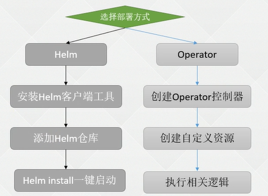

### 中间件容器化Operator&Helm

---

#### 1.1 容器化中间件部署

 

容器化好处：可以非常方便的部署

+ 单实例部署
+ 集群模式部署

> 学习部署逻辑，举一反三；流程都是一样的

传统架构和集群模式下的区别....


#### 1.2 部署应用至K8s通用步骤

步骤：

1. 必须了解要部署的这个东西

   + 架构、配置、端口号、启动命令

2. 其次要有这个东西的镜像

   + 镜像谁来做

3. 找到一个比较合适的部署方式

   + 是否有状态的
   + 配置分离
   + 部署文件来源
   + 如何部署

4. 这个程序如何被使用

   + 协议TCP、HTTP
   + 内部还是外部

   

#### 1.3 Helm 安装 Kafka、Zookeeper

 

Helm 客户端安装：https://helm.sh/docs/intro/install/

添加仓库

+ bitnami
+ helm

```YAML
helm repo add bitnami https://charts.bitnami.com/bitnami
helm repo add stable https://charts.helm.sh/stable
```

安装方式：先下载再安装

```YAML
# helm search repo zookeeper
NAME                            CHART VERSION   APP VERSION     DESCRIPTION
bitnami/zookeeper               11.1.5          3.8.1           Apache ZooKeeper provides a reliable, centraliz...
bitnami/dataplatform-bp2        12.0.5          1.0.1           DEPRECATED This Helm chart can be used for the ...
bitnami/kafka                   21.4.2          3.4.0           Apache Kafka is a distributed streaming platfor...
bitnami/schema-registry         9.0.1           7.3.2           Confluent Schema Registry provides a RESTful in...
bitnami/solr                    7.2.1           9.1.1           Apache Solr is an extremely powerful, open sour...
 
# helm pull bitnami/zookeeper
# 下载完成后是一个 tgz的包，解压
# tar -zxvf zookeeper-11.1.5.tgz
# 
```

更改配置

+ 副本数、auth、持久化

```YAML
vim zookeeper/values.yaml
```

安装

```YAML
# cd zookeeper
# kubectl create ns zookeeper
# helm install -n zookeeper zookeeper .
```

查看

```YAML
# kubectl get pod -n zookeeper
NAME          READY   STATUS              RESTARTS   AGE
zookeeper-0   0/1     ContainerCreating   0          33s
zookeeper-1   0/1     ContainerCreating   0          33s
zookeeper-2   0/1     ContainerCreating   0          33s
```

> 安装 Kafka 需要指定zookeeper

在安装kafka的 helm中有zookeeper，如果有外部zookeeper设置 zookeeper.enable=false 指定 externalZookeeper.servers=zookeeper(zookeeper的svc) 


