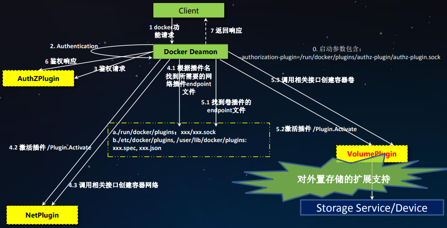
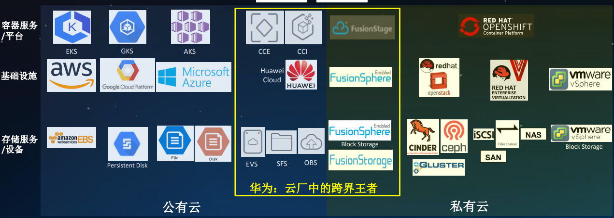
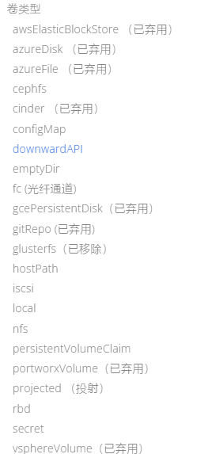
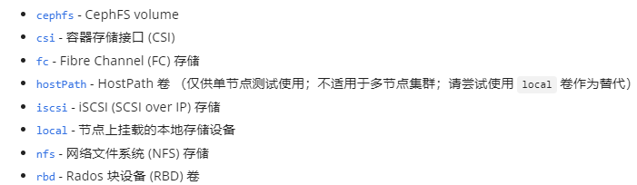
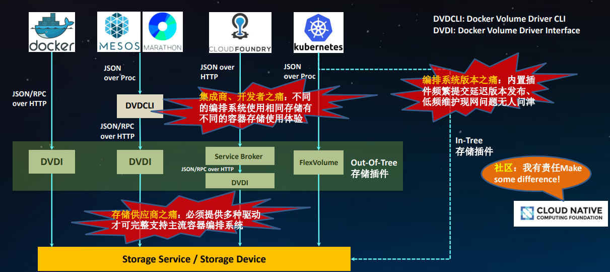
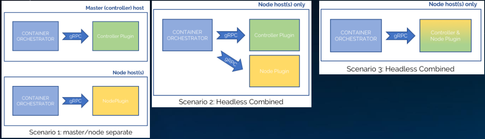
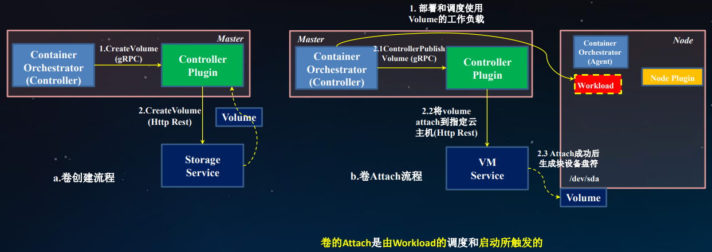
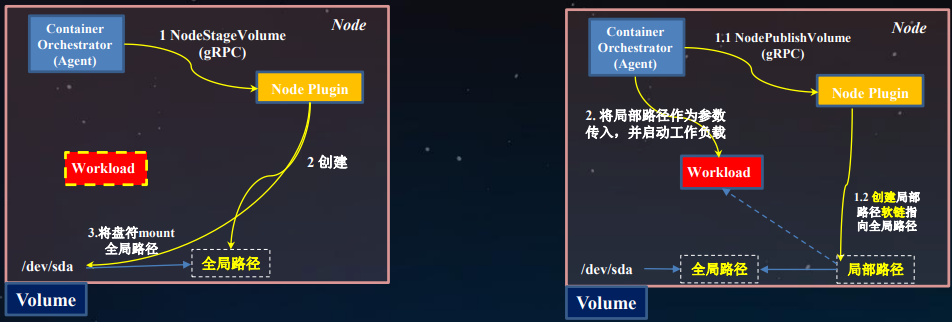
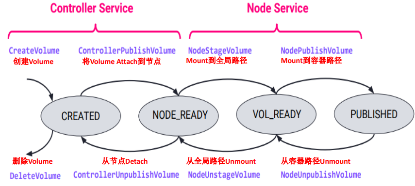
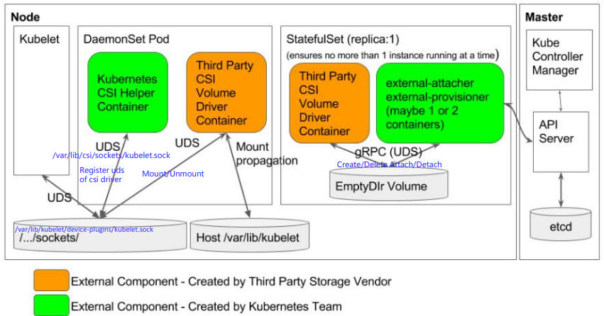

项目原理刨析&实践

---

大纲

+ K8s存储整体框架及原理解析
+ K8s FlexVolume存储扩展机制
+ K8s CSI存储扩展机制


#### Docker 插件机制-架构&评价

 

背景：

​		在云领域 docker 是面向无状态应用的，相关应用都是从物理机或虚拟机 做容器化改造完成后，作为容器运行 或相关交付，初期还有些日志打在容器，久而久之配置文件，定期更新业务的数据、DB、分布式缓存，如果只是放在镜像中，镜像挂了，数据没办法保存；

> docker做了一个插件框，在docker中是一个体系（支持 认证、网络、存储等）

在 volume Plugin中，docker 只提供一条卷插件的API，基于JSON和RPC的，各种存储厂商需要上私有公有云都会通过 Docker VolumePlugin interfac接口取定义存储接口；


> 2017 k8s称为了业界标准的容器编排工具


#### 支持Kubernetes的平台和存储服务

 

第一层：k8s + docker CNCF的标配

容器服务平台：基于上两种开源技术的平台

基础设施层：提供k8s平台的管里面和数据面的一个节点，对应的IAAS的提供商

存储服务：非常多卷的插件


#### K8s存储能力 - Volume概述

K8s中的普通存储 Volume 提供了在容器中挂在卷的能力，它不是独立的K8s资源对象，不同通过K8s取管理（创建删除等），只能在创建Pod时去引用。

Pod需要设置卷的来源（spec.volume）和挂载点（spec.containers.volumeMounts）两个信息后才可以使用相应的Volume

下面是一个简单的Kubernetes应用程序示例，它挂载了华为云的OBS存储：

```yaml
apiVersion: apps/v1
kind: Deployment
metadata:
  name: my-app
spec:
  selector:
    matchLabels:
      app: my-app
  replicas: 3
  template:
    metadata:
      labels:
        app: my-app
    spec:
      containers:
        - name: my-app-container
          image: my-app-image:latest
          volumeMounts:
            - name: obs-storage
              mountPath: /mnt/obs
      volumes:
        - name: obs-storage
          flexVolume:
            driver: "hwc-csi-driver"
            options:
              accessKey: <your-access-key>
              secretKey: <your-secret-key>
```

内置插件 IN-Tree Volime Plugins 

https://kubernetes.io/zh-cn/docs/concepts/storage/volumes/

 

Volume 外部创建好，填好用，没有生命周期；演进到下一阶段：PV、PVC

#### K8S存储能力 - PV

> PV全称为Persistent Volume，即持久化存储卷

制备方式

+ 管理员手动
+ 存储类 Storage Class 动态制备

持久卷是集群资源，就像节点也是集群资源一样。PV 持久卷和普通的 Volume 一样， 也是使用卷插件来实现的，只是它们拥有独立于任何使用 PV 的 Pod 的生命周期。

PV 持久卷是用插件的形式来实现的。Kubernetes 目前支持以下插件：

 

> 容器应用（spec-volume） - > 卷需求模板（PVC）-> 数据卷定义（PV） -> 数据卷类型（StorageClass）


Flex Volume 架构

> 已被 Kubernetes 官方宣布弃用,推荐使用 CSI（Container Storage Interface）作为替代方案，CSI 提供了更好的安全性、性能和可扩展性


#### K8S CSI存储扩展机制

术语

+ CO：容器编排系统
+ RPC：远程方法调用
+ Plugin：插件实现
+ SP：存储提供商
+ Volume：卷
+ Blocak Volume：块设备卷
+ Workload：工作负载
+ CSI Volume Plugin：内置插件，适配第三方CSI卷曲度
+ CSI Volume Driver：CSI兼容的卷插件驱动

> 存储接口之痛

 


#### 容器存储届福音 CSI

 		k8s的CSI是在2018年开始使用的。这是由Kubernetes社区开发的一种规范，旨在为存储供应商提供一个标准接口，以便他们能够轻松地将其存储系统集成到Kubernetes中!

> gRPC是一种高性能、开源的远程过程调用（RPC）框架，由Google开发和维护

CSI通用架构

每个SP必须实现两个Plugin

+ Node Plugin：运行在使用 volume的node得上，负责 volume mount/unmount 等操作
+ Controller Plugin：运行在如何节点上，负责volume creation/DELETION、attach/detach等

CSI有以下三种可选的插件部署架构：

 


#### CO与Plugin的交互

> 卷的创建和Attach

 

盘挂载到节点

+ 可能是 sda ...
+ node Plugin 创建局部路径软链指向全局路径，workload将软链路径作为参数传入

 


> 删除


#### 卷的声明周期

 


#### K8S CSI架构

 

为了部署一个容器化的第三方CSI volume driver，存储提供商需要执行如下操作：

1. 创建一个实现CSI规范描述的插件功能，并通过Unix套接字来暴露gRPC访问接口的 ”CSI volume driver“ 容器；
2. 结合使用k8s团队提供的帮助容器来部署CSI volume driver，具体需要创建如下两类K8s对象
   1. StatefulSet：与k8s控制器交互，实例数1，包含3和容器，需要挂载一个挂载点
   2. DaemonSet：两个容器 CSI volume driver、K8s CSI Helper


> 在云常用，无论出方案也好，用的最多的 块、对象、文件


#### 扩展

1. 容器内的数据保存在镜像中，还是宿主机中

​		写随意的临时的日志，也不求定位问题的，放在容器内也无所谓，在生成环境需要读一些频繁更新的数据、记录一些日志能够挂载主机进行定位，还是挂载一个外部存储为宜。

​		容器挂了、业务迁移的、容器相关的配置信息都还在！

2. 应用的配置文件是存在volume还是configmap，有什么区别

​		如果存在volume外部存储，还需要将配置文件通过网络传输到存储上，各种各样存储可能有什么不便

​		configmap 本身就可以作为一个VolumeMounts，本身是一个key volue格式，像env，塞到configmap 可能是一个最优实践

3. 社区会考虑pv被哪些pod使用吗

​		存储到底为哪些应用可用，常用方法：标签、监控、PV限制

​		PV可以反推挂了哪些PVC，但是PVC被哪些Pod使用，可能都要遍历同namespac的Pod开查看

4.同一个文件存储，为什么可以同时挂载在多个集群

​		文件存储服务，是基于同一个vpc的认证，在同一个vpc下的集群 都可以挂载，ecs也是在同一个vpc下；vpc满足同一个区域都可以挂载

5. 云存储使用的限制，可以挂载到多个实例？

> 块存储

性能最好，用户从虚拟机和物理机迁移上来，最先想到的性能快，使用块存储，但是块存储性能好

​	缺点：文件系统时跟着宿主机走的，各大厂商的共享卷，IAAS的共享卷只能解决多节点挂载，业务上层如果没有多节点的分布式挂载，还是会读写不一致们相互写问题，最后将盘撑爆；

> 文件存储

基于主机的内网网络，处理sever端的负载处理能力，依赖宿主机的计算网卡的能力，网络时间要短、带宽大

> 对象存储

便宜，桶创建、赛数据，内外外网调用不收费，后台不会预留容量；后台的存储池


在特点场景下，适用限制，根据客户或者自己要上的业务，和业务的实际的量，和对应性能的要求，去选择对应的存储


