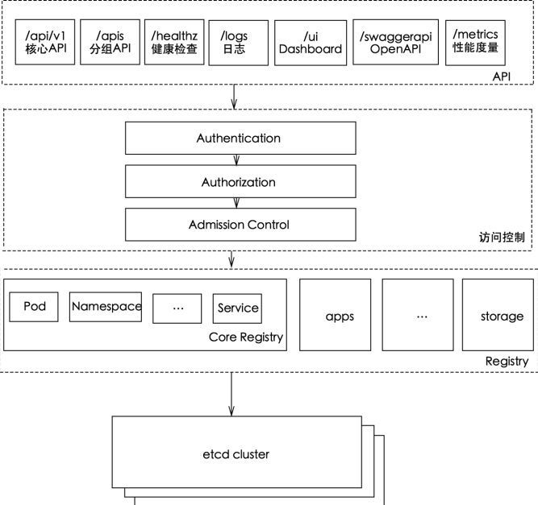
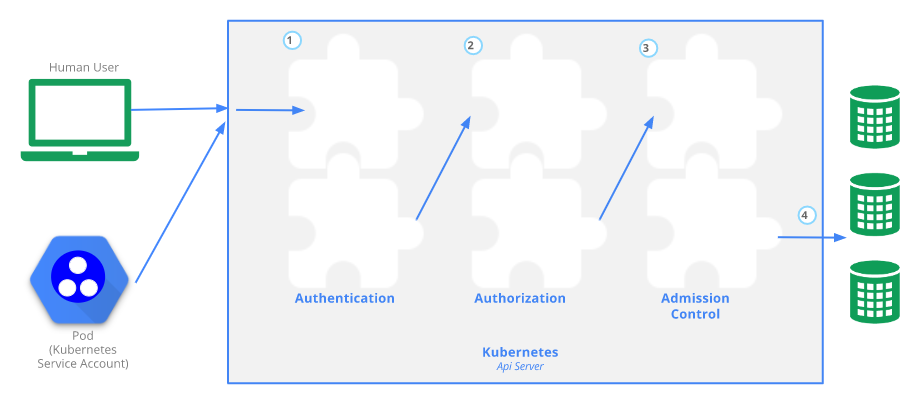
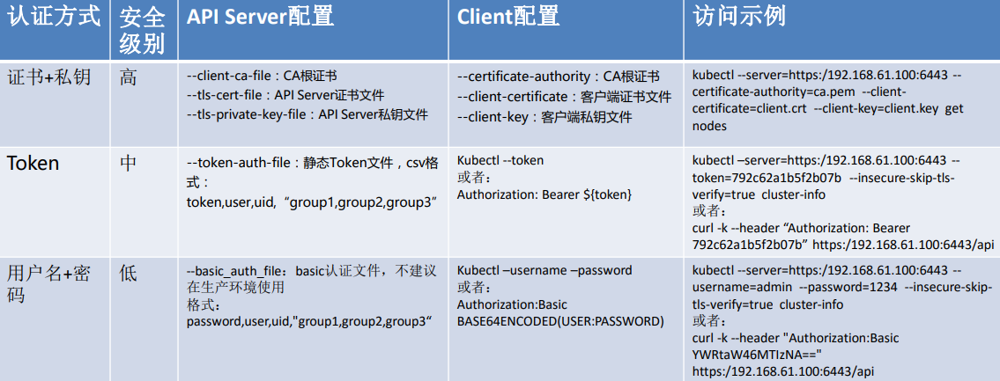
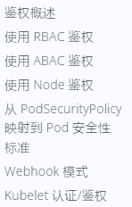
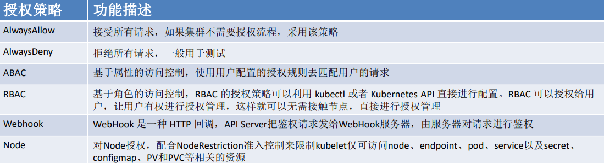

安全原理刨析

---

+ 认证与鉴权
+ 准入控制
+ Serveice Account
+ Secret

#### API Server

 

api sevrer：在集群数据库之前的类似api网关的功能，提供了一些API

+ 资源URL：Pod、svc等
+ 非资源URL：logs、healthz等

经过访问控制，请求才会真正的转发给etcd

 

访问K8S集群的资源需要过三关：认证、鉴权、准入控制。 

+ 普通用户若要安全访问集群API Server，往往需要证书、token、用户名-密码；Pod访问，需要ServiceAccount

+ K8S安全控制框架主要由下面3个阶段进行控制，每一个阶段都支持插件方式，通过API Server配置来启用插件 ① Authentication 

  ② Authorization

  ③ Admission Control

#### 认证

 

#### 授权

 

用户通过认证后，对指定的资源是否有权限访问，还需要经过授权环节。授权主要是用于对集群资源的访问控制，通过检查请求 包含的相关属性值，与相对应的访问策略相比较，API请求必须满足某些策略才能被处理 

+ Kubernetes授权仅处理以下的请求属性： 

  ① user, group, extra

  ② API、请求方法（如get、post、update、patch和delete）和请求路径（如/api） 

  ③ 请求资源和子资源 

  ④ Namespace 

  ⑤ API Group

  API Server支持多种授权策略，通过启动参数“--authorization_mode”设置，可以同时启用多种策略

 

K8s最危险的，node和master 控制时要很严格，node时客户可以接触到的；

ABAC静态配置 json 不灵活，还需要重启API-server

RBAC（Role-Based Access Control），允许通过Kubernetes API 动态配置策略。 

+ RBAC被映射成四种K8S顶级资源对象： -
  + 角色(Role)：Role、ClusterRole 
    + 角色表示一组权限的规则，累积规则 
    + Role适用带namespace的资源，ClusterRole适用集群资源或非资源API 
  + 建立用户与角色的映射/绑定关系：RoleBinding、ClusterRoleBinding 
    + RoleBinding和ClusterRoleBinding的区别在于是否是namespace的资源 
    + 角色绑定包含了一组相关主体（即subject, 包括用户、用户组、或者Service Account）以及对被授予角色的引用

#### Secret

保存铭感信息

+ 密码
+ 令牌
+ 证书
+ 等等

三种使用方式

+ volume挂载到Pod的容器
+ 环境变量
+ kubelet为Pod拉去镜像时使用（imagePullSecret）

#### ServiceAccount使用

让Pod访问api-server

+ 容器应用读取/var/run/secrets/kubernetes.io/serviceaccount/token文件，使用token认证方式访问API Server - client-go做了封装 

+ Kubectl使用ServiceAccount token访问API Server

   ① 查看指定namespace(如default)下的ServiceAccount，获取Secret

   ② 查看Secret，获取token 

  ③ 设置kubeconfig中设置token

   ④ 使用kubectl访问

#### 总结

API Server安全框架三类

+ 认证
+ 鉴权
+ 准入控制
  + ABAC：没人用
  + RBAC：常用
    + 四类资源对象：role、clusterrole、rolebading、clusterrolebading

用户名、密码、敏感信息存在secret中

容器访问apiserver：volume、环境变量、sa

