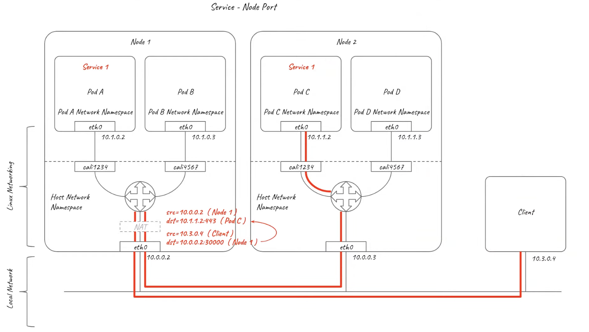

- [📒doc](#doc)
  - [🏗️ Kubernetes 架构](#️-kubernetes-架构)
      - [Worker 节点](#worker-节点)
  - [🧩 Kubernetes 与Docker](#-kubernetes-与docker)
  - [🎲 Kubernetes 组件](#-kubernetes-组件)
    - [控制平面组件](#控制平面组件)
      - [kube-apiserver](#kube-apiserver)
      - [etcd](#etcd)
      - [kube-scheduler](#kube-scheduler)
      - [kube-controller-manager](#kube-controller-manager)
    - [Node 组件](#node-组件)
      - [kubelet](#kubelet)
      - [kube-proxy](#kube-proxy)
      - [容器运行时](#容器运行时)
    - [插件](#插件)
  - [📦 容器](#-容器)
    - [Image 镜像](#image-镜像)
      - [拉取策略](#拉取策略)
      - [更新方法](#更新方法)
      - [使用私有仓库](#使用私有仓库)
  - [🎨 工作负载](#-工作负载)
    - [Pod](#pod)
      - [Pod 的生命周期](#pod-的生命周期)
      - [容器探针](#容器探针)
      - [干扰（Disruptions）](#干扰disruptions)
      - [Pod QoS 类](#pod-qos-类)
    - [Deployments](#deployments)
    - [ReplicaSet](#replicaset)
    - [StatefulSet](#statefulset)
  - [🕸️ NetWork](#️-network)
    - [Service](#service)
      - [Service - ClusterIP](#service---clusterip)
      - [Service - NodePort](#service---nodeport)
      - [Service - LoadBalance](#service---loadbalance)
    - [Ingress Networking](#ingress-networking)
    - [服务发现](#服务发现)
    - [网路策略](#网路策略)
    - [Service 与 Pod 的 DNS](#service-与-pod-的-dns)
  - [🗳️ Volume](#️-volume)
    - [Type](#type)
    - [**持久卷** PV](#持久卷-pv)
    - [PVC **持久卷申领**](#pvc-持久卷申领)
  - [📜 配置](#-配置)
    - [ConfigMap](#configmap)
    - [Secret](#secret)
  - [🔐 安全](#-安全)
    - [云原生安全概述](#云原生安全概述)
  - [🧬 策略](#-策略)
    - [限制范围](#限制范围)
    - [资源配额](#资源配额)
    - [进程 ID 约束与预留](#进程-id-约束与预留)
  - [⚖️ 调度、抢占和驱逐](#️-调度抢占和驱逐)
    - [Kubernetes 调度器](#kubernetes-调度器)
    - [将 Pod 指派给节点](#将-pod-指派给节点)
    - [Pod 拓扑分布约束](#pod-拓扑分布约束)
      - [分布约束定义](#分布约束定义)
    - [污点和容忍度](#污点和容忍度)
    - [调度器性能调优](#调度器性能调优)
      - [设置阈值 ](#设置阈值-)
      - [节点打分阈值](#节点打分阈值)
# 📒doc

## 🏗️ Kubernetes 架构

 


#### Worker 节点

Kubernetes 通过将容器放入在节点（Node）上运行的 Pod 中来执行你的[工作负载](https://kubernetes.io/zh-cn/docs/concepts/workloads/)

可以是：

+ 物理机
+ 虚拟机


## 🧩 Kubernetes 与Docker

Kubernetes 和 Docker 不是选择使用其中的一个，而是在需要时完美地结合在一起，发挥出彼此的最佳功能

比如现在有一个程序：

+ 前端：js
+ 数据库：使用java连接
+ API：python提供

使用纯粹的Docker方法部署应用程序， 甚至使用docker commpose，需要三个dcoker 容器。

作为运维工程师，我的第一直觉是：已经有了部署堆栈的脚本，并且可以多次部署。

但是：

+ 当开始按比例缩放时，需要找到最有效的方法来应对负载，识别并解决逐步扩展时的用户问题。
+ 因此这就是Kubernetes的来源：允许使用现有的Docker应用程序，精心策划并更加有效地利用服务器和空间。
+ kubernetes分为主节点和worker节点，在worker节点上托管应用程序（docker 容器）如何开始，停止，更新之类的事情。

kubernetes提供的优势

1. 使部署，开发更容易，并且提供监控工具
2. 扩所容、故障恢复、并且具有负载均衡、服务发现等功能


## 🎲 Kubernetes 组件

工作节点会托管 [Pod](https://kubernetes.io/zh-cn/docs/concepts/workloads/pods/)，而 Pod 就是作为应用负载的组件。

 

### 控制平面组件

#### kube-apiserver

负责公开了 Kubernetes API，负责处理接受请求的工作,是 Kubernetes 控制平面的前端。

#### etcd

一致且高可用的键值存储，用作 Kubernetes 所有集群数据的后台数据库。

#### kube-scheduler

负责监视新创建的、未指定运行[节点（node）](https://kubernetes.io/zh-cn/docs/concepts/architecture/nodes/)的 [Pods](https://kubernetes.io/zh-cn/docs/concepts/workloads/pods/)， 并选择节点来让 Pod 在上面运行

调度决策考虑的因素: 

+  包括单个 Pod 及 Pods 集合的资源需求
+ 软硬件及策略约束
+  亲和性及反亲和性规范
+ 数据位置
+ 工作负载间的干扰及最后时限。

#### kube-controller-manager

负责运行[控制器](https://kubernetes.io/zh-cn/docs/concepts/architecture/controller/)进程

从逻辑上讲， 每个[控制器](https://kubernetes.io/zh-cn/docs/concepts/architecture/controller/)都是一个单独的进程， 但是为了降低复杂性，它们都被编译到同一个可执行文件，并在同一个进程中运行。

有许多不同类型的控制器，例如：

1. Node Controller：负责在节点出现故障时进行通知和响应
2. EndpointSlice controller：提供 Service 和 Pod 之间的链接。
3. replicas controller：通过控制Pod的副本数量

---

### Node 组件

节点组件会在每个节点上运行，负责维护运行的 Pod 并提供 Kubernetes 运行环境。

#### kubelet

保证[容器（containers）](https://kubernetes.io/zh-cn/docs/concepts/overview/what-is-kubernetes/#why-containers)都运行在 [Pod](https://kubernetes.io/zh-cn/docs/concepts/workloads/pods/) 中，接受PodSpec，确保这些 PodSpec 中描述的容器处于运行状态且健康

#### kube-proxy

集群中每个[节点（node）](https://kubernetes.io/zh-cn/docs/concepts/architecture/nodes/)上所运行的网络代理， 实现 Kubernetes [服务（Service）](https://kubernetes.io/zh-cn/docs/concepts/services-networking/service/) 概念的一部分。

+ kube-proxy 维护节点上的一些网络规则， 这些网络规则会允许从集群内部或外部的网络会话与 Pod 进行网络通信。

#### 容器运行时

> Container Runtime

使 Kubernetes 能够有效运行容器。 它负责管理 Kubernetes 环境中容器的执行和生命周期。

支持许多容器运行环境

+  [containerd](https://containerd.io/docs/)
+ docker
+  [CRI-O](https://cri-o.io/#what-is-cri-o) 

---

### 插件

插件使用 Kubernetes 资源（[DaemonSet](https://kubernetes.io/zh-cn/docs/concepts/workloads/controllers/daemonset/)、 [Deployment](https://kubernetes.io/zh-cn/docs/concepts/workloads/controllers/deployment/) 等）实现集群功能。 因为这些插件提供集群级别的功能，插件中命名空间域的资源属于 `kube-system` 命名空间。

DNS：coredns（提供 DNS 服务）

CNI：calico （实现容器网络接口）负责为 Pod 分配 IP 地址，并使这些 Pod 能在集群内部相互通信

Web 界面：Dashborand


## 📦 容器

### Image 镜像

> 镜像：承载的是封装了应用程序及其所有软件依赖的二进制数据。 容器镜像是可执行的软件包，可以单独运行

通常会创建应用的容器镜像并将其推送到某仓库（Registry），然后在 [Pod](https://kubernetes.io/zh-cn/docs/concepts/workloads/pods/) 中引用它。

#### 拉取策略

默认镜像策略：`IfNotPresent` , 拉取策略

1. Always
2. never
3. ifnotpresent

🧡如果没有指定`imagePullPolicy`

+ 有指定镜像tag，但非`latest`： ifnotpresent
+ 指定镜像tag为`latest`：Always
+ 未指定镜像tag：Always

#### 更新方法

更新镜像的方法：

1. kubectl apply yaml文件
2. kubectl set images
3. kubectl edit

💛 ImagePullBackOff

当 kubelet 使用容器运行时创建 Pod 时，容器可能因为 `ImagePullBackOff` 导致状态为 [Waiting](https://kubernetes.io/zh-cn/docs/concepts/workloads/pods/pod-lifecycle/#container-state-waiting)。

或者从私有仓库拉取没有：

+ imagePullSecret

Kubernetes 将继续尝试拉取镜像，并增加回退延迟（即 300 秒）

+ BackOff


#### 使用私有仓库

从私有仓库读取镜像时可能需要密钥，方式

1. 所有节点登录 仓库
2. 在 Pod 中设置 ImagePullSecrets

```sh
kubectl create secret docker-registry <name> \
  --docker-server=DOCKER_REGISTRY_SERVER \
  --docker-username=DOCKER_USER \
  --docker-password=DOCKER_PASSWORD \
  --docker-email=DOCKER_EMAIL
```


## 🎨 工作负载

### Pod

#### Pod 的生命周期

起始于 `Pending` [阶段](https://kubernetes.io/zh-cn/docs/concepts/workloads/pods/pod-lifecycle/#pod-phase)， 如果至少其中有一个主要容器正常启动，则进入 `Running`，之后取决于 Pod 中是否有容器以失败状态结束而进入 `Succeeded` 或者 `Failed` 阶段。

Pod 在其生命周期中只会被[调度](https://kubernetes.io/zh-cn/docs/concepts/scheduling-eviction/)一次

+  一旦 Pod 被调度（分派）到某个节点，Pod 会一直在该节点运行，直到 Pod 停止或者被[终止](https://kubernetes.io/zh-cn/docs/concepts/workloads/pods/pod-lifecycle/#pod-termination)。

| 取值                | 描述                                                         |
| :------------------ | :----------------------------------------------------------- |
| `Pending`（悬决）   | Pod 已被 Kubernetes 系统接受，但有一个或者多个容器尚未创建亦未运行。此阶段包括等待 Pod 被调度的时间和通过网络下载镜像的时间。 |
| `Running`（运行中） | Pod 已经绑定到了某个节点，Pod 中所有的容器都已被创建。至少有一个容器仍在运行，或者正处于启动或重启状态。 |
| `Succeeded`（成功） | Pod 中的所有容器都已成功终止，并且不会再重启。               |
| `Failed`（失败）    | Pod 中的所有容器都已终止，并且至少有一个容器是因为失败终止。也就是说，容器以非 0 状态退出或者被系统终止。 |
| `Unknown`（未知）   | 因为某些原因无法取得 Pod 的状态。这种情况通常是因为与 Pod 所在主机通信失败。 |

Kubernetes 会跟踪 Pod 中每个容器的状态，就像它跟踪 Pod 总体上的[阶段](https://kubernetes.io/zh-cn/docs/concepts/workloads/pods/pod-lifecycle/#pod-phase)一样。 

容器的状态 三种：

1. `Waiting`（等待）
2. `Running`（运行中）
3.  `Terminated`（已终止）


#### 容器探针

**probe** 是由 [kubelet](https://kubernetes.io/zh-cn/docs/reference/command-line-tools-reference/kubelet/) 对容器执行的定期诊断。

探针来检查容器有四种不同的方法：

1. exec：在容器内执行指定命令。如果命令退出时返回码为 0 则认为诊断成功。
2. grpc：使用 [gRPC](https://grpc.io/) 执行一个远程过程调用
3. httpget：对容器的 IP 地址上指定端口和路径执行 HTTP `GET` 请求
4. tcpsocket：对容器的 IP 地址上的指定端口执行 TCP 检查。如果端口打开，则诊断被认为是成功的。

结果三种：`Success `、 `Failure`、`Unknown`

探测的三种类型：

**livenessProbe**

+ 指示容器是否正在运行

**readinessProbe**

+ 指示容器是否准备好为请求提供服务。

**startupProbe**

+ 指示容器中的应用是否已经启动。如果提供了启动探针，则所有其他探针都会被 禁用，直到此探针成功为止。


#### 干扰（Disruptions）

Pod 不会消失，除非有人（用户或控制器）将其销毁，或者出现了不可避免的硬件或软件系统错误。

称为应用的**非自愿干扰（Involuntary Disruptions）**

- 节点下层物理机的硬件故障
- 集群管理员错误地删除虚拟机（实例）
- 云提供商或虚拟机管理程序中的故障导致的虚拟机消失
- 内核错误
- 节点由于集群网络隔离从集群中消失
- 由于节点[资源不足](https://kubernetes.io/zh-cn/docs/concepts/scheduling-eviction/node-pressure-eviction/)导致 pod 被驱逐。

除了资源不足的情况，称其他情况为**自愿干扰**，包括

1. 删除 Deployment 或其他管理 Pod 的控制器
2. 更新了 Deployment 的 Pod 模板导致 Pod 重启
3. 直接删除 Pod（例如，因为误操作）

集群管理员操作包括：

- [排空（drain）节点](https://kubernetes.io/zh-cn/docs/tasks/administer-cluster/safely-drain-node/)进行修复或升级。
- 从集群中排空节点以缩小集群（了解[集群自动扩缩](https://github.com/kubernetes/autoscaler/#readme)）。
- 从节点中移除一个 Pod，以允许其他 Pod 使用该节点。


#### Pod QoS 类

> 服务质量

可选的 QoS 类有：

1.  `Guaranteed`：最不可能面临驱逐，具有最严格的资源限制
2. ``Burstable` 
3.  `BestEffort`

当一个 Node 耗尽资源时，Kubernetes 将首先驱逐BestEffort


🧡 判断

Pod 被赋予 `Guaranteed` QoS 类的几个判据：

- Pod 中的每个容器必须有内存 limit 和内存 request。
- 对于 Pod 中的每个容器，内存 limit 必须等于内存 request。
- Pod 中的每个容器必须有 CPU limit 和 CPU request。
- 对于 Pod 中的每个容器，CPU limit 必须等于 CPU request。


Pod 被赋予 `Burstable` QoS 类的几个判据：

- Pod 不满足针对 QoS 类 `Guaranteed` 的判据。
- Pod 中至少一个容器有内存或 CPU 的 request 或 limit。


如果 Pod 不满足 `Guaranteed` 或 `Burstable` 的判据，则它的 QoS 类为 `BestEffort`。 换言之，只有当 Pod 中的所有容器没有内存 limit 或内存 request，也没有 CPU limit 或 CPU request 时，Pod 才是 `BestEffort`。


### Deployments

一个 Deployment 为 [Pod](https://kubernetes.io/zh-cn/docs/concepts/workloads/pods/) 和 [ReplicaSet](https://kubernetes.io/zh-cn/docs/concepts/workloads/controllers/replicaset/) 提供声明式的更新能力。

### ReplicaSet

保证给定数量的、完全相同的 Pod 的可用性。

### StatefulSet

管理有状态应用

为这些 Pod 提供持久存储和持久标识符

稳定的存储：

+ 每个 Pod 接收到一个PVC，会通过SC制备PV，在Pod删除后，与PVC相关联的PV并不会被删除


## 🕸️ NetWork

### 了解网络

#### 容器网络

需要真正的了解网路在Kubernetes中的工作原理

Kubernetes中存在三种类型的网路：

1. node 网路
2. cluster 网络 ： 集群内部和外部的网络
3. Pod 网络

 

> 最基本也是最复杂的部分

一切都在变得虚拟化，包括网络也是

从网络的OSI来时，它是一切网络的开始，需要知道OSI网络模型的工作原理，然后了解一些关键的网络设备，例如路由器、交换机、以及数据包如何通过网络中设备传输的。

了解网络的namespace、，这对于理解容器网络非常有帮助，通过在几个虚拟机上创建虚拟网络并将它们桥接在一起，来模拟容器内部。

##### 🧡 OSI模型

放系统互连模型，最初有7层，单后来不再需要关注两层，所以只关注5层。

| 层   | name       | protocol      | data unit | 寻址方案 |
| ---- | ---------- | ------------- | --------- | -------- |
| 1    | 应用层     | HTTP/SMTP/... | 数据      | N/A      |
| 2    | 传输层     | TCP/UDP       | 数据段    | Port     |
| 3    | 网路层     | IP            | 数据包    | IP地址   |
| 4    | 数据链路层 | Ethernet/WIFI | 数据帧    | MAC 地址 |
| 5    | 物理层     | 物理介质      | Bits      | N/A      |

物理层：有线、无线、电缆、光纤每一种都有精确的协议

数据链路层：取决于有线还是无线，是点对点（p2p）的

网路层：网路层帮助 Ethernet 构建从源到目的地的地方

传输层

应用层

##### 🧡 网络适配器 & 路由器 & 交换机

网路适配器：网络接口卡，提供以太网接口

路由器；维护一张路由表

交换机：维护的是MAC地址表（MAC - IP）

这些不仅仅是物理的，也可以在代码中创建，这就是虚拟机的实际情况，因为虚拟实际上并不存在主机之外，他们拥有的网路适配器的所有东西，使用的都是虚拟化的。


💛观察物理网路和虚拟网络，一切都是如何工作的：


 


PC端 他们都在同一子网上，通过交换机（以太网）可以直接进行相互通信。

如何向访问互联网：内部私有IP，无法从外部对其进行寻址，通过NAT转换成外部IP（维护一张NAT映射表）。

   

windows上按照了虚拟化软件 - [ ubuntu1 ubuntu2]

+ 定义了一个虚拟接口或者网卡，都在192的网段内
+ 还定义了一个虚拟的交换机 或者 网桥
+ 为计算机定义了一个虚拟网络适配器，所以上面可以看到有两个适配器，所以现在这个设备 主机变成了一个路由器

所以不必是专用的物理设备

还可以在每个虚拟机中创建容器，使用所谓的 `namespac	` 来模拟容器网络。基本上和上面是同样的事情。


##### 🧡 网路namespace

网路`namespac`：提供与网路相关的系统资源的隔离，因为基本上在主机内，可以声明一个区域，某个区域作为边界

+ 该网段有自己的网路设备，即交换机或网桥
+ ipv4 和 ipv6
+ 路由表
+ 防火墙规则
+ 端口号 ... 等

这就是容器的实际创建方式，容器是在 namespace内创建的

网桥或者虚拟以太网接口被构建为连接虚拟虚拟互联网接口，并且可以被任务是虚拟的 patch 表。

  

每个容器有一个虚拟以太网接口，有一个IP地址，可以连接到网桥。会自动创建两个网路接，一端是有一个IP地址，另一段连接桥的没有，所以做到了隔离这个区域。

两个VM之间的容器（同一个子网），通过创建一个交换机但是在主机本身上，如果这两个虚拟机位于不同的子网上，可以使用隧道。


##### 🧡 如何创建两者之间的隧道

如果位于不同的子网：（简单的路由操作将不起作用）

> 需要另外一种策略

+ 覆盖网络 overlay 发挥作用的地方

实际上是一个虚拟网络，位于底层网络之上，是虚拟化的，通过它 在提供的虚拟环境容器在与另一台服务器上的容器之间的连接。

广泛用于 docker 和 kubernetes

有不同类型的 overaly 网络，有些在第二层运行，例如VXLAN（在UDP内以太网封装），第三层封装的overlay网络：calico，在kubernets中使用，它使用IP-IP协议，将IP或数据包封装在另外一个IP中，然后将IP路由到不同服务器。

示例：

 

显然之间有个路由器，只是为了在两个不同的服务器上的容器之间提供连接。

所以：需要制定策略

+ 在两天服务器直接简历一条隧道UDP隧道，该隧道每侧具又不同的IP，位于不同的子网
+ 网桥通过隧道口IP连接到隧道
+ 通信的所有内容被封装在UDP中，一端发送到另外一端。

上述都是可以代码实现：

+ 可以是三层的 socat 连接 （TUN）- 点对点虚拟网络设备，用于路由层次的数据包
+ 也可以是二层的 socat连接 （TAP）- 二层（链路层）虚拟网络设备，用于以太网层次的数据包。


### Pod网络、CNI和Flannel CNI插件

##### kubernetes Pod网络

kubernets 强加了一些网络规则，这些规则是：

1. 所有的Pod可以在所有节点上相互通信；
2. 节点上的代理，可以与该节点上的所有Pod通信；（代理 - 世纪意味着 Kubernetes Service），所有的Service可以与特点节点上的Pod进行通信；
3. 没有 NAT（网路地址转换） - 每个部分都获取它的IP地址，并且用于从其他Pod或Service寻址特定的Pod

这些网路规则的基本原理非常简单，可以隐藏实现细节和服务发现

首先了解：

+ Node网路：每个节点都有自己的IP地址，从DHCP或者是静态配置的IP，集群的节点可以彼此自由通信
+ Pod网路：Pod可以位于不同的节点上，非常重要的是都有IP地址，以便可以在集群上的如何为主进行寻址。要么从网路检索，要么常见的是CIDR的IP地址范围内分配
+ 集群网络：由Service提供，Service的IP地址是IP地址范围分配的。由 API-server 和 contamanager管理配置的一部分，因此默认情况下它具有IP。

> 使用kubernetes CNI容器网络接口提供的程序时，通常有一个IP地址池用于为Pod分配IP地址。

Kubernetes中的网路分为三种

1. Pod
2. Node
3. Cluster


示例：

  


节点上创建一个Pod、Pod中有两个容器

+ Pod中多个容器是共享一个IP地址 的，因此每个容器没有自己的Ip地址，Pod中容器可以通过 localhost通信。

多个Pod：

+ 每个Pod都有自己的IP
+ 通信方式：通过桥接器，取决于CNI的提供者，假设提供了一个桥，桥也会连接到节点的网络接口

节点直接：

+ 通过 Overlay 或者 Layer2/3，会提高网络直接的复杂性，可以看起来像是所有Pod都在一个网路上，这样简化了网络


##### CNI

CNI是一个由CNCF管理的开源项目，目标是提供用于编写在Linux容器中配置网络接口的插件的规范和库，以及许多受支持的库。

因此，CNI只关系容器的网络连接，并在容器删除时删除分配资源。

> 之前可以手动创建网络接口、网桥、隧道 ，CNI实际上是自动化了这些，所以我们不必手动去执行此操作。实际上CNI就是提供了之前手动创建的那些服务。

CNI：实际上并不管理 Kubernetes 部分网络，而是一切都是通过CNI插件进行管理的，有各种插件，比如

+ Flannel
+ Calico

Kubernets 绝对不是唯一一个使用CNI的软件

当按照Kubernets时，必须安装CNI，并且有多种选择。


### Service

将运行在一个或一组 [Pod](https://kubernetes.io/zh-cn/docs/concepts/workloads/pods/) 上的网络应用程序公开为网络服务的方法。

[Endpoints](https://kubernetes.io/zh-cn/docs/reference/kubernetes-api/service-resources/endpoints-v1/) （复数形式）定义的是网络端点的列表，通常由 Service 引用， 以定义可以将流量发送到哪些 Pod。

> calico

 

calico：使用虚拟以太网接口将各部分连接到主机，并将Linux 内核设置充当所有内容连接在一起的简单虚拟路由器。

#### Service - ClusterIP

当 Pod A--> Pod D（Service 1）-虚拟IP地址：Linux 内核拦截与Cluster IP的连接，并且在每个Service下的Pod之间对它们进行负载均衡

+ 例如：PodD访问 Service -ClusterIP时，连接就会被拦截，并使用映射网络地址转换技术NET，将目标的ClusterIP更改为所选的Pod IP

#### Service - NodePort

外部客户端连接到集群中如何节点上的节点端口，连接就会被拦截，并且目的IP会从node IP和node port 记录到所选的 Service-ClusterIP 和 Service端口。 

如果只有目的地是匹配的，从其他节点的端口返回数据包将直接发送到客户端，客户端将不知道如何处理数据包。

+ 因为不是来自节点，并且可能认为它在连接，因为为了避免

  

流量的回路：

  

这种方式的缺点是：Kubernetes 网络现在的应用到支持calico的策略无法限制对特定外部客户端的访问，因为客户端的IP被网络隐藏。

#### Service - LoadBalance

> 负载均衡器

动态的为服务分配外部网络负载均衡器网络，LB取决于运提供厂商，然后使用节点端口在节点之间分配连接，大多数的节点负载均衡器会保留客户端的 源IP地址 ，但因为流量任然会通过默认情况下，我们的节点端口支持Pod本身看不到客户端IP，除非是要保留源IP的代理替代方案。

 

 

### Ingress Networking

> 应用程序出负载平衡，提供对集群外部服务的访问

 将 Ingress 负载均衡器作为集群本身的一部分运行

 

Ingress Pod 收到连接后，hui检查 HTTP 请求 URL以确定哪些服务是应该对请求进行负载均衡的，然后去单独的连接。

+ 因此：如图PodC的流量来自于PodB，而不是原始的客户端

 


因此：需要编写如何网络策略，因为流量返回时遵循反向中的相同路径节点端口

 


### 服务发现

持两种主要的服务发现模式：

1. 环境变量
2.  DNS

当 Pod 运行在某 Node 上时，kubelet 会在其中为每个活跃的 Service 添加一组环境变量

```sh
REDIS_PRIMARY_SERVICE_HOST=10.0.0.11
REDIS_PRIMARY_SERVICE_PORT=6379
REDIS_PRIMARY_PORT=tcp://10.0.0.11:6379
REDIS_PRIMARY_PORT_6379_TCP=tcp://10.0.0.11:6379
REDIS_PRIMARY_PORT_6379_TCP_PROTO=tcp
REDIS_PRIMARY_PORT_6379_TCP_PORT=6379
REDIS_PRIMARY_PORT_6379_TCP_ADDR=10.0.0.11
```

当你的 Pod 需要访问某 Service，并且你在使用环境变量方法将端口和集群 IP 发布到客户端 Pod 时

⚠️：必须在客户端 Pod 出现**之前**创建该 Service。 否则，这些客户端 Pod 中将不会出现对应的环境变量。


如果仅使用 DNS 来发现 Service 的集群 IP，则无需担心此顺序问题。

能够感知集群的 DNS 服务器（例如 CoreDNS）会：监视 Kubernetes API 中的新 Service，并为每个 Service 创建一组 DNS 记录。如果在整个集群中都启用了 DNS，则所有 Pod 都应该能够通过 DNS 名称自动解析 Service。

例如，如果你在 Kubernetes 命名空间 `my-ns` 中有一个名为 `my-service` 的 Service

+ 控制平面和 DNS 服务共同为 `my-service.my-ns` 生成 DNS 记录
+ 通过检索 `my-service.my-ns`。 将解析为分配给 Service 的集群 IP。


### 网路策略

希望在 IP 地址或端口层面（OSI 第 3 层或第 4 层）控制网络流量，可以使用（NetworkPolicy）

隔离类型：Ingress、egress

通过如下三个标识符的组合来辩识的：

1. 其他被允许的 Pods（podSelector）
2. 被允许的名字空间
3. IP 组块
4. Ports 端口 类型

示例：

```yaml
apiVersion: networking.k8s.io/v1
kind: NetworkPolicy
metadata:
  name: test-network-policy
  namespace: default
spec:
  podSelector:
    matchLabels:
      role: db
  policyTypes:
    - Ingress
    - Egress
  ingress:
    - from:
        - ipBlock:
            cidr: 172.17.0.0/16
            except:
              - 172.17.1.0/24
        - namespaceSelector:
            matchLabels:
              project: myproject
        - podSelector:
            matchLabels:
              role: frontend
      ports:
        - protocol: TCP
          port: 6379
  egress:
    - to:
        - ipBlock:
            cidr: 10.0.0.0/24
      ports:
        - protocol: TCP
          port: 5978
```

### Service 与 Pod 的 DNS

Kubernetes 为 Service 和 Pod 创建 DNS 记录。 你可以使用一致的 DNS 名称而非 IP 地址访问 Service。

DNS 查询可以使用 Pod 中的 `/etc/resolv.conf`

```sh
nameserver 10.32.0.10
search <namespace>.svc.cluster.local svc.cluster.local cluster.local
options ndots:5
```

除了无头 Service 之外的 “普通” Service 会被赋予一个形如 `my-svc.my-namespace.svc.cluster-domain.example` 的 DNS A 和/或 AAAA 记录

---


## 🗳️ Volume

### Type

Kubernetes 支持很多类型的卷。 [Pod](https://kubernetes.io/zh-cn/docs/concepts/workloads/pods/) 可以同时使用任意数目的卷类型。

常用：

+ cephfs
+ configMap
+ secret
+ emptyDir
+ hostpath
+ local
+ nfs
+ pvc


### **持久卷** PV

是集群中的一块存储，可以由管理员事先制备， 或者使用[存储类（Storage Class）](https://kubernetes.io/zh-cn/docs/concepts/storage/storage-classes/)来动态制备

+ 此 API 对象中记述了存储的实现细节，无论其背后是 NFS、iSCSI 还是特定于云平台的存储系统。


### PVC **持久卷申领**

表达的是用户对存储的请求。

+ 概念上与 Pod 类似。 Pod 会耗用节点资源，而 PVC 申领会耗用 PV 资源。

申领：大小和访问模式

针对不同的问题用户需要的是具有不同属性（如，性能）


数据卷可以被 Retained（保留）、Recycled（回收）或 Deleted（删除）。

> 目前，仅 NFS 和 HostPath 支持回收（Recycle）

🧡 NFS - PV

```yaml
apiVersion: v1
kind: PersistentVolume
metadata:
  name: pv0003
spec:
  capacity:
    storage: 5Gi
  volumeMode: Filesystem
  accessModes:
    - ReadWriteOnce
  persistentVolumeReclaimPolicy: Recycle
  storageClassName: slow
  mountOptions:
    - hard
    - nfsvers=4.1
  nfs:
    path: /tmp
    server: 172.17.0.2
```

访问模式： （取决于卷的类型 / 驱动）

1. **ReadWriteOnce**
2. **ReadOnlyMany**
3. **ReadWriteMany**
4. **ReadWriteOncePod**


🧡 持久卷状态

每个持久卷会处于以下阶段（Phase）之一：

- `Available`

  卷是一个空闲资源，尚未绑定到任何申领

- `Bound`

  该卷已经绑定到某申领

- `Released`

  所绑定的申领已被删除，但是关联存储资源尚未被集群回收

- `Failed`

  卷的自动回收操作失败

---


## 📜 配置

### ConfigMap

来将非机密性的数据保存到键值对中

🧡 动机

将的配置数据和应用程序代码分开

>  ConfigMap 中保存的数据不可超过 1 MiB

使用四种方式来使用 ConfigMap 配置 Pod 中的容器：

1. 在容器命令和参数内
2. 容器的环境变量
3. 在只读卷里面添加一个文件，让应用来读取
4. 编写代码在 Pod 中运行，使用 Kubernetes API 来读取 ConfigMap

### Secret

Secret 是一种包含少量敏感信息例如密码、令牌或密钥的对象。

通过为 Secret 对象的 `type` 字段设置

| 内置类型                              | 用法                                     |
| ------------------------------------- | ---------------------------------------- |
| `Opaque`                              | 用户定义的任意数据                       |
| `kubernetes.io/service-account-token` | 服务账号令牌                             |
| `kubernetes.io/dockercfg`             | `~/.dockercfg` 文件的序列化形式          |
| `kubernetes.io/dockerconfigjson`      | `~/.docker/config.json` 文件的序列化形式 |
| `kubernetes.io/basic-auth`            | 用于基本身份认证的凭据                   |
| `kubernetes.io/ssh-auth`              | 用于 SSH 身份认证的凭据                  |
| `kubernetes.io/tls`                   | 用于 TLS 客户端或者服务器端的数据        |
| `bootstrap.kubernetes.io/token`       | 启动引导令牌数据                         |


## 🔐 安全

### 云原生安全概述

你可以分层去考虑安全性，云原生安全的 4 个 C 分别是

+ 云（Cloud）
+ 集群（Cluster）
+ 容器（Container）
+ 代码（Code）。

  

云原生安全模型的每一层都是基于下一个最外层，代码层受益于强大的基础安全层（云、集群、容器）。 

你无法通过在代码层解决安全问题来为基础层中糟糕的安全标准提供保护。


## 🧬 策略

### 限制范围

默认情况下， Kubernetes 集群上的容器运行使用的[计算资源](https://kubernetes.io/zh-cn/docs/concepts/configuration/manage-resources-containers/)没有限制

+ 可以在一个指定的[命名空间](https://kubernetes.io/zh-cn/docs/concepts/overview/working-with-objects/namespaces/)内限制集群资源的使用与创建。

一个 **LimitRange（限制范围）** 对象提供的限制能够做到：

- 每个 Pod 或 Container 最小和最大的资源使用量的限制。
- 对每个 [PersistentVolumeClaim](https://kubernetes.io/zh-cn/docs/concepts/storage/persistent-volumes/#persistentvolumeclaims) 能申请的最小和最大的存储空间大小的限制。
- 一种资源的申请值和限制值的比值的控制。
- 设对计算资源的默认申请/限制值，并且自动的在运行时注入到多个 Container 中。

当某命名空间中有一个 LimitRange 对象时，将在该命名空间中实施 LimitRange 限制。

```yaml
apiVersion: v1
kind: LimitRange
metadata:
  name: cpu-resource-constraint
spec:
  limits:
  - default: # 此处定义默认限制值
      cpu: 500m
    defaultRequest: # 此处定义默认请求值
      cpu: 500m
    max: # max 和 min 定义限制范围
      cpu: "1"
    min:
      cpu: 100m
    type: Container

```

### 资源配额

当多个用户或团队共享具有固定节点数目的集群时，人们会担心有人使用超过其基于公平原则所分配到的资源量。


### 进程 ID 约束与预留

Kubernetes 允许你限制一个 [Pod](https://kubernetes.io/zh-cn/docs/concepts/workloads/pods/) 中可以使用的进程 ID（PID）数目。 你也可以为每个[节点](https://kubernetes.io/zh-cn/docs/concepts/architecture/nodes/)预留一定数量的可分配的 PID， 供操作系统和守护进程（而非 Pod）使用。


## ⚖️ 调度、抢占和驱逐

### Kubernetes 调度器

在 Kubernetes 中，**调度** 是指将 [Pod](https://kubernetes.io/zh-cn/docs/concepts/workloads/pods/) 放置到合适的[节点](https://kubernetes.io/zh-cn/docs/concepts/architecture/nodes/)上，以便对应节点上的 [Kubelet](https://kubernetes.io/docs/reference/generated/kubelet) 能够运行这些 Pod。

调度器通过 Kubernetes 的监测（Watch）机制来发现集群中新创建且尚未被调度到节点上的 Pod。 

kube-scheduler 给一个 Pod 做调度选择时包含两个步骤：

1. 过滤
2. 打分

### 将 Pod 指派给节点

约束一个 [Pod](https://kubernetes.io/zh-cn/docs/concepts/workloads/pods/) 以便 **限制** 其只能在特定的[节点](https://kubernetes.io/zh-cn/docs/concepts/architecture/nodes/)上运行， 或优先在特定的节点上运行。

默认调度器会进行合理的放置，但是我们希望更加细粒度的调度时：

🧡 需要进一步控制 Pod 被部署到哪个节点：

- 与[节点标签](https://kubernetes.io/zh-cn/docs/concepts/scheduling-eviction/assign-pod-node/#built-in-node-labels)匹配的 [nodeSelector](https://kubernetes.io/zh-cn/docs/concepts/scheduling-eviction/assign-pod-node/#nodeSelector)
- [亲和性与反亲和性](https://kubernetes.io/zh-cn/docs/concepts/scheduling-eviction/assign-pod-node/#affinity-and-anti-affinity)
- [nodeName](https://kubernetes.io/zh-cn/docs/concepts/scheduling-eviction/assign-pod-node/#nodename) 字段
- [Pod 拓扑分布约束](https://kubernetes.io/zh-cn/docs/concepts/scheduling-eviction/assign-pod-node/#pod-topology-spread-constraints)

1）nodeSelector

将 `nodeSelector` 字段添加到 Pod 的规约中设置你希望目标节点所具有的[节点标签](https://kubernetes.io/zh-cn/docs/concepts/scheduling-eviction/assign-pod-node/#built-in-node-labels)。 Kubernetes 只会将 Pod 调度到拥有你所指定的每个标签的节点上。

2）[亲和性与反亲和性](https://kubernetes.io/zh-cn/docs/concepts/scheduling-eviction/assign-pod-node/#affinity-and-anti-affinity)

亲和性功能由两种类型的亲和性组成：

- **节点亲和性**功能类似于 `nodeSelector` 字段，但它的表达能力更强，并且允许你指定软规则。
- Pod 间亲和性/反亲和性允许你根据其他 Pod 的标签来约束 Pod。

3）nodeName

`nodeName` 是比亲和性或者 `nodeSelector` 更为直接的形式。

> `nodeName` 旨在供自定义调度器或需要绕过任何已配置调度器的高级场景使用。

3）[Pod 拓扑分布约束](https://kubernetes.io/zh-cn/docs/concepts/scheduling-eviction/assign-pod-node/#pod-topology-spread-constraints)

可以使用 **拓扑分布约束（Topology Spread Constraints）** 来控制 [Pod](https://kubernetes.io/zh-cn/docs/concepts/workloads/pods/) 在集群内故障域之间的分布

 故障域的示例有区域（Region）、可用区（Zone）、节点和其他用户自定义的拓扑域。 这样做有助于提升性能、实现高可用或提升资源利用率。


可以使用的所有逻辑运算符。

|     操作符     |              行为              |
| :------------: | :----------------------------: |
|      `In`      |  标签值存在于提供的字符串集中  |
|    `NotIn`     | 标签值不包含在提供的字符串集中 |
|    `Exists`    |    对象上存在具有此键的标签    |
| `DoesNotExist` |   对象上不存在具有此键的标签   |


### Pod 拓扑分布约束

动机：假设你有一个最多包含二十个节点的集群，你想要运行一个自动扩缩的 [工作负载](https://kubernetes.io/zh-cn/docs/concepts/workloads/)，请问要使用多少个副本？ 答案可能是最少 2 个 Pod，最多 15 个 Pod。 

+ 当只有 2 个 Pod 时：倾向于这 2 个 Pod 不要同时在同一个节点上运行
+ 风险：遭遇的风险是如果放在同一个节点上且单节点出现故障，可能会让你的工作负载下线。

除了这个基本的用法之外，还有一些高级的使用案例，能够让你的工作负载受益于高可用性并提高集群利用率。

#### 分布约束定义

你可以定义一个或多个 `topologySpreadConstraints` 条目以指导 kube-scheduler 如何将每个新来的 Pod 与跨集群的现有 Pod 相关联


### 污点和容忍度

[节点亲和性](https://kubernetes.io/zh-cn/docs/concepts/scheduling-eviction/assign-pod-node/#affinity-and-anti-affinity) 是 [Pod](https://kubernetes.io/zh-cn/docs/concepts/workloads/pods/) 的一种属性，它使 Pod 被吸引到一类特定的[节点](https://kubernetes.io/zh-cn/docs/concepts/architecture/nodes/) （这可能出于一种偏好，也可能是硬性要求）

**污点（Taint）** 则相反——它使节点能够排斥一类特定的 Pod。

**容忍度（Toleration）** 是应用于 Pod 上的。容忍度允许调度器调度带有对应污点的 Pod。 容忍度允许调度但并不保证调度：

污点和容忍度（Toleration）相互配合，可以用来避免 Pod 被分配到不合适的节点上。 每个节点上都可以应用一个或多个污点，这表示对于那些不能容忍这些污点的 Pod， 是不会被该节点接受的。


### 调度器性能调优

#### 设置阈值[ ](https://kubernetes.io/zh-cn/docs/concepts/scheduling-eviction/scheduler-perf-tuning/#设置阈值)

配置文件是 `/etc/kubernetes/config/kube-scheduler.yaml`

```sh
kubectl get pods -n kube-system | grep kube-scheduler
```

#### 节点打分阈值

要提升调度性能，kube-scheduler 可以在找到足够的可调度节点之后停止查找。 在大规模集群中，比起考虑每个节点的简单方法相比可以节省时间。

默认：

+ 在 100-节点集群 下取 50%，在 5000-节点的集群下取 10%。这个自动设置的参数的最低值是 5%。

