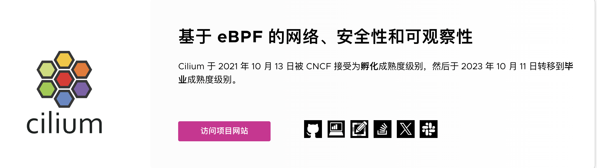
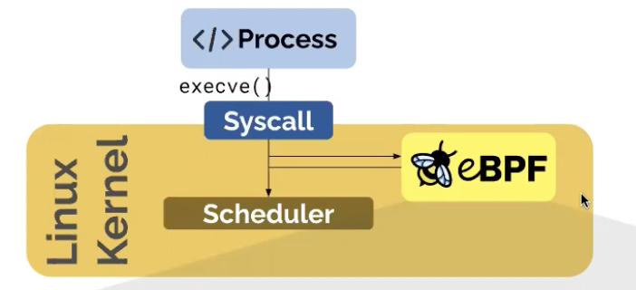
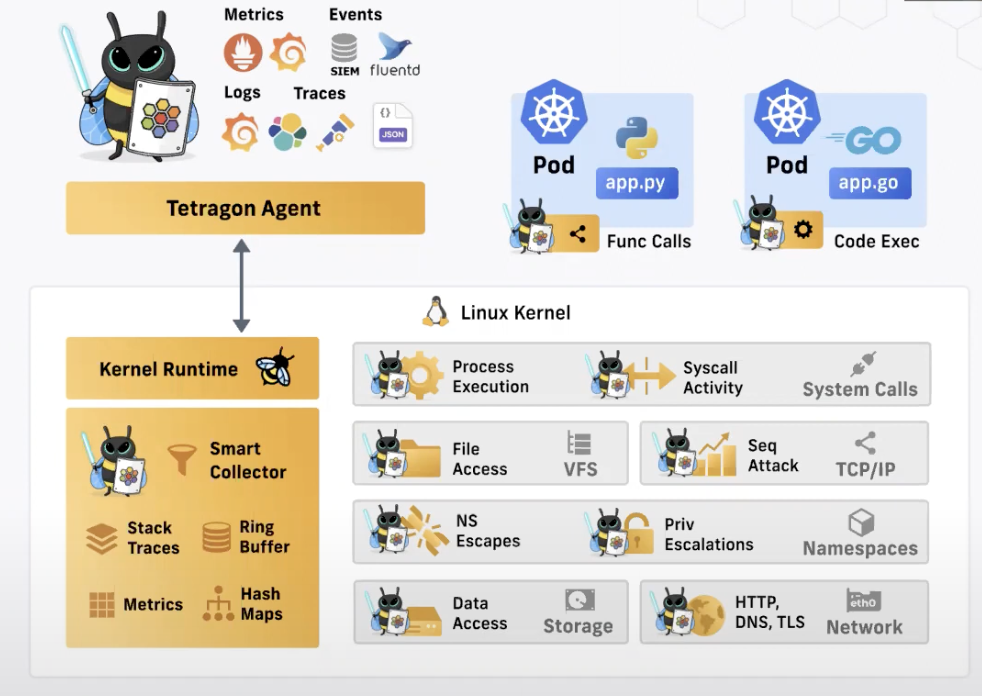
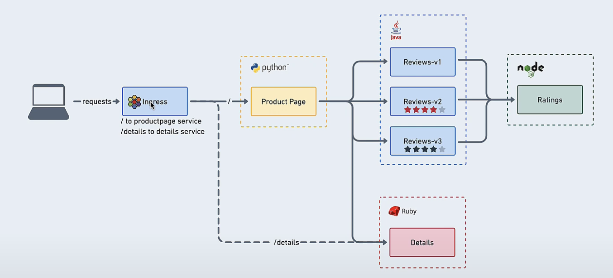
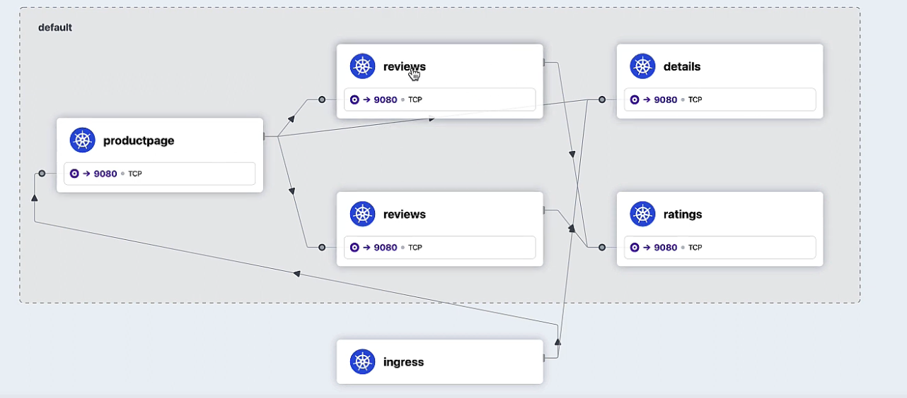
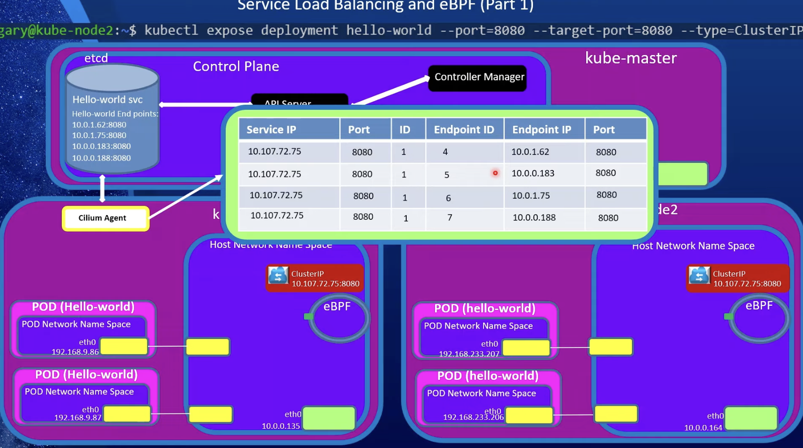

# 📒 Doc

 

> 基于 eBPF 的网络、可观察性、安全性

Cilium 是一种开源云原生解决方案，用于提供、保护和观察工作负载之间的网络连接，由革命性的内核技术 eBPF 推动

### eBPF

  

cilium 的基础是eBPF，发挥了重要的作用

 

ebpf是一种修改Linux内核能力，对内核进行安全有效的编程

+ 例如：应用程序进行系统调用，或者何时接受或传输网络数据包等等，调用ebpf

### Cilium的项目

Cilium不仅仅是一个CNI项目

+ CNI：提供k8s或容器高度可扩展的高度安全的高性能网络
+ Service Mesh：将cilium提升到了第7层并运行一个sidecar服务网格以及一个完全一致的ingress控制器，以及网关API的实现
+ Hubble：cilium网路的可观测层，以及提供观测能力 grafana和prometheus指标等
+ Tetragon：安全可观测性和运行时执行层

他们都是机遇eBPF的，最大程度上利用了eBPF，本质上是为了利用eBPF

> 他们团队的创始人说：在2016年时他们意识到了可观性也很重要，因为可见性绝对是可怕的，所以这就是团队编写cilium第一行代码时的情况

很明显现有的解决方案无法满足容器和k8s的崛起速度和需求。

cilium：主要运行在3/4层，也可以2层运行，因为可以在2层进行arp多播，也可以在7册个进行操作。

### 网路安全和加密

第三层到第七层进行网路安全，不仅仅构建容器网路策略的防火墙，还内置了加密功能

#### Hubble

提供了网路可观测性部分， 看到所有网路活动，有多少HTTP请求响应延迟等等，确实可以解决问题，这也是在网路安全层中构建的功能

### Tetragon

Tetragon 提供的所有内容 

 

可以从网路接口看到所有的TCP握手以及它们去哪里

还有文件完整性监控，监控文件内容更改时等等

可以更好的了解系统和应用程序

### Load Balabcer

cilium作为负载均衡器，当然还可以获得可观察性网路策略控制

### 为什么不是服务网格

可以在第七层操作的可观察性，挣扎于所谓的sidecar代理 

> 功能强大的 istio

首先删除了 sidecar 代理

garfana除了在仪表盘方面很出色，还有可以练路追踪、日志记录等

传统的网路架构

+ 使用kube-proxy 充当集群的负载均衡器，用于集群内程序直接的流量转发
+ 然后必须安装CNI网路，有很多的插件

Cilium

+ 替换kube-proxy
+ ebpf可以直接处理网路策略等事务

kubernetes Service

二层 ARP

使用BGP将集群外部的流量到集群内部

### Hubble UI

主要功能：轻松的构建Service Map、建立在Cilium之上，

 

示例：

ingress：可以部署 ingress或者 api gateway，通过ingress访问基于维服务的应用程序。

hubble提供的UI：

 

7层流的可观察性

对HTTP请求数据包以及路径状态码更多的信息

方法：cilium中嵌入了 Envoy代理，无法在eBPF中本地执行此操作，因此必须在内部将流量转发到 cilium的 envoy

代理。

### BGP

在cilium上提供BGP服务，将cilium管理的Pod连接到传统的网路

---

eBPF技术 在内核运行的技术，所以非常快

Cilium

+ 提供了Pod网路
+ 可观测性 Hubble
+ 安全 L3/L4/L7
+ Service Mesh L7流量管理和负载均衡，取消了sidecar

eBpf内核技术而无需对操作系统本身进行任何的更改， 

  

依赖于ebpf 而不是 ipvs和iptables

是的，Cilium 使用 VXLAN（Virtual eXtensible LAN）技术作为其网络隧道协议之一

安装cilium

1. 安装 Agent
2. cilium CLI
3. Operator
4. CNI Plugin
5. Hubbel （server、Relay、CLI、UI）

