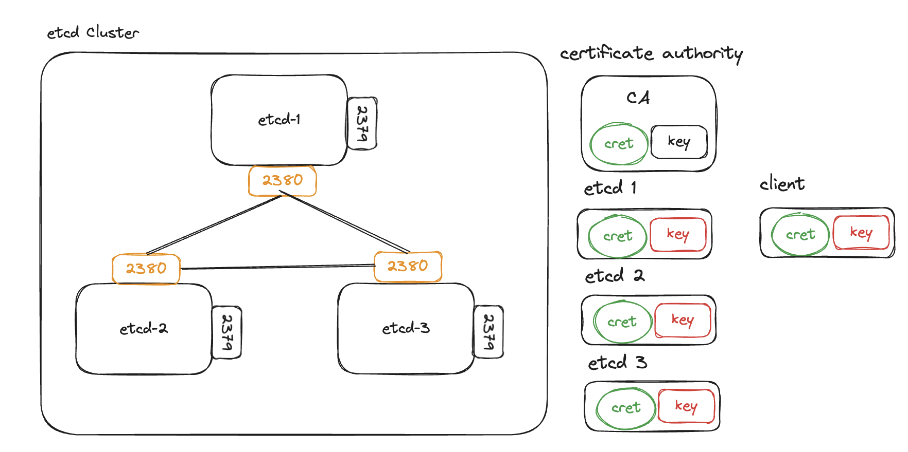

- [📒doc](#doc)
  - [🪜 高可用拓扑选项](#-高可用拓扑选项)
    - [堆叠（Stacked）etcd 拓扑](#堆叠stackedetcd-拓扑)
    - [外部 etcd 拓扑](#外部-etcd-拓扑)
  - [👀 What ETCD？](#-what-etcd)
- [🧪deploy](#deploy)
  - [🧱 二进制部署etcd集群（企业级）](#-二进制部署etcd集群企业级)
    - [1. 主机规划](#1-主机规划)
    - [2. 高可用集群的三种形式](#2-高可用集群的三种形式)
    - [3. 主机初始化](#3-主机初始化)
      - [3.1 配置/etc/hosts](#31-配置etchosts)
      - [3.2 安装cfssl证书工具](#32-安装cfssl证书工具)
      - [3.3 创建工作目录](#33-创建工作目录)
      - [3.4  关闭SELinux、firewalld](#34--关闭selinuxfirewalld)
    - [4. 制作证书](#4-制作证书)
      - [4.1创建证书颁发机构（CA）](#41创建证书颁发机构ca)
        - [4.1.1 创建配置文件](#411-创建配置文件)
        - [4.1.2 生成并配置csr请求文件](#412-生成并配置csr请求文件)
        - [4.1.3 创建ca证书](#413-创建ca证书)
        - [4.1.4  颁发etcd证书](#414--颁发etcd证书)
        - [4.1.5 生成etcd证书](#415-生成etcd证书)
        - [4.1.6  证书分发](#416--证书分发)
    - [5. 部署etcd集群](#5-部署etcd集群)
      - [5.1下载二进制包](#51下载二进制包)
      - [5.2  创建etcd配置文件](#52--创建etcd配置文件)
        - [5.2.1 etcd1节点配置文件](#521-etcd1节点配置文件)
        - [5.2.2 etcd2节点配置文件](#522-etcd2节点配置文件)
        - [5.2.3 etcd3节点配置文件](#523-etcd3节点配置文件)
        - [5.2.4 配置文件解析](#524-配置文件解析)
      - [5.3 创建服务启动文件](#53-创建服务启动文件)
      - [5.4 启动etcd集群](#54-启动etcd集群)
      - [5.5 查看集群状态](#55-查看集群状态)
- [📦 ETCD 备份](#-etcd-备份)
    - [快照备份](#快照备份)
    - [灾难恢复](#灾难恢复)
      - [1.快照键空间](#1快照键空间)
      - [2.恢复集群](#2恢复集群)
- [🔭 监控 ETCD](#-监控-etcd)
  - [prometheus](#prometheus)

# 📒doc

## 🪜 高可用拓扑选项

本页面介绍了配置高可用（HA）Kubernetes 集群拓扑的两个选项。

你可以设置 HA 集群：

- 使用堆叠（stacked）控制平面节点，其中 etcd 节点与控制平面节点共存
- 使用外部 etcd 节点，其中 etcd 在与控制平面不同的节点上运行

在设置 HA 集群之前，你应该仔细考虑每种拓扑的优缺点。

**说明：**

kubeadm 静态引导 etcd 集群。 阅读 etcd [集群指南](https://github.com/etcd-io/etcd/blob/release-3.4/Documentation/op-guide/clustering.md#static)以获得更多详细信息。

### 堆叠（Stacked）etcd 拓扑

堆叠（Stacked）HA 集群是一种这样的[拓扑](https://zh.wikipedia.org/wiki/网络拓扑)， 其中 etcd 分布式数据存储集群堆叠在 kubeadm 管理的控制平面节点上，作为控制平面的一个组件运行。

每个控制平面节点运行 `kube-apiserver`、`kube-scheduler` 和 `kube-controller-manager` 实例。 `kube-apiserver` 使用负载均衡器暴露给工作节点。

每个控制平面节点创建一个本地 etcd 成员（member），这个 etcd 成员只与该节点的 `kube-apiserver` 通信。 这同样适用于本地 `kube-controller-manager` 和 `kube-scheduler` 实例。

这种拓扑将控制平面和 etcd 成员耦合在同一节点上。相对使用外部 etcd 集群， 设置起来更简单，而且更易于副本管理。

然而，堆叠集群存在耦合失败的风险。如果一个节点发生故障，则 etcd 成员和控制平面实例都将丢失， 并且冗余会受到影响。你可以通过添加更多控制平面节点来降低此风险。

因此，你应该为 HA 集群运行至少三个堆叠的控制平面节点。

这是 kubeadm 中的默认拓扑。当使用 `kubeadm init` 和 `kubeadm join --control-plane` 时， 在控制平面节点上会自动创建本地 etcd 成员。

 

### 外部 etcd 拓扑

具有外部 etcd 的 HA 集群是一种这样的[拓扑](https://zh.wikipedia.org/wiki/网络拓扑)， 其中 etcd 分布式数据存储集群在独立于控制平面节点的其他节点上运行。

就像堆叠的 etcd 拓扑一样，外部 etcd 拓扑中的每个控制平面节点都会运行 `kube-apiserver`、`kube-scheduler` 和 `kube-controller-manager` 实例。 同样，`kube-apiserver` 使用负载均衡器暴露给工作节点。但是 etcd 成员在不同的主机上运行， 每个 etcd 主机与每个控制平面节点的 `kube-apiserver` 通信。

这种拓扑结构解耦了控制平面和 etcd 成员。因此它提供了一种 HA 设置， 其中失去控制平面实例或者 etcd 成员的影响较小，并且不会像堆叠的 HA 拓扑那样影响集群冗余。

但此拓扑需要两倍于堆叠 HA 拓扑的主机数量。 具有此拓扑的 HA 集群至少需要三个用于控制平面节点的主机和三个用于 etcd 节点的主机。

 

## 👀 What ETCD？ 

Etcd是一款分布式存储中间件，使用Go语言编写并通过Raft一致性算法处理和确保分布式一致性解决了分布式系统中数据一致性的问题。

Etcd常用于微服务架构中的服务注册与发现中心，相较于Zookeeper部署更简单，而且具有数据持久化、支持SSL客户端安全认证的独特优势；


etcd - 完全复制：构建在用于分布式共识的 Raft 算法之上

etcd - 可靠一致

etcd - 高可用性：不意味着ETCD 不存在单点故障，可以容忍网路和硬件故障

+ 领导者故障：追随者它们将进行选举，根据可用性投票，新节点将被选举为领导者，继续管理集群的复制，并且数据不受影响，

etcd - 速度快：基准测试速度为每秒万次写入，与磁盘的性能有关。

etcd - 安全：使用传输层安全性，SSL客户端证书身份验证，存储重要且高度铭感的配置数据，因此对其保护非常重要！

etcd - 使用简单

watch功能：

+ etcd 存储 kubernetes配置数据及其状态数据，因此 etcd使用监视功能来项目比较，如果它们不同步，Etcd 会让让Kubernets 的API知道，Kubernetes API相应的重新配置集群，


# 🧪deploy

## 🧱 二进制部署etcd集群（企业级）

安装 etcd 最简单的方法是使用预构建的二进制文件

[官方文档](https://etcd.io/docs/v3.5/install/)

1. [从Releases](https://github.com/etcd-io/etcd/releases/)下载适合您平台的压缩存档文件，选择版本[v3.5.0](https://github.com/etcd-io/etcd/releases/tag/v3.5.0)或更高版本。
2. 解压缩存档文件。这会产生一个包含二进制文件的目录。
3. 将可执行二进制文件添加到您的路径中。例如，将二进制文件重命名和/或移动到您的路径中的目录（如`/usr/local/bin`），或者将上一步创建的目录添加到您的路径中。


堆叠etcd拓扑：

+ 如果其中一个主节点发烧故障，也活同时带走ETCD的Pod，因为它不是一个存粹的高可用，因为它聚集到了主节点本身中，所以如果使用kubeadm这就是基本默认情况下会得到的。

使用现有的外部 etcd 集群来配置 kubernetes 集群

 

etcd集群

 三节点的 ETCD 集群，在2380上相互通信以保持同步，2379是监听来自客户端连接的端口。

 


### 1. 主机规划

| 主机IP       | 主机名 | 配置                 | 描述 |
| :----------- | :----- | :------------------- | :--- |
| 192.168.2.51 | etcd1  | 1C、2GB内存、20G存储 |      |
| 192.168.2.52 | etcd2  | 1C、2GB内存、20G存储 |      |
| 192.168.2.53 | etcd3  | 1C、2GB内存、20G存储 |      |

`本文档使用说明：`全局将IP修改为自己环境的地址，其它版本亦可参照本文，操作步骤大体类似。


### 2. 高可用集群的三种形式

- **静态配置**

预先已经知道etcd集群有哪些节点，在启动时通过`--initial-cluster`参数直接指定好etcd的各个节点地址。

- **etcd动态发现**

通过已经搭建好的etcd来辅助搭建新的etcd集群，已有的etcd集群作为数据交互点，然后在扩展新的集群时，实现通过已有集群进行服务发现的机制，如官方提供的：discovery.etcd.io

- **DNS动态发现**

通过DNS查询方式获取其它节点地址信息。


### 3. 主机初始化

对每个etcd节点主机进行初始配置操作：

#### 3.1 配置/etc/hosts

```sh
$ cat <<EOF >> /etc/hosts
192.168.2.51 etcd1
192.168.2.52 etcd2
192.168.2.53 etcd3
EOF
```

#### 3.2 安装cfssl证书工具

使用`cfsll`工具生成集群需要的证书文件,其中一台master节点安装即可！

```sh
$ wget https://github.com/cloudflare/cfssl/releases/download/v1.6.0/cfssl_1.6.0_linux_amd64  -O   /usr/local/bin/cfssl
$ wget https://github.com/cloudflare/cfssl/releases/download/v1.6.0/cfssljson_1.6.0_linux_amd64 -O  /usr/local/bin/cfssljson
$ wget https://github.com/cloudflare/cfssl/releases/download/v1.6.0/cfssl-certinfo_1.6.0_linux_amd64   -O  /usr/local/bin/cfssl-certinfo 
$ chmod +x  /usr/local/bin/cfssl*
```

+ cfssljson：将从cfssl和multirootca等获得的json格式的输出转化为证书格式的文件（证书，密钥，CSR和bundle）进行存储；

+ cfssl-certinfo：可显示CSR或证书文件的详细信息；可用于证书校验。

#### 3.3 创建工作目录

```sh
$ mkdir -p /etc/etcd/cert
```

`/etc/etcd/`为etcd工作目录;

`/etc/etcd/cert`为etcd相关证书存放目录;

#### 3.4  关闭SELinux、firewalld

firewalld开启会导致etcd服务启动失败。

```sh
$ sed -i 's/SELINUX=enforcing/SELINUX=disabled/g'  /etc/selinux/config
$ systemctl status firewalld.service
$ systemctl disable --now firewalld.service
```


### 4. 制作证书

#### 4.1创建证书颁发机构（CA）

##### 4.1.1 创建配置文件

```sh
$ cfssl print-defaults  config > /etc/etcd/cert/ca-config.json            #生成默认配置文件
$ cat <<EOF > /etc/etcd/cert/ca-config.json
{
    "signing": {
        "default": {
            "expiry": "87600h"
        },
        "profiles": {
            "etcd": {
                "expiry": "87600h",
                "usages": [
                    "signing",
                    "key encipherment",
                    "server auth",
                    "client auth"
                ]
            }
        }
    }
}
EOF
```

`参数解析`：

+ default.expiry：默认证书有效期（单位：h）
+ profiles.etcd：为服务使用该配置文件颁发证书的配置模块；
+ signing：签署，表示该证书可用于签名其它证书；生成的 ca.pem 证书中 CA=TRUE；
+ key encipherment：密钥加密；
+ profiles：指定了不同角色的配置信息；可以定义多个 profiles，分别指定不同的过期时间、使用场景等参数；后续在签名证书时使用某个 profile
+ server auth：服务器身份验证；表示 client 可以用该 CA 对 server 提供的证书进行验证；
+ client auth：客户端身份验证；表示 server 可以用该 CA 对 client 提供的证书进行验证；


##### 4.1.2 生成并配置csr请求文件

类似于申请表，表中填写申请者的信息（证书签名请求文件）

```sh
$ cfssl  print-defaults csr  > /etc/etcd/cert/ca-csr.json
$ cat <<EOF > ca-csr.json
{
    "CN": "etcd",
    "key": {
        "algo": "rsa",
        "size": 2048
    },
    "names": [
        {
            "C": "CN",
            "ST": "BeiJing",
            "L": "BeiJing",
            "O": "etcd",
            "OU": "system"
        }
    ]
}
EOF
```

参数解析：

+ hosts：包含的授权范围，不在此范围的的节点或者服务使用此证书就会报证书不匹配错误，证书如果不包含可能会出现无法连接的情况；
+ Key: 指定使用的加密算法，一般使用rsa非对称加密算法（algo:rsa；size:2048）
+ CN：Common Name，从证书中提取该字段作为请求的用户名 (User Name)；浏览器使用该字段验证网站是否合法；CN是域名，也就是你现在使用什么域名就写什么域名。
+ C：国家（CN中国）
+ ST：类似省份（如湖南省等）
+ L：城市（如北京市）
+ O：Organization，从证书中提取该字段作为请求用户所属的组 (Group)；


##### 4.1.3 创建ca证书

创建CA证书并放入`/etc/etcd/cert/`下

```sh
$ cfssl gencert -initca /etc/etcd/cert/ca-csr.json | cfssljson -bare /etc/etcd/cert/etcd-ca
$ ls  /etc/etcd/cert/etcd-ca*
/etc/etcd/cert/etcd-ca.csr  /etc/etcd/cert/etcd-ca-key.pem  /etc/etcd/cert/etcd-ca.pem
```


##### 4.1.4  颁发etcd证书

使用刚才的证书机构，根据提供的请求文件向etcd颁发证书。

```sh
$ cfssl  print-defaults csr  > /etc/etcd/cert/etcd-csr.json
$ cat <<EOF > /etc/etcd/cert/etcd-csr.json
{
    "CN": "etcd",
    "hosts": [
        "127.0.0.1",
        "192.168.2.51",
        "192.168.2.52",
        "192.168.2.53"
    ],
    "key": {
        "algo": "rsa",
        "size": 2048
    },
    "names": [
        {
            "C": "CN",
            "ST": "BeiJing",
            "L": "BeiJing",
            "O": "etcd",
            "OU": "system"
        }
    ]
}
EOF
```

`hosts`：所有etcd节点的地址列表和本地回环地址；


##### 4.1.5 生成etcd证书

生成etcd证书并放入到`/etc/etcd/cert/`下

```sh
$ cfssl  gencert  -ca=/etc/etcd/cert/etcd-ca.pem  \
 -ca-key=/etc/etcd/cert/etcd-ca-key.pem \
 -config=/etc/etcd/cert/ca-config.json  -profile=etcd  \
 /etc/etcd/cert/etcd-csr.json  |  cfssljson -bare  /etc/etcd/cert/etcd
$ ls /etc/etcd/cert/
ca-config.json  ca-csr.json  etcd-ca.csr  etcd-ca-key.pem  etcd-ca.pem  etcd.csr  etcd-csr.json  etcd-key.pem  etcd.pem
```

etcd.csr、etcd-key.pem、etcd.pem为新生成的证书文件

参数解析

+ -ca-key：指定CA证书机构的私钥；
+ -config：指定CA证书策略；
+ -profile：指定使用CA证书策略中的哪个模块,即CA配置文件中的signing.profiles.etcd参数；
+ etcd.pem：公钥
+ etcd-key.pem：私钥


##### 4.1.6  证书分发

4.1.3 - 4.1.5 操作均在etcd1节点操作，需要将相关的证书文件分发到其它etcd节点。

```sh
$ scp /etc/etcd/cert/{etcd-ca.pem,etcd.pem,etcd-key.pem} 192.168.2.52:/etc/etcd/cert/
$ scp /etc/etcd/cert/{etcd-ca.pem,etcd.pem,etcd-key.pem} 192.168.2.53:/etc/etcd/cert/
```


### 5. 部署etcd集群

默认的`2379`端口为客户端访问端口，`2380`为etcd节点间通信的端口。

#### 5.1下载二进制包

```sh
$ wget -c https://github.com/etcd-io/etcd/releases/download/v3.5.5/etcd-v3.5.5-linux-amd64.tar.gz -k
$ tar -xf etcd-v3.5.5-linux-amd64.tar.gz 
$ cp -p  etcd-v3.5.5-linux-amd64/{etcd,etcdctl,etcdutl}  /usr/local/bin/
$ ls  /usr/local/bin/
etcd  etcdctl  etcdutl
$ etcd -version
etcd Version: 3.5.5
Git SHA: 19002cfc6
Go Version: go1.16.15
Go OS/Arch: linux/amd64
```

- etcd：服务端；
- etcdctl：etcd客户端工具；
- etcdutl：数据恢复工具，旧版是使用etcdctl完成数据的备份和恢复；

#### 5.2  创建etcd配置文件

##### 5.2.1 etcd1节点配置文件

```sh
$ cat  /etc/etcd/etcd.conf
# Member（成员）:
ETCD_NAME="etcd-1"
ETCD_DATA_DIR="/etc/etcd/etcd-data"
ETCD_SNAPSHOT_COUNT="5000"
ETCD_HEARTBEAT_INTERVAL="100"
ETCD_ELECTION_TIMEOUT="500"
ETCD_LISTEN_PEER_URLS="https://192.168.2.51:2380"
ETCD_LISTEN_CLIENT_URLS="https://192.168.2.51:2379,https://127.0.0.1:2379"
# Clustering（集群）:
ETCD_INITIAL_ADVERTISE_PEER_URLS="https://192.168.2.51:2380"
ETCD_INITIAL_CLUSTER_STATE="new"
ETCD_INITIAL_CLUSTER="etcd-1=https://192.168.2.51:2380,etcd-2=https://192.168.2.52:2380,etcd-3=https://192.168.2.53:2380"
ETCD_INITIAL_CLUSTER_TOKEN="etcd-cluster-1"
ETCD_ADVERTISE_CLIENT_URLS="https://192.168.2.51:2379"
# Security（安全）：
ETCD_CLIENT_CERT_AUTH="true"
ETCD_CERT_FILE="/etc/etcd/cert/etcd.pem"
ETCD_KEY_FILE="/etc/etcd/cert/etcd-key.pem"
ETCD_TRUSTED_CA_FILE="/etc/etcd/cert/etcd-ca.pem"
ETCD_PEER_CLIENT_CERT_AUTH="true"
ETCD_PEER_CERT_FILE="/etc/etcd/cert/etcd.pem"
ETCD_PEER_KEY_FILE="/etc/etcd/cert/etcd-key.pem"
ETCD_PEER_TRUSTED_CA_FILE="/etc/etcd/cert/etcd-ca.pem"
```

##### 5.2.2 etcd2节点配置文件

```sh
$ cat  /etc/etcd/etcd.conf 
# [Member]成员
ETCD_NAME="etcd-2"
ETCD_DATA_DIR="/etc/etcd/etcd-data"
ETCD_SNAPSHOT_COUNT="5000"
ETCD_HEARTBEAT_INTERVAL="100"
ETCD_ELECTION_TIMEOUT="500"
ETCD_LISTEN_PEER_URLS="https://192.168.2.52:2380"
ETCD_LISTEN_CLIENT_URLS="https://192.168.2.52:2379,https://127.0.0.1:2379"
# Clustering（集群）
ETCD_INITIAL_ADVERTISE_PEER_URLS="https://192.168.2.52:2380"
ETCD_INITIAL_CLUSTER_STATE="new"
ETCD_INITIAL_CLUSTER="etcd-1=https://192.168.2.51:2380,etcd-2=https://192.168.2.52:2380,etcd-3=https://192.168.2.53:2380"
ETCD_INITIAL_CLUSTER_TOKEN="etcd-cluster-1"
ETCD_ADVERTISE_CLIENT_URLS="https://192.168.2.52:2379"
# Security（安全）
ETCD_CLIENT_CERT_AUTH="true"
ETCD_CERT_FILE="/etc/etcd/cert/etcd.pem"
ETCD_KEY_FILE="/etc/etcd/cert/etcd-key.pem"
ETCD_TRUSTED_CA_FILE="/etc/etcd/cert/etcd-ca.pem"
ETCD_PEER_CLIENT_CERT_AUTH="true" 
ETCD_PEER_CERT_FILE="/etc/etcd/cert/etcd.pem"
ETCD_PEER_KEY_FILE="/etc/etcd/cert/etcd-key.pem"
ETCD_PEER_TRUSTED_CA_FILE="/etc/etcd/cert/etcd-ca.pem"
```

##### 5.2.3 etcd3节点配置文件

```sh
$ cat  /etc/etcd/etcd.conf
# [Member]成员
ETCD_NAME="etcd-3"
ETCD_DATA_DIR="/etc/etcd/etcd-data"
ETCD_SNAPSHOT_COUNT="5000"
ETCD_HEARTBEAT_INTERVAL="100"
ETCD_ELECTION_TIMEOUT="500"
ETCD_LISTEN_PEER_URLS="https://192.168.2.53:2380"
ETCD_LISTEN_CLIENT_URLS="https://192.168.2.53:2379,https://127.0.0.1:2379"
# Clustering（集群）
ETCD_INITIAL_ADVERTISE_PEER_URLS="https://192.168.2.53:2380"
ETCD_INITIAL_CLUSTER_STATE="new"
ETCD_INITIAL_CLUSTER="etcd-1=https://192.168.2.51:2380,etcd-2=https://192.168.2.52:2380,etcd-3=https://192.168.2.53:2380"
ETCD_INITIAL_CLUSTER_TOKEN="etcd-cluster-1"
ETCD_ADVERTISE_CLIENT_URLS="https://192.168.2.53:2379"
# Security（安全）
ETCD_CLIENT_CERT_AUTH="true"
ETCD_CERT_FILE="/etc/etcd/cert/etcd.pem"
ETCD_KEY_FILE="/etc/etcd/cert/etcd-key.pem"
ETCD_TRUSTED_CA_FILE="/etc/etcd/cert/etcd-ca.pem"
ETCD_PEER_CLIENT_CERT_AUTH="true" 
ETCD_PEER_CERT_FILE="/etc/etcd/cert/etcd.pem"
ETCD_PEER_KEY_FILE="/etc/etcd/cert/etcd-key.pem"
ETCD_PEER_TRUSTED_CA_FILE="/etc/etcd/cert/etcd-ca.pem"
```

##### 5.2.4 配置文件解析

```sh

[Cluster tag]  #集群标记部分
ETCD_INITIAL_CLUSTER：集群节点地址（为启动初始化集群配置）
ETCD_INITIAL_CLUSTER_STATE：加入集群的当前状态，new是新集群，existing表示加入已有集群
ETCD_INITIAL_CLUSTER_TOKEN：在启动期间用于集群初始化标记，集群Token（集群名称）
ETCD_INITIAL_ADVERTISE_PEER_URLS：列出该成员URL，以便通告给其他成员，用于在集群中通信etcd数据；
ETCD_ADVERTISE_CLIENT_URLS：列出该成员客户端URL，通告给集群中的其他成员；

[Member tag] #成员标记部分
ETCD_NAME：当前节点名称，与`ETCD_INITIAL_CLUSTER`中的一致
ETCD_DATA_DIR:  #etcd数据目录
ETCD_HEARTBEAT_INTERVAL：心跳间隔时间 (单位 毫秒).默认100
ETCD_ELECTION_TIMEOUT： 选举的超时时间(单位 毫秒).默认1000
ETCD_LISTEN_PEER_URLS：监听集群内部的URL列表，为本集群其他节点提供的服务监听URL地址（内部）
ETCD_LISTEN_CLIENT_URLS：为`客户端`提供的服务监听URL地址（外部）;

# Security（安全）：
ETCD_CLIENT_CERT_AUTH:  是否启用客户端证书认证，当这个选项被设置时，etcd 将为受信任CA签名的客户端证书检查所有的传入的 HTTPS 请求，不能提供有效客户端证书的请求将会失败。
ETCD_PEER_CERT_FILE:  etcd的peers通信的公钥证书,集群各节点相互认证使用的证书（-crt文件）
ETCD_PEER_KEY_FILE:  etcd的peers通信的私钥, 集群各节点相互认证使用的私钥（-key文件）
ETCD_PEER_CLIENT_CERT_AUTH：是否开启peer client 证书验证
ETCD_PEER_TRUSTED_CA_FILE：CA根证书文件，peer server TLS 信任证书文件路径.。
ETCD_PEER_AUTO_TLS="true"

ETCD_CERT_FILE：指定etcd的证书（etcd.pem)，客户端服务器TLS证书文件，供客户端访问
ETCD_KEY_FILE：指定etcd的私钥，客户端访问认证
ETCD_CLIENT_CERT_AUTH="true"  #是否开启客户端证书认证；
ETCD_TRUSTED_CA_FILE: 指定CA的证书（ca.pem或ca.crt),
ETCD_AUTO_TLS="true"  使用生成证书的客户端TLS
#####################################################################################################
# [Member]成员
--name=etcd1
--data-dir=/etc/etcd/etcd-data   #etcd数据目录,启动时会z
--snapshot-count=5000
--heartbeat-interval=100  #心跳间隔的时间
--election-timeout=500    #选举超时的时间(默认100)
--listen-peer-urls https://192.168.2.52:2380  #集群节点间通信监听地址（本机IP:2380端口）
--listen-client-urls https://192.168.2.52:2379,https://127.0.0.1:2379 #监听客户端访问地址
# Clustering（集群）
--initial-advertise-peer-urls=https://192.168.2.52:2380  #本机IP，集群通告地址
--initial-cluster infra0=https://192.168.2.51:2380,infra1=https://192.168.2.52:2380,infra2=https://10.0.1.12:2380 \
--initial-cluster-state new  #初始集群状态
--advertise-client-urls https://192.168.2.52:2379  #向客户端通告此成员地址
--initial-cluster-token etcd-cluster-1   #初始集群令牌
# Security（安全）：
--client-cert-auth="true"            #是否启用客户端证书认证
--cert-file=/path/to/infra1-client.crt   #客户端、服务端通信的TLS证书文件
--key-file=/path/to/infra1-client.key    #客户端、服务器通信的TLS密钥文件
--trusted-ca-file=/path/to/ca-client.crt  #客户端服务器TLS受信任CA证书文件的路径。
--peer-client-cert-auth="true"        #是否启用集群节点间通信认证
--peer-cert-file=/path/to/infra1-peer.crt #集群节点间通信TLS证书文件
--peer-key-file=/path/to/infra1-peer.key  #集群节点间通信TLS密钥文件（私钥）
--peer-trusted-ca-file=ca-peer.crt     #集群节点间通信TLS受信任CA文件的路径
```


#### 5.3 创建服务启动文件

每个etcd节点的服务启动文件内容一致。

```sh
$ cat /usr/lib/systemd/system/etcd.service
[Unit]
Description=Etcd Server
After=network.target
After=network-online.target
Wants=network-online.target

[Service]
Type=notify
EnvironmentFile=/etc/etcd/etcd.conf
#WorkingDirectory=/etc/etcd/etcd-data
ExecStart=/usr/local/bin/etcd    
Restart=on-failure
RestartSec=5
LimitNOFILE=65536
[Install]
WantedBy=multi-user.target
```

- `WorkingDirectory`：etcd数据目录，与ETCD_DATA_DIR会冲突；
- `EnvironmentFile`：指定etcd配置文件；
- `ExecStart`：启动指令；


#### 5.4 启动etcd集群

重新加载服务配置

```sh
$ systemctl daemon-reload
```

启动etcd服务

```sh
$ systemctl start etcd.service
$ systemctl enable etcd.service
$ systemctl status etcd
```

#### 5.5 查看集群状态

```sh
$ etcdctl endpoint health --write-out=table \
--endpoints=https://192.168.2.51:2379,https://192.168.2.52:2379,https://192.168.2.53:2379 \
--cacert=/etc/etcd/cert/etcd-ca.pem --cert=/etc/etcd/cert/etcd.pem --key=/etc/etcd/cert/etcd-key.pem 
# shu'chu
+---------------------------+--------+-------------+-------+
|     ENDPOINT         | HEALTH |    TOOK     | ERROR |
+---------------------------+--------+-------------+-------+
| https://192.168.2.52:2379 |   true | 20.340362ms |       |
| https://192.168.2.53:2379 |   true | 26.419585ms |       |
| https://192.168.2.51:2379 |   true | 26.196417ms |       |
+---------------------------+--------+-------------+-------+
```

- --write-out=table/-w table：以表格形式输出结果;
- --cacert: 指定CA证书
- --cert：指定etcd服务证书
- --key：指定etcd私钥
- --endpoints：指定集群地址
- --HEALTH：是否健康；


# 📦 ETCD 备份

### 快照备份

`etcd`定期对集群进行快照可作为 etcd 键空间的持久备份。通过对 etcd 成员的后端数据库进行定期快照，`etcd`可以将集群恢复到具有已知良好状态的时间点。

快照是用以下命令拍摄的`etcdctl`：

```sh
$ etcdctl snapshot save backup.db
$ etcdctl --write-out=table snapshot status backup.db
+----------+----------+------------+------------+
|   HASH   | REVISION | TOTAL KEYS | TOTAL SIZE |
+----------+----------+------------+------------+
| fe01cf57 |       10 |          7 | 2.1 MB     |
+----------+----------+------------+------------+
```

### 灾难恢复

etcd 集群会自动从临时故障（例如，机器重新启动）中恢复，并且对于包含 N 个成员的集群，最多可容忍*(N-1)/2永久性故障*

#### 1.快照键空间

恢复集群首先需要来自 etcd 成员的键空间快照。

```sh
$ ETCDCTL_API=3 etcdctl --endpoints $ENDPOINT snapshot save snapshot.db
```

+ 将所服务的键空间快照`$ENDPOINT`到文件中`snapshot.db`

#### 2.恢复集群

要恢复集群，只需要一个快照“db”文件。集群恢复会`etcdutl snapshot restore`创建新的 etcd 数据目录；所有成员应使用相同的快照进行恢复。恢复会覆盖一些快照元数据（具体是成员ID和集群ID）；该成员失去了以前的身份。此元数据覆盖可防止新成员无意中加入现有集群。因此，为了从快照启动集群，恢复必须启动一个新的逻辑集群。

可以选择在恢复时验证快照完整性。如果使用 拍摄快照`etcdctl snapshot save`，它将具有由 进行检查的完整性哈希值`etcdutl snapshot restore`。如果快照是从数据目录复制的，则没有完整性哈希，只能使用`--skip-hash-check`.

恢复使用 的集群配置标志使用新的集群配置来初始化新集群的新成员`etcd`，但保留 etcd 键空间的内容。继续前面的示例，以下内容为三成员集群创建新的 etcd 数据目录 ( `m1.etcd`、`m2.etcd`、 )：`m3.etcd`

新版命令：

```sh
$ etcdutl snapshot restore snapshot.db \
  --name m1 \
  --initial-cluster m1=http://host1:2380,m2=http://host2:2380,m3=http://host3:2380 \
  --initial-cluster-token etcd-cluster-1 \
  --initial-advertise-peer-urls http://host1:2380
$ etcdutl snapshot restore snapshot.db \
  --name m2 \
  --initial-cluster m1=http://host1:2380,m2=http://host2:2380,m3=http://host3:2380 \
  --initial-cluster-token etcd-cluster-1 \
  --initial-advertise-peer-urls http://host2:2380
$ etcdutl snapshot restore snapshot.db \
  --name m3 \
  --initial-cluster m1=http://host1:2380,m2=http://host2:2380,m3=http://host3:2380 \
  --initial-cluster-token etcd-cluster-1 \
  --initial-advertise-peer-urls http://host3:2380
```

旧版命令：

```sh
$ ETCDCTL_API=3 etcdctl snapshot restore snapshot.db \
  --name m1 \
  --initial-cluster m1=http://host1:2380,m2=http://host2:2380,m3=http://host3:2380 \
  --initial-cluster-token etcd-cluster-1 \
  --initial-advertise-peer-urls http://host1:2380
$ ETCDCTL_API=3 etcdctl snapshot restore snapshot.db \
  --name m2 \
  --initial-cluster m1=http://host1:2380,m2=http://host2:2380,m3=http://host3:2380 \
  --initial-cluster-token etcd-cluster-1 \
  --initial-advertise-peer-urls http://host2:2380
$ ETCDCTL_API=3 etcdctl snapshot restore snapshot.db \
  --name m3 \
  --initial-cluster m1=http://host1:2380,m2=http://host2:2380,m3=http://host3:2380 \
  --initial-cluster-token etcd-cluster-1 \
  --initial-advertise-peer-urls http://host3:2380
```


接下来，`etcd`从新的数据目录开始：

```sh
$ etcd \
  --name m1 \
  --listen-client-urls http://host1:2379 \
  --advertise-client-urls http://host1:2379 \
  --listen-peer-urls http://host1:2380 &
$ etcd \
  --name m2 \
  --listen-client-urls http://host2:2379 \
  --advertise-client-urls http://host2:2379 \
  --listen-peer-urls http://host2:2380 &
$ etcd \
  --name m3 \
  --listen-client-urls http://host3:2379 \
  --advertise-client-urls http://host3:2379 \
  --listen-peer-urls http://host3:2380 &
```


# 🔭 监控 ETCD

## prometheus

运行[Prometheus](https://prometheus.io/)监控服务是获取和记录 etcd 指标的最简单方法。

将 Prometheus 的 scraper 设置为目标 etcd 集群端点：

```sh
global:
  scrape_interval: 10s
scrape_configs:
  - job_name: test-etcd
    static_configs:
    - targets: ['10.240.0.32:2379','10.240.0.33:2379','10.240.0.34:2379']
```

