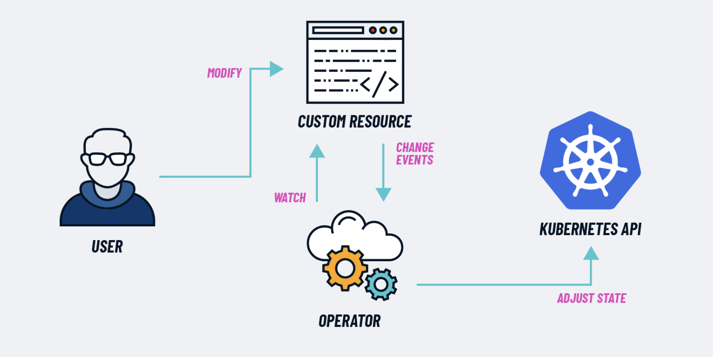

# Prometheus

prometheus 是 为了监控容器环境，如 kubernetes、docker创建的；然而 它也可以用在传统的非容器设施上，如裸服务器、GPU等；因此它在这几年成为了容器 和 微服务首选的主流监控工具。


缺点：在拥有庞大的基础设定的情况下，`Prometheus` 可能是难以扩展的。

可以：增加`promethues`容量，限制从应用程序收集的指标的数量，降低到只有相关的

## :books: Docs

### 🤔️ 出现

一个技术的出现必定有它的原因（解决了什么问题）

在现代的 DevOps 中手动处理变得越来越复杂，因此需要更多的自动化；

通常会拥有：

1. 多个项目、多个集群
2. 运行非常多的容器，并且有成千上百的不同进程在运行
3. 基础设施和 应用是相连的

因此需要去保持这样的设置去平稳运行、并且没有应用程序去停机，时间是非常重要的，也是有挑战性的。

需要解决：

1. 无法了解硬件级别或上层发生的情况
2. 应用程序级别、如 Error、响应延迟、硬件故障、或过载，可能耗尽资源等

在如此复杂的环境中，当部署大量的服务和应用程序时，可能出现很多问题，其中任何一个都可能导致程序崩溃，并且导致其他服务失败。

+ 突然的应用程序对用户变得不可用，必须快速的确定这整个应用程序中是到底出现了什么问题
+ 并且在手动调试过程中可能会很困难 且 耗时


### 🌰 用例

服务器内存不足，并启动了一个正在运行的容器，该容器在 `Kubernetes` 集群中两个数据库 `Pod` 之间提供数据，这反过来又导致：

1. 两个数据库部分失败，该数据库被身份验证服务器使用，该服务器也停止工作，因为数据库变得不可用
2. 然后依赖于该身份验证服务的应用程序无法再对 `UI` 中的用户进行身份验证
3. 用户角度：只看到 `UI` 中的错误，无法登陆

所以：遇到这种情况，如何知道实际上出了什么问题，对集群内部发生的情况如果看不到事件发生的整个事件链的红线，只看到错误，如何去排查修复，以便检查服务是否有返回并运行正常，是否现实异常，服务是否在正常运行，为什么会崩溃。

拥有一个工具使得搜索问题过程更加高效

1. 持续监控服务是否正常运行
2. 在一项服务崩溃时立即那个运维人员发出告警
3. 以便确切的知道发生了什么，甚至可以在问题发生前识别问题 提醒运维人员

例如在上述例子中，可以去定期检查每台 服务器的内存，做内存上限告警（当在一段时间内飙升到某个值，例如70%）或者不间断的去增加。


另外一种情况：突然停止看到应用程序的日志，因为 `elasticsear` 可接受的日志因为磁盘空间的不足或 `elasticsear` 再次达到为其分配的存储限制， 监控工具将 `持续检查磁盘空间` ，可以额告诉监控何时触发告警。


第三种情况：即应用程序由于一项服务奔溃而突然变得很慢，并开始在网络中循环发生数百条错误信息，这会产生高网络流量并减慢其他服务的速度，有一个工具可以检测网络负载中的此类峰值，并且告诉哪个服务负责导致的，可以及时发出告警 解决这个问题。

+ 自动监控和警报：Promethers


### 🧬 架构

 

核心为：Prometheus server，实际的监控工作由三部分组成

1. TSDB：时间序列数据库（用于存储所有的指标数据） storage metrics data
2. Retrieval：数据检索，用于获取或提取这些 指标 ，并将它们 `push` 到数据库中 pulls metrics data
3. HTTP serevr：`web serevr` 或 `api` 接受对存储数据的查询，并且勇于在 `UI` 可视化工具

Prometheus sevrer 监视特定的事物，该事物可以是如何东西，可以是整个Linux服务器、Windows服务器、也可以是独立的Apache服务器、单个应用程序 或 像数据库这样的服务，以及Prometheus 监视的哪些东西称为`目标`.

​		每个`目标`（targets）都有Linux serevr的监视单位，可以是 CPU、内存、磁盘、网路等，也可以是异常数据请求、请求持续时间以及 想要监视的目标的单位称之为 `指标`，指标是保存着 TSDB

`metrics` : 定义了可读性的机遇文本的格式指标条目 或 数据具有的类型和 Help基本上是一种描述

+ help：仅描述指标的含义
+ type：指标类型
  + 计数器（Counter）：例如应用程序收到异常请求数量
  + 仪表（Gauge）：可以向上向下 ，例如CPU的使用率是当前的多少
  + 直方图（Histogram）：为了追踪某件事花费了多少时间或有多大，例如请求的大小 
  + 摘要（Summary）：摘要类似于直方图，但不会保留每个事件的数据，而是存储事件的总数、总和等统计信息。


### 📡 收集指标

  一个有趣的问题：如何去从目标收集这些指标

1. `prometheus` 从 `http` 端点从 `metrics` 中提取指标数据 
2. 默认情况下是 `主机IP+端口:/metrics` 
3.  目标必须公开`/metrics`接口，且必须采用 `prometheus`能够理解的格式

一些服务本身有`/metrics` 一些没有，因此需要额外的组件来执行此操作 ，该组件是导出器 `Exporter`

+ Exporter：基本上是一个脚本，或者一个服务，用于从端点获取指标目标，并以`prometheus` 能够理解的格式转换它，并在自己的 `/metrics` 上公开它们（这些转换后的数据）。

prometheus 可以通过 Retrieval 去抓取它们

+ Prometheus 有一个不同服务的 Exporter 列表

 

如果想监视Linux服务器，可以使用：node exporter，可以去github存储库下载 tar文件减压并且执行，它将会开始转换服务器的直白哦，并且使得可以在 `/metrics` 上公开，然后配置 `prometheus` 来抓取 该target。

这些 Exporter 可以是：

1. 二进制
2. Docker 容器
3. Pod


监视自己的应用程序：

有适用于不同语言的 prometheus的客户端，使用这些库可以在应用程序中公开 `/metrics` 并且提供指标。

+ 基础设施团队告诉开发：发出相关的指标，并将在基础设施中收集和监控它们。


### 👍 优势

从端点提取数据是 `prometheus` 的一个重要的特征

推送系统：应用程序和服务器将指标 推送 到监控的集中收集平台， 当使用许多微服务，并且每个服务将其指标推送，会在基础设施产生高流量负载，来自所有服务的推送将造成基础设施超载，从而淹没网路，还必须在每个目标上安装守护进程。

prometheus 只需要一个抓取端点，这样指标就可以由多个prometheus 实例抓取，另一个优点是使用 `pull` 可以轻松检测到服务是否启动并正常运行，例如在拉取时没有响应 或者 当服务推送是时端点不可用时不推送如何数据或发送健康数据，除了服务未运行之外可能还有很多原因，网路不可达、或者其他的一些问题


pushgateway：

在有限的情况下，需要监视的目标仅仅运行很短的时间，因此存在的时间不足以被抓取， 例如批处理、job 

+ 提供了 pushgateway 推送网关，以便可以将数据指标推送到TSDB

但是使用 `pushgateway` 在prometheus中时一个例外


### 🗒️ 配置示例

`prometheus` 如何知道需要抓取的什么以及何时在 `prometheus.yaml` 中配置所有内容，以便定义需要抓取哪些目标以及什么时间间隔

prometheus 使用服务发现机制来查找这些目标端点

+ service discover - discover targets

```yaml
global:
	scrape_interval: 1m
	scrape_timeout: 10s
rule_files:
scrape_configs:
	- job_name: prometheus
	  static_config: 
      targets:
    	  [ - 'localhost:9090' ]
```

全局配置：

+ 定义了抓取的时间间隔、超时时间等，可以为单个targets 配置

rule_files：

+ 任何规则的位置，希望`promether` 去加载这些配置
+ 规则要么使用聚合矩阵的值， 要么在满足某些条件下（CPU使用率达到70%） 时创建告警，因此 `prometheus` 使用规则来创新的时间序列条目，并生成告警和评估间隔，全局配置选项中定义了规则的频率


### ❗️ 告警

Alter Manager

`prometheus` 实际上如何去触发由规则定义的告警，以及谁去接受这些告警，AlterManager报警器：

1. `prometheus` 读取告警规则，满足规则则会通过
2. 通过该配置的通道出触发报警


### 📒存储

`prometheus` 存储数据，将其收集，然后聚合的所有数据存储

将数据存储在本地磁盘上，数据以自定义时间序列格式存储


### 🔍 PromQL

可以通过`prometheus` 的UI 使用 `PromQL` 去查询特点目标，或者食用强大的 可视化工具 `Grafana`  来显示数据，该工具在背后使用的还是 `PromQL` .

关于 `grafana` UI 中的使用 `promql` 查询，我个人的经验：

+  配置 `prometheus.yaml` 来抓取不同的目标，然后创建所有的这些仪表盘来显示有意义的数据，实际上是非常困难的。

---


## 🎨 Deploy

`prometheus` 核心是一个 `promtheus server` 来存储和处理指标数据，并有有一个 `Alter Manager` 使用它根据 `pronetheus` 收集和处理的数据 发出警报.

构建的高级 `Prometheus kubernetes 架构` :

 


通过传统的单独 `yaml` 文件部署，可以参考: [链接🔗](https://devopscube.com/setup-prometheus-monitoring-on-kubernetes/)


### 🤔 operator

 

K8s Operator 是利用 Kubernetes API 来扩展行为的软件扩展

**Operator 是** 在不更改 Kubernetes 代码的情况下扩展集群行为的模式.

**我们可以将 `operator` 视为“专家”。我们向它展示我们想要什么以及使用什么工具，然后它会不知疲倦地努力实现该目标**。 

+ 责任是调整系统以使其尽可能接近期望的状态


### 🔭 deployment

Kubernetes 集群监控的一个非常高效的端到端解决方案是基于 [kube-prometheus](https://artifacthub.io/packages/helm/prometheus-community/kube-prometheus-stack) 堆栈。

[它是 Kubernetes 清单、 Graphana 仪表板](https://grafana.com/)和 Prometheus 规则的集合 ，并结合文档和脚本，通过利用 [**Prometheus Operator**](https://operatorhub.io/operator/prometheus)**提供用户友好的监控**


